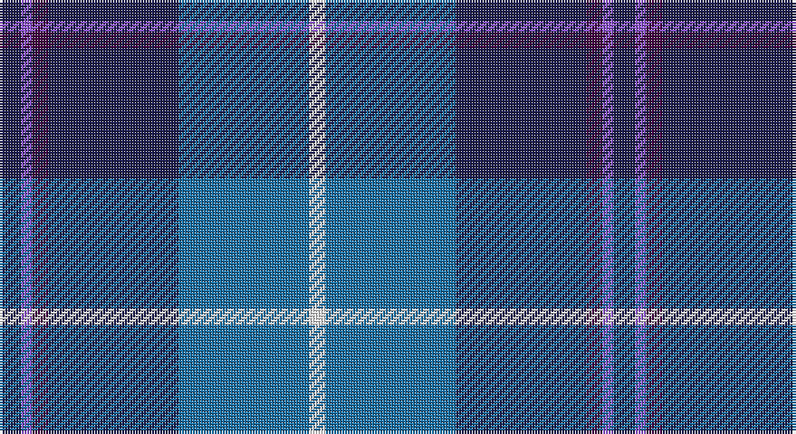

This page is one **sett** — a single exact thread-count. It belongs to the [tartan](/setts/db4p2dp3db24b24w3/)
(the same proportion at any scale), whose colour order is pattern [BBBBBW](/stripes/bbbbbw/).

Sourced from register-of-tartans.  It is a [6 stripe tartan](/stripes/stripes6/).

Original link https://www.tartanregister.gov.uk/tartanDetails.aspx?ref=11181

## Register references

External register numbers recorded for this tartan.

- Scottish Register of Tartans: [11181](https://www.tartanregister.gov.uk/tartanDetails.aspx?ref=11181)

## Thread count
DB/8 P4 DP6 DB48 B48 W/6

One full sett is **226 threads**.

## Palette

Palette: <strong>Tartan Register</strong>
<table><thead><tr><th>Colour</th><th>Threads</th><th>Shade</th><th>Base</th><th>OKLCh</th></tr></thead><tbody><tr><td>DB/</td><td style="text-align:right;font-variant-numeric:tabular-nums">8</td><td><code style="background-color:#1C1C50;">#1C1C50</code> <small style="color:#888">#1C1C50</small></td><td>B <code style="background-color:#2A418A;">#2A418A</code></td><td><small style="color:#888">oklch(26.2% 0.093 277.9)</small></td></tr><tr><td>P</td><td style="text-align:right;font-variant-numeric:tabular-nums">4</td><td><code style="background-color:#9058D8;">#9058D8</code> <small style="color:#888">#9058D8</small></td><td>B <code style="background-color:#2A418A;">#2A418A</code></td><td><small style="color:#888">oklch(58.4% 0.190 300.8)</small></td></tr><tr><td>DP</td><td style="text-align:right;font-variant-numeric:tabular-nums">6</td><td><code style="background-color:#440044;">#440044</code> <small style="color:#888">#440044</small></td><td>B <code style="background-color:#2A418A;">#2A418A</code></td><td><small style="color:#888">oklch(27.1% 0.125 328.4)</small></td></tr><tr><td>DB</td><td style="text-align:right;font-variant-numeric:tabular-nums">48</td><td><code style="background-color:#1C1C50;">#1C1C50</code> <small style="color:#888">#1C1C50</small></td><td>B <code style="background-color:#2A418A;">#2A418A</code></td><td><small style="color:#888">oklch(26.2% 0.093 277.9)</small></td></tr><tr><td>B</td><td style="text-align:right;font-variant-numeric:tabular-nums">48</td><td><code style="background-color:#1870A4;">#1870A4</code> <small style="color:#888">#1870A4</small></td><td>B <code style="background-color:#2A418A;">#2A418A</code></td><td><small style="color:#888">oklch(52.2% 0.113 241.2)</small></td></tr><tr><td>W/</td><td style="text-align:right;font-variant-numeric:tabular-nums">6</td><td><code style="background-color:#FFFFFF;">#FFFFFF</code> <small style="color:#888">#FFFFFF</small></td><td>W <code style="background-color:#F7F7F7;">#F7F7F7</code></td><td><small style="color:#888">oklch(100.0% 0.000 89.9)</small></td></tr></tbody></table>

# Sample pattern

## Nearest tartans

The nearest existing variants by ΔTartan distance, with this tartan at the top so the swatches line up against it.

ΔTartan

Tartan

Sett

—

<a href="/ttd/edit/#slug=db4p2dp3db24b24w3~x2">Aberdeen Academy of Performing Arts</a> <a class="nn-out" href="/variants/s6/db4p2dp3db24b24w3~x2/" title="open its dictionary page">↗</a>

0.66

<a href="/ttd/edit/#slug=db4dpi2dp3db24t24w3~x2&amp;base=db4p2dp3db24b24w3~x2">Aberdeen Academy of Performing Art</a> <a class="nn-out" href="/variants/s6/db4dpi2dp3db24t24w3~x2/" title="open its dictionary page">↗</a>

0.93

<a href="/ttd/edit/#slug=t3k2g2k1db10w1~x8&amp;base=db4p2dp3db24b24w3~x2">Isle of Harris (District)</a> <a class="nn-out" href="/variants/s6/t3k2g2k1db10w1~x8/" title="open its dictionary page">↗</a>

0.96

<a href="/ttd/edit/#slug=w4db24ly2dbi24t5db4ly4~x2&amp;base=db4p2dp3db24b24w3~x2">Mina Perhonen Japanese Corporate Tartan</a> <a class="nn-out" href="/variants/s7/w4db24ly2dbi24t5db4ly4~x2/" title="open its dictionary page">↗</a>

1.03

<a href="/ttd/edit/#slug=db3t24k11db20w2db5lo3~x2&amp;base=db4p2dp3db24b24w3~x2">Icelandair</a> <a class="nn-out" href="/variants/s7/db3t24k11db20w2db5lo3~x2/" title="open its dictionary page">↗</a>

1.05

<a href="/ttd/edit/#slug=db6lb2db2lb3db16b26r2~x2&amp;base=db4p2dp3db24b24w3~x2">Federal Bureau of Investigation</a> <a class="nn-out" href="/variants/s7/db6lb2db2lb3db16b26r2~x2/" title="open its dictionary page">↗</a>

1.10

<a href="/ttd/edit/#slug=db35w3db8t36dg9o3~x2&amp;base=db4p2dp3db24b24w3~x2">Georgian Bay, Waters of</a> <a class="nn-out" href="/variants/s6/db35w3db8t36dg9o3~x2/" title="open its dictionary page">↗</a>

1.23

<a href="/ttd/edit/#slug=m4k3b18r3dt34w3~x2&amp;base=db4p2dp3db24b24w3~x2">Margach, William (Personal)</a> <a class="nn-out" href="/variants/s6/m4k3b18r3dt34w3~x2/" title="open its dictionary page">↗</a>

1.24

<a href="/ttd/edit/#slug=b30k12dt12k2w3~x2&amp;base=db4p2dp3db24b24w3~x2">MacNeil - 1994 (Personal)</a> <a class="nn-out" href="/variants/s5/b30k12dt12k2w3~x2/" title="open its dictionary page">↗</a>

1.24

<a href="/ttd/edit/#slug=p30db5p3db33lg8k3db8w2~x2&amp;base=db4p2dp3db24b24w3~x2">Saint Margaret of Scotland Youth Group</a> <a class="nn-out" href="/variants/s8/p30db5p3db33lg8k3db8w2~x2/" title="open its dictionary page">↗</a>

1.25

<a href="/ttd/edit/#slug=db7r3db26t2db2t26ly4~x2&amp;base=db4p2dp3db24b24w3~x2">Int. Police Association (Official)</a> <a class="nn-out" href="/variants/s7/db7r3db26t2db2t26ly4~x2/" title="open its dictionary page">↗</a>

## Neighbour map

Every grey dot is one of 14360 variants placed by the first two principal components of the ΔTartan feature space (44% of its variance). Red is this tartan; blue dots are its nearest — click one to open its page.

<svg viewBox="0 0 640 380" role="img" style="max-width:100%;height:auto;border:1px solid #e0e0e0;border-radius:4px;display:block" xmlns="http://www.w3.org/2000/svg"><image href="/nn/cloud.v1.png" width="640" height="380"/><a href="/variants/s6/db4dpi2dp3db24t24w3~x2/"><circle cx="265.6" cy="184.4" r="4" fill="#3465a4"><title>Aberdeen Academy of Performing Art</title></circle></a><a href="/variants/s6/t3k2g2k1db10w1~x8/"><circle cx="243.1" cy="185.7" r="4" fill="#3465a4"><title>Isle of Harris (District)</title></circle></a><a href="/variants/s7/w4db24ly2dbi24t5db4ly4~x2/"><circle cx="212.6" cy="177.3" r="4" fill="#3465a4"><title>Mina Perhonen Japanese Corporate Tartan</title></circle></a><a href="/variants/s7/db3t24k11db20w2db5lo3~x2/"><circle cx="206.7" cy="188.5" r="4" fill="#3465a4"><title>Icelandair</title></circle></a><a href="/variants/s7/db6lb2db2lb3db16b26r2~x2/"><circle cx="288.2" cy="191.5" r="4" fill="#3465a4"><title>Federal Bureau of Investigation</title></circle></a><a href="/variants/s6/db35w3db8t36dg9o3~x2/"><circle cx="247.7" cy="196.7" r="4" fill="#3465a4"><title>Georgian Bay, Waters of</title></circle></a><a href="/variants/s6/m4k3b18r3dt34w3~x2/"><circle cx="275.8" cy="176.3" r="4" fill="#3465a4"><title>Margach, William (Personal)</title></circle></a><a href="/variants/s5/b30k12dt12k2w3~x2/"><circle cx="280.1" cy="212.0" r="4" fill="#3465a4"><title>MacNeil - 1994 (Personal)</title></circle></a><a href="/variants/s8/p30db5p3db33lg8k3db8w2~x2/"><circle cx="279.6" cy="157.8" r="4" fill="#3465a4"><title>Saint Margaret of Scotland Youth Group</title></circle></a><a href="/variants/s7/db7r3db26t2db2t26ly4~x2/"><circle cx="288.1" cy="180.6" r="4" fill="#3465a4"><title>Int. Police Association (Official)</title></circle></a><circle cx="264.3" cy="188.9" r="5" fill="#c00000"/></svg>

ID: /variants/s6/db4p2dp3db24b24w3~x2/
