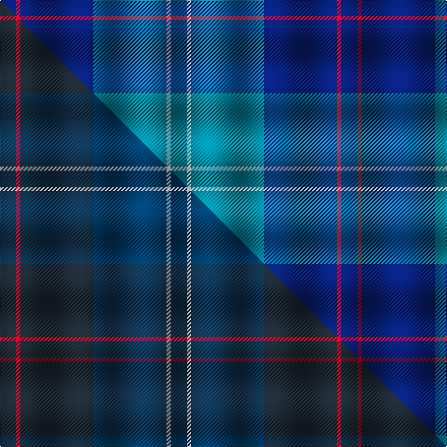

This is one **variant** — a specific cloth: this exact thread count and colourway, with its own
provenance below. It is one weaving of the [sett](/setts/db4r1db18t18w1t4/) (the scale-free proportion — the
same cloth at any scale or shade), whose colour order is pattern [BRBBWB](/stripes/brbbwb/).

Part of the [Ewell Castle School](/tartans/ewell-castle-school/) tartan — the named design grouping this sett with its other cloths.

Sourced from tartans-authority.  It is a [6 stripe tartan](/stripes/stripes6/).

Original link [https://www.tartanregister.gov.uk/tartanDetails.aspx?ref=11288](https://www.tartanregister.gov.uk/tartanDetails.aspx?ref=11288)

Dataset <small>— provenance for this record, inherited from the source manifest</small>

<dl class="dataset-prov">
<dt>source</dt><dd><a href="/sources/tartans-authority/">Scottish Tartans Authority</a></dd>
<dt>data captured from</dt><dd><a href="https://github.com/thetartan/tartan-database/blob/master/data/tartans-authority/data.csv">https://github.com/thetartan/tartan-database/blob/master/data/tartans-authority/data.csv</a></dd>
<dt>data date</dt><dd>2015 <small>(this record)</small></dd>
<dt>licence</dt><dd><a href="https://creativecommons.org/licenses/by-nc-nd/4.0/">CC BY-NC-ND 4.0</a></dd>
</dl>

Capture chain <small>— the hands this data passed through, oldest first; each capture carries its own licence</small>

<ol class="capture-chain">
<li><a href="https://www.tartansauthority.com/">Scottish Tartans Authority</a> <small>the heritage body's archive — its tartan-ferret record browser is retired (links repaired to the SRT, above)</small></li>
<li><a href="https://github.com/thetartan/tartan-database">thetartan/tartan-database</a> <small>2016-2017</small> · <a href="https://creativecommons.org/licenses/by-nc-nd/4.0/">CC BY-NC-ND 4.0</a> <small>Levko Kravets's frozen compilation — the capture we vendored, and where its CC licence text came from</small></li>
<li>this dictionary <small>captured 2026-06-10 · commit 5bf86c7566</small> <small>each re-capture is a git commit to data/sources</small></li>
</ol>

## Register references

External register numbers recorded for this tartan.

- Scottish Register of Tartans: [11288](https://www.tartanregister.gov.uk/tartanDetails?ref=11288)
- Scottish Tartans Authority (ITI): 11288

## Thread count
DB/16 R4 DB72 T72 W4 T/16

One full sett is **336 threads**.

## Palette
<table><thead><tr><th>Colour</th><th>Shade</th><th>OKLCh</th></tr></thead><tbody><tr><td>T</td><td><code style="background-color:#00879F;">#00879F</code> <small style="color:#888">#00879F</small></td><td><small style="color:#888">oklch(57.4% 0.102 216.1)</small></td></tr><tr><td>DB</td><td><code style="background-color:#082077;">#082077</code> <small style="color:#888">#082077</small></td><td><small style="color:#888">oklch(30.0% 0.149 265.1)</small></td></tr><tr><td>R</td><td><code style="background-color:#D60020;">#D60020</code> <small style="color:#888">#D60020</small></td><td><small style="color:#888">oklch(55.2% 0.224 25.5)</small></td></tr><tr><td>W</td><td><code style="background-color:#F7F7F7;">#F7F7F7</code> <small style="color:#888">#F7F7F7</small></td><td><small style="color:#888">oklch(97.6% 0.000 89.9)</small></td></tr></tbody></table>

# Sample pattern

## Compared to the master

This cloth is one sett of its design; the master sett (the exemplar the design is anchored on) is below for comparison.

Its **ΔTartan distance** from the master is **0.20** — the same measure the nearest-tartans table ranks by (0 is identical; a re-scale of the same cloth is near 0, a recolour or a different proportion further).

<figure class="master-compare" style="margin:0">

this sett
master sett ★

<figcaption style="color:#888;font-size:smaller">One weave of this sett against the <a href="/setts/dt4r1dt18db18w1db4/">master sett ★</a>, split on the diagonal: a shared proportion runs seamlessly across it with only the shades shifting; a different proportion breaks on it.</figcaption>
</figure>

## Nearest tartan variants

The nearest existing variants by ΔTartan distance, with this cloth at the top so the swatches line up against it.

ΔTartan

Threads

Variant

Sett

—

336

<a href="/variants/s6/db4r1db18t18w1t4~x4/">Ewell Castle School</a>

<a href="/ttd/edit/#slug=db2b2r1b16w1db20r2~x2&amp;base=db4r1db18t18w1t4~x4" title="compare in the TTD">1.29</a>

168

<a href="/variants/s7/db2b2r1b16w1db20r2~x2/">British American School (Corporate)</a>

<a href="/ttd/edit/#slug=db2b2r1b16w1db20r2~x2~db1406275&amp;base=db4r1db18t18w1t4~x4" title="compare in the TTD">1.29</a>

168

<a href="/variants/s7/db2b2r1b16w1db20r2~x2~db1406275/">British American School of Charlotte</a>

<a href="/ttd/edit/#slug=db4r1db18n18lb1~x4&amp;base=db4r1db18t18w1t4~x4" title="compare in the TTD">1.85</a>

316

<a href="/variants/s5/db4r1db18n18lb1~x4/">Ardee (Corporate)</a>

<a href="/ttd/edit/#slug=db7r3db26lb2db2lb26y4~x2&amp;base=db4r1db18t18w1t4~x4" title="compare in the TTD">1.96</a>

258

<a href="/variants/s7/db7r3db26lb2db2lb26y4~x2/">Int. Police Association (Official)</a>

<a href="/ttd/edit/#slug=db14r6db52lb4db4lb51y8&amp;base=db4r1db18t18w1t4~x4" title="compare in the TTD">1.96</a>

256

<a href="/variants/s7/db14r6db52lb4db4lb51y8/">International Police Association (IPA 2010)</a>

<a href="/ttd/edit/#slug=r15t98db72y25db8w15~t2304245-db1404245&amp;base=db4r1db18t18w1t4~x4" title="compare in the TTD">2.21</a>

436

<a href="/variants/s6/r15t98db72y25db8w15~t2304245-db1404245/">Afternoon Tea / Earl Grey</a>

<a href="/ttd/edit/#slug=db104n16w8n66r3n16~db0805267-n1604274&amp;base=db4r1db18t18w1t4~x4" title="compare in the TTD">2.22</a>

306

<a href="/variants/s6/db104dbi16w8dbi66r3dbi16~db0805267-dbi1604274/">Edzell, U.S. Navy</a>

<a href="/ttd/edit/#slug=db51t8w4t30r1t9~x2&amp;base=db4r1db18t18w1t4~x4" title="compare in the TTD">2.24</a>

292

<a href="/variants/s6/db51t8w4t30r1t9~x2/">Navy-Radar</a>

<a href="/ttd/edit/#slug=db35w3db8t36dg9o3~x2~db1605267-t2605232&amp;base=db4r1db18t18w1t4~x4" title="compare in the TTD">2.27</a>

300

<a href="/variants/s6/db35w3db8t36dg9o3~x2~db1605267-t2605232/">Georgian Bay, Waters of</a>

<a href="/ttd/edit/#slug=db45n7w3n27r1n7~x2~db0805267-n1604274&amp;base=db4r1db18t18w1t4~x4" title="compare in the TTD">2.28</a>

256

<a href="/variants/s6/db45dbi7w3dbi27r1dbi7~x2~db0805267-dbi1604274/">Edzell, U.S. Navy</a>

## Neighbour map

Every grey dot is one of 13621 variants placed by the first two principal components of the ΔTartan feature space (42% of its variance). Red is this tartan; blue dots are its nearest — click one to open its page.

<svg viewBox="0 0 640 380" role="img" style="max-width:100%;height:auto;border:1px solid #e0e0e0;border-radius:4px;display:block" xmlns="http://www.w3.org/2000/svg"><image href="/nn/cloud.v1.png" width="640" height="380"/><a href="/variants/s7/db2b2r1b16w1db20r2~x2/"><circle cx="373.0" cy="173.2" r="4" fill="#3465a4"><title>British American School (Corporate)</title></circle></a><a href="/variants/s7/db2b2r1b16w1db20r2~x2~db1406275/"><circle cx="403.8" cy="182.7" r="4" fill="#3465a4"><title>British American School of Charlotte</title></circle></a><a href="/variants/s5/db4r1db18n18lb1~x4/"><circle cx="416.0" cy="217.3" r="4" fill="#3465a4"><title>Ardee (Corporate)</title></circle></a><a href="/variants/s7/db7r3db26lb2db2lb26y4~x2/"><circle cx="287.5" cy="179.9" r="4" fill="#3465a4"><title>Int. Police Association (Official)</title></circle></a><a href="/variants/s7/db14r6db52lb4db4lb51y8/"><circle cx="288.5" cy="180.1" r="4" fill="#3465a4"><title>International Police Association (IPA 2010)</title></circle></a><a href="/variants/s6/r15t98db72y25db8w15~t2304245-db1404245/"><circle cx="253.6" cy="208.0" r="4" fill="#3465a4"><title>Afternoon Tea / Earl Grey</title></circle></a><a href="/variants/s6/db104dbi16w8dbi66r3dbi16~db0805267-dbi1604274/"><circle cx="400.6" cy="172.4" r="4" fill="#3465a4"><title>Edzell, U.S. Navy</title></circle></a><a href="/variants/s6/db51t8w4t30r1t9~x2/"><circle cx="387.5" cy="154.8" r="4" fill="#3465a4"><title>Navy-Radar</title></circle></a><a href="/variants/s6/db35w3db8t36dg9o3~x2~db1605267-t2605232/"><circle cx="290.0" cy="208.2" r="4" fill="#3465a4"><title>Georgian Bay, Waters of</title></circle></a><a href="/variants/s6/db45dbi7w3dbi27r1dbi7~x2~db0805267-dbi1604274/"><circle cx="423.1" cy="164.0" r="4" fill="#3465a4"><title>Edzell, U.S. Navy</title></circle></a><circle cx="358.3" cy="200.9" r="5" fill="#c00000"/><text x="320" y="376" text-anchor="middle" font-size="11" fill="#999">ground</text><text x="11" y="190" text-anchor="middle" font-size="11" fill="#999" transform="rotate(-90 11 190)">complexity</text></svg>

ID: /variants/s6/db4r1db18t18w1t4~x4/
