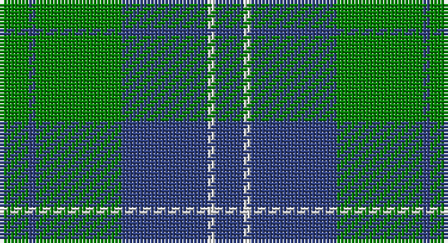

This page is one **sett** — a single exact thread-count. It belongs to the [tartan](/setts/db4w1db12g12db1g4/)
(the same proportion at any scale), whose colour order is pattern [BWBGBG](/stripes/bwbgbg/).

Sourced from weddslist.  It is a [6 stripe tartan](/stripes/stripes6/).

Original link http://www.weddslist.com/cgi-bin/tartans/pg.pl?source=sts

## Also known as

This cloth is also recorded under:

- Unidentified, Tweed

## Thread count
G/8 B2 G24 B24 LN2 B/8

One full sett is **120 threads**.

## Palette

Palette: <strong>Tartan Dictionary</strong> <small style="color:#888">(1 of 3 colours)</small>
<table><thead><tr><th>Colour</th><th>Threads</th><th>Shade</th><th>Base</th><th>OKLCh</th></tr></thead><tbody><tr><td>G/</td><td style="text-align:right;font-variant-numeric:tabular-nums">8</td><td><code style="background-color:#008000;">#008000</code> <small style="color:#888">#008000</small></td><td>G <code style="background-color:#006100;">#006100</code></td><td><small style="color:#888">oklch(52.0% 0.177 142.5)</small></td></tr><tr><td>B</td><td style="text-align:right;font-variant-numeric:tabular-nums">2</td><td><code style="background-color:#304080;">#304080</code> <small style="color:#888">#304080</small></td><td>B <code style="background-color:#2A418A;">#2A418A</code></td><td><small style="color:#888">oklch(39.4% 0.109 270.2)</small></td></tr><tr><td>G</td><td style="text-align:right;font-variant-numeric:tabular-nums">24</td><td><code style="background-color:#008000;">#008000</code> <small style="color:#888">#008000</small></td><td>G <code style="background-color:#006100;">#006100</code></td><td><small style="color:#888">oklch(52.0% 0.177 142.5)</small></td></tr><tr><td>B</td><td style="text-align:right;font-variant-numeric:tabular-nums">24</td><td><code style="background-color:#304080;">#304080</code> <small style="color:#888">#304080</small></td><td>B <code style="background-color:#2A418A;">#2A418A</code></td><td><small style="color:#888">oklch(39.4% 0.109 270.2)</small></td></tr><tr><td>LN</td><td style="text-align:right;font-variant-numeric:tabular-nums">2</td><td><code style="background-color:#E0E0E0;">#E0E0E0</code> <small style="color:#888">#E0E0E0</small></td><td>W <code style="background-color:#F7F7F7;">#F7F7F7</code></td><td><small style="color:#888">oklch(90.7% 0.000 89.9)</small></td></tr><tr><td>B/</td><td style="text-align:right;font-variant-numeric:tabular-nums">8</td><td><code style="background-color:#304080;">#304080</code> <small style="color:#888">#304080</small></td><td>B <code style="background-color:#2A418A;">#2A418A</code></td><td><small style="color:#888">oklch(39.4% 0.109 270.2)</small></td></tr></tbody></table>

# Sample pattern

## Nearest tartans

The nearest existing variants by ΔTartan distance, with this tartan at the top so the swatches line up against it.

ΔTartan

Tartan

Sett

—

<a href="/ttd/edit/#slug=db4w1db12g12db1g4~x2">Unidentified, Tweed</a> <a class="nn-out" href="/variants/s6/db4w1db12g12db1g4~x2/" title="open its dictionary page">↗</a>

0.88

<a href="/ttd/edit/#slug=db11g2db15g18w2~x2&amp;base=db4w1db12g12db1g4~x2">Hamilton, hunting</a> <a class="nn-out" href="/variants/s5/db11g2db15g18w2~x2/" title="open its dictionary page">↗</a>

1.16

<a href="/ttd/edit/#slug=b52g21b6g16k4g16~x2&amp;base=db4w1db12g12db1g4~x2">Milligan</a> <a class="nn-out" href="/variants/s6/b52g21b6g16k4g16~x2/" title="open its dictionary page">↗</a>

1.17

<a href="/ttd/edit/#slug=db6g2db29g29db2g6~x2&amp;base=db4w1db12g12db1g4~x2">Harmony, 12</a> <a class="nn-out" href="/variants/s6/db6g2db29g29db2g6~x2/" title="open its dictionary page">↗</a>

1.20

<a href="/ttd/edit/#slug=t7k7t7g20t2g2~x4&amp;base=db4w1db12g12db1g4~x2">Falconer of Labhdal (Personal)</a> <a class="nn-out" href="/variants/s6/t7k7t7g20t2g2~x4/" title="open its dictionary page">↗</a>

1.21

<a href="/ttd/edit/#slug=db5g2db5g8w1~x8&amp;base=db4w1db12g12db1g4~x2">Hamilton, hunting</a> <a class="nn-out" href="/variants/s5/db5g2db5g8w1~x8/" title="open its dictionary page">↗</a>

1.23

<a href="/ttd/edit/#slug=db1g12db4lb1db4g4db1~x4&amp;base=db4w1db12g12db1g4~x2">St. Dennis &amp; Cranley School</a> <a class="nn-out" href="/variants/s7/db1g12db4lb1db4g4db1~x4/" title="open its dictionary page">↗</a>

1.26

<a href="/ttd/edit/#slug=b3k1g4k1b4g9k2~x4&amp;base=db4w1db12g12db1g4~x2">Outdoorsmen (Fashion)</a> <a class="nn-out" href="/variants/s7/b3k1g4k1b4g9k2~x4/" title="open its dictionary page">↗</a>

1.31

<a href="/ttd/edit/#slug=g12lo1db8k1db1~x4&amp;base=db4w1db12g12db1g4~x2">Rowan (Personal)</a> <a class="nn-out" href="/variants/s5/g12lo1db8k1db1~x4/" title="open its dictionary page">↗</a>

1.35

<a href="/ttd/edit/#slug=g40k20t10k4t7g13k4t4~x2&amp;base=db4w1db12g12db1g4~x2">Letham (S.Australia)</a> <a class="nn-out" href="/variants/s8/g40k20t10k4t7g13k4t4~x2/" title="open its dictionary page">↗</a>

1.36

<a href="/ttd/edit/#slug=r1g16db16g1~x2&amp;base=db4w1db12g12db1g4~x2">Barclay</a> <a class="nn-out" href="/variants/s4/r1g16db16g1~x2/" title="open its dictionary page">↗</a>

## Neighbour map

Every grey dot is one of 14360 variants placed by the first two principal components of the ΔTartan feature space (44% of its variance). Red is this tartan; blue dots are its nearest — click one to open its page.

<svg viewBox="0 0 640 380" role="img" style="max-width:100%;height:auto;border:1px solid #e0e0e0;border-radius:4px;display:block" xmlns="http://www.w3.org/2000/svg"><image href="/nn/cloud.v1.png" width="640" height="380"/><a href="/variants/s5/db11g2db15g18w2~x2/"><circle cx="328.2" cy="271.2" r="4" fill="#3465a4"><title>Hamilton, hunting</title></circle></a><a href="/variants/s6/b52g21b6g16k4g16~x2/"><circle cx="353.2" cy="248.5" r="4" fill="#3465a4"><title>Milligan</title></circle></a><a href="/variants/s6/db6g2db29g29db2g6~x2/"><circle cx="400.5" cy="251.2" r="4" fill="#3465a4"><title>Harmony, 12</title></circle></a><a href="/variants/s6/t7k7t7g20t2g2~x4/"><circle cx="296.2" cy="249.8" r="4" fill="#3465a4"><title>Falconer of Labhdal (Personal)</title></circle></a><a href="/variants/s5/db5g2db5g8w1~x8/"><circle cx="285.1" cy="283.9" r="4" fill="#3465a4"><title>Hamilton, hunting</title></circle></a><a href="/variants/s7/db1g12db4lb1db4g4db1~x4/"><circle cx="369.2" cy="225.6" r="4" fill="#3465a4"><title>St. Dennis &amp; Cranley School</title></circle></a><a href="/variants/s7/b3k1g4k1b4g9k2~x4/"><circle cx="298.0" cy="246.4" r="4" fill="#3465a4"><title>Outdoorsmen (Fashion)</title></circle></a><a href="/variants/s5/g12lo1db8k1db1~x4/"><circle cx="339.9" cy="226.8" r="4" fill="#3465a4"><title>Rowan (Personal)</title></circle></a><a href="/variants/s8/g40k20t10k4t7g13k4t4~x2/"><circle cx="299.3" cy="227.5" r="4" fill="#3465a4"><title>Letham (S.Australia)</title></circle></a><a href="/variants/s4/r1g16db16g1~x2/"><circle cx="385.3" cy="256.9" r="4" fill="#3465a4"><title>Barclay</title></circle></a><circle cx="339.4" cy="244.4" r="5" fill="#c00000"/></svg>

ID: /variants/s6/db4w1db12g12db1g4~x2/
