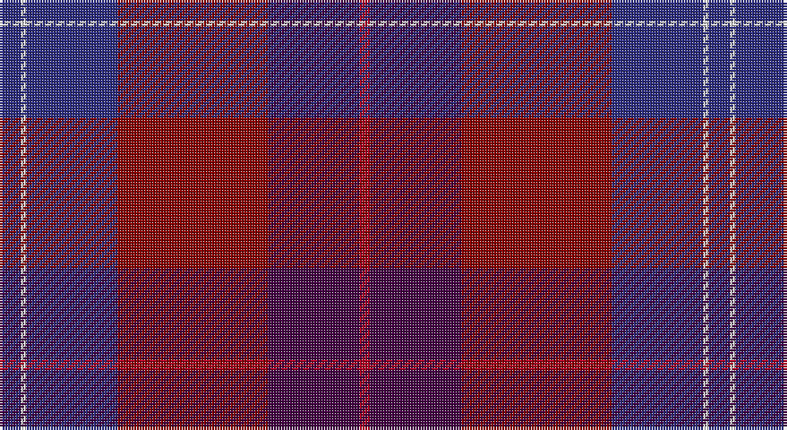

This page is one **sett** — a single exact thread-count. It belongs to the [tartan](/setts/db4w1db17ri28dp17r2/)
(the same proportion at any scale), whose colour order is pattern [BWBRBR](/stripes/bwbrbr/).

Sourced from register-of-tartans.  It is a [6 stripe tartan](/stripes/stripes6/).

Original link https://www.tartanregister.gov.uk/tartanDetails.aspx?ref=3637

2 attestations — the source records this cloth was collapsed from (oldest owns this page)

<ul>
<li>01/06/2007 — Sail Chalmadale (register-of-tartans, <a href="https://www.tartanregister.gov.uk/tartanDetails.aspx?ref=3637">record</a>)</li>
<li>June 2007 — Sail Chalmadale (Fashion) (tartans-authority, <a href="http://www.tartansauthority.com/tartan-ferret/display/7217/">record</a>)</li>
</ul>

## Register references

External register numbers recorded for this tartan.

- Scottish Register of Tartans: [3637](https://www.tartanregister.gov.uk/tartanDetails.aspx?ref=3637)
- Scottish Tartans Authority (ITI): 7217

## Thread count
DB/8 LN2 DB34 DR56 DP34 R/4

One full sett is **264 threads**.

## Palette

Palette: <strong>Tartan Register</strong> <small style="color:#888">(5 of 6 colours)</small>
<table><thead><tr><th>Colour</th><th>Threads</th><th>Shade</th><th>Base</th><th>OKLCh</th></tr></thead><tbody><tr><td>DB/</td><td style="text-align:right;font-variant-numeric:tabular-nums">8</td><td><code style="background-color:#2C2C80;">#2C2C80</code> <small style="color:#888">#2C2C80</small></td><td>B <code style="background-color:#2A418A;">#2A418A</code></td><td><small style="color:#888">oklch(35.0% 0.138 276.6)</small></td></tr><tr><td>LN</td><td style="text-align:right;font-variant-numeric:tabular-nums">2</td><td><code style="background-color:#E0E0E0;">#E0E0E0</code> <small style="color:#888">#E0E0E0</small></td><td>W <code style="background-color:#F7F7F7;">#F7F7F7</code></td><td><small style="color:#888">oklch(90.7% 0.000 89.9)</small></td></tr><tr><td>DB</td><td style="text-align:right;font-variant-numeric:tabular-nums">34</td><td><code style="background-color:#2C2C80;">#2C2C80</code> <small style="color:#888">#2C2C80</small></td><td>B <code style="background-color:#2A418A;">#2A418A</code></td><td><small style="color:#888">oklch(35.0% 0.138 276.6)</small></td></tr><tr><td>DR</td><td style="text-align:right;font-variant-numeric:tabular-nums">56</td><td><code style="background-color:#880000;">#880000</code> <small style="color:#888">#880000</small></td><td>R <code style="background-color:#CC0000;">#CC0000</code></td><td><small style="color:#888">oklch(39.4% 0.162 29.2)</small></td></tr><tr><td>DP</td><td style="text-align:right;font-variant-numeric:tabular-nums">34</td><td><code style="background-color:#440044;">#440044</code> <small style="color:#888">#440044</small></td><td>B <code style="background-color:#2A418A;">#2A418A</code></td><td><small style="color:#888">oklch(27.1% 0.125 328.4)</small></td></tr><tr><td>R/</td><td style="text-align:right;font-variant-numeric:tabular-nums">4</td><td><code style="background-color:#B00024;">#B00024</code> <small style="color:#888">#B00024</small></td><td>R <code style="background-color:#CC0000;">#CC0000</code></td><td><small style="color:#888">oklch(47.8% 0.193 22.4)</small></td></tr></tbody></table>

# Sample pattern

## Nearest tartans

The nearest existing variants by ΔTartan distance, with this tartan at the top so the swatches line up against it.

ΔTartan

Tartan

Sett

—

<a href="/ttd/edit/#slug=db4w1db17ri28dp17r2~x2">Sail Chalmadale</a> <a class="nn-out" href="/variants/s6/db4w1db17ri28dp17r2~x2/" title="open its dictionary page">↗</a>

1.59

<a href="/ttd/edit/#slug=dp13ly2r38k13r8k8dp17dg2dp17k4dp11&amp;base=db4w1db17ri28dp17r2~x2">Bute Heather, Autumn (Fashion)</a> <a class="nn-out" href="/variants/s11/dp13ly2r38k13r8k8dp17dg2dp17k4dp11/" title="open its dictionary page">↗</a>

1.60

<a href="/ttd/edit/#slug=dpi13dg16g4dp1g4dp34ly1dp1~x2&amp;base=db4w1db17ri28dp17r2~x2">Heather Mead (Personal)</a> <a class="nn-out" href="/variants/s8/dpi13dg16g4dp1g4dp34ly1dp1~x2/" title="open its dictionary page">↗</a>

1.65

<a href="/ttd/edit/#slug=m4dp1m1dp12k6dt16w1~x2&amp;base=db4w1db17ri28dp17r2~x2">First (Corporate)</a> <a class="nn-out" href="/variants/s7/m4dp1m1dp12k6dt16w1~x2/" title="open its dictionary page">↗</a>

1.74

<a href="/ttd/edit/#slug=db4dg2r17ri9dg10db30n2~x2&amp;base=db4w1db17ri28dp17r2~x2">Dempster, Ross (Personal)</a> <a class="nn-out" href="/variants/s7/db4dg2r17ri9dg10db30n2~x2/" title="open its dictionary page">↗</a>

1.76

<a href="/ttd/edit/#slug=dp1m4dp1m1dp12k6dt16w1~x2&amp;base=db4w1db17ri28dp17r2~x2">First</a> <a class="nn-out" href="/variants/s8/dp1m4dp1m1dp12k6dt16w1~x2/" title="open its dictionary page">↗</a>

1.78

<a href="/ttd/edit/#slug=g10o1k3dp22o1dp8k2r26lo1r6k3~x2&amp;base=db4w1db17ri28dp17r2~x2">Faulkner (Personal)</a> <a class="nn-out" href="/variants/s11/g10o1k3dp22o1dp8k2r26lo1r6k3~x2/" title="open its dictionary page">↗</a>

1.80

<a href="/ttd/edit/#slug=w2dp5m34k5n9k12dp1~x2&amp;base=db4w1db17ri28dp17r2~x2">Thomson, Reona Ellen (Personal)</a> <a class="nn-out" href="/variants/s7/w2dp5m34k5n9k12dp1~x2/" title="open its dictionary page">↗</a>

1.81

<a href="/ttd/edit/#slug=k2dr1dt17dr17db1ly2~x4&amp;base=db4w1db17ri28dp17r2~x2">Murdoch (Geoffrey)</a> <a class="nn-out" href="/variants/s6/k2dr1dt17dr17db1ly2~x4/" title="open its dictionary page">↗</a>

1.84

<a href="/ttd/edit/#slug=dp2g18dp15r24k1ly2~x2&amp;base=db4w1db17ri28dp17r2~x2">Miller, Reverend Ian (Personal</a> <a class="nn-out" href="/variants/s6/dp2g18dp15r24k1ly2~x2/" title="open its dictionary page">↗</a>

1.86

<a href="/ttd/edit/#slug=dg5r1ri4db2ri20dg12db16ri4r1~x2&amp;base=db4w1db17ri28dp17r2~x2">Diana Princess of Wales</a> <a class="nn-out" href="/variants/s9/dg5r1ri4db2ri20dg12db16ri4r1~x2/" title="open its dictionary page">↗</a>

## Neighbour map

Every grey dot is one of 14360 variants placed by the first two principal components of the ΔTartan feature space (44% of its variance). Red is this tartan; blue dots are its nearest — click one to open its page.

<svg viewBox="0 0 640 380" role="img" style="max-width:100%;height:auto;border:1px solid #e0e0e0;border-radius:4px;display:block" xmlns="http://www.w3.org/2000/svg"><image href="/nn/cloud.v1.png" width="640" height="380"/><a href="/variants/s11/dp13ly2r38k13r8k8dp17dg2dp17k4dp11/"><circle cx="306.9" cy="183.0" r="4" fill="#3465a4"><title>Bute Heather, Autumn (Fashion)</title></circle></a><a href="/variants/s8/dpi13dg16g4dp1g4dp34ly1dp1~x2/"><circle cx="351.1" cy="147.4" r="4" fill="#3465a4"><title>Heather Mead (Personal)</title></circle></a><a href="/variants/s7/m4dp1m1dp12k6dt16w1~x2/"><circle cx="252.3" cy="184.0" r="4" fill="#3465a4"><title>First (Corporate)</title></circle></a><a href="/variants/s7/db4dg2r17ri9dg10db30n2~x2/"><circle cx="281.0" cy="195.7" r="4" fill="#3465a4"><title>Dempster, Ross (Personal)</title></circle></a><a href="/variants/s8/dp1m4dp1m1dp12k6dt16w1~x2/"><circle cx="254.6" cy="172.4" r="4" fill="#3465a4"><title>First</title></circle></a><a href="/variants/s11/g10o1k3dp22o1dp8k2r26lo1r6k3~x2/"><circle cx="274.8" cy="118.9" r="4" fill="#3465a4"><title>Faulkner (Personal)</title></circle></a><a href="/variants/s7/w2dp5m34k5n9k12dp1~x2/"><circle cx="331.5" cy="137.8" r="4" fill="#3465a4"><title>Thomson, Reona Ellen (Personal)</title></circle></a><a href="/variants/s6/k2dr1dt17dr17db1ly2~x4/"><circle cx="327.5" cy="184.0" r="4" fill="#3465a4"><title>Murdoch (Geoffrey)</title></circle></a><a href="/variants/s6/dp2g18dp15r24k1ly2~x2/"><circle cx="264.2" cy="169.2" r="4" fill="#3465a4"><title>Miller, Reverend Ian (Personal</title></circle></a><a href="/variants/s9/dg5r1ri4db2ri20dg12db16ri4r1~x2/"><circle cx="309.4" cy="191.8" r="4" fill="#3465a4"><title>Diana Princess of Wales</title></circle></a><circle cx="313.4" cy="184.7" r="5" fill="#c00000"/></svg>

ID: /variants/s6/db4w1db17ri28dp17r2~x2/
