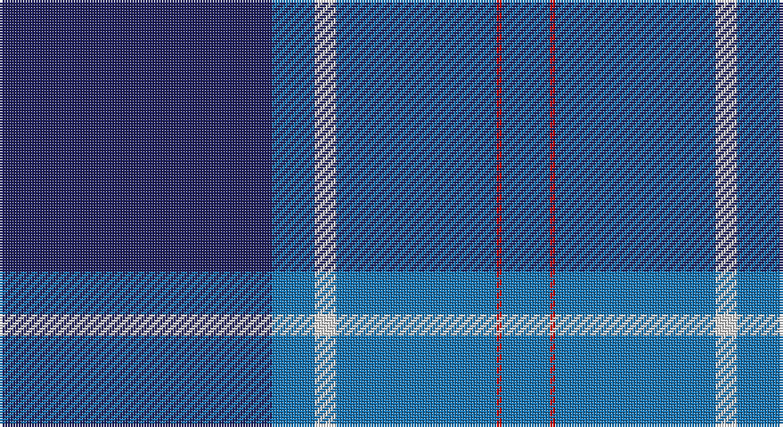

This page is one **sett** — a single exact thread-count. It belongs to the [tartan](/setts/db51b8w4b30r1b9/)
(the same proportion at any scale), whose colour order is pattern [BBWBRB](/stripes/bbwbrb/).

Sourced from tartans-authority.  It is a [6 stripe tartan](/stripes/stripes6/).

Original link http://www.tartansauthority.com/tartan-ferret/display/8868/

## Register references

External register numbers recorded for this tartan.

- Scottish Tartans Authority (ITI): 8868

## Thread count
DB/102 B16 LN8 B60 R2 B/18

One full sett is **292 threads**.

## Palette

Palette: <strong>Tartan Register</strong>
<table><thead><tr><th>Colour</th><th>Threads</th><th>Shade</th><th>Base</th><th>OKLCh</th></tr></thead><tbody><tr><td>DB/</td><td style="text-align:right;font-variant-numeric:tabular-nums">102</td><td><code style="background-color:#202060;">#202060</code> <small style="color:#888">#202060</small></td><td>B <code style="background-color:#2A418A;">#2A418A</code></td><td><small style="color:#888">oklch(28.9% 0.111 276.9)</small></td></tr><tr><td>B</td><td style="text-align:right;font-variant-numeric:tabular-nums">16</td><td><code style="background-color:#1474B4;">#1474B4</code> <small style="color:#888">#1474B4</small></td><td>B <code style="background-color:#2A418A;">#2A418A</code></td><td><small style="color:#888">oklch(54.0% 0.129 245.1)</small></td></tr><tr><td>LN</td><td style="text-align:right;font-variant-numeric:tabular-nums">8</td><td><code style="background-color:#E0E0E0;">#E0E0E0</code> <small style="color:#888">#E0E0E0</small></td><td>W <code style="background-color:#F7F7F7;">#F7F7F7</code></td><td><small style="color:#888">oklch(90.7% 0.000 89.9)</small></td></tr><tr><td>B</td><td style="text-align:right;font-variant-numeric:tabular-nums">60</td><td><code style="background-color:#1474B4;">#1474B4</code> <small style="color:#888">#1474B4</small></td><td>B <code style="background-color:#2A418A;">#2A418A</code></td><td><small style="color:#888">oklch(54.0% 0.129 245.1)</small></td></tr><tr><td>R</td><td style="text-align:right;font-variant-numeric:tabular-nums">2</td><td><code style="background-color:#C80000;">#C80000</code> <small style="color:#888">#C80000</small></td><td>R <code style="background-color:#CC0000;">#CC0000</code></td><td><small style="color:#888">oklch(52.3% 0.215 29.2)</small></td></tr><tr><td>B/</td><td style="text-align:right;font-variant-numeric:tabular-nums">18</td><td><code style="background-color:#1474B4;">#1474B4</code> <small style="color:#888">#1474B4</small></td><td>B <code style="background-color:#2A418A;">#2A418A</code></td><td><small style="color:#888">oklch(54.0% 0.129 245.1)</small></td></tr></tbody></table>

# Sample pattern

## Nearest tartans

The nearest existing variants by ΔTartan distance, with this tartan at the top so the swatches line up against it.

ΔTartan

Tartan

Sett

—

<a href="/ttd/edit/#slug=db51b8w4b30r1b9~x2">Navy-Radar</a> <a class="nn-out" href="/variants/s6/db51b8w4b30r1b9~x2/" title="open its dictionary page">↗</a>

1.21

<a href="/ttd/edit/#slug=dbi45db7w3db27r1db7~x2&amp;base=db51b8w4b30r1b9~x2">Edzell, U.S. Navy</a> <a class="nn-out" href="/variants/s6/dbi45db7w3db27r1db7~x2/" title="open its dictionary page">↗</a>

1.23

<a href="/ttd/edit/#slug=dbi104db16w8db66r3db16&amp;base=db51b8w4b30r1b9~x2">Edzell, U.S. Navy</a> <a class="nn-out" href="/variants/s6/dbi104db16w8db66r3db16/" title="open its dictionary page">↗</a>

1.50

<a href="/ttd/edit/#slug=k4w1t2w1k16db36t4~x2&amp;base=db51b8w4b30r1b9~x2">NHS Grampian</a> <a class="nn-out" href="/variants/s7/k4w1t2w1k16db36t4~x2/" title="open its dictionary page">↗</a>

1.52

<a href="/ttd/edit/#slug=t28dt15r2dt2w1dt6~x2&amp;base=db51b8w4b30r1b9~x2">Corries</a> <a class="nn-out" href="/variants/s6/t28dt15r2dt2w1dt6~x2/" title="open its dictionary page">↗</a>

1.56

<a href="/ttd/edit/#slug=db4r1db18b18w1b4~x4&amp;base=db51b8w4b30r1b9~x2">Ewell Castle School</a> <a class="nn-out" href="/variants/s6/db4r1db18b18w1b4~x4/" title="open its dictionary page">↗</a>

1.56

<a href="/ttd/edit/#slug=t52db28w3db2w2db10~x2&amp;base=db51b8w4b30r1b9~x2">St Andrews Earl of Royal family Tartan</a> <a class="nn-out" href="/variants/s6/t52db28w3db2w2db10~x2/" title="open its dictionary page">↗</a>

1.60

<a href="/ttd/edit/#slug=ly4b3ly1b17db40b2db3~x2&amp;base=db51b8w4b30r1b9~x2">Danzas</a> <a class="nn-out" href="/variants/s7/ly4b3ly1b17db40b2db3~x2/" title="open its dictionary page">↗</a>

1.60

<a href="/ttd/edit/#slug=b52db28w5db3w2db10~x2&amp;base=db51b8w4b30r1b9~x2">St. Andrews, Earl of (District)</a> <a class="nn-out" href="/variants/s6/b52db28w5db3w2db10~x2/" title="open its dictionary page">↗</a>

1.61

<a href="/ttd/edit/#slug=db48k32r1k8r3w3~x2&amp;base=db51b8w4b30r1b9~x2">Koot Wedding (Personal)</a> <a class="nn-out" href="/variants/s6/db48k32r1k8r3w3~x2/" title="open its dictionary page">↗</a>

1.62

<a href="/ttd/edit/#slug=w3t38db38w1ti3w1r2~x2&amp;base=db51b8w4b30r1b9~x2">Bousie (Personal)</a> <a class="nn-out" href="/variants/s7/w3t38db38w1ti3w1r2~x2/" title="open its dictionary page">↗</a>

## Neighbour map

Every grey dot is one of 14360 variants placed by the first two principal components of the ΔTartan feature space (44% of its variance). Red is this tartan; blue dots are its nearest — click one to open its page.

<svg viewBox="0 0 640 380" role="img" style="max-width:100%;height:auto;border:1px solid #e0e0e0;border-radius:4px;display:block" xmlns="http://www.w3.org/2000/svg"><image href="/nn/cloud.v1.png" width="640" height="380"/><a href="/variants/s6/dbi45db7w3db27r1db7~x2/"><circle cx="409.5" cy="180.0" r="4" fill="#3465a4"><title>Edzell, U.S. Navy</title></circle></a><a href="/variants/s6/dbi104db16w8db66r3db16/"><circle cx="387.1" cy="186.9" r="4" fill="#3465a4"><title>Edzell, U.S. Navy</title></circle></a><a href="/variants/s7/k4w1t2w1k16db36t4~x2/"><circle cx="395.1" cy="147.9" r="4" fill="#3465a4"><title>NHS Grampian</title></circle></a><a href="/variants/s6/t28dt15r2dt2w1dt6~x2/"><circle cx="381.3" cy="178.9" r="4" fill="#3465a4"><title>Corries</title></circle></a><a href="/variants/s6/db4r1db18b18w1b4~x4/"><circle cx="345.4" cy="205.1" r="4" fill="#3465a4"><title>Ewell Castle School</title></circle></a><a href="/variants/s6/t52db28w3db2w2db10~x2/"><circle cx="401.3" cy="192.0" r="4" fill="#3465a4"><title>St Andrews Earl of Royal family Tartan</title></circle></a><a href="/variants/s7/ly4b3ly1b17db40b2db3~x2/"><circle cx="469.4" cy="167.1" r="4" fill="#3465a4"><title>Danzas</title></circle></a><a href="/variants/s6/b52db28w5db3w2db10~x2/"><circle cx="361.3" cy="184.3" r="4" fill="#3465a4"><title>St. Andrews, Earl of (District)</title></circle></a><a href="/variants/s6/db48k32r1k8r3w3~x2/"><circle cx="390.0" cy="156.2" r="4" fill="#3465a4"><title>Koot Wedding (Personal)</title></circle></a><a href="/variants/s7/w3t38db38w1ti3w1r2~x2/"><circle cx="319.2" cy="119.9" r="4" fill="#3465a4"><title>Bousie (Personal)</title></circle></a><circle cx="388.5" cy="162.8" r="5" fill="#c00000"/></svg>

ID: /variants/s6/db51b8w4b30r1b9~x2/
