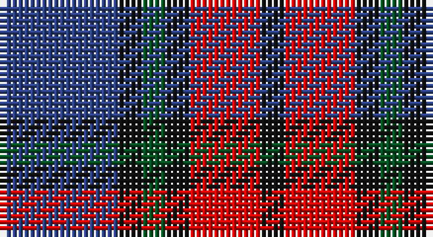

This page is one **sett** — a single exact thread-count. It belongs to the [tartan](/setts/db5k1dg1k1r3k1/)
(the same proportion at any scale), whose colour order is pattern [BKGKRK](/stripes/bkgkrk/).

Part of the [Clerk](/tartans/clerk/) tartan — the named design grouping this sett with its other cloths.

Sourced from register-of-tartans.  It is a [6 stripe tartan](/stripes/stripes6/).

Original link https://www.tartanregister.gov.uk/tartanDetails.aspx?ref=685

## Register references

External register numbers recorded for this tartan.

- Scottish Register of Tartans: [685](https://www.tartanregister.gov.uk/tartanDetails.aspx?ref=685)
- Scottish Tartans World Register: 326

## Thread count
B/20 K4 G4 K4 R12 K/4

One full sett is **72 threads**.

## Palette

Palette: <strong>Tartan Register</strong>
<table><thead><tr><th>Colour</th><th>Threads</th><th>Shade</th><th>Base</th><th>OKLCh</th></tr></thead><tbody><tr><td>B/</td><td style="text-align:right;font-variant-numeric:tabular-nums">20</td><td><code style="background-color:#2C4084;">#2C4084</code> <small style="color:#888">#2C4084</small></td><td>B <code style="background-color:#2A418A;">#2A418A</code></td><td><small style="color:#888">oklch(39.4% 0.117 268.3)</small></td></tr><tr><td>K</td><td style="text-align:right;font-variant-numeric:tabular-nums">4</td><td><code style="background-color:#101010;">#101010</code> <small style="color:#888">#101010</small></td><td>K <code style="background-color:#000000;">#000000</code></td><td><small style="color:#888">oklch(17.3% 0.000 89.9)</small></td></tr><tr><td>G</td><td style="text-align:right;font-variant-numeric:tabular-nums">4</td><td><code style="background-color:#005020;">#005020</code> <small style="color:#888">#005020</small></td><td>G <code style="background-color:#006100;">#006100</code></td><td><small style="color:#888">oklch(37.7% 0.105 149.6)</small></td></tr><tr><td>K</td><td style="text-align:right;font-variant-numeric:tabular-nums">4</td><td><code style="background-color:#101010;">#101010</code> <small style="color:#888">#101010</small></td><td>K <code style="background-color:#000000;">#000000</code></td><td><small style="color:#888">oklch(17.3% 0.000 89.9)</small></td></tr><tr><td>R</td><td style="text-align:right;font-variant-numeric:tabular-nums">12</td><td><code style="background-color:#DC0000;">#DC0000</code> <small style="color:#888">#DC0000</small></td><td>R <code style="background-color:#CC0000;">#CC0000</code></td><td><small style="color:#888">oklch(56.2% 0.230 29.2)</small></td></tr><tr><td>K/</td><td style="text-align:right;font-variant-numeric:tabular-nums">4</td><td><code style="background-color:#101010;">#101010</code> <small style="color:#888">#101010</small></td><td>K <code style="background-color:#000000;">#000000</code></td><td><small style="color:#888">oklch(17.3% 0.000 89.9)</small></td></tr></tbody></table>

# Sample pattern

## Nearest tartans

The nearest existing variants by ΔTartan distance, with this tartan at the top so the swatches line up against it.

ΔTartan

Tartan

Sett

—

<a href="/ttd/edit/#slug=db5k1dg1k1r3k1~x4">Clerk</a> <a class="nn-out" href="/variants/s6/db5k1dg1k1r3k1~x4/" title="open its dictionary page">↗</a>

0.63

<a href="/ttd/edit/#slug=t1r6db1t3k3t1~x8&amp;base=db5k1dg1k1r3k1~x4">MacTavish #2</a> <a class="nn-out" href="/variants/s6/t1r6db1t3k3t1~x8/" title="open its dictionary page">↗</a>

0.88

<a href="/ttd/edit/#slug=n32w4n4k24dp29k4&amp;base=db5k1dg1k1r3k1~x4">Grammar School at Leeds (School)</a> <a class="nn-out" href="/variants/s6/n32w4n4k24dp29k4/" title="open its dictionary page">↗</a>

0.95

<a href="/ttd/edit/#slug=db5k1g1k1r3k1~x4&amp;base=db5k1dg1k1r3k1~x4">Clerk</a> <a class="nn-out" href="/variants/s6/db5k1g1k1r3k1~x4/" title="open its dictionary page">↗</a>

1.18

<a href="/ttd/edit/#slug=k1r2t1db5lo1~x16&amp;base=db5k1dg1k1r3k1~x4">Trinity College, Toronto Uni. (Corp</a> <a class="nn-out" href="/variants/s5/k1r2t1db5lo1~x16/" title="open its dictionary page">↗</a>

1.20

<a href="/ttd/edit/#slug=dbi3db1g5dbi3r9dbi1r1dbi2~x4&amp;base=db5k1dg1k1r3k1~x4">Unidentified #61</a> <a class="nn-out" href="/variants/s8/dbi3db1g5dbi3r9dbi1r1dbi2~x4/" title="open its dictionary page">↗</a>

1.21

<a href="/ttd/edit/#slug=db31t4db6k19r20ly4~x2&amp;base=db5k1dg1k1r3k1~x4">Fife (McGill)</a> <a class="nn-out" href="/variants/s6/db31t4db6k19r20ly4~x2/" title="open its dictionary page">↗</a>

1.22

<a href="/ttd/edit/#slug=dp3k1dp8k6dg8k1w2~x2&amp;base=db5k1dg1k1r3k1~x4">Baillie (Highland Society)</a> <a class="nn-out" href="/variants/s7/dp3k1dp8k6dg8k1w2~x2/" title="open its dictionary page">↗</a>

1.24

<a href="/ttd/edit/#slug=r12dbi3g5db16ly2g2~x2&amp;base=db5k1dg1k1r3k1~x4">Dunbog Primary School Corporate Tartan</a> <a class="nn-out" href="/variants/s6/r12dbi3g5db16ly2g2~x2/" title="open its dictionary page">↗</a>

1.26

<a href="/ttd/edit/#slug=r1db3dr1g3dr5lb1~x4&amp;base=db5k1dg1k1r3k1~x4">Lanark (Fashion #1)</a> <a class="nn-out" href="/variants/s6/r1db3dr1g3dr5lb1~x4/" title="open its dictionary page">↗</a>

1.27

<a href="/ttd/edit/#slug=r5db35k25db8ly10r5~x2&amp;base=db5k1dg1k1r3k1~x4">University of Notre Dame</a> <a class="nn-out" href="/variants/s6/r5db35k25db8ly10r5~x2/" title="open its dictionary page">↗</a>

## Neighbour map

Every grey dot is one of 14360 variants placed by the first two principal components of the ΔTartan feature space (44% of its variance). Red is this tartan; blue dots are its nearest — click one to open its page.

<svg viewBox="0 0 640 380" role="img" style="max-width:100%;height:auto;border:1px solid #e0e0e0;border-radius:4px;display:block" xmlns="http://www.w3.org/2000/svg"><image href="/nn/cloud.v1.png" width="640" height="380"/><a href="/variants/s6/t1r6db1t3k3t1~x8/"><circle cx="192.3" cy="235.8" r="4" fill="#3465a4"><title>MacTavish #2</title></circle></a><a href="/variants/s6/n32w4n4k24dp29k4/"><circle cx="207.2" cy="230.1" r="4" fill="#3465a4"><title>Grammar School at Leeds (School)</title></circle></a><a href="/variants/s6/db5k1g1k1r3k1~x4/"><circle cx="172.1" cy="234.5" r="4" fill="#3465a4"><title>Clerk</title></circle></a><a href="/variants/s5/k1r2t1db5lo1~x16/"><circle cx="205.3" cy="230.3" r="4" fill="#3465a4"><title>Trinity College, Toronto Uni. (Corp</title></circle></a><a href="/variants/s8/dbi3db1g5dbi3r9dbi1r1dbi2~x4/"><circle cx="217.6" cy="209.0" r="4" fill="#3465a4"><title>Unidentified #61</title></circle></a><a href="/variants/s6/db31t4db6k19r20ly4~x2/"><circle cx="188.2" cy="210.2" r="4" fill="#3465a4"><title>Fife (McGill)</title></circle></a><a href="/variants/s7/dp3k1dp8k6dg8k1w2~x2/"><circle cx="177.0" cy="227.0" r="4" fill="#3465a4"><title>Baillie (Highland Society)</title></circle></a><a href="/variants/s6/r12dbi3g5db16ly2g2~x2/"><circle cx="180.0" cy="200.4" r="4" fill="#3465a4"><title>Dunbog Primary School Corporate Tartan</title></circle></a><a href="/variants/s6/r1db3dr1g3dr5lb1~x4/"><circle cx="180.8" cy="247.4" r="4" fill="#3465a4"><title>Lanark (Fashion #1)</title></circle></a><a href="/variants/s6/r5db35k25db8ly10r5~x2/"><circle cx="220.4" cy="222.4" r="4" fill="#3465a4"><title>University of Notre Dame</title></circle></a><circle cx="195.2" cy="243.4" r="5" fill="#c00000"/></svg>

ID: /variants/s6/db5k1dg1k1r3k1~x4/
