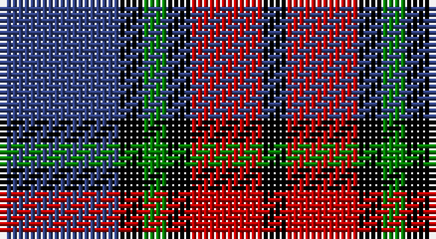

This page is one **sett** — a single exact thread-count. It belongs to the [tartan](/setts/db5k1g1k1r3k1/)
(the same proportion at any scale), whose colour order is pattern [BKGKRK](/stripes/bkgkrk/).

Part of the [Clerk](/tartans/clerk/) tartan — the named design grouping this sett with its other cloths.

Sourced from weddslist.  It is a [6 stripe tartan](/stripes/stripes6/).

Original link http://www.weddslist.com/cgi-bin/tartans/pg.pl?source=sts

## Provenance

Earliest known date: 1847 Also referred to as Clark.

2 attestations — the source records this cloth was collapsed from (oldest owns this page)

<ul>
<li>undated — Clerk (weddslist, <a href="http://www.weddslist.com/cgi-bin/tartans/pg.pl?source=sts">record</a>)</li>
<li>undated — Clerk Family Tartan (house-of-tartan, <a href="http://www.house-of-tartan.scotland.net/house/TartanViewjs.asp?colr=Def&tnam=326">record</a>)</li>
</ul>

## Thread count
B/20 K4 G4 K4 R12 K/4

One full sett is **72 threads**.

## Palette

Palette: <strong>Ingles Buchan</strong> <small style="color:#888">(1 of 4 colours)</small>
<table><thead><tr><th>Colour</th><th>Threads</th><th>Shade</th><th>Base</th><th>OKLCh</th></tr></thead><tbody><tr><td>B/</td><td style="text-align:right;font-variant-numeric:tabular-nums">20</td><td><code style="background-color:#304080;">#304080</code> <small style="color:#888">#304080</small></td><td>B <code style="background-color:#2A418A;">#2A418A</code></td><td><small style="color:#888">oklch(39.4% 0.109 270.2)</small></td></tr><tr><td>K</td><td style="text-align:right;font-variant-numeric:tabular-nums">4</td><td><code style="background-color:#000000;">#000000</code> <small style="color:#888">#000000</small></td><td>K <code style="background-color:#000000;">#000000</code></td><td><small style="color:#888">oklch(0.0% 0.000 0.0)</small></td></tr><tr><td>G</td><td style="text-align:right;font-variant-numeric:tabular-nums">4</td><td><code style="background-color:#008000;">#008000</code> <small style="color:#888">#008000</small></td><td>G <code style="background-color:#006100;">#006100</code></td><td><small style="color:#888">oklch(52.0% 0.177 142.5)</small></td></tr><tr><td>K</td><td style="text-align:right;font-variant-numeric:tabular-nums">4</td><td><code style="background-color:#000000;">#000000</code> <small style="color:#888">#000000</small></td><td>K <code style="background-color:#000000;">#000000</code></td><td><small style="color:#888">oklch(0.0% 0.000 0.0)</small></td></tr><tr><td>R</td><td style="text-align:right;font-variant-numeric:tabular-nums">12</td><td><code style="background-color:#C00000;">#C00000</code> <small style="color:#888">#C00000</small></td><td>R <code style="background-color:#CC0000;">#CC0000</code></td><td><small style="color:#888">oklch(50.7% 0.208 29.2)</small></td></tr><tr><td>K/</td><td style="text-align:right;font-variant-numeric:tabular-nums">4</td><td><code style="background-color:#000000;">#000000</code> <small style="color:#888">#000000</small></td><td>K <code style="background-color:#000000;">#000000</code></td><td><small style="color:#888">oklch(0.0% 0.000 0.0)</small></td></tr></tbody></table>

# Sample pattern

## Compared to the master

This cloth is one sett of its design; the master sett (the exemplar the design is anchored on) is below for comparison.

<figure style="margin:0"><figcaption style="color:#888;font-size:smaller">this sett</figcaption></figure>
<figure style="margin:0"><figcaption style="color:#888;font-size:smaller"><a href="/setts/db5k1dg1k1r3k1/">master sett →</a></figcaption></figure>

## Nearest tartans

The nearest existing variants by ΔTartan distance, with this tartan at the top so the swatches line up against it.

ΔTartan

Tartan

Sett

—

<a href="/ttd/edit/#slug=db5k1g1k1r3k1~x4">Clerk</a> <a class="nn-out" href="/variants/s6/db5k1g1k1r3k1~x4/" title="open its dictionary page">↗</a>

0.95

<a href="/ttd/edit/#slug=db5k1dg1k1r3k1~x4&amp;base=db5k1g1k1r3k1~x4">Clerk</a> <a class="nn-out" href="/variants/s6/db5k1dg1k1r3k1~x4/" title="open its dictionary page">↗</a>

1.01

<a href="/ttd/edit/#slug=r12db3g5db16ly2g2~x2&amp;base=db5k1g1k1r3k1~x4">Dunbog Primary (School)</a> <a class="nn-out" href="/variants/s6/r12db3g5db16ly2g2~x2/" title="open its dictionary page">↗</a>

1.05

<a href="/ttd/edit/#slug=r5db35k25db8ly10r5~x2&amp;base=db5k1g1k1r3k1~x4">University of Notre Dame</a> <a class="nn-out" href="/variants/s6/r5db35k25db8ly10r5~x2/" title="open its dictionary page">↗</a>

1.08

<a href="/ttd/edit/#slug=p3k1p8k6g8k1w2~x2&amp;base=db5k1g1k1r3k1~x4">Baillie</a> <a class="nn-out" href="/variants/s7/p3k1p8k6g8k1w2~x2/" title="open its dictionary page">↗</a>

1.11

<a href="/ttd/edit/#slug=t1r6db1t3k3t1~x8&amp;base=db5k1g1k1r3k1~x4">MacTavish #2</a> <a class="nn-out" href="/variants/s6/t1r6db1t3k3t1~x8/" title="open its dictionary page">↗</a>

1.12

<a href="/ttd/edit/#slug=oi4db19oi3k20o24db3~x2&amp;base=db5k1g1k1r3k1~x4">Edinburgh International Conference Centre</a> <a class="nn-out" href="/variants/s6/oi4db19oi3k20o24db3~x2/" title="open its dictionary page">↗</a>

1.14

<a href="/ttd/edit/#slug=k1r1k5r1w1r1db5r1k1~x2&amp;base=db5k1g1k1r3k1~x4">Gipsy</a> <a class="nn-out" href="/variants/s9/k1r1k5r1w1r1db5r1k1~x2/" title="open its dictionary page">↗</a>

1.14

<a href="/variants/s6/dg3k20ki20r20k3r3~x2/">Unidentified #65</a>

1.19

<a href="/ttd/edit/#slug=w2p10k10g9k3w2~x2&amp;base=db5k1g1k1r3k1~x4">MacNeil 2</a> <a class="nn-out" href="/variants/s6/w2p10k10g9k3w2~x2/" title="open its dictionary page">↗</a>

1.21

<a href="/ttd/edit/#slug=k2g8db2k9p7k2~x2&amp;base=db5k1g1k1r3k1~x4">Campbell, Sir Walter Scott</a> <a class="nn-out" href="/variants/s6/k2g8db2k9p7k2~x2/" title="open its dictionary page">↗</a>

## Neighbour map

Every grey dot is one of 14360 variants placed by the first two principal components of the ΔTartan feature space (44% of its variance). Red is this tartan; blue dots are its nearest — click one to open its page.

<svg viewBox="0 0 640 380" role="img" style="max-width:100%;height:auto;border:1px solid #e0e0e0;border-radius:4px;display:block" xmlns="http://www.w3.org/2000/svg"><image href="/nn/cloud.v1.png" width="640" height="380"/><a href="/variants/s6/db5k1dg1k1r3k1~x4/"><circle cx="195.2" cy="243.4" r="4" fill="#3465a4"><title>Clerk</title></circle></a><a href="/variants/s6/r12db3g5db16ly2g2~x2/"><circle cx="223.3" cy="210.7" r="4" fill="#3465a4"><title>Dunbog Primary (School)</title></circle></a><a href="/variants/s6/r5db35k25db8ly10r5~x2/"><circle cx="220.4" cy="222.4" r="4" fill="#3465a4"><title>University of Notre Dame</title></circle></a><a href="/variants/s7/p3k1p8k6g8k1w2~x2/"><circle cx="147.8" cy="208.6" r="4" fill="#3465a4"><title>Baillie</title></circle></a><a href="/variants/s6/t1r6db1t3k3t1~x8/"><circle cx="192.3" cy="235.8" r="4" fill="#3465a4"><title>MacTavish #2</title></circle></a><a href="/variants/s6/oi4db19oi3k20o24db3~x2/"><circle cx="153.2" cy="224.2" r="4" fill="#3465a4"><title>Edinburgh International Conference Centre</title></circle></a><a href="/variants/s9/k1r1k5r1w1r1db5r1k1~x2/"><circle cx="164.1" cy="202.6" r="4" fill="#3465a4"><title>Gipsy</title></circle></a><a href="/variants/s6/dg3k20ki20r20k3r3~x2/"><circle cx="164.7" cy="227.9" r="4" fill="#3465a4"><title>Unidentified #65</title></circle></a><a href="/variants/s6/w2p10k10g9k3w2~x2/"><circle cx="106.7" cy="239.6" r="4" fill="#3465a4"><title>MacNeil 2</title></circle></a><a href="/variants/s6/k2g8db2k9p7k2~x2/"><circle cx="152.0" cy="257.1" r="4" fill="#3465a4"><title>Campbell, Sir Walter Scott</title></circle></a><circle cx="172.1" cy="234.5" r="5" fill="#c00000"/></svg>

ID: /variants/s6/db5k1g1k1r3k1~x4/
