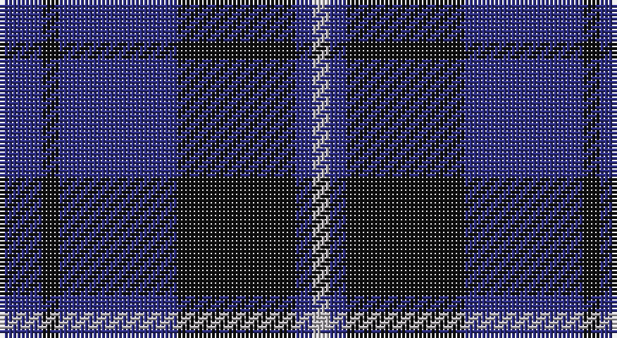

This page is one **sett** — a single exact thread-count. It belongs to the [tartan](/setts/db5k2db14k14db2lr2/)
(the same proportion at any scale), whose colour order is pattern [BKBKBY](/stripes/bkbkby/).

Part of the [Royal Scotsman Train](/tartans/royal-scotsman-train/) tartan — the named design grouping this sett with its other cloths.

Sourced from tartans-authority.  It is a [6 stripe tartan](/stripes/stripes6/).

Original link http://www.tartansauthority.com/tartan-ferret/display/7774/

## Register references

External register numbers recorded for this tartan.

- Scottish Tartans Authority (ITI): 7774

## Thread count
DB/10 K4 DB28 K28 DB4 N/4

One full sett is **142 threads**.

## Palette

Palette: <strong>Tartan Register</strong> <small style="color:#888">(4 of 5 colours)</small>
<table><thead><tr><th>Colour</th><th>Threads</th><th>Shade</th><th>Base</th><th>OKLCh</th></tr></thead><tbody><tr><td>DB/</td><td style="text-align:right;font-variant-numeric:tabular-nums">10</td><td><code style="background-color:#2C2C80;">#2C2C80</code> <small style="color:#888">#2C2C80</small></td><td>B <code style="background-color:#2A418A;">#2A418A</code></td><td><small style="color:#888">oklch(35.0% 0.138 276.6)</small></td></tr><tr><td>K</td><td style="text-align:right;font-variant-numeric:tabular-nums">4</td><td><code style="background-color:#101010;">#101010</code> <small style="color:#888">#101010</small></td><td>K <code style="background-color:#000000;">#000000</code></td><td><small style="color:#888">oklch(17.3% 0.000 89.9)</small></td></tr><tr><td>DB</td><td style="text-align:right;font-variant-numeric:tabular-nums">28</td><td><code style="background-color:#2C2C80;">#2C2C80</code> <small style="color:#888">#2C2C80</small></td><td>B <code style="background-color:#2A418A;">#2A418A</code></td><td><small style="color:#888">oklch(35.0% 0.138 276.6)</small></td></tr><tr><td>K</td><td style="text-align:right;font-variant-numeric:tabular-nums">28</td><td><code style="background-color:#101010;">#101010</code> <small style="color:#888">#101010</small></td><td>K <code style="background-color:#000000;">#000000</code></td><td><small style="color:#888">oklch(17.3% 0.000 89.9)</small></td></tr><tr><td>DB</td><td style="text-align:right;font-variant-numeric:tabular-nums">4</td><td><code style="background-color:#2C2C80;">#2C2C80</code> <small style="color:#888">#2C2C80</small></td><td>B <code style="background-color:#2A418A;">#2A418A</code></td><td><small style="color:#888">oklch(35.0% 0.138 276.6)</small></td></tr><tr><td>N/</td><td style="text-align:right;font-variant-numeric:tabular-nums">4</td><td><code style="background-color:#B8B4B8;">#B8B4B8</code> <small style="color:#888">#B8B4B8</small></td><td>Y <code style="background-color:#F2BF00;">#F2BF00</code></td><td><small style="color:#888">oklch(77.4% 0.007 325.6)</small></td></tr></tbody></table>

# Sample pattern

## Compared to the master

This cloth is one sett of its design; the master sett (the exemplar the design is anchored on) is below for comparison.

<figure style="margin:0"><figcaption style="color:#888;font-size:smaller">this sett</figcaption></figure>
<figure style="margin:0"><figcaption style="color:#888;font-size:smaller"><a href="/setts/db5k2db14k14db2k2r2/">master sett →</a></figcaption></figure>

## Nearest tartans

The nearest existing variants by ΔTartan distance, with this tartan at the top so the swatches line up against it.

ΔTartan

Tartan

Sett

—

<a href="/ttd/edit/#slug=db5k2db14k14db2lr2~x2">Royal Scotsman Train (Corporate)</a> <a class="nn-out" href="/variants/s6/db5k2db14k14db2lr2~x2/" title="open its dictionary page">↗</a>

0.88

<a href="/ttd/edit/#slug=db1k3db1k3db8r1~x4&amp;base=db5k2db14k14db2lr2~x2">Morgan (MacKay Blue) Clan Tartan</a> <a class="nn-out" href="/variants/s6/db1k3db1k3db8r1~x4/" title="open its dictionary page">↗</a>

1.16

<a href="/ttd/edit/#slug=k6db10k10b1k1b1k10b6~x4&amp;base=db5k2db14k14db2lr2~x2">Oban</a> <a class="nn-out" href="/variants/s8/k6db10k10b1k1b1k10b6~x4/" title="open its dictionary page">↗</a>

1.20

<a href="/ttd/edit/#slug=k1db7k4lb1k4p1~x4&amp;base=db5k2db14k14db2lr2~x2">Scottish Express International</a> <a class="nn-out" href="/variants/s6/k1db7k4lb1k4p1~x4/" title="open its dictionary page">↗</a>

1.24

<a href="/ttd/edit/#slug=k1db12k12g1k12db12g1~x4&amp;base=db5k2db14k14db2lr2~x2">Marchmont (Personal)</a> <a class="nn-out" href="/variants/s7/k1db12k12g1k12db12g1~x4/" title="open its dictionary page">↗</a>

1.29

<a href="/ttd/edit/#slug=k20db2k6db2k4db27w2db8~x2&amp;base=db5k2db14k14db2lr2~x2">Pride of Kinross</a> <a class="nn-out" href="/variants/s8/k20db2k6db2k4db27w2db8~x2/" title="open its dictionary page">↗</a>

1.31

<a href="/ttd/edit/#slug=k15db40k9o10~x2&amp;base=db5k2db14k14db2lr2~x2">Omega Delta Sigma, National Veterans</a> <a class="nn-out" href="/variants/s4/k15db40k9o10~x2/" title="open its dictionary page">↗</a>

1.31

<a href="/ttd/edit/#slug=db2k11db5k1db5k1~x6&amp;base=db5k2db14k14db2lr2~x2">Gagetown (School)</a> <a class="nn-out" href="/variants/s6/db2k11db5k1db5k1~x6/" title="open its dictionary page">↗</a>

1.33

<a href="/ttd/edit/#slug=db24n13db4n4w2~x2&amp;base=db5k2db14k14db2lr2~x2">Gallaecia - Galicia National</a> <a class="nn-out" href="/variants/s5/db24n13db4n4w2~x2/" title="open its dictionary page">↗</a>

1.36

<a href="/ttd/edit/#slug=k15db4k15db28r2~x2&amp;base=db5k2db14k14db2lr2~x2">MacKay (Blue) #2</a> <a class="nn-out" href="/variants/s5/k15db4k15db28r2~x2/" title="open its dictionary page">↗</a>

1.36

<a href="/ttd/edit/#slug=db1r3db1r3db6g1~x8&amp;base=db5k2db14k14db2lr2~x2">Robbins</a> <a class="nn-out" href="/variants/s6/db1r3db1r3db6g1~x8/" title="open its dictionary page">↗</a>

## Neighbour map

Every grey dot is one of 14360 variants placed by the first two principal components of the ΔTartan feature space (44% of its variance). Red is this tartan; blue dots are its nearest — click one to open its page.

<svg viewBox="0 0 640 380" role="img" style="max-width:100%;height:auto;border:1px solid #e0e0e0;border-radius:4px;display:block" xmlns="http://www.w3.org/2000/svg"><image href="/nn/cloud.v1.png" width="640" height="380"/><a href="/variants/s6/db1k3db1k3db8r1~x4/"><circle cx="404.2" cy="272.9" r="4" fill="#3465a4"><title>Morgan (MacKay Blue) Clan Tartan</title></circle></a><a href="/variants/s8/k6db10k10b1k1b1k10b6~x4/"><circle cx="367.6" cy="264.7" r="4" fill="#3465a4"><title>Oban</title></circle></a><a href="/variants/s6/k1db7k4lb1k4p1~x4/"><circle cx="285.6" cy="258.2" r="4" fill="#3465a4"><title>Scottish Express International</title></circle></a><a href="/variants/s7/k1db12k12g1k12db12g1~x4/"><circle cx="366.9" cy="265.4" r="4" fill="#3465a4"><title>Marchmont (Personal)</title></circle></a><a href="/variants/s8/k20db2k6db2k4db27w2db8~x2/"><circle cx="389.7" cy="222.8" r="4" fill="#3465a4"><title>Pride of Kinross</title></circle></a><a href="/variants/s4/k15db40k9o10~x2/"><circle cx="311.0" cy="313.4" r="4" fill="#3465a4"><title>Omega Delta Sigma, National Veterans</title></circle></a><a href="/variants/s6/db2k11db5k1db5k1~x6/"><circle cx="413.4" cy="281.1" r="4" fill="#3465a4"><title>Gagetown (School)</title></circle></a><a href="/variants/s5/db24n13db4n4w2~x2/"><circle cx="397.1" cy="254.9" r="4" fill="#3465a4"><title>Gallaecia - Galicia National</title></circle></a><a href="/variants/s5/k15db4k15db28r2~x2/"><circle cx="378.2" cy="271.0" r="4" fill="#3465a4"><title>MacKay (Blue) #2</title></circle></a><a href="/variants/s6/db1r3db1r3db6g1~x8/"><circle cx="332.0" cy="274.0" r="4" fill="#3465a4"><title>Robbins</title></circle></a><circle cx="353.0" cy="271.7" r="5" fill="#c00000"/></svg>

ID: /variants/s6/db5k2db14k14db2lr2~x2/
