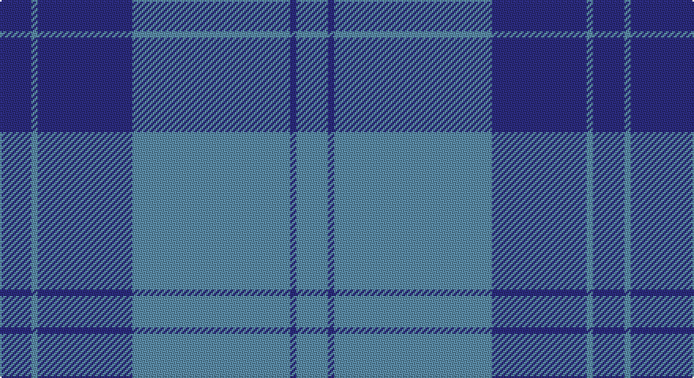

This page is one **sett** — a single exact thread-count. It belongs to the [tartan](/setts/db5t1db15t25db1t5/)
(the same proportion at any scale), whose colour order is pattern [BBBBBB](/stripes/bbbbbb/).

Sourced from tartans-authority.  It is a [6 stripe tartan](/stripes/stripes6/).

Original link http://www.tartansauthority.com/tartan-ferret/display/7532/

2 attestations — the source records this cloth was collapsed from (oldest owns this page)

<ul>
<li>February 2008 — Dram! (Corporate) (tartans-authority, <a href="http://www.tartansauthority.com/tartan-ferret/display/7532/">record</a>)</li>
<li>undated — Dram! (register-of-tartans, <a href="https://www.tartanregister.gov.uk/tartanDetails.aspx?ref=5568">record</a>)</li>
</ul>

## Register references

External register numbers recorded for this tartan.

- Scottish Register of Tartans: [5568](https://www.tartanregister.gov.uk/tartanDetails.aspx?ref=5568)
- Scottish Tartans Authority (ITI): 7532

## Thread count
DB/20 B4 DB60 B100 DB4 B/20

One full sett is **376 threads**.

## Palette

Palette: <strong>Tartan Register</strong>
<table><thead><tr><th>Colour</th><th>Threads</th><th>Shade</th><th>Base</th><th>OKLCh</th></tr></thead><tbody><tr><td>DB/</td><td style="text-align:right;font-variant-numeric:tabular-nums">20</td><td><code style="background-color:#2C2C80;">#2C2C80</code> <small style="color:#888">#2C2C80</small></td><td>B <code style="background-color:#2A418A;">#2A418A</code></td><td><small style="color:#888">oklch(35.0% 0.138 276.6)</small></td></tr><tr><td>B</td><td style="text-align:right;font-variant-numeric:tabular-nums">4</td><td><code style="background-color:#5C8CA8;">#5C8CA8</code> <small style="color:#888">#5C8CA8</small></td><td>B <code style="background-color:#2A418A;">#2A418A</code></td><td><small style="color:#888">oklch(61.7% 0.067 235.0)</small></td></tr><tr><td>DB</td><td style="text-align:right;font-variant-numeric:tabular-nums">60</td><td><code style="background-color:#2C2C80;">#2C2C80</code> <small style="color:#888">#2C2C80</small></td><td>B <code style="background-color:#2A418A;">#2A418A</code></td><td><small style="color:#888">oklch(35.0% 0.138 276.6)</small></td></tr><tr><td>B</td><td style="text-align:right;font-variant-numeric:tabular-nums">100</td><td><code style="background-color:#5C8CA8;">#5C8CA8</code> <small style="color:#888">#5C8CA8</small></td><td>B <code style="background-color:#2A418A;">#2A418A</code></td><td><small style="color:#888">oklch(61.7% 0.067 235.0)</small></td></tr><tr><td>DB</td><td style="text-align:right;font-variant-numeric:tabular-nums">4</td><td><code style="background-color:#2C2C80;">#2C2C80</code> <small style="color:#888">#2C2C80</small></td><td>B <code style="background-color:#2A418A;">#2A418A</code></td><td><small style="color:#888">oklch(35.0% 0.138 276.6)</small></td></tr><tr><td>B/</td><td style="text-align:right;font-variant-numeric:tabular-nums">20</td><td><code style="background-color:#5C8CA8;">#5C8CA8</code> <small style="color:#888">#5C8CA8</small></td><td>B <code style="background-color:#2A418A;">#2A418A</code></td><td><small style="color:#888">oklch(61.7% 0.067 235.0)</small></td></tr></tbody></table>

# Sample pattern

## Nearest tartans

The nearest existing variants by ΔTartan distance, with this tartan at the top so the swatches line up against it.

ΔTartan

Tartan

Sett

—

<a href="/ttd/edit/#slug=db5t1db15t25db1t5~x4">Dram! (Corporate)</a> <a class="nn-out" href="/variants/s6/db5t1db15t25db1t5~x4/" title="open its dictionary page">↗</a>

1.43

<a href="/ttd/edit/#slug=t52db28w3db2w2db10~x2&amp;base=db5t1db15t25db1t5~x4">St Andrews Earl of Royal family Tartan</a> <a class="nn-out" href="/variants/s6/t52db28w3db2w2db10~x2/" title="open its dictionary page">↗</a>

1.44

<a href="/ttd/edit/#slug=b50db15w3db4w2~x2&amp;base=db5t1db15t25db1t5~x4">Scottish Tourist Board (1990) (Corp)</a> <a class="nn-out" href="/variants/s5/b50db15w3db4w2~x2/" title="open its dictionary page">↗</a>

1.62

<a href="/ttd/edit/#slug=db13b1db3b6ly1b1~x4&amp;base=db5t1db15t25db1t5~x4">Hepburn #2</a> <a class="nn-out" href="/variants/s6/db13b1db3b6ly1b1~x4/" title="open its dictionary page">↗</a>

1.64

<a href="/ttd/edit/#slug=o9db3o1db11o1~x6&amp;base=db5t1db15t25db1t5~x4">MacCallum High School Corporate Tartan</a> <a class="nn-out" href="/variants/s5/o9db3o1db11o1~x6/" title="open its dictionary page">↗</a>

1.68

<a href="/ttd/edit/#slug=lg6r1lg17db3lg3db8lg1~x2&amp;base=db5t1db15t25db1t5~x4">Dominion (Fashion)</a> <a class="nn-out" href="/variants/s7/lg6r1lg17db3lg3db8lg1~x2/" title="open its dictionary page">↗</a>

1.68

<a href="/ttd/edit/#slug=ly4b3ly1b17db40b2db3~x2&amp;base=db5t1db15t25db1t5~x4">Danzas</a> <a class="nn-out" href="/variants/s7/ly4b3ly1b17db40b2db3~x2/" title="open its dictionary page">↗</a>

1.70

<a href="/ttd/edit/#slug=db12ly1t16db1t1db14t3db14ly1~x4&amp;base=db5t1db15t25db1t5~x4">Orlando Police Department (Corporate</a> <a class="nn-out" href="/variants/s9/db12ly1t16db1t1db14t3db14ly1~x4/" title="open its dictionary page">↗</a>

1.80

<a href="/ttd/edit/#slug=dp11t90dy3t11dp7dy11dp13t11&amp;base=db5t1db15t25db1t5~x4">Royal Conservatoire of Scotland</a> <a class="nn-out" href="/variants/s8/dp11t90dy3t11dp7dy11dp13t11/" title="open its dictionary page">↗</a>

1.84

<a href="/ttd/edit/#slug=db64g20r4g3r4g3&amp;base=db5t1db15t25db1t5~x4">Wilson</a> <a class="nn-out" href="/variants/s6/db64g20r4g3r4g3/" title="open its dictionary page">↗</a>

1.84

<a href="/ttd/edit/#slug=db48g14r3g2r3g2~x2&amp;base=db5t1db15t25db1t5~x4">Wilson</a> <a class="nn-out" href="/variants/s6/db48g14r3g2r3g2~x2/" title="open its dictionary page">↗</a>

## Neighbour map

Every grey dot is one of 14360 variants placed by the first two principal components of the ΔTartan feature space (44% of its variance). Red is this tartan; blue dots are its nearest — click one to open its page.

<svg viewBox="0 0 640 380" role="img" style="max-width:100%;height:auto;border:1px solid #e0e0e0;border-radius:4px;display:block" xmlns="http://www.w3.org/2000/svg"><image href="/nn/cloud.v1.png" width="640" height="380"/><a href="/variants/s6/t52db28w3db2w2db10~x2/"><circle cx="401.3" cy="192.0" r="4" fill="#3465a4"><title>St Andrews Earl of Royal family Tartan</title></circle></a><a href="/variants/s5/b50db15w3db4w2~x2/"><circle cx="495.7" cy="208.0" r="4" fill="#3465a4"><title>Scottish Tourist Board (1990) (Corp)</title></circle></a><a href="/variants/s6/db13b1db3b6ly1b1~x4/"><circle cx="424.0" cy="225.2" r="4" fill="#3465a4"><title>Hepburn #2</title></circle></a><a href="/variants/s5/o9db3o1db11o1~x6/"><circle cx="403.8" cy="265.5" r="4" fill="#3465a4"><title>MacCallum High School Corporate Tartan</title></circle></a><a href="/variants/s7/lg6r1lg17db3lg3db8lg1~x2/"><circle cx="452.9" cy="208.3" r="4" fill="#3465a4"><title>Dominion (Fashion)</title></circle></a><a href="/variants/s7/ly4b3ly1b17db40b2db3~x2/"><circle cx="469.4" cy="167.1" r="4" fill="#3465a4"><title>Danzas</title></circle></a><a href="/variants/s9/db12ly1t16db1t1db14t3db14ly1~x4/"><circle cx="433.5" cy="216.4" r="4" fill="#3465a4"><title>Orlando Police Department (Corporate</title></circle></a><a href="/variants/s8/dp11t90dy3t11dp7dy11dp13t11/"><circle cx="513.6" cy="164.3" r="4" fill="#3465a4"><title>Royal Conservatoire of Scotland</title></circle></a><a href="/variants/s6/db64g20r4g3r4g3/"><circle cx="474.1" cy="193.5" r="4" fill="#3465a4"><title>Wilson</title></circle></a><a href="/variants/s6/db48g14r3g2r3g2~x2/"><circle cx="489.6" cy="188.6" r="4" fill="#3465a4"><title>Wilson</title></circle></a><circle cx="467.1" cy="225.4" r="5" fill="#c00000"/></svg>

ID: /variants/s6/db5t1db15t25db1t5~x4/
