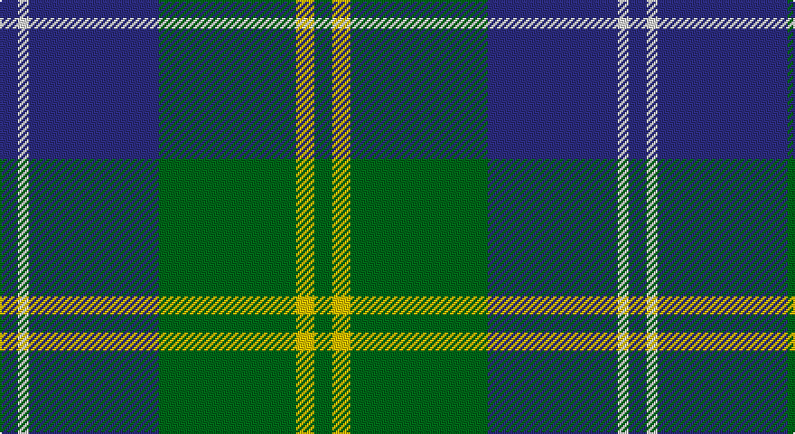

This page is one **sett** — a single exact thread-count. It belongs to the [tartan](/setts/db5w3db36g38ly5g5/)
(the same proportion at any scale), whose colour order is pattern [BWBGYG](/stripes/bwbgyg/).

Sourced from tartans-authority.  It is a [6 stripe tartan](/stripes/stripes6/).

Original link http://www.tartansauthority.com/tartan-ferret/display/8121/

## Register references

External register numbers recorded for this tartan.

- Scottish Register of Tartans: [8121](https://www.tartanregister.gov.uk/tartanDetails?ref=8121)
- Scottish Tartans Authority (ITI): 8121

## Thread count
DB/10 LN6 DB72 G76 Y10 G/10

One full sett is **348 threads**.

## Palette

Palette: <strong>Tartan Register</strong>
<table><thead><tr><th>Colour</th><th>Threads</th><th>Shade</th><th>Base</th><th>OKLCh</th></tr></thead><tbody><tr><td>DB/</td><td style="text-align:right;font-variant-numeric:tabular-nums">10</td><td><code style="background-color:#2C2C80;">#2C2C80</code> <small style="color:#888">#2C2C80</small></td><td>B <code style="background-color:#2A418A;">#2A418A</code></td><td><small style="color:#888">oklch(35.0% 0.138 276.6)</small></td></tr><tr><td>LN</td><td style="text-align:right;font-variant-numeric:tabular-nums">6</td><td><code style="background-color:#E0E0E0;">#E0E0E0</code> <small style="color:#888">#E0E0E0</small></td><td>W <code style="background-color:#F7F7F7;">#F7F7F7</code></td><td><small style="color:#888">oklch(90.7% 0.000 89.9)</small></td></tr><tr><td>DB</td><td style="text-align:right;font-variant-numeric:tabular-nums">72</td><td><code style="background-color:#2C2C80;">#2C2C80</code> <small style="color:#888">#2C2C80</small></td><td>B <code style="background-color:#2A418A;">#2A418A</code></td><td><small style="color:#888">oklch(35.0% 0.138 276.6)</small></td></tr><tr><td>G</td><td style="text-align:right;font-variant-numeric:tabular-nums">76</td><td><code style="background-color:#006818;">#006818</code> <small style="color:#888">#006818</small></td><td>G <code style="background-color:#006100;">#006100</code></td><td><small style="color:#888">oklch(45.0% 0.142 145.0)</small></td></tr><tr><td>Y</td><td style="text-align:right;font-variant-numeric:tabular-nums">10</td><td><code style="background-color:#E8C000;">#E8C000</code> <small style="color:#888">#E8C000</small></td><td>Y <code style="background-color:#F2BF00;">#F2BF00</code></td><td><small style="color:#888">oklch(81.9% 0.168 93.7)</small></td></tr><tr><td>G/</td><td style="text-align:right;font-variant-numeric:tabular-nums">10</td><td><code style="background-color:#006818;">#006818</code> <small style="color:#888">#006818</small></td><td>G <code style="background-color:#006100;">#006100</code></td><td><small style="color:#888">oklch(45.0% 0.142 145.0)</small></td></tr></tbody></table>

# Sample pattern

## Nearest tartans

The nearest existing variants by ΔTartan distance, with this tartan at the top so the swatches line up against it.

ΔTartan

Tartan

Sett

—

<a href="/ttd/edit/#slug=db5w3db36g38ly5g5~x2">St. Andrew Society, Sao Paulo (Corp)</a> <a class="nn-out" href="/variants/s6/db5w3db36g38ly5g5~x2/" title="open its dictionary page">↗</a>

0.78

<a href="/ttd/edit/#slug=r2db32g14db5g16w2~x2&amp;base=db5w3db36g38ly5g5~x2">Connacht Irish District Tartan</a> <a class="nn-out" href="/variants/s6/r2db32g14db5g16w2~x2/" title="open its dictionary page">↗</a>

0.88

<a href="/ttd/edit/#slug=g4db12r3db12g32w4~x2&amp;base=db5w3db36g38ly5g5~x2">MacIntyre Hunting (VS)</a> <a class="nn-out" href="/variants/s6/g4db12r3db12g32w4~x2/" title="open its dictionary page">↗</a>

0.94

<a href="/ttd/edit/#slug=g26db10k3db2dy2db10~x4&amp;base=db5w3db36g38ly5g5~x2">St. Andrews Old Course Hotel (Corp)</a> <a class="nn-out" href="/variants/s6/g26db10k3db2dy2db10~x4/" title="open its dictionary page">↗</a>

0.94

<a href="/ttd/edit/#slug=db24g3db3g3lo2g18r2~x2&amp;base=db5w3db36g38ly5g5~x2">Greenways Marketing Intl (Corporate)</a> <a class="nn-out" href="/variants/s7/db24g3db3g3lo2g18r2~x2/" title="open its dictionary page">↗</a>

0.94

<a href="/ttd/edit/#slug=db8r4db24g35lb4g8&amp;base=db5w3db36g38ly5g5~x2">Heritage Tartan, The</a> <a class="nn-out" href="/variants/s6/db8r4db24g35lb4g8/" title="open its dictionary page">↗</a>

0.97

<a href="/ttd/edit/#slug=g40k15b10k10ly3~x2&amp;base=db5w3db36g38ly5g5~x2">U.S. Border Patrol (Corporate)</a> <a class="nn-out" href="/variants/s5/g40k15b10k10ly3~x2/" title="open its dictionary page">↗</a>

1.02

<a href="/ttd/edit/#slug=db1k1db8ly1g12ly1db8k1db1~x2&amp;base=db5w3db36g38ly5g5~x2">Rowan</a> <a class="nn-out" href="/variants/s9/db1k1db8ly1g12ly1db8k1db1~x2/" title="open its dictionary page">↗</a>

1.03

<a href="/ttd/edit/#slug=r5db25w5db3g25db3~x2&amp;base=db5w3db36g38ly5g5~x2">Thayer USA (Name)</a> <a class="nn-out" href="/variants/s6/r5db25w5db3g25db3~x2/" title="open its dictionary page">↗</a>

1.04

<a href="/ttd/edit/#slug=dg4db12r3db12dg32lb4&amp;base=db5w3db36g38ly5g5~x2">MacIntyre L</a> <a class="nn-out" href="/variants/s6/dg4db12r3db12dg32lb4/" title="open its dictionary page">↗</a>

1.05

<a href="/ttd/edit/#slug=g12lo1db8k1db1~x4&amp;base=db5w3db36g38ly5g5~x2">Rowan (Personal)</a> <a class="nn-out" href="/variants/s5/g12lo1db8k1db1~x4/" title="open its dictionary page">↗</a>

## Neighbour map

Every grey dot is one of 14360 variants placed by the first two principal components of the ΔTartan feature space (44% of its variance). Red is this tartan; blue dots are its nearest — click one to open its page.

<svg viewBox="0 0 640 380" role="img" style="max-width:100%;height:auto;border:1px solid #e0e0e0;border-radius:4px;display:block" xmlns="http://www.w3.org/2000/svg"><image href="/nn/cloud.v1.png" width="640" height="380"/><a href="/variants/s6/r2db32g14db5g16w2~x2/"><circle cx="323.1" cy="202.9" r="4" fill="#3465a4"><title>Connacht Irish District Tartan</title></circle></a><a href="/variants/s6/g4db12r3db12g32w4~x2/"><circle cx="294.7" cy="211.8" r="4" fill="#3465a4"><title>MacIntyre Hunting (VS)</title></circle></a><a href="/variants/s6/g26db10k3db2dy2db10~x4/"><circle cx="315.5" cy="218.3" r="4" fill="#3465a4"><title>St. Andrews Old Course Hotel (Corp)</title></circle></a><a href="/variants/s7/db24g3db3g3lo2g18r2~x2/"><circle cx="312.1" cy="197.7" r="4" fill="#3465a4"><title>Greenways Marketing Intl (Corporate)</title></circle></a><a href="/variants/s6/db8r4db24g35lb4g8/"><circle cx="284.6" cy="229.3" r="4" fill="#3465a4"><title>Heritage Tartan, The</title></circle></a><a href="/variants/s5/g40k15b10k10ly3~x2/"><circle cx="279.6" cy="217.2" r="4" fill="#3465a4"><title>U.S. Border Patrol (Corporate)</title></circle></a><a href="/variants/s9/db1k1db8ly1g12ly1db8k1db1~x2/"><circle cx="296.9" cy="177.8" r="4" fill="#3465a4"><title>Rowan</title></circle></a><a href="/variants/s6/r5db25w5db3g25db3~x2/"><circle cx="251.4" cy="216.9" r="4" fill="#3465a4"><title>Thayer USA (Name)</title></circle></a><a href="/variants/s6/dg4db12r3db12dg32lb4/"><circle cx="301.0" cy="219.4" r="4" fill="#3465a4"><title>MacIntyre L</title></circle></a><a href="/variants/s5/g12lo1db8k1db1~x4/"><circle cx="339.9" cy="226.8" r="4" fill="#3465a4"><title>Rowan (Personal)</title></circle></a><circle cx="293.6" cy="202.5" r="5" fill="#c00000"/></svg>

ID: /variants/s6/db5w3db36g38ly5g5~x2/
