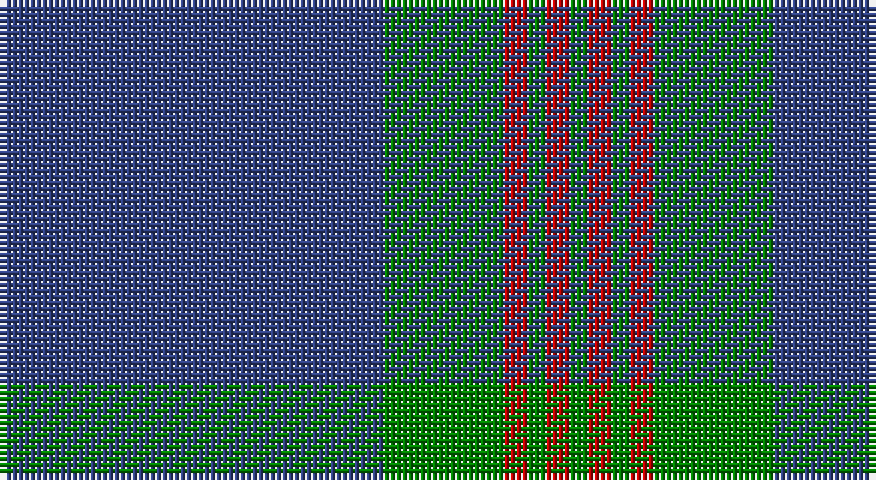

This page is one **sett** — a single exact thread-count. It belongs to the [tartan](/setts/db64g20r4g3r4g3/)
(the same proportion at any scale), whose colour order is pattern [BGRGRG](/stripes/bgrgrg/).

Sourced from weddslist.  It is a [6 stripe tartan](/stripes/stripes6/).

Original link http://www.weddslist.com/cgi-bin/tartans/pg.pl?source=sts

## Thread count
B/64 G20 R4 G3 R4 G/3

One full sett is **129 threads**.

## Palette

Palette: <strong>custom</strong>
<table><thead><tr><th>Colour</th><th>Threads</th><th>Shade</th><th>Base</th><th>OKLCh</th></tr></thead><tbody><tr><td>B/</td><td style="text-align:right;font-variant-numeric:tabular-nums">64</td><td><code style="background-color:#304080;">#304080</code> <small style="color:#888">#304080</small></td><td>B <code style="background-color:#2A418A;">#2A418A</code></td><td><small style="color:#888">oklch(39.4% 0.109 270.2)</small></td></tr><tr><td>G</td><td style="text-align:right;font-variant-numeric:tabular-nums">20</td><td><code style="background-color:#008000;">#008000</code> <small style="color:#888">#008000</small></td><td>G <code style="background-color:#006100;">#006100</code></td><td><small style="color:#888">oklch(52.0% 0.177 142.5)</small></td></tr><tr><td>R</td><td style="text-align:right;font-variant-numeric:tabular-nums">4</td><td><code style="background-color:#C00000;">#C00000</code> <small style="color:#888">#C00000</small></td><td>R <code style="background-color:#CC0000;">#CC0000</code></td><td><small style="color:#888">oklch(50.7% 0.208 29.2)</small></td></tr><tr><td>G</td><td style="text-align:right;font-variant-numeric:tabular-nums">3</td><td><code style="background-color:#008000;">#008000</code> <small style="color:#888">#008000</small></td><td>G <code style="background-color:#006100;">#006100</code></td><td><small style="color:#888">oklch(52.0% 0.177 142.5)</small></td></tr><tr><td>R</td><td style="text-align:right;font-variant-numeric:tabular-nums">4</td><td><code style="background-color:#C00000;">#C00000</code> <small style="color:#888">#C00000</small></td><td>R <code style="background-color:#CC0000;">#CC0000</code></td><td><small style="color:#888">oklch(50.7% 0.208 29.2)</small></td></tr><tr><td>G/</td><td style="text-align:right;font-variant-numeric:tabular-nums">3</td><td><code style="background-color:#008000;">#008000</code> <small style="color:#888">#008000</small></td><td>G <code style="background-color:#006100;">#006100</code></td><td><small style="color:#888">oklch(52.0% 0.177 142.5)</small></td></tr></tbody></table>

# Sample pattern

## Nearest tartans

The nearest existing variants by ΔTartan distance, with this tartan at the top so the swatches line up against it.

ΔTartan

Tartan

Sett

—

<a href="/ttd/edit/#slug=db64g20r4g3r4g3">Wilson</a> <a class="nn-out" href="/variants/s6/db64g20r4g3r4g3/" title="open its dictionary page">↗</a>

0.25

<a href="/ttd/edit/#slug=db48g14r3g2r3g2~x2&amp;base=db64g20r4g3r4g3">Wilson</a> <a class="nn-out" href="/variants/s6/db48g14r3g2r3g2~x2/" title="open its dictionary page">↗</a>

1.23

<a href="/ttd/edit/#slug=db64dg20r4dg3r4dg3&amp;base=db64g20r4g3r4g3">Wilson</a> <a class="nn-out" href="/variants/s6/db64dg20r4dg3r4dg3/" title="open its dictionary page">↗</a>

1.25

<a href="/ttd/edit/#slug=db48dg14r3dg2r3dg2~x2&amp;base=db64g20r4g3r4g3">Wilson #2</a> <a class="nn-out" href="/variants/s6/db48dg14r3dg2r3dg2~x2/" title="open its dictionary page">↗</a>

1.38

<a href="/ttd/edit/#slug=dp11t90dy3t11dp7dy11dp13t11&amp;base=db64g20r4g3r4g3">Royal Conservatoire of Scotland</a> <a class="nn-out" href="/variants/s8/dp11t90dy3t11dp7dy11dp13t11/" title="open its dictionary page">↗</a>

1.39

<a href="/ttd/edit/#slug=k8m26k22dt110w4k5w4&amp;base=db64g20r4g3r4g3">Edinburgh, The University of</a> <a class="nn-out" href="/variants/s7/k8m26k22dt110w4k5w4/" title="open its dictionary page">↗</a>

1.46

<a href="/ttd/edit/#slug=b64k3g14k4b4k12lo4~x2&amp;base=db64g20r4g3r4g3">Murray of Elibank</a> <a class="nn-out" href="/variants/s7/b64k3g14k4b4k12lo4~x2/" title="open its dictionary page">↗</a>

1.50

<a href="/ttd/edit/#slug=k3n6k8lr2k8n3k5n36k2n3~x2&amp;base=db64g20r4g3r4g3">City Building (Glasgow) LLP</a> <a class="nn-out" href="/variants/s10/k3n6k8lr2k8n3k5n36k2n3~x2/" title="open its dictionary page">↗</a>

1.52

<a href="/ttd/edit/#slug=n42db2n2db17lo8db4~x2&amp;base=db64g20r4g3r4g3">Connecticut State Police PB (Cor.)</a> <a class="nn-out" href="/variants/s6/n42db2n2db17lo8db4~x2/" title="open its dictionary page">↗</a>

1.55

<a href="/ttd/edit/#slug=db16w1db1w1db8dg16r1db2~x2&amp;base=db64g20r4g3r4g3">Roxburgh</a> <a class="nn-out" href="/variants/s8/db16w1db1w1db8dg16r1db2~x2/" title="open its dictionary page">↗</a>

1.56

<a href="/ttd/edit/#slug=db40g8k1ly2k1g8db5~x4&amp;base=db64g20r4g3r4g3">Salvation Army, Hunting</a> <a class="nn-out" href="/variants/s7/db40g8k1ly2k1g8db5~x4/" title="open its dictionary page">↗</a>

## Neighbour map

Every grey dot is one of 14360 variants placed by the first two principal components of the ΔTartan feature space (44% of its variance). Red is this tartan; blue dots are its nearest — click one to open its page.

<svg viewBox="0 0 640 380" role="img" style="max-width:100%;height:auto;border:1px solid #e0e0e0;border-radius:4px;display:block" xmlns="http://www.w3.org/2000/svg"><image href="/nn/cloud.v1.png" width="640" height="380"/><a href="/variants/s6/db48g14r3g2r3g2~x2/"><circle cx="489.6" cy="188.6" r="4" fill="#3465a4"><title>Wilson</title></circle></a><a href="/variants/s6/db64dg20r4dg3r4dg3/"><circle cx="506.3" cy="211.1" r="4" fill="#3465a4"><title>Wilson</title></circle></a><a href="/variants/s6/db48dg14r3dg2r3dg2~x2/"><circle cx="520.3" cy="205.4" r="4" fill="#3465a4"><title>Wilson #2</title></circle></a><a href="/variants/s8/dp11t90dy3t11dp7dy11dp13t11/"><circle cx="513.6" cy="164.3" r="4" fill="#3465a4"><title>Royal Conservatoire of Scotland</title></circle></a><a href="/variants/s7/k8m26k22dt110w4k5w4/"><circle cx="427.0" cy="160.0" r="4" fill="#3465a4"><title>Edinburgh, The University of</title></circle></a><a href="/variants/s7/b64k3g14k4b4k12lo4~x2/"><circle cx="413.1" cy="162.1" r="4" fill="#3465a4"><title>Murray of Elibank</title></circle></a><a href="/variants/s10/k3n6k8lr2k8n3k5n36k2n3~x2/"><circle cx="452.2" cy="179.6" r="4" fill="#3465a4"><title>City Building (Glasgow) LLP</title></circle></a><a href="/variants/s6/n42db2n2db17lo8db4~x2/"><circle cx="380.8" cy="179.7" r="4" fill="#3465a4"><title>Connecticut State Police PB (Cor.)</title></circle></a><a href="/variants/s8/db16w1db1w1db8dg16r1db2~x2/"><circle cx="398.6" cy="197.9" r="4" fill="#3465a4"><title>Roxburgh</title></circle></a><a href="/variants/s7/db40g8k1ly2k1g8db5~x4/"><circle cx="486.5" cy="143.3" r="4" fill="#3465a4"><title>Salvation Army, Hunting</title></circle></a><circle cx="474.1" cy="193.5" r="5" fill="#c00000"/></svg>

ID: /variants/s6/db64g20r4g3r4g3/
