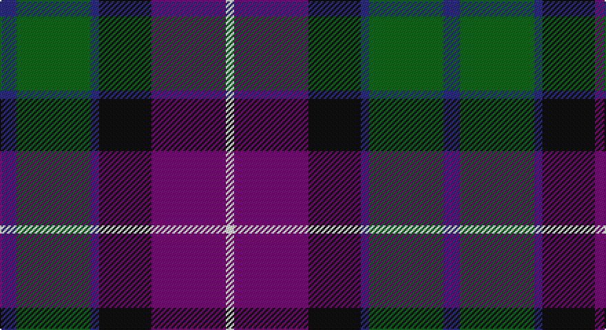

This page is one **sett** — a single exact thread-count. It belongs to the [tartan](/setts/db6g27db3k19dp27w3/)
(the same proportion at any scale), whose colour order is pattern [BGBKBW](/stripes/bgbkbw/).

Sourced from register-of-tartans.  It is a [6 stripe tartan](/stripes/stripes6/).

Original link https://www.tartanregister.gov.uk/tartanDetails.aspx?ref=1444

## Also known as

This cloth is also recorded under:

- Gold Brothers

2 attestations — the source records this cloth was collapsed from (oldest owns this page)

<ul>
<li>01/05/2005 — Gold Brothers (register-of-tartans, <a href="https://www.tartanregister.gov.uk/tartanDetails.aspx?ref=1444">record</a>)</li>
<li>2005 May — Freedom (Fashion) (tartans-authority, <a href="http://www.tartansauthority.com/tartan-ferret/display/6865/">record</a>)</li>
</ul>

## Register references

External register numbers recorded for this tartan.

- Scottish Register of Tartans: [1444](https://www.tartanregister.gov.uk/tartanDetails.aspx?ref=1444)
- Scottish Tartans Authority (ITI): 6865

## Thread count
DB/12 G54 DB6 K38 P54 W/6

One full sett is **322 threads**.

## Palette

Palette: <strong>Tartan Register</strong>
<table><thead><tr><th>Colour</th><th>Threads</th><th>Shade</th><th>Base</th><th>OKLCh</th></tr></thead><tbody><tr><td>DB/</td><td style="text-align:right;font-variant-numeric:tabular-nums">12</td><td><code style="background-color:#2C2C80;">#2C2C80</code> <small style="color:#888">#2C2C80</small></td><td>B <code style="background-color:#2A418A;">#2A418A</code></td><td><small style="color:#888">oklch(35.0% 0.138 276.6)</small></td></tr><tr><td>G</td><td style="text-align:right;font-variant-numeric:tabular-nums">54</td><td><code style="background-color:#006818;">#006818</code> <small style="color:#888">#006818</small></td><td>G <code style="background-color:#006100;">#006100</code></td><td><small style="color:#888">oklch(45.0% 0.142 145.0)</small></td></tr><tr><td>DB</td><td style="text-align:right;font-variant-numeric:tabular-nums">6</td><td><code style="background-color:#2C2C80;">#2C2C80</code> <small style="color:#888">#2C2C80</small></td><td>B <code style="background-color:#2A418A;">#2A418A</code></td><td><small style="color:#888">oklch(35.0% 0.138 276.6)</small></td></tr><tr><td>K</td><td style="text-align:right;font-variant-numeric:tabular-nums">38</td><td><code style="background-color:#101010;">#101010</code> <small style="color:#888">#101010</small></td><td>K <code style="background-color:#000000;">#000000</code></td><td><small style="color:#888">oklch(17.3% 0.000 89.9)</small></td></tr><tr><td>P</td><td style="text-align:right;font-variant-numeric:tabular-nums">54</td><td><code style="background-color:#780078;">#780078</code> <small style="color:#888">#780078</small></td><td>B <code style="background-color:#2A418A;">#2A418A</code></td><td><small style="color:#888">oklch(40.2% 0.185 328.4)</small></td></tr><tr><td>W/</td><td style="text-align:right;font-variant-numeric:tabular-nums">6</td><td><code style="background-color:#F8F8F8;">#F8F8F8</code> <small style="color:#888">#F8F8F8</small></td><td>W <code style="background-color:#F7F7F7;">#F7F7F7</code></td><td><small style="color:#888">oklch(97.9% 0.000 89.9)</small></td></tr></tbody></table>

# Sample pattern

## Nearest tartans

The nearest existing variants by ΔTartan distance, with this tartan at the top so the swatches line up against it.

ΔTartan

Tartan

Sett

—

<a href="/ttd/edit/#slug=db6g27db3k19dp27w3~x2">Gold Brothers</a> <a class="nn-out" href="/variants/s6/db6g27db3k19dp27w3~x2/" title="open its dictionary page">↗</a>

0.68

<a href="/ttd/edit/#slug=dp6k3dp21k23w3dg24r3~x2&amp;base=db6g27db3k19dp27w3~x2">Colquhoun #3</a> <a class="nn-out" href="/variants/s7/dp6k3dp21k23w3dg24r3~x2/" title="open its dictionary page">↗</a>

0.68

<a href="/ttd/edit/#slug=r5g19w3k19db19k3db2~x2&amp;base=db6g27db3k19dp27w3~x2">Fruin Colquhoun (Commemorative?)</a> <a class="nn-out" href="/variants/s7/r5g19w3k19db19k3db2~x2/" title="open its dictionary page">↗</a>

0.69

<a href="/ttd/edit/#slug=k4b21dy10y4k20r6b3~x2&amp;base=db6g27db3k19dp27w3~x2">Swankie (Personal)</a> <a class="nn-out" href="/variants/s7/k4b21dy10y4k20r6b3~x2/" title="open its dictionary page">↗</a>

0.80

<a href="/ttd/edit/#slug=do7w1r6db10g10w1~x4&amp;base=db6g27db3k19dp27w3~x2">McEachern, Andrew</a> <a class="nn-out" href="/variants/s6/do7w1r6db10g10w1~x4/" title="open its dictionary page">↗</a>

0.82

<a href="/ttd/edit/#slug=r10db6g24dbi24r6ly3&amp;base=db6g27db3k19dp27w3~x2">Canine All Dogs (Fashion)</a> <a class="nn-out" href="/variants/s6/r10db6g24dbi24r6ly3/" title="open its dictionary page">↗</a>

0.83

<a href="/ttd/edit/#slug=g3db12w1dg12r12dg2~x2&amp;base=db6g27db3k19dp27w3~x2">Patterson, John (Personal)</a> <a class="nn-out" href="/variants/s6/g3db12w1dg12r12dg2~x2/" title="open its dictionary page">↗</a>

0.83

<a href="/variants/s5/dp20k5ki19g19ly2~x2/">Martin Hunting</a>

0.83

<a href="/ttd/edit/#slug=m3k17n11m2o20w2~x2&amp;base=db6g27db3k19dp27w3~x2">Commonwealth Games Council (Corp.)</a> <a class="nn-out" href="/variants/s6/m3k17n11m2o20w2~x2/" title="open its dictionary page">↗</a>

0.85

<a href="/ttd/edit/#slug=ly5db24k8dbi18ly6dy3&amp;base=db6g27db3k19dp27w3~x2">Cala Homes (Corporate)</a> <a class="nn-out" href="/variants/s6/ly5db24k8dbi18ly6dy3/" title="open its dictionary page">↗</a>

0.86

<a href="/ttd/edit/#slug=r2o8db2t4k4t1~x6&amp;base=db6g27db3k19dp27w3~x2">Thom(p)son's, Fancy</a> <a class="nn-out" href="/variants/s6/r2o8db2t4k4t1~x6/" title="open its dictionary page">↗</a>

## Neighbour map

Every grey dot is one of 14360 variants placed by the first two principal components of the ΔTartan feature space (44% of its variance). Red is this tartan; blue dots are its nearest — click one to open its page.

<svg viewBox="0 0 640 380" role="img" style="max-width:100%;height:auto;border:1px solid #e0e0e0;border-radius:4px;display:block" xmlns="http://www.w3.org/2000/svg"><image href="/nn/cloud.v1.png" width="640" height="380"/><a href="/variants/s7/dp6k3dp21k23w3dg24r3~x2/"><circle cx="158.1" cy="207.9" r="4" fill="#3465a4"><title>Colquhoun #3</title></circle></a><a href="/variants/s7/r5g19w3k19db19k3db2~x2/"><circle cx="148.1" cy="204.2" r="4" fill="#3465a4"><title>Fruin Colquhoun (Commemorative?)</title></circle></a><a href="/variants/s7/k4b21dy10y4k20r6b3~x2/"><circle cx="147.2" cy="214.6" r="4" fill="#3465a4"><title>Swankie (Personal)</title></circle></a><a href="/variants/s6/do7w1r6db10g10w1~x4/"><circle cx="104.5" cy="211.2" r="4" fill="#3465a4"><title>McEachern, Andrew</title></circle></a><a href="/variants/s6/r10db6g24dbi24r6ly3/"><circle cx="141.9" cy="215.2" r="4" fill="#3465a4"><title>Canine All Dogs (Fashion)</title></circle></a><a href="/variants/s6/g3db12w1dg12r12dg2~x2/"><circle cx="168.9" cy="200.8" r="4" fill="#3465a4"><title>Patterson, John (Personal)</title></circle></a><a href="/variants/s5/dp20k5ki19g19ly2~x2/"><circle cx="137.9" cy="229.9" r="4" fill="#3465a4"><title>Martin Hunting</title></circle></a><a href="/variants/s6/m3k17n11m2o20w2~x2/"><circle cx="159.8" cy="192.2" r="4" fill="#3465a4"><title>Commonwealth Games Council (Corp.)</title></circle></a><a href="/variants/s6/ly5db24k8dbi18ly6dy3/"><circle cx="142.7" cy="212.9" r="4" fill="#3465a4"><title>Cala Homes (Corporate)</title></circle></a><a href="/variants/s6/r2o8db2t4k4t1~x6/"><circle cx="135.0" cy="212.1" r="4" fill="#3465a4"><title>Thom(p)son's, Fancy</title></circle></a><circle cx="140.8" cy="208.0" r="5" fill="#c00000"/></svg>

ID: /variants/s6/db6g27db3k19dp27w3~x2/
