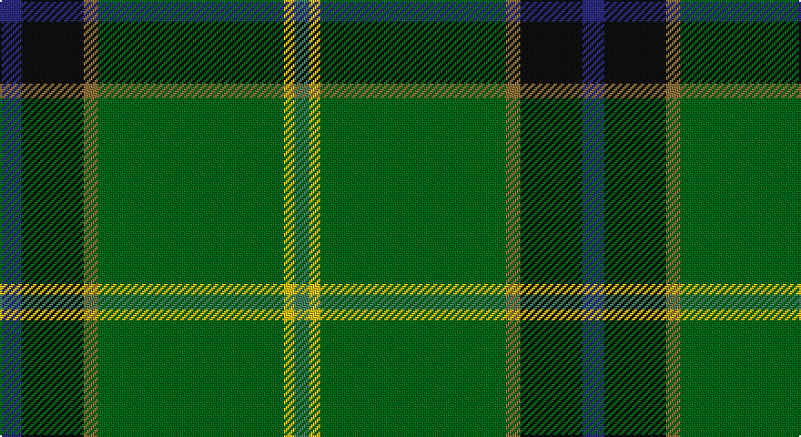

This page is one **sett** — a single exact thread-count. It belongs to the [tartan](/setts/db6k17y4gi51ly3g4/)
(the same proportion at any scale), whose colour order is pattern [BKGGYG](/stripes/bkggyg/).

Part of the [U.S. Army](/tartans/u-s-army/) tartan — the named design grouping this sett with its other cloths.

Sourced from tartans-authority.  It is a [6 stripe tartan](/stripes/stripes6/).

Original link http://www.tartansauthority.com/tartan-ferret/display/6307/

## Register references

External register numbers recorded for this tartan.

- Scottish Tartans Authority (ITI): 6307

## Thread count
DB/12 K34 LT8 Ga102 Y6 G/8

One full sett is **320 threads**.

## Palette

Palette: <strong>Tartan Register</strong>
<table><thead><tr><th>Colour</th><th>Threads</th><th>Shade</th><th>Base</th><th>OKLCh</th></tr></thead><tbody><tr><td>DB/</td><td style="text-align:right;font-variant-numeric:tabular-nums">12</td><td><code style="background-color:#2C2C80;">#2C2C80</code> <small style="color:#888">#2C2C80</small></td><td>B <code style="background-color:#2A418A;">#2A418A</code></td><td><small style="color:#888">oklch(35.0% 0.138 276.6)</small></td></tr><tr><td>K</td><td style="text-align:right;font-variant-numeric:tabular-nums">34</td><td><code style="background-color:#101010;">#101010</code> <small style="color:#888">#101010</small></td><td>K <code style="background-color:#000000;">#000000</code></td><td><small style="color:#888">oklch(17.3% 0.000 89.9)</small></td></tr><tr><td>LT</td><td style="text-align:right;font-variant-numeric:tabular-nums">8</td><td><code style="background-color:#8C7038;">#8C7038</code> <small style="color:#888">#8C7038</small></td><td>G <code style="background-color:#006100;">#006100</code></td><td><small style="color:#888">oklch(56.0% 0.082 83.0)</small></td></tr><tr><td>Ga</td><td style="text-align:right;font-variant-numeric:tabular-nums">102</td><td><code style="background-color:#006818;">#006818</code> <small style="color:#888">#006818</small></td><td>G <code style="background-color:#006100;">#006100</code></td><td><small style="color:#888">oklch(45.0% 0.142 145.0)</small></td></tr><tr><td>Y</td><td style="text-align:right;font-variant-numeric:tabular-nums">6</td><td><code style="background-color:#E8C000;">#E8C000</code> <small style="color:#888">#E8C000</small></td><td>Y <code style="background-color:#F2BF00;">#F2BF00</code></td><td><small style="color:#888">oklch(81.9% 0.168 93.7)</small></td></tr><tr><td>G/</td><td style="text-align:right;font-variant-numeric:tabular-nums">8</td><td><code style="background-color:#408060;">#408060</code> <small style="color:#888">#408060</small></td><td>G <code style="background-color:#006100;">#006100</code></td><td><small style="color:#888">oklch(54.8% 0.084 160.1)</small></td></tr></tbody></table>

# Sample pattern

## Compared to the master

This cloth is one sett of its design; the master sett (the exemplar the design is anchored on) is below for comparison.

<figure style="margin:0"><figcaption style="color:#888;font-size:smaller">this sett</figcaption></figure>
<figure style="margin:0"><figcaption style="color:#888;font-size:smaller"><a href="/setts/k17y4gi51ly3g4ly3gi51y4k17db6/">master sett →</a></figcaption></figure>

## Nearest tartans

The nearest existing variants by ΔTartan distance, with this tartan at the top so the swatches line up against it.

ΔTartan

Tartan

Sett

—

<a href="/ttd/edit/#slug=db6k17y4gi51ly3g4~x2">U.S. Army (Military)</a> <a class="nn-out" href="/variants/s6/db6k17y4gi51ly3g4~x2/" title="open its dictionary page">↗</a>

1.00

<a href="/ttd/edit/#slug=k3g34b10g5r2k8dy2w3~x2&amp;base=db6k17y4gi51ly3g4~x2">Lambert Kai (Personal)</a> <a class="nn-out" href="/variants/s8/k3g34b10g5r2k8dy2w3~x2/" title="open its dictionary page">↗</a>

1.19

<a href="/ttd/edit/#slug=k17y4gi51ly3g4ly3gi51y4k17db6~x2&amp;base=db6k17y4gi51ly3g4~x2">U.S. Army</a> <a class="nn-out" href="/variants/s10/k17y4gi51ly3g4ly3gi51y4k17db6~x2/" title="open its dictionary page">↗</a>

1.27

<a href="/ttd/edit/#slug=k3g2k3g18r2db2lo1~x4&amp;base=db6k17y4gi51ly3g4~x2">Selvon-Bruce (Personal)</a> <a class="nn-out" href="/variants/s7/k3g2k3g18r2db2lo1~x4/" title="open its dictionary page">↗</a>

1.34

<a href="/ttd/edit/#slug=g55db7r24g12dt4ly3dt4~x2&amp;base=db6k17y4gi51ly3g4~x2">Crieff &amp; Strathearn #1</a> <a class="nn-out" href="/variants/s7/g55db7r24g12dt4ly3dt4~x2/" title="open its dictionary page">↗</a>

1.34

<a href="/ttd/edit/#slug=dgi36dg5db17w2dgi14o3dp2~x2&amp;base=db6k17y4gi51ly3g4~x2">Mounth,The Rejected</a> <a class="nn-out" href="/variants/s7/dgi36dg5db17w2dgi14o3dp2~x2/" title="open its dictionary page">↗</a>

1.36

<a href="/ttd/edit/#slug=g36dg5db17w2g14y3p2~x2&amp;base=db6k17y4gi51ly3g4~x2">Mounth, The, (rejected)</a> <a class="nn-out" href="/variants/s7/g36dg5db17w2g14y3p2~x2/" title="open its dictionary page">↗</a>

1.42

<a href="/ttd/edit/#slug=g55k17r9k11ly2db4~x2&amp;base=db6k17y4gi51ly3g4~x2">Moran Family Tartan</a> <a class="nn-out" href="/variants/s6/g55k17r9k11ly2db4~x2/" title="open its dictionary page">↗</a>

1.43

<a href="/ttd/edit/#slug=w3r4db13g37t3k3ly2~x2&amp;base=db6k17y4gi51ly3g4~x2">Washington District Tartan</a> <a class="nn-out" href="/variants/s7/w3r4db13g37t3k3ly2~x2/" title="open its dictionary page">↗</a>

1.43

<a href="/ttd/edit/#slug=w1db6g4db1g16k1g4k6ly1~x4&amp;base=db6k17y4gi51ly3g4~x2">Henderson/MacKendrick</a> <a class="nn-out" href="/variants/s9/w1db6g4db1g16k1g4k6ly1~x4/" title="open its dictionary page">↗</a>

1.43

<a href="/ttd/edit/#slug=w1db6g4db1g16k1g4k6ly1~x2&amp;base=db6k17y4gi51ly3g4~x2">MacKendrick</a> <a class="nn-out" href="/variants/s9/w1db6g4db1g16k1g4k6ly1~x2/" title="open its dictionary page">↗</a>

## Neighbour map

Every grey dot is one of 14360 variants placed by the first two principal components of the ΔTartan feature space (44% of its variance). Red is this tartan; blue dots are its nearest — click one to open its page.

<svg viewBox="0 0 640 380" role="img" style="max-width:100%;height:auto;border:1px solid #e0e0e0;border-radius:4px;display:block" xmlns="http://www.w3.org/2000/svg"><image href="/nn/cloud.v1.png" width="640" height="380"/><a href="/variants/s8/k3g34b10g5r2k8dy2w3~x2/"><circle cx="299.8" cy="136.0" r="4" fill="#3465a4"><title>Lambert Kai (Personal)</title></circle></a><a href="/variants/s10/k17y4gi51ly3g4ly3gi51y4k17db6~x2/"><circle cx="353.8" cy="143.8" r="4" fill="#3465a4"><title>U.S. Army</title></circle></a><a href="/variants/s7/k3g2k3g18r2db2lo1~x4/"><circle cx="378.6" cy="155.1" r="4" fill="#3465a4"><title>Selvon-Bruce (Personal)</title></circle></a><a href="/variants/s7/g55db7r24g12dt4ly3dt4~x2/"><circle cx="386.2" cy="175.6" r="4" fill="#3465a4"><title>Crieff &amp; Strathearn #1</title></circle></a><a href="/variants/s7/dgi36dg5db17w2dgi14o3dp2~x2/"><circle cx="366.7" cy="173.6" r="4" fill="#3465a4"><title>Mounth,The Rejected</title></circle></a><a href="/variants/s7/g36dg5db17w2g14y3p2~x2/"><circle cx="321.7" cy="150.9" r="4" fill="#3465a4"><title>Mounth, The, (rejected)</title></circle></a><a href="/variants/s6/g55k17r9k11ly2db4~x2/"><circle cx="344.8" cy="156.2" r="4" fill="#3465a4"><title>Moran Family Tartan</title></circle></a><a href="/variants/s7/w3r4db13g37t3k3ly2~x2/"><circle cx="282.8" cy="115.5" r="4" fill="#3465a4"><title>Washington District Tartan</title></circle></a><a href="/variants/s9/w1db6g4db1g16k1g4k6ly1~x4/"><circle cx="326.6" cy="166.2" r="4" fill="#3465a4"><title>Henderson/MacKendrick</title></circle></a><a href="/variants/s9/w1db6g4db1g16k1g4k6ly1~x2/"><circle cx="326.6" cy="166.2" r="4" fill="#3465a4"><title>MacKendrick</title></circle></a><circle cx="339.3" cy="159.7" r="5" fill="#c00000"/></svg>

ID: /variants/s6/db6k17y4gi51ly3g4~x2/
