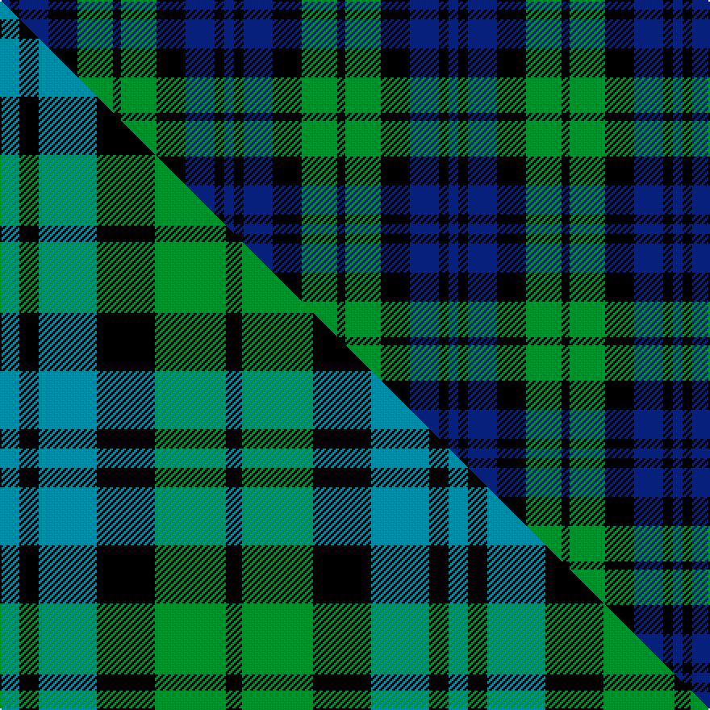

This is one **variant** — a specific cloth: this exact thread count and colourway, with its own
provenance below. It is one weaving of the [sett](/setts/db6k6db18k18g22k5/) (the scale-free proportion — the
same cloth at any scale or shade), whose colour order is pattern [BKBKGK](/stripes/bkbkgk/).

Part of the [Campbell, The 42nd](/tartans/campbell-the-42nd/) tartan — the named design grouping this sett with its other cloths.

Sourced from weddslist.  It is a [6 stripe tartan](/stripes/stripes6/).

Original link [http://www.weddslist.com/cgi-bin/tartans/pg.pl?source=sts](http://www.weddslist.com/cgi-bin/tartans/pg.pl?source=sts)

Dataset <small>— provenance for this record, inherited from the source manifest</small>

<dl class="dataset-prov">
<dt>source</dt><dd><a href="/sources/weddslist/">Weddslist</a></dd>
<dt>data captured from</dt><dd><a href="https://github.com/thetartan/tartan-database/blob/master/data/weddslist/data.csv">https://github.com/thetartan/tartan-database/blob/master/data/weddslist/data.csv</a></dd>
<dt>data date</dt><dd>2016-11-17 <small>(dataset default)</small></dd>
<dt>licence</dt><dd><a href="https://creativecommons.org/licenses/by-nc-nd/4.0/">CC BY-NC-ND 4.0</a></dd>
</dl>

Capture chain <small>— the hands this data passed through, oldest first; each capture carries its own licence</small>

<ol class="capture-chain">
<li><a href="https://www.weddslist.com/tartans/">Weddslist</a> <small>the living privately compiled reference</small></li>
<li><a href="https://github.com/thetartan/tartan-database">thetartan/tartan-database</a> <small>2016-2017</small> · <a href="https://creativecommons.org/licenses/by-nc-nd/4.0/">CC BY-NC-ND 4.0</a> <small>Levko Kravets's frozen compilation — the capture we vendored, and where its CC licence text came from</small></li>
<li>this dictionary <small>captured 2026-06-10 · commit 5bf86c7566</small> <small>each re-capture is a git commit to data/sources</small></li>
</ol>

## Thread count
DB/6 K6 DB18 K18 G22 K/5

One full sett is **139 threads**.

## Palette
<table><thead><tr><th>Colour</th><th>Shade</th><th>OKLCh</th></tr></thead><tbody><tr><td>DB</td><td><code style="background-color:#082077;">#082077</code> <small style="color:#888">#082077</small></td><td><small style="color:#888">oklch(30.0% 0.149 265.1)</small></td></tr><tr><td>G</td><td><code style="background-color:#008B2A;">#008B2A</code> <small style="color:#888">#008B2A</small></td><td><small style="color:#888">oklch(55.4% 0.170 145.9)</small></td></tr><tr><td>K</td><td><code style="background-color:#000000;">#000000</code> <small style="color:#888">#000000</small></td><td><small style="color:#888">oklch(0.0% 0.000 0.0)</small></td></tr></tbody></table>

# Sample pattern

## Compared to the master

This cloth is one sett of its design; the master sett (the exemplar the design is anchored on) is below for comparison.

Its **ΔTartan distance** from the master is **0.15** — the same measure the nearest-tartans table ranks by (0 is identical; a re-scale of the same cloth is near 0, a recolour or a different proportion further).

<figure class="master-compare" style="margin:0">

this sett
master sett ★

<figcaption style="color:#888;font-size:smaller">One weave of this sett against the <a href="/setts/t6k6t18k18g22k5/">master sett ★</a>, split on the diagonal: a shared proportion runs seamlessly across it with only the shades shifting; a different proportion breaks on it.</figcaption>
</figure>

## Nearest tartan variants

The nearest existing variants by ΔTartan distance, with this cloth at the top so the swatches line up against it.

ΔTartan

Threads

Variant

Sett

—

139

<a href="/variants/s6/db6k6db18k18g22k5/">Campbell, the 42nd</a>

<a href="/ttd/edit/#slug=t6k6t18k18g22k5~x2&amp;base=db6k6db18k18g22k5" title="compare in the TTD">0.15</a>

278

<a href="/variants/s6/t6k6t18k18g22k5~x2/">Campbell, The 42nd</a>

<a href="/ttd/edit/#slug=k1g3k3db3k1db1~x4&amp;base=db6k6db18k18g22k5" title="compare in the TTD">0.55</a>

88

<a href="/variants/s6/k1g3k3db3k1db1~x4/">Sutherland 42nd</a>

<a href="/ttd/edit/#slug=db4k2db16k10g18k3~x2&amp;base=db6k6db18k18g22k5" title="compare in the TTD">0.59</a>

198

<a href="/variants/s6/db4k2db16k10g18k3~x2/">Wartley Htg (Fashion)</a>

<a href="/ttd/edit/#slug=k1dg6k6db6k1db1~x4~dg1605139-db1004274&amp;base=db6k6db18k18g22k5" title="compare in the TTD">0.64</a>

160

<a href="/variants/s6/k1dg6k6db6k1db1~x4~dg1605139-db1004274/">Black Watch (smallest sett)</a>

<a href="/ttd/edit/#slug=db4k2db10k10g10k2dr3~x2&amp;base=db6k6db18k18g22k5" title="compare in the TTD">0.68</a>

150

<a href="/variants/s7/db4k2db10k10g10k2dr3~x2/">MacKinlay (Clan)</a>

<a href="/ttd/edit/#slug=db1k1db6k6g6k1w1~x2&amp;base=db6k6db18k18g22k5" title="compare in the TTD">0.70</a>

84

<a href="/variants/s7/db1k1db6k6g6k1w1~x2/">Forbes #4</a>

<a href="/ttd/edit/#slug=t10k3t10k14r2g14k4~x2&amp;base=db6k6db18k18g22k5" title="compare in the TTD">0.86</a>

200

<a href="/variants/s7/t10k3t10k14r2g14k4~x2/">Fletcher #2</a>

<a href="/ttd/edit/#slug=db6k1db6k8r1g8k2&amp;base=db6k6db18k18g22k5" title="compare in the TTD">0.94</a>

56

<a href="/variants/s7/db6k1db6k8r1g8k2/">Fletcher</a>

<a href="/ttd/edit/#slug=db6k1db6k8r1g8k2~x2&amp;base=db6k6db18k18g22k5" title="compare in the TTD">0.94</a>

112

<a href="/variants/s7/db6k1db6k8r1g8k2~x2/">Fletcher Clan Tartan</a>

<a href="/ttd/edit/#slug=db1k6db6k6g6k1w1~x6&amp;base=db6k6db18k18g22k5" title="compare in the TTD">0.97</a>

312

<a href="/variants/s7/db1k6db6k6g6k1w1~x6/">Forbes - 1947 (Lyon Court)</a>

## Neighbour map

Every grey dot is one of 13621 variants placed by the first two principal components of the ΔTartan feature space (42% of its variance). Red is this tartan; blue dots are its nearest — click one to open its page.

<svg viewBox="0 0 640 380" role="img" style="max-width:100%;height:auto;border:1px solid #e0e0e0;border-radius:4px;display:block" xmlns="http://www.w3.org/2000/svg"><image href="/nn/cloud.v1.png" width="640" height="380"/><a href="/variants/s6/t6k6t18k18g22k5~x2/"><circle cx="137.7" cy="269.3" r="4" fill="#3465a4"><title>Campbell, The 42nd</title></circle></a><a href="/variants/s6/k1g3k3db3k1db1~x4/"><circle cx="148.7" cy="290.5" r="4" fill="#3465a4"><title>Sutherland 42nd</title></circle></a><a href="/variants/s6/db4k2db16k10g18k3~x2/"><circle cx="185.6" cy="228.5" r="4" fill="#3465a4"><title>Wartley Htg (Fashion)</title></circle></a><a href="/variants/s6/k1dg6k6db6k1db1~x4~dg1605139-db1004274/"><circle cx="218.3" cy="253.4" r="4" fill="#3465a4"><title>Black Watch (smallest sett)</title></circle></a><a href="/variants/s7/db4k2db10k10g10k2dr3~x2/"><circle cx="122.0" cy="240.8" r="4" fill="#3465a4"><title>MacKinlay (Clan)</title></circle></a><a href="/variants/s7/db1k1db6k6g6k1w1~x2/"><circle cx="131.6" cy="212.1" r="4" fill="#3465a4"><title>Forbes #4</title></circle></a><a href="/variants/s7/t10k3t10k14r2g14k4~x2/"><circle cx="120.8" cy="227.8" r="4" fill="#3465a4"><title>Fletcher #2</title></circle></a><a href="/variants/s7/db6k1db6k8r1g8k2/"><circle cx="148.2" cy="217.6" r="4" fill="#3465a4"><title>Fletcher</title></circle></a><a href="/variants/s7/db6k1db6k8r1g8k2~x2/"><circle cx="148.2" cy="217.6" r="4" fill="#3465a4"><title>Fletcher Clan Tartan</title></circle></a><a href="/variants/s7/db1k6db6k6g6k1w1~x6/"><circle cx="170.4" cy="222.6" r="4" fill="#3465a4"><title>Forbes - 1947 (Lyon Court)</title></circle></a><circle cx="151.0" cy="270.0" r="5" fill="#c00000"/><text x="320" y="376" text-anchor="middle" font-size="11" fill="#999">ground</text><text x="11" y="190" text-anchor="middle" font-size="11" fill="#999" transform="rotate(-90 11 190)">complexity</text></svg>

ID: /variants/s6/db6k6db18k18g22k5/
