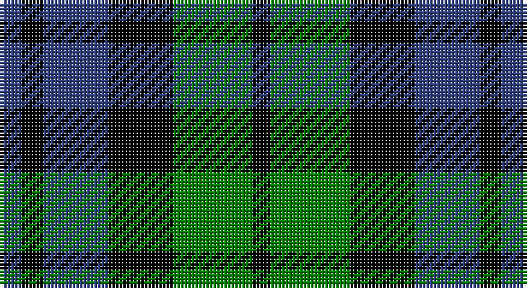

This page is one **sett** — a single exact thread-count. It belongs to the [tartan](/setts/db6k6db18k18g22k5/)
(the same proportion at any scale), whose colour order is pattern [BKBKGK](/stripes/bkbkgk/).

Part of the [Campbell, The 42nd](/tartans/campbell-the-42nd/) tartan — the named design grouping this sett with its other cloths.

Sourced from weddslist.  It is a [6 stripe tartan](/stripes/stripes6/).

Original link http://www.weddslist.com/cgi-bin/tartans/pg.pl?source=sts

## Also known as

This cloth is also recorded under:

- Campbell, the 42nd

## Thread count
B/6 K6 B18 K18 G22 K/5

One full sett is **139 threads**.

## Palette

Palette: <strong>Ingles Buchan</strong> <small style="color:#888">(1 of 3 colours)</small>
<table><thead><tr><th>Colour</th><th>Threads</th><th>Shade</th><th>Base</th><th>OKLCh</th></tr></thead><tbody><tr><td>B/</td><td style="text-align:right;font-variant-numeric:tabular-nums">6</td><td><code style="background-color:#304080;">#304080</code> <small style="color:#888">#304080</small></td><td>B <code style="background-color:#2A418A;">#2A418A</code></td><td><small style="color:#888">oklch(39.4% 0.109 270.2)</small></td></tr><tr><td>K</td><td style="text-align:right;font-variant-numeric:tabular-nums">6</td><td><code style="background-color:#000000;">#000000</code> <small style="color:#888">#000000</small></td><td>K <code style="background-color:#000000;">#000000</code></td><td><small style="color:#888">oklch(0.0% 0.000 0.0)</small></td></tr><tr><td>B</td><td style="text-align:right;font-variant-numeric:tabular-nums">18</td><td><code style="background-color:#304080;">#304080</code> <small style="color:#888">#304080</small></td><td>B <code style="background-color:#2A418A;">#2A418A</code></td><td><small style="color:#888">oklch(39.4% 0.109 270.2)</small></td></tr><tr><td>K</td><td style="text-align:right;font-variant-numeric:tabular-nums">18</td><td><code style="background-color:#000000;">#000000</code> <small style="color:#888">#000000</small></td><td>K <code style="background-color:#000000;">#000000</code></td><td><small style="color:#888">oklch(0.0% 0.000 0.0)</small></td></tr><tr><td>G</td><td style="text-align:right;font-variant-numeric:tabular-nums">22</td><td><code style="background-color:#008000;">#008000</code> <small style="color:#888">#008000</small></td><td>G <code style="background-color:#006100;">#006100</code></td><td><small style="color:#888">oklch(52.0% 0.177 142.5)</small></td></tr><tr><td>K/</td><td style="text-align:right;font-variant-numeric:tabular-nums">5</td><td><code style="background-color:#000000;">#000000</code> <small style="color:#888">#000000</small></td><td>K <code style="background-color:#000000;">#000000</code></td><td><small style="color:#888">oklch(0.0% 0.000 0.0)</small></td></tr></tbody></table>

# Sample pattern

## Compared to the master

This cloth is one sett of its design; the master sett (the exemplar the design is anchored on) is below for comparison.

<figure style="margin:0"><figcaption style="color:#888;font-size:smaller">this sett</figcaption></figure>
<figure style="margin:0"><figcaption style="color:#888;font-size:smaller"><a href="/setts/b6k6b18k18g22k5/">master sett →</a></figcaption></figure>

## Nearest tartans

The nearest existing variants by ΔTartan distance, with this tartan at the top so the swatches line up against it.

ΔTartan

Tartan

Sett

—

<a href="/ttd/edit/#slug=db6k6db18k18g22k5">Campbell, the 42nd</a> <a class="nn-out" href="/variants/s6/db6k6db18k18g22k5/" title="open its dictionary page">↗</a>

0.73

<a href="/ttd/edit/#slug=k1g3k3db3k1db1~x4&amp;base=db6k6db18k18g22k5">Sutherland, 42nd</a> <a class="nn-out" href="/variants/s6/k1g3k3db3k1db1~x4/" title="open its dictionary page">↗</a>

0.80

<a href="/ttd/edit/#slug=t3g12k14t11k3t3~x2&amp;base=db6k6db18k18g22k5">Wilson's, No 166</a> <a class="nn-out" href="/variants/s6/t3g12k14t11k3t3~x2/" title="open its dictionary page">↗</a>

0.81

<a href="/ttd/edit/#slug=k5g14k16db12g4~x2&amp;base=db6k6db18k18g22k5">Unnamed 1</a> <a class="nn-out" href="/variants/s5/k5g14k16db12g4~x2/" title="open its dictionary page">↗</a>

0.86

<a href="/ttd/edit/#slug=g7k6db7k1db2~x2&amp;base=db6k6db18k18g22k5">Campbell of Glenlyon</a> <a class="nn-out" href="/variants/s5/g7k6db7k1db2~x2/" title="open its dictionary page">↗</a>

0.88

<a href="/ttd/edit/#slug=k1g5k5db5k1db1k1~x4&amp;base=db6k6db18k18g22k5">Strathspey</a> <a class="nn-out" href="/variants/s7/k1g5k5db5k1db1k1~x4/" title="open its dictionary page">↗</a>

0.97

<a href="/ttd/edit/#slug=k3g4k1g4k3db4k1~x2&amp;base=db6k6db18k18g22k5">Unnamed, No 63</a> <a class="nn-out" href="/variants/s7/k3g4k1g4k3db4k1~x2/" title="open its dictionary page">↗</a>

1.00

<a href="/ttd/edit/#slug=k3g14k14g2db14g3~x2&amp;base=db6k6db18k18g22k5">MacKay</a> <a class="nn-out" href="/variants/s6/k3g14k14g2db14g3~x2/" title="open its dictionary page">↗</a>

1.20

<a href="/ttd/edit/#slug=dt4g18dt3k17dt18dp4~x2&amp;base=db6k6db18k18g22k5">Scottish Airports</a> <a class="nn-out" href="/variants/s6/dt4g18dt3k17dt18dp4~x2/" title="open its dictionary page">↗</a>

1.20

<a href="/ttd/edit/#slug=k2g8k7db8r2~x2&amp;base=db6k6db18k18g22k5">Denholme</a> <a class="nn-out" href="/variants/s5/k2g8k7db8r2~x2/" title="open its dictionary page">↗</a>

1.22

<a href="/ttd/edit/#slug=k6g6r1g6k6db6k1~x2&amp;base=db6k6db18k18g22k5">MacCallum</a> <a class="nn-out" href="/variants/s7/k6g6r1g6k6db6k1~x2/" title="open its dictionary page">↗</a>

## Neighbour map

Every grey dot is one of 14360 variants placed by the first two principal components of the ΔTartan feature space (44% of its variance). Red is this tartan; blue dots are its nearest — click one to open its page.

<svg viewBox="0 0 640 380" role="img" style="max-width:100%;height:auto;border:1px solid #e0e0e0;border-radius:4px;display:block" xmlns="http://www.w3.org/2000/svg"><image href="/nn/cloud.v1.png" width="640" height="380"/><a href="/variants/s6/k1g3k3db3k1db1~x4/"><circle cx="148.8" cy="308.6" r="4" fill="#3465a4"><title>Sutherland, 42nd</title></circle></a><a href="/variants/s6/t3g12k14t11k3t3~x2/"><circle cx="145.3" cy="269.2" r="4" fill="#3465a4"><title>Wilson's, No 166</title></circle></a><a href="/variants/s5/k5g14k16db12g4~x2/"><circle cx="157.1" cy="312.6" r="4" fill="#3465a4"><title>Unnamed 1</title></circle></a><a href="/variants/s5/g7k6db7k1db2~x2/"><circle cx="179.0" cy="278.0" r="4" fill="#3465a4"><title>Campbell of Glenlyon</title></circle></a><a href="/variants/s7/k1g5k5db5k1db1k1~x4/"><circle cx="188.9" cy="258.9" r="4" fill="#3465a4"><title>Strathspey</title></circle></a><a href="/variants/s7/k3g4k1g4k3db4k1~x2/"><circle cx="140.2" cy="298.7" r="4" fill="#3465a4"><title>Unnamed, No 63</title></circle></a><a href="/variants/s6/k3g14k14g2db14g3~x2/"><circle cx="179.5" cy="256.1" r="4" fill="#3465a4"><title>MacKay</title></circle></a><a href="/variants/s6/dt4g18dt3k17dt18dp4~x2/"><circle cx="162.3" cy="254.1" r="4" fill="#3465a4"><title>Scottish Airports</title></circle></a><a href="/variants/s5/k2g8k7db8r2~x2/"><circle cx="98.6" cy="281.3" r="4" fill="#3465a4"><title>Denholme</title></circle></a><a href="/variants/s7/k6g6r1g6k6db6k1~x2/"><circle cx="141.2" cy="259.4" r="4" fill="#3465a4"><title>MacCallum</title></circle></a><circle cx="154.6" cy="287.0" r="5" fill="#c00000"/></svg>

ID: /variants/s6/db6k6db18k18g22k5/
