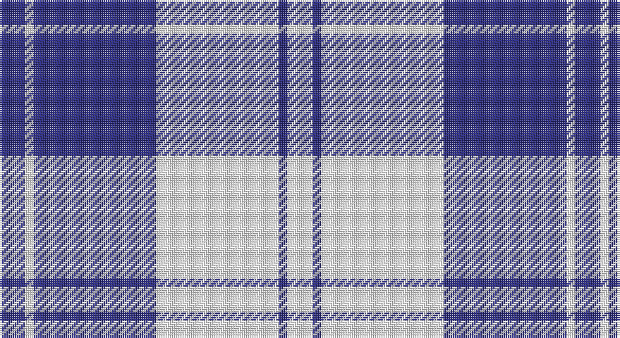

This page is one **sett** — a single exact thread-count. It belongs to the [tartan](/setts/db6w2db29w29db2w6/)
(the same proportion at any scale), whose colour order is pattern [BWBWBW](/stripes/bwbwbw/).

Part of the [Erskine](/tartans/erskine/) tartan — the named design grouping this sett with its other cloths.

Sourced from register-of-tartans.  It is a [6 stripe tartan](/stripes/stripes6/).

Original link https://www.tartanregister.gov.uk/tartanDetails.aspx?ref=1125

## Provenance

Earliest known date: 1980 One of a number of dress tartans produced by Hugh Macpherson, a kiltmaker in Edinburgh, intended for dancing and other informal occassions. The 'dress' version of clan tartan is usually created by substituting white for one of the 'ground' colours.

## Also known as

This cloth is also recorded under:

- Erskine Blue
- Erskine Green
- Erskine Hunting
- Erskine Purple
- Erskine Red Dress
- Erskine Royal Blue Dress
- Erskine,
- Erskine, Black & Red
- Erskine, Blue
- Erskine, Burgundy
- Erskine, Green
- Erskine, Grey
- Erskine, Purple
- Erskine, dress
- Erskine, hunting
- Royal Scots Fusiliers

4 attestations — the source records this cloth was collapsed from (oldest owns this page)

<ul>
<li>01/01/2002 — Erskine Blue (Dance) (register-of-tartans, <a href="https://www.tartanregister.gov.uk/tartanDetails.aspx?ref=1125">record</a>)</li>
<li>pre 2002 — Erskine, Blue (Dance) (tartans-authority, <a href="http://www.tartansauthority.com/tartan-ferret/display/632/">record</a>)</li>
<li>undated — Erskine, dress (weddslist, <a href="http://www.weddslist.com/cgi-bin/tartans/pg.pl?source=sts">record</a>)</li>
<li>undated — Erskine Royal Blue Dress Clan Tartan (house-of-tartan, <a href="http://www.house-of-tartan.scotland.net/house/TartanViewjs.asp?colr=Def&tnam=632">record</a>)</li>
</ul>

## Register references

External register numbers recorded for this tartan.

- Scottish Register of Tartans: [1125](https://www.tartanregister.gov.uk/tartanDetails.aspx?ref=1125)
- Scottish Tartans Authority (ITI): 632
- Scottish Tartans World Register: 632

## Thread count
DB/12 W4 DB58 W58 DB4 W/12

One full sett is **272 threads**.

## Palette

Palette: <strong>Tartan Register</strong>
<table><thead><tr><th>Colour</th><th>Threads</th><th>Shade</th><th>Base</th><th>OKLCh</th></tr></thead><tbody><tr><td>DB/</td><td style="text-align:right;font-variant-numeric:tabular-nums">12</td><td><code style="background-color:#2C2C80;">#2C2C80</code> <small style="color:#888">#2C2C80</small></td><td>B <code style="background-color:#2A418A;">#2A418A</code></td><td><small style="color:#888">oklch(35.0% 0.138 276.6)</small></td></tr><tr><td>W</td><td style="text-align:right;font-variant-numeric:tabular-nums">4</td><td><code style="background-color:#FCFCFC;">#FCFCFC</code> <small style="color:#888">#FCFCFC</small></td><td>W <code style="background-color:#F7F7F7;">#F7F7F7</code></td><td><small style="color:#888">oklch(99.1% 0.000 89.9)</small></td></tr><tr><td>DB</td><td style="text-align:right;font-variant-numeric:tabular-nums">58</td><td><code style="background-color:#2C2C80;">#2C2C80</code> <small style="color:#888">#2C2C80</small></td><td>B <code style="background-color:#2A418A;">#2A418A</code></td><td><small style="color:#888">oklch(35.0% 0.138 276.6)</small></td></tr><tr><td>W</td><td style="text-align:right;font-variant-numeric:tabular-nums">58</td><td><code style="background-color:#FCFCFC;">#FCFCFC</code> <small style="color:#888">#FCFCFC</small></td><td>W <code style="background-color:#F7F7F7;">#F7F7F7</code></td><td><small style="color:#888">oklch(99.1% 0.000 89.9)</small></td></tr><tr><td>DB</td><td style="text-align:right;font-variant-numeric:tabular-nums">4</td><td><code style="background-color:#2C2C80;">#2C2C80</code> <small style="color:#888">#2C2C80</small></td><td>B <code style="background-color:#2A418A;">#2A418A</code></td><td><small style="color:#888">oklch(35.0% 0.138 276.6)</small></td></tr><tr><td>W/</td><td style="text-align:right;font-variant-numeric:tabular-nums">12</td><td><code style="background-color:#FCFCFC;">#FCFCFC</code> <small style="color:#888">#FCFCFC</small></td><td>W <code style="background-color:#F7F7F7;">#F7F7F7</code></td><td><small style="color:#888">oklch(99.1% 0.000 89.9)</small></td></tr></tbody></table>

# Sample pattern

## Compared to the master

This cloth is one sett of its design; the master sett (the exemplar the design is anchored on) is below for comparison.

<figure style="margin:0"><figcaption style="color:#888;font-size:smaller">this sett</figcaption></figure>
<figure style="margin:0"><figcaption style="color:#888;font-size:smaller"><a href="/setts/g6r1g24r28g1r4/">master sett →</a></figcaption></figure>

## Nearest tartans

The nearest existing variants by ΔTartan distance, with this tartan at the top so the swatches line up against it.

ΔTartan

Tartan

Sett

—

<a href="/ttd/edit/#slug=db6w2db29w29db2w6~x2">Erskine Blue (Dance)</a> <a class="nn-out" href="/variants/s6/db6w2db29w29db2w6~x2/" title="open its dictionary page">↗</a>

1.04

<a href="/ttd/edit/#slug=b6ly2b21ly2b6ly24b2ly6~x2&amp;base=db6w2db29w29db2w6~x2">MacLachlan (Chief's Dress) Blue</a> <a class="nn-out" href="/variants/s8/b6ly2b21ly2b6ly24b2ly6~x2/" title="open its dictionary page">↗</a>

1.20

<a href="/ttd/edit/#slug=w5db16w5db16w33r3~x2&amp;base=db6w2db29w29db2w6~x2">Buchanan Dress Blue (Dance)</a> <a class="nn-out" href="/variants/s6/w5db16w5db16w33r3~x2/" title="open its dictionary page">↗</a>

1.28

<a href="/ttd/edit/#slug=db8w3db28w32k3w4~x2&amp;base=db6w2db29w29db2w6~x2">Ailsa, Navy (Dance)</a> <a class="nn-out" href="/variants/s6/db8w3db28w32k3w4~x2/" title="open its dictionary page">↗</a>

1.42

<a href="/ttd/edit/#slug=db4w35db31w4~x2&amp;base=db6w2db29w29db2w6~x2">Lewis, Navy (Dance)</a> <a class="nn-out" href="/variants/s4/db4w35db31w4~x2/" title="open its dictionary page">↗</a>

1.64

<a href="/ttd/edit/#slug=dp6w2dp29w29dp2w6~x2&amp;base=db6w2db29w29db2w6~x2">Erskine Purple (Dance) Fashion Tartan</a> <a class="nn-out" href="/variants/s6/dp6w2dp29w29dp2w6~x2/" title="open its dictionary page">↗</a>

1.64

<a href="/ttd/edit/#slug=ly5db15lb5db5lb40ly3~x2&amp;base=db6w2db29w29db2w6~x2">Legary</a> <a class="nn-out" href="/variants/s6/ly5db15lb5db5lb40ly3~x2/" title="open its dictionary page">↗</a>

1.66

<a href="/ttd/edit/#slug=db19ly2db3w7db3w7db9w3db2w19~x2&amp;base=db6w2db29w29db2w6~x2">Yorkshire, The Spirit of</a> <a class="nn-out" href="/variants/s10/db19ly2db3w7db3w7db9w3db2w19~x2/" title="open its dictionary page">↗</a>

1.70

<a href="/ttd/edit/#slug=dt3w16dt4w3dt12w2~x3&amp;base=db6w2db29w29db2w6~x2">MacMugen</a> <a class="nn-out" href="/variants/s6/dt3w16dt4w3dt12w2~x3/" title="open its dictionary page">↗</a>

1.70

<a href="/ttd/edit/#slug=w32r12db12w2db3~x2&amp;base=db6w2db29w29db2w6~x2">Fraser Arisaid Red (Dance)</a> <a class="nn-out" href="/variants/s5/w32r12db12w2db3~x2/" title="open its dictionary page">↗</a>

1.71

<a href="/ttd/edit/#slug=b1w5b1w5b15ly1~x4&amp;base=db6w2db29w29db2w6~x2">Whitley (Personal)</a> <a class="nn-out" href="/variants/s6/b1w5b1w5b15ly1~x4/" title="open its dictionary page">↗</a>

## Neighbour map

Every grey dot is one of 14360 variants placed by the first two principal components of the ΔTartan feature space (44% of its variance). Red is this tartan; blue dots are its nearest — click one to open its page.

<svg viewBox="0 0 640 380" role="img" style="max-width:100%;height:auto;border:1px solid #e0e0e0;border-radius:4px;display:block" xmlns="http://www.w3.org/2000/svg"><image href="/nn/cloud.v1.png" width="640" height="380"/><a href="/variants/s8/b6ly2b21ly2b6ly24b2ly6~x2/"><circle cx="325.2" cy="189.6" r="4" fill="#3465a4"><title>MacLachlan (Chief's Dress) Blue</title></circle></a><a href="/variants/s6/w5db16w5db16w33r3~x2/"><circle cx="282.6" cy="195.7" r="4" fill="#3465a4"><title>Buchanan Dress Blue (Dance)</title></circle></a><a href="/variants/s6/db8w3db28w32k3w4~x2/"><circle cx="278.4" cy="190.9" r="4" fill="#3465a4"><title>Ailsa, Navy (Dance)</title></circle></a><a href="/variants/s4/db4w35db31w4~x2/"><circle cx="306.3" cy="242.5" r="4" fill="#3465a4"><title>Lewis, Navy (Dance)</title></circle></a><a href="/variants/s6/dp6w2dp29w29dp2w6~x2/"><circle cx="340.2" cy="187.5" r="4" fill="#3465a4"><title>Erskine Purple (Dance) Fashion Tartan</title></circle></a><a href="/variants/s6/ly5db15lb5db5lb40ly3~x2/"><circle cx="332.9" cy="176.2" r="4" fill="#3465a4"><title>Legary</title></circle></a><a href="/variants/s10/db19ly2db3w7db3w7db9w3db2w19~x2/"><circle cx="264.3" cy="184.9" r="4" fill="#3465a4"><title>Yorkshire, The Spirit of</title></circle></a><a href="/variants/s6/dt3w16dt4w3dt12w2~x3/"><circle cx="293.2" cy="227.3" r="4" fill="#3465a4"><title>MacMugen</title></circle></a><a href="/variants/s5/w32r12db12w2db3~x2/"><circle cx="286.7" cy="176.8" r="4" fill="#3465a4"><title>Fraser Arisaid Red (Dance)</title></circle></a><a href="/variants/s6/b1w5b1w5b15ly1~x4/"><circle cx="365.6" cy="182.6" r="4" fill="#3465a4"><title>Whitley (Personal)</title></circle></a><circle cx="319.0" cy="191.0" r="5" fill="#c00000"/></svg>

ID: /variants/s6/db6w2db29w29db2w6~x2/
