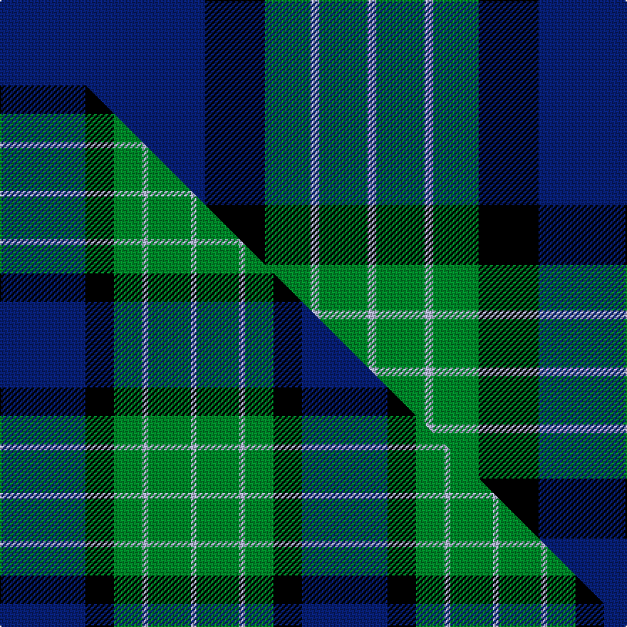

This page is one **sett** — a single exact thread-count. It belongs to the [tartan](/setts/db72k21g16lb3g17lb3/)
(the same proportion at any scale), whose colour order is pattern [BKGWGW](/stripes/bkgwgw/).

Part of the [MacRobart](/tartans/macrobart/) tartan — the named design grouping this sett with its other cloths.

Sourced from weddslist.  It is a [6 stripe tartan](/stripes/stripes6/).

Original link http://www.weddslist.com/cgi-bin/tartans/pg.pl?source=sts

## Thread count
DB/144 K42 G32 LB6 G34 LB/6

One full sett is **378 threads**.

## Palette
<table><thead><tr><th>Colour</th><th>Shade</th><th>OKLCh</th></tr></thead><tbody><tr><td>DB</td><td><code style="background-color:#082077;">#082077</code> <small style="color:#888">#082077</small></td><td><small style="color:#888">oklch(30.0% 0.149 265.1)</small></td></tr><tr><td>LB</td><td><code style="background-color:#B5BBDE;">#B5BBDE</code> <small style="color:#888">#B5BBDE</small></td><td><small style="color:#888">oklch(79.9% 0.050 277.6)</small></td></tr><tr><td>G</td><td><code style="background-color:#008B2A;">#008B2A</code> <small style="color:#888">#008B2A</small></td><td><small style="color:#888">oklch(55.4% 0.170 145.9)</small></td></tr><tr><td>K</td><td><code style="background-color:#000000;">#000000</code> <small style="color:#888">#000000</small></td><td><small style="color:#888">oklch(0.0% 0.000 0.0)</small></td></tr></tbody></table>

# Sample pattern

## Compared to the master

This cloth is one sett of its design; the master sett (the exemplar the design is anchored on) is below for comparison.

Its **ΔTartan distance** from the master is **1.55** — the same measure the nearest-tartans table ranks by (0 is identical; a re-scale of the same cloth is near 0, a recolour or a different proportion further).

<figure class="master-compare" style="margin:0">

this sett
master sett ★

<figcaption style="color:#888;font-size:smaller">One weave of this sett against the <a href="/setts/db30k10g10lb2g15lb2/">master sett ★</a>, split on the diagonal: a shared proportion runs seamlessly across it with only the shades shifting; a different proportion breaks on it.</figcaption>
</figure>

## Nearest variants

The nearest existing variants by ΔTartan distance, with this cloth at the top so the swatches line up against it.

ΔTartan

Threads

Variant

Sett

—

378

<a href="/variants/s6/db72k21g16lb3g17lb3~x2/">MacRobart</a>

<a href="/ttd/edit/#slug=db30k10g10lb2g15lb2~x2&amp;base=db72k21g16lb3g17lb3~x2" title="compare in the TTD">0.65</a>

212

<a href="/variants/s6/db30k10g10lb2g15lb2~x2/">MacRobart (Personal)</a>

<a href="/ttd/edit/#slug=db48w2k20g22r3g4~x2&amp;base=db72k21g16lb3g17lb3~x2" title="compare in the TTD">1.29</a>

292

<a href="/variants/s6/db48w2k20g22r3g4~x2/">MacFadzean</a>

<a href="/ttd/edit/#slug=db24k8g8dp2g8k1w2~x2&amp;base=db72k21g16lb3g17lb3~x2" title="compare in the TTD">1.94</a>

160

<a href="/variants/s7/db24k8g8dp2g8k1w2~x2/">Alexander</a>

<a href="/ttd/edit/#slug=db24k8g8r2g8k1y2&amp;base=db72k21g16lb3g17lb3~x2" title="compare in the TTD">1.94</a>

80

<a href="/variants/s7/db24k8g8r2g8k1y2/">MacLaren</a>

<a href="/ttd/edit/#slug=db24k8g8r2g8k1y2~x2&amp;base=db72k21g16lb3g17lb3~x2" title="compare in the TTD">1.94</a>

160

<a href="/variants/s7/db24k8g8r2g8k1y2~x2/">MacLaren</a>

<a href="/ttd/edit/#slug=db24k8g8r2g8k1w2&amp;base=db72k21g16lb3g17lb3~x2" title="compare in the TTD">1.94</a>

80

<a href="/variants/s7/db24k8g8r2g8k1w2/">Fergusson</a>

<a href="/ttd/edit/#slug=db24k8g8r2g8k1w2~x2&amp;base=db72k21g16lb3g17lb3~x2" title="compare in the TTD">1.94</a>

160

<a href="/variants/s7/db24k8g8r2g8k1w2~x2/">Ferguson of Athol</a>

<a href="/ttd/edit/#slug=db16k6g8y1~x2&amp;base=db72k21g16lb3g17lb3~x2" title="compare in the TTD">1.99</a>

90

<a href="/variants/s4/db16k6g8y1~x2/">Sinclair, Sir John</a>

<a href="/ttd/edit/#slug=db50g26k9g4lb2dr2g10~x2&amp;base=db72k21g16lb3g17lb3~x2" title="compare in the TTD">2.14</a>

292

<a href="/variants/s7/db50g26k9g4lb2dr2g10~x2/">Java Saint Andrew Society Hunting</a>

<a href="/ttd/edit/#slug=db36k8g3dr3g6k1lo2~x2&amp;base=db72k21g16lb3g17lb3~x2" title="compare in the TTD">2.24</a>

160

<a href="/variants/s7/db36k8g3dr3g6k1lo2~x2/">MacLaurin of Broich (Clan)</a>

## Neighbour map

Every grey dot is one of 13620 variants placed by the first two principal components of the ΔTartan feature space (42% of its variance). Red is this tartan; blue dots are its nearest — click one to open its page.

<svg viewBox="0 0 640 380" role="img" style="max-width:100%;height:auto;border:1px solid #e0e0e0;border-radius:4px;display:block" xmlns="http://www.w3.org/2000/svg"><image href="/nn/cloud.v1.png" width="640" height="380"/><a href="/variants/s6/db30k10g10lb2g15lb2~x2/"><circle cx="215.4" cy="187.8" r="4" fill="#3465a4"><title>MacRobart (Personal)</title></circle></a><a href="/variants/s6/db48w2k20g22r3g4~x2/"><circle cx="237.5" cy="139.1" r="4" fill="#3465a4"><title>MacFadzean</title></circle></a><a href="/variants/s7/db24k8g8dp2g8k1w2~x2/"><circle cx="215.6" cy="136.3" r="4" fill="#3465a4"><title>Alexander</title></circle></a><a href="/variants/s7/db24k8g8r2g8k1y2/"><circle cx="222.8" cy="137.7" r="4" fill="#3465a4"><title>MacLaren</title></circle></a><a href="/variants/s7/db24k8g8r2g8k1y2~x2/"><circle cx="222.8" cy="137.7" r="4" fill="#3465a4"><title>MacLaren</title></circle></a><a href="/variants/s7/db24k8g8r2g8k1w2/"><circle cx="211.5" cy="134.2" r="4" fill="#3465a4"><title>Fergusson</title></circle></a><a href="/variants/s7/db24k8g8r2g8k1w2~x2/"><circle cx="211.5" cy="134.2" r="4" fill="#3465a4"><title>Ferguson of Athol</title></circle></a><a href="/variants/s4/db16k6g8y1~x2/"><circle cx="261.0" cy="211.6" r="4" fill="#3465a4"><title>Sinclair, Sir John</title></circle></a><a href="/variants/s7/db50g26k9g4lb2dr2g10~x2/"><circle cx="272.1" cy="130.9" r="4" fill="#3465a4"><title>Java Saint Andrew Society Hunting</title></circle></a><a href="/variants/s7/db36k8g3dr3g6k1lo2~x2/"><circle cx="349.6" cy="97.4" r="4" fill="#3465a4"><title>MacLaurin of Broich (Clan)</title></circle></a><circle cx="299.2" cy="149.8" r="5" fill="#c00000"/><text x="320" y="376" text-anchor="middle" font-size="11" fill="#999">ground</text><text x="11" y="190" text-anchor="middle" font-size="11" fill="#999" transform="rotate(-90 11 190)">complexity</text></svg>

ID: /variants/s6/db72k21g16lb3g17lb3~x2/
