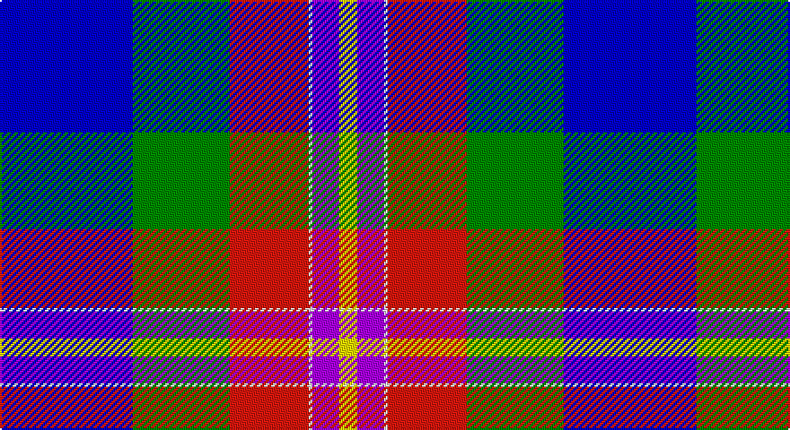

This page is one **sett** — a single exact thread-count. It belongs to the [tartan](/setts/db74g54r44w2p15ly10/)
(the same proportion at any scale), whose colour order is pattern [BGRWBY](/stripes/bgrwby/).

Part of the [Palazzo Bloise](/tartans/palazzo-bloise/) tartan — the named design grouping this sett with its other cloths.

Sourced from register-of-tartans.  It is a [6 stripe tartan](/stripes/stripes6/).

Original link https://www.tartanregister.gov.uk/tartanDetails.aspx?ref=10543

## Register references

External register numbers recorded for this tartan.

- Scottish Register of Tartans: [10543](https://www.tartanregister.gov.uk/tartanDetails.aspx?ref=10543)

## Thread count
B/74 G54 R44 W2 P15 Y/10

One full sett is **314 threads**.

## Palette

Palette: <strong>Tartan Register</strong> <small style="color:#888">(5 of 6 colours)</small>
<table><thead><tr><th>Colour</th><th>Threads</th><th>Shade</th><th>Base</th><th>OKLCh</th></tr></thead><tbody><tr><td>B/</td><td style="text-align:right;font-variant-numeric:tabular-nums">74</td><td><code style="background-color:#0000CD;">#0000CD</code> <small style="color:#888">#0000CD</small></td><td>B <code style="background-color:#2A418A;">#2A418A</code></td><td><small style="color:#888">oklch(38.3% 0.266 264.1)</small></td></tr><tr><td>G</td><td style="text-align:right;font-variant-numeric:tabular-nums">54</td><td><code style="background-color:#008B00;">#008B00</code> <small style="color:#888">#008B00</small></td><td>G <code style="background-color:#006100;">#006100</code></td><td><small style="color:#888">oklch(55.2% 0.188 142.5)</small></td></tr><tr><td>R</td><td style="text-align:right;font-variant-numeric:tabular-nums">44</td><td><code style="background-color:#E3170D;">#E3170D</code> <small style="color:#888">#E3170D</small></td><td>R <code style="background-color:#CC0000;">#CC0000</code></td><td><small style="color:#888">oklch(58.1% 0.230 29.4)</small></td></tr><tr><td>W</td><td style="text-align:right;font-variant-numeric:tabular-nums">2</td><td><code style="background-color:#FFFFFF;">#FFFFFF</code> <small style="color:#888">#FFFFFF</small></td><td>W <code style="background-color:#F7F7F7;">#F7F7F7</code></td><td><small style="color:#888">oklch(100.0% 0.000 89.9)</small></td></tr><tr><td>P</td><td style="text-align:right;font-variant-numeric:tabular-nums">15</td><td><code style="background-color:#AA00FF;">#AA00FF</code> <small style="color:#888">#AA00FF</small></td><td>B <code style="background-color:#2A418A;">#2A418A</code></td><td><small style="color:#888">oklch(58.1% 0.299 307.0)</small></td></tr><tr><td>Y/</td><td style="text-align:right;font-variant-numeric:tabular-nums">10</td><td><code style="background-color:#FFE600;">#FFE600</code> <small style="color:#888">#FFE600</small></td><td>Y <code style="background-color:#F2BF00;">#F2BF00</code></td><td><small style="color:#888">oklch(91.7% 0.192 101.4)</small></td></tr></tbody></table>

# Sample pattern

## Nearest tartans

The nearest existing variants by ΔTartan distance, with this tartan at the top so the swatches line up against it.

ΔTartan

Tartan

Sett

—

<a href="/ttd/edit/#slug=db74g54r44w2p15ly10">Palazzo Bloise (Personal)</a> <a class="nn-out" href="/variants/s6/db74g54r44w2p15ly10/" title="open its dictionary page">↗</a>

1.23

<a href="/ttd/edit/#slug=t53w27r5k19lo1dg11~x2&amp;base=db74g54r44w2p15ly10">Crookstoun, James (West Lothian) (Personal)</a> <a class="nn-out" href="/variants/s6/t53w27r5k19lo1dg11~x2/" title="open its dictionary page">↗</a>

1.28

<a href="/ttd/edit/#slug=b53w27r5k19lo1g11~x2&amp;base=db74g54r44w2p15ly10">Crookstoun (Personal)</a> <a class="nn-out" href="/variants/s6/b53w27r5k19lo1g11~x2/" title="open its dictionary page">↗</a>

1.40

<a href="/ttd/edit/#slug=b37k12o17r3o17k1ly3~x2&amp;base=db74g54r44w2p15ly10">Berger-MacLaren</a> <a class="nn-out" href="/variants/s7/b37k12o17r3o17k1ly3~x2/" title="open its dictionary page">↗</a>

1.46

<a href="/ttd/edit/#slug=w3k1db24dbi10o24k1ly3~x2&amp;base=db74g54r44w2p15ly10">George Heriot's School</a> <a class="nn-out" href="/variants/s7/w3k1db24dbi10o24k1ly3~x2/" title="open its dictionary page">↗</a>

1.48

<a href="/ttd/edit/#slug=lb16ly3lb9b14lb1b8k32r1w4~x2&amp;base=db74g54r44w2p15ly10">Wrens (WRNS) (Military)</a> <a class="nn-out" href="/variants/s9/lb16ly3lb9b14lb1b8k32r1w4~x2/" title="open its dictionary page">↗</a>

1.59

<a href="/ttd/edit/#slug=db68k42w32r5w32dg4w6&amp;base=db74g54r44w2p15ly10">Ferguson Dress #2</a> <a class="nn-out" href="/variants/s7/db68k42w32r5w32dg4w6/" title="open its dictionary page">↗</a>

1.61

<a href="/ttd/edit/#slug=db4w3db17lb10k1dp5k1lb6dg3~x2&amp;base=db74g54r44w2p15ly10">Queen Margaret University</a> <a class="nn-out" href="/variants/s9/db4w3db17lb10k1dp5k1lb6dg3~x2/" title="open its dictionary page">↗</a>

1.70

<a href="/ttd/edit/#slug=r2w6k12db36o12ly1~x2&amp;base=db74g54r44w2p15ly10">Alan Stone Family (Personal)</a> <a class="nn-out" href="/variants/s6/r2w6k12db36o12ly1~x2/" title="open its dictionary page">↗</a>

1.71

<a href="/ttd/edit/#slug=db16w6r8db3lo1g1lg3db1g10~x4&amp;base=db74g54r44w2p15ly10">Ogilvie of Inverquharity or Ohio</a> <a class="nn-out" href="/variants/s9/db16w6r8db3lo1g1lg3db1g10~x4/" title="open its dictionary page">↗</a>

1.71

<a href="/ttd/edit/#slug=db4k4db23k12g10k1w23dp2w2dp4~x2&amp;base=db74g54r44w2p15ly10">Baird Dress</a> <a class="nn-out" href="/variants/s10/db4k4db23k12g10k1w23dp2w2dp4~x2/" title="open its dictionary page">↗</a>

## Neighbour map

Every grey dot is one of 14360 variants placed by the first two principal components of the ΔTartan feature space (44% of its variance). Red is this tartan; blue dots are its nearest — click one to open its page.

<svg viewBox="0 0 640 380" role="img" style="max-width:100%;height:auto;border:1px solid #e0e0e0;border-radius:4px;display:block" xmlns="http://www.w3.org/2000/svg"><image href="/nn/cloud.v1.png" width="640" height="380"/><a href="/variants/s6/t53w27r5k19lo1dg11~x2/"><circle cx="221.5" cy="96.4" r="4" fill="#3465a4"><title>Crookstoun, James (West Lothian) (Personal)</title></circle></a><a href="/variants/s6/b53w27r5k19lo1g11~x2/"><circle cx="212.6" cy="98.5" r="4" fill="#3465a4"><title>Crookstoun (Personal)</title></circle></a><a href="/variants/s7/b37k12o17r3o17k1ly3~x2/"><circle cx="232.7" cy="123.8" r="4" fill="#3465a4"><title>Berger-MacLaren</title></circle></a><a href="/variants/s7/w3k1db24dbi10o24k1ly3~x2/"><circle cx="196.2" cy="126.1" r="4" fill="#3465a4"><title>George Heriot's School</title></circle></a><a href="/variants/s9/lb16ly3lb9b14lb1b8k32r1w4~x2/"><circle cx="149.6" cy="93.3" r="4" fill="#3465a4"><title>Wrens (WRNS) (Military)</title></circle></a><a href="/variants/s7/db68k42w32r5w32dg4w6/"><circle cx="159.6" cy="149.0" r="4" fill="#3465a4"><title>Ferguson Dress #2</title></circle></a><a href="/variants/s9/db4w3db17lb10k1dp5k1lb6dg3~x2/"><circle cx="169.2" cy="128.3" r="4" fill="#3465a4"><title>Queen Margaret University</title></circle></a><a href="/variants/s6/r2w6k12db36o12ly1~x2/"><circle cx="268.9" cy="114.7" r="4" fill="#3465a4"><title>Alan Stone Family (Personal)</title></circle></a><a href="/variants/s9/db16w6r8db3lo1g1lg3db1g10~x4/"><circle cx="147.6" cy="126.4" r="4" fill="#3465a4"><title>Ogilvie of Inverquharity or Ohio</title></circle></a><a href="/variants/s10/db4k4db23k12g10k1w23dp2w2dp4~x2/"><circle cx="133.9" cy="115.2" r="4" fill="#3465a4"><title>Baird Dress</title></circle></a><circle cx="162.7" cy="118.8" r="5" fill="#c00000"/></svg>

ID: /variants/s6/db74g54r44w2p15ly10/
