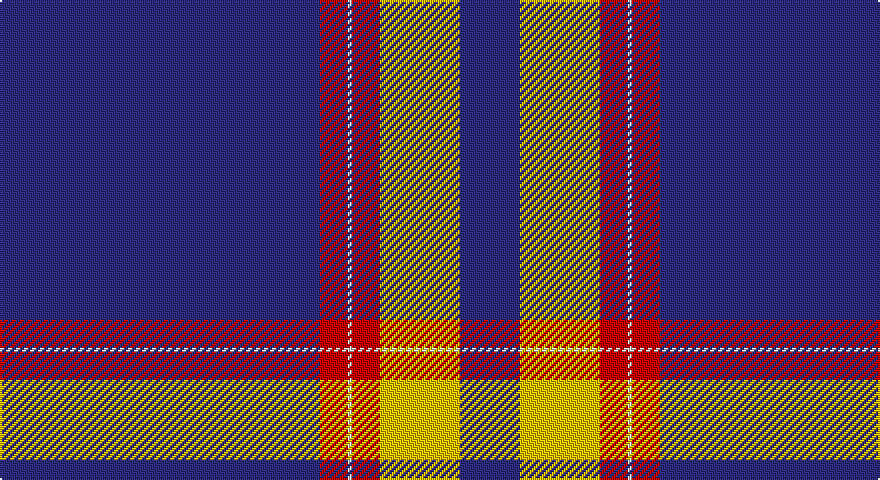

This page is one **sett** — a single exact thread-count. It belongs to the [tartan](/setts/db80r7w1r7ly20db15/)
(the same proportion at any scale), whose colour order is pattern [BRWRYB](/stripes/brwryb/).

Part of the [Auchtermuchty Tartan Army](/tartans/auchtermuchty-tartan-army/) tartan — the named design grouping this sett with its other cloths.

Sourced from tartans-authority.  It is a [6 stripe tartan](/stripes/stripes6/).

Original link http://www.tartansauthority.com/tartan-ferret/display/10197/

## Register references

External register numbers recorded for this tartan.

- Scottish Register of Tartans: [10197](https://www.tartanregister.gov.uk/tartanDetails?ref=10197)
- Scottish Tartans Authority (ITI): 10197

## Thread count
DB/160 R14 LN2 R14 Y40 DB/30

One full sett is **330 threads**.

## Palette

Palette: <strong>Tartan Register</strong>
<table><thead><tr><th>Colour</th><th>Threads</th><th>Shade</th><th>Base</th><th>OKLCh</th></tr></thead><tbody><tr><td>DB/</td><td style="text-align:right;font-variant-numeric:tabular-nums">160</td><td><code style="background-color:#2C2C80;">#2C2C80</code> <small style="color:#888">#2C2C80</small></td><td>B <code style="background-color:#2A418A;">#2A418A</code></td><td><small style="color:#888">oklch(35.0% 0.138 276.6)</small></td></tr><tr><td>R</td><td style="text-align:right;font-variant-numeric:tabular-nums">14</td><td><code style="background-color:#C80000;">#C80000</code> <small style="color:#888">#C80000</small></td><td>R <code style="background-color:#CC0000;">#CC0000</code></td><td><small style="color:#888">oklch(52.3% 0.215 29.2)</small></td></tr><tr><td>LN</td><td style="text-align:right;font-variant-numeric:tabular-nums">2</td><td><code style="background-color:#E0E0E0;">#E0E0E0</code> <small style="color:#888">#E0E0E0</small></td><td>W <code style="background-color:#F7F7F7;">#F7F7F7</code></td><td><small style="color:#888">oklch(90.7% 0.000 89.9)</small></td></tr><tr><td>R</td><td style="text-align:right;font-variant-numeric:tabular-nums">14</td><td><code style="background-color:#C80000;">#C80000</code> <small style="color:#888">#C80000</small></td><td>R <code style="background-color:#CC0000;">#CC0000</code></td><td><small style="color:#888">oklch(52.3% 0.215 29.2)</small></td></tr><tr><td>Y</td><td style="text-align:right;font-variant-numeric:tabular-nums">40</td><td><code style="background-color:#E8C000;">#E8C000</code> <small style="color:#888">#E8C000</small></td><td>Y <code style="background-color:#F2BF00;">#F2BF00</code></td><td><small style="color:#888">oklch(81.9% 0.168 93.7)</small></td></tr><tr><td>DB/</td><td style="text-align:right;font-variant-numeric:tabular-nums">30</td><td><code style="background-color:#2C2C80;">#2C2C80</code> <small style="color:#888">#2C2C80</small></td><td>B <code style="background-color:#2A418A;">#2A418A</code></td><td><small style="color:#888">oklch(35.0% 0.138 276.6)</small></td></tr></tbody></table>

# Sample pattern

## Compared to the master

This cloth is one sett of its design; the master sett (the exemplar the design is anchored on) is below for comparison.

<figure style="margin:0"><figcaption style="color:#888;font-size:smaller">this sett</figcaption></figure>
<figure style="margin:0"><figcaption style="color:#888;font-size:smaller"><a href="/setts/db80r8w1r8ly20db15/">master sett →</a></figcaption></figure>

## Nearest tartans

The nearest existing variants by ΔTartan distance, with this tartan at the top so the swatches line up against it.

ΔTartan

Tartan

Sett

—

<a href="/ttd/edit/#slug=db80r7w1r7ly20db15~x2">Auchtermuchty Tartan Army (Corp)</a> <a class="nn-out" href="/variants/s6/db80r7w1r7ly20db15~x2/" title="open its dictionary page">↗</a>

0.18

<a href="/ttd/edit/#slug=db80r8w1r8ly20db15~x2&amp;base=db80r7w1r7ly20db15~x2">Auchtermuchty Tartan Army</a> <a class="nn-out" href="/variants/s6/db80r8w1r8ly20db15~x2/" title="open its dictionary page">↗</a>

1.09

<a href="/ttd/edit/#slug=db39ly8r3w1~x4&amp;base=db80r7w1r7ly20db15~x2">Norwich University (Corporate)</a> <a class="nn-out" href="/variants/s4/db39ly8r3w1~x4/" title="open its dictionary page">↗</a>

1.43

<a href="/ttd/edit/#slug=w2db49r5ly2r5ly2~x2&amp;base=db80r7w1r7ly20db15~x2">Balmer (Personal)</a> <a class="nn-out" href="/variants/s6/w2db49r5ly2r5ly2~x2/" title="open its dictionary page">↗</a>

1.44

<a href="/ttd/edit/#slug=db28dr3w1dr3db4w2dp1w5~x4&amp;base=db80r7w1r7ly20db15~x2">Baker Family Tartan</a> <a class="nn-out" href="/variants/s8/db28dr3w1dr3db4w2dp1w5~x4/" title="open its dictionary page">↗</a>

1.45

<a href="/ttd/edit/#slug=db67w10ly14db10w2&amp;base=db80r7w1r7ly20db15~x2">St. John (Corporate?)</a> <a class="nn-out" href="/variants/s5/db67w10ly14db10w2/" title="open its dictionary page">↗</a>

1.45

<a href="/ttd/edit/#slug=db28o3w1o3db4w2p1w5~x4&amp;base=db80r7w1r7ly20db15~x2">Baker</a> <a class="nn-out" href="/variants/s8/db28o3w1o3db4w2p1w5~x4/" title="open its dictionary page">↗</a>

1.46

<a href="/ttd/edit/#slug=db28o3w1o3db4w2dp1w5~x4&amp;base=db80r7w1r7ly20db15~x2">Baker</a> <a class="nn-out" href="/variants/s8/db28o3w1o3db4w2dp1w5~x4/" title="open its dictionary page">↗</a>

1.47

<a href="/ttd/edit/#slug=db80r21k2ly4k2r16db10~x2&amp;base=db80r7w1r7ly20db15~x2">Salvation Army, dress</a> <a class="nn-out" href="/variants/s7/db80r21k2ly4k2r16db10~x2/" title="open its dictionary page">↗</a>

1.48

<a href="/ttd/edit/#slug=db28lo3w1lo3db4w2dp1w5~x4&amp;base=db80r7w1r7ly20db15~x2">Baker (Name)</a> <a class="nn-out" href="/variants/s8/db28lo3w1lo3db4w2dp1w5~x4/" title="open its dictionary page">↗</a>

1.52

<a href="/ttd/edit/#slug=db60w1ly4k4w1lp8w2~x2&amp;base=db80r7w1r7ly20db15~x2">Nunavut Territory (District)</a> <a class="nn-out" href="/variants/s7/db60w1ly4k4w1lp8w2~x2/" title="open its dictionary page">↗</a>

## Neighbour map

Every grey dot is one of 14360 variants placed by the first two principal components of the ΔTartan feature space (44% of its variance). Red is this tartan; blue dots are its nearest — click one to open its page.

<svg viewBox="0 0 640 380" role="img" style="max-width:100%;height:auto;border:1px solid #e0e0e0;border-radius:4px;display:block" xmlns="http://www.w3.org/2000/svg"><image href="/nn/cloud.v1.png" width="640" height="380"/><a href="/variants/s6/db80r8w1r8ly20db15~x2/"><circle cx="475.3" cy="125.7" r="4" fill="#3465a4"><title>Auchtermuchty Tartan Army</title></circle></a><a href="/variants/s4/db39ly8r3w1~x4/"><circle cx="503.0" cy="153.2" r="4" fill="#3465a4"><title>Norwich University (Corporate)</title></circle></a><a href="/variants/s6/w2db49r5ly2r5ly2~x2/"><circle cx="507.6" cy="140.8" r="4" fill="#3465a4"><title>Balmer (Personal)</title></circle></a><a href="/variants/s8/db28dr3w1dr3db4w2dp1w5~x4/"><circle cx="427.3" cy="122.7" r="4" fill="#3465a4"><title>Baker Family Tartan</title></circle></a><a href="/variants/s5/db67w10ly14db10w2/"><circle cx="481.7" cy="165.0" r="4" fill="#3465a4"><title>St. John (Corporate?)</title></circle></a><a href="/variants/s8/db28o3w1o3db4w2p1w5~x4/"><circle cx="434.7" cy="125.4" r="4" fill="#3465a4"><title>Baker</title></circle></a><a href="/variants/s8/db28o3w1o3db4w2dp1w5~x4/"><circle cx="413.7" cy="116.1" r="4" fill="#3465a4"><title>Baker</title></circle></a><a href="/variants/s7/db80r21k2ly4k2r16db10~x2/"><circle cx="474.7" cy="132.6" r="4" fill="#3465a4"><title>Salvation Army, dress</title></circle></a><a href="/variants/s8/db28lo3w1lo3db4w2dp1w5~x4/"><circle cx="412.6" cy="115.8" r="4" fill="#3465a4"><title>Baker (Name)</title></circle></a><a href="/variants/s7/db60w1ly4k4w1lp8w2~x2/"><circle cx="496.5" cy="86.1" r="4" fill="#3465a4"><title>Nunavut Territory (District)</title></circle></a><circle cx="485.8" cy="125.4" r="5" fill="#c00000"/></svg>

ID: /variants/s6/db80r7w1r7ly20db15~x2/
