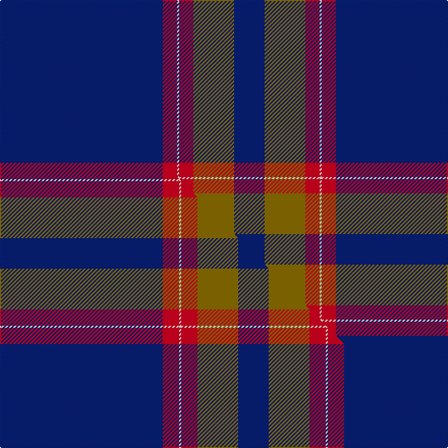

This page is one **sett** — a single exact thread-count. It belongs to the [tartan](/setts/db80r7w1r7y20db15/)
(the same proportion at any scale), whose colour order is pattern [BGRWRB](/stripes/bgrwrb/).

Part of the [Auchtermuchty Tartan Army](/tartans/auchtermuchty-tartan-army/) tartan — the named design grouping this sett with its other cloths.

Sourced from tartans-authority.  It is a [6 stripe tartan](/stripes/stripes6/).

Original link http://www.tartansauthority.com/tartan-ferret/display/10197/

## Register references

External register numbers recorded for this tartan.

- Scottish Register of Tartans: [10197](https://www.tartanregister.gov.uk/tartanDetails?ref=10197)
- Scottish Tartans Authority (ITI): 10197

## Thread count
DB/160 R14 W2 R14 Y40 DB/30

One full sett is **330 threads**.

## Palette
<table><thead><tr><th>Colour</th><th>Shade</th><th>OKLCh</th></tr></thead><tbody><tr><td>DB</td><td><code style="background-color:#082077;">#082077</code> <small style="color:#888">#082077</small></td><td><small style="color:#888">oklch(30.0% 0.149 265.1)</small></td></tr><tr><td>W</td><td><code style="background-color:#F7F7F7;">#F7F7F7</code> <small style="color:#888">#F7F7F7</small></td><td><small style="color:#888">oklch(97.6% 0.000 89.9)</small></td></tr><tr><td>R</td><td><code style="background-color:#D60020;">#D60020</code> <small style="color:#888">#D60020</small></td><td><small style="color:#888">oklch(55.2% 0.224 25.5)</small></td></tr><tr><td>Y</td><td><code style="background-color:#8B6E00;">#8B6E00</code> <small style="color:#888">#8B6E00</small></td><td><small style="color:#888">oklch(55.1% 0.113 90.4)</small></td></tr></tbody></table>

# Sample pattern

## Compared to the master

This cloth is one sett of its design; the master sett (the exemplar the design is anchored on) is below for comparison.

Its **ΔTartan distance** from the master is **0.20** — the same measure the nearest-tartans table ranks by (0 is identical; a re-scale of the same cloth is near 0, a recolour or a different proportion further).

<figure class="master-compare" style="margin:0">

this sett
master sett ★

<figcaption style="color:#888;font-size:smaller">One weave of this sett against the <a href="/setts/db80r8w1r8y20db15/">master sett ★</a>, split on the diagonal: a shared proportion runs seamlessly across it with only the shades shifting; a different proportion breaks on it.</figcaption>
</figure>

## Nearest variants

The nearest existing variants by ΔTartan distance, with this cloth at the top so the swatches line up against it.

ΔTartan

Threads

Variant

Sett

—

330

<a href="/variants/s6/db80r7w1r7y20db15~x2/">Auchtermuchty Tartan Army (Corp)</a>

<a href="/ttd/edit/#slug=db80r8w1r8y20db15~x2&amp;base=db80r7w1r7y20db15~x2" title="compare in the TTD">0.02</a>

338

<a href="/variants/s6/db80r8w1r8y20db15~x2/">Auchtermuchty Tartan Army</a>

<a href="/ttd/edit/#slug=db39y8r3w1~x4&amp;base=db80r7w1r7y20db15~x2" title="compare in the TTD">1.85</a>

248

<a href="/variants/s4/db39y8r3w1~x4/">Norwich University</a>

<a href="/ttd/edit/#slug=db39y8dr3w1~x4&amp;base=db80r7w1r7y20db15~x2" title="compare in the TTD">1.85</a>

248

<a href="/variants/s4/db39y8dr3w1~x4/">Norwich University Regimental Tartan</a>

<a href="/ttd/edit/#slug=y2db66dr16w2dr1w1~x2&amp;base=db80r7w1r7y20db15~x2" title="compare in the TTD">2.20</a>

346

<a href="/variants/s6/y2db66dr16w2dr1w1~x2/">Coogan (Personal)</a>

<a href="/ttd/edit/#slug=db61r6w2r8y2db3y2db15~x2&amp;base=db80r7w1r7y20db15~x2" title="compare in the TTD">2.27</a>

244

<a href="/variants/s8/db61r6w2r8y2db3y2db15~x2/">Duke of York (Royal)</a>

<a href="/ttd/edit/#slug=db122r11w4r15y4db6y4db30&amp;base=db80r7w1r7y20db15~x2" title="compare in the TTD">2.27</a>

240

<a href="/variants/s8/db122r11w4r15y4db6y4db30/">Inverness, Duke of York</a>

<a href="/ttd/edit/#slug=y2r5y2r5db49w2~x2&amp;base=db80r7w1r7y20db15~x2" title="compare in the TTD">2.29</a>

252

<a href="/variants/s6/y2r5y2r5db49w2~x2/">Balmer (Personal)</a>

<a href="/ttd/edit/#slug=db80r21k2y4k2r16db10~x2&amp;base=db80r7w1r7y20db15~x2" title="compare in the TTD">2.50</a>

360

<a href="/variants/s7/db80r21k2y4k2r16db10~x2/">Salvation Army, dress</a>

<a href="/ttd/edit/#slug=db62r24y5g3~x2&amp;base=db80r7w1r7y20db15~x2" title="compare in the TTD">2.59</a>

246

<a href="/variants/s4/db62r24y5g3~x2/">Meaux, Luc G (Personal)</a>

<a href="/ttd/edit/#slug=r5db40w1db13g8k4~x2&amp;base=db80r7w1r7y20db15~x2" title="compare in the TTD">2.59</a>

266

<a href="/variants/s6/r5db40w1db13g8k4~x2/">London Scottish Rugby Club</a>

## Neighbour map

Every grey dot is one of 13620 variants placed by the first two principal components of the ΔTartan feature space (42% of its variance). Red is this tartan; blue dots are its nearest — click one to open its page.

<svg viewBox="0 0 640 380" role="img" style="max-width:100%;height:auto;border:1px solid #e0e0e0;border-radius:4px;display:block" xmlns="http://www.w3.org/2000/svg"><image href="/nn/cloud.v1.png" width="640" height="380"/><a href="/variants/s6/db80r8w1r8y20db15~x2/"><circle cx="494.6" cy="127.2" r="4" fill="#3465a4"><title>Auchtermuchty Tartan Army</title></circle></a><a href="/variants/s4/db39y8r3w1~x4/"><circle cx="529.5" cy="152.6" r="4" fill="#3465a4"><title>Norwich University</title></circle></a><a href="/variants/s4/db39y8dr3w1~x4/"><circle cx="568.8" cy="174.5" r="4" fill="#3465a4"><title>Norwich University Regimental Tartan</title></circle></a><a href="/variants/s6/y2db66dr16w2dr1w1~x2/"><circle cx="587.3" cy="132.9" r="4" fill="#3465a4"><title>Coogan (Personal)</title></circle></a><a href="/variants/s8/db61r6w2r8y2db3y2db15~x2/"><circle cx="542.8" cy="114.7" r="4" fill="#3465a4"><title>Duke of York (Royal)</title></circle></a><a href="/variants/s8/db122r11w4r15y4db6y4db30/"><circle cx="551.0" cy="114.2" r="4" fill="#3465a4"><title>Inverness, Duke of York</title></circle></a><a href="/variants/s6/y2r5y2r5db49w2~x2/"><circle cx="497.9" cy="127.9" r="4" fill="#3465a4"><title>Balmer (Personal)</title></circle></a><a href="/variants/s7/db80r21k2y4k2r16db10~x2/"><circle cx="428.2" cy="101.0" r="4" fill="#3465a4"><title>Salvation Army, dress</title></circle></a><a href="/variants/s4/db62r24y5g3~x2/"><circle cx="423.2" cy="184.4" r="4" fill="#3465a4"><title>Meaux, Luc G (Personal)</title></circle></a><a href="/variants/s6/r5db40w1db13g8k4~x2/"><circle cx="448.2" cy="111.5" r="4" fill="#3465a4"><title>London Scottish Rugby Club</title></circle></a><circle cx="505.6" cy="126.2" r="5" fill="#c00000"/><text x="320" y="376" text-anchor="middle" font-size="11" fill="#999">ground</text><text x="11" y="190" text-anchor="middle" font-size="11" fill="#999" transform="rotate(-90 11 190)">complexity</text></svg>

ID: /variants/s6/db80r7w1r7y20db15~x2/
