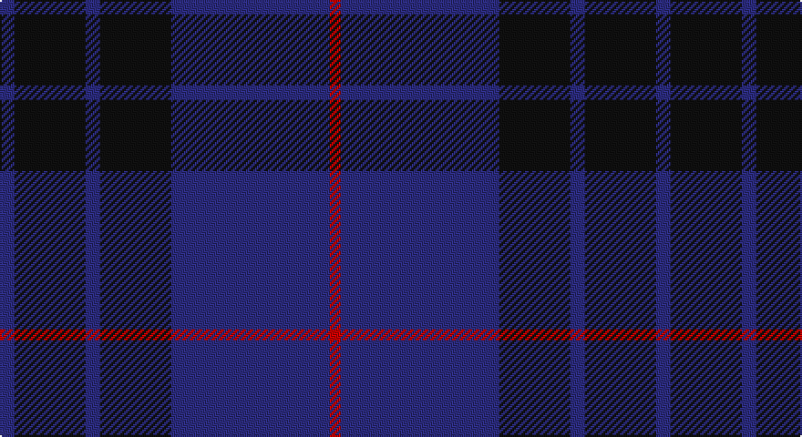

This page is one **sett** — a single exact thread-count. It belongs to the [tartan](/setts/db8k39db8k39db87r6/)
(the same proportion at any scale), whose colour order is pattern [BKBKBR](/stripes/bkbkbr/).

Sourced from tartans-authority.  It is a [6 stripe tartan](/stripes/stripes6/).

Original link http://www.tartansauthority.com/tartan-ferret/display/8072/

## Register references

External register numbers recorded for this tartan.

- Scottish Register of Tartans: [8072](https://www.tartanregister.gov.uk/tartanDetails?ref=8072)
- Scottish Tartans Authority (ITI): 8072

## Thread count
DB/8 K39 DB8 K39 DB87 R/6

One full sett is **360 threads**.

## Palette

Palette: <strong>Tartan Register</strong>
<table><thead><tr><th>Colour</th><th>Threads</th><th>Shade</th><th>Base</th><th>OKLCh</th></tr></thead><tbody><tr><td>DB/</td><td style="text-align:right;font-variant-numeric:tabular-nums">8</td><td><code style="background-color:#2C2C80;">#2C2C80</code> <small style="color:#888">#2C2C80</small></td><td>B <code style="background-color:#2A418A;">#2A418A</code></td><td><small style="color:#888">oklch(35.0% 0.138 276.6)</small></td></tr><tr><td>K</td><td style="text-align:right;font-variant-numeric:tabular-nums">39</td><td><code style="background-color:#101010;">#101010</code> <small style="color:#888">#101010</small></td><td>K <code style="background-color:#000000;">#000000</code></td><td><small style="color:#888">oklch(17.3% 0.000 89.9)</small></td></tr><tr><td>DB</td><td style="text-align:right;font-variant-numeric:tabular-nums">8</td><td><code style="background-color:#2C2C80;">#2C2C80</code> <small style="color:#888">#2C2C80</small></td><td>B <code style="background-color:#2A418A;">#2A418A</code></td><td><small style="color:#888">oklch(35.0% 0.138 276.6)</small></td></tr><tr><td>K</td><td style="text-align:right;font-variant-numeric:tabular-nums">39</td><td><code style="background-color:#101010;">#101010</code> <small style="color:#888">#101010</small></td><td>K <code style="background-color:#000000;">#000000</code></td><td><small style="color:#888">oklch(17.3% 0.000 89.9)</small></td></tr><tr><td>DB</td><td style="text-align:right;font-variant-numeric:tabular-nums">87</td><td><code style="background-color:#2C2C80;">#2C2C80</code> <small style="color:#888">#2C2C80</small></td><td>B <code style="background-color:#2A418A;">#2A418A</code></td><td><small style="color:#888">oklch(35.0% 0.138 276.6)</small></td></tr><tr><td>R/</td><td style="text-align:right;font-variant-numeric:tabular-nums">6</td><td><code style="background-color:#C80000;">#C80000</code> <small style="color:#888">#C80000</small></td><td>R <code style="background-color:#CC0000;">#CC0000</code></td><td><small style="color:#888">oklch(52.3% 0.215 29.2)</small></td></tr></tbody></table>

# Sample pattern

## Nearest tartans

The nearest existing variants by ΔTartan distance, with this tartan at the top so the swatches line up against it.

ΔTartan

Tartan

Sett

—

<a href="/ttd/edit/#slug=db8k39db8k39db87r6">Largan (?)</a> <a class="nn-out" href="/variants/s6/db8k39db8k39db87r6/" title="open its dictionary page">↗</a>

1.04

<a href="/ttd/edit/#slug=db1k3db1k3db8r1~x4&amp;base=db8k39db8k39db87r6">Morgan (MacKay Blue) Clan Tartan</a> <a class="nn-out" href="/variants/s6/db1k3db1k3db8r1~x4/" title="open its dictionary page">↗</a>

1.05

<a href="/ttd/edit/#slug=k1db12k12g1k12db12g1~x4&amp;base=db8k39db8k39db87r6">Marchmont (Personal)</a> <a class="nn-out" href="/variants/s7/k1db12k12g1k12db12g1~x4/" title="open its dictionary page">↗</a>

1.07

<a href="/ttd/edit/#slug=db37r10dg22db11dg3r3~x2&amp;base=db8k39db8k39db87r6">Perthshire, New /Tourist Board</a> <a class="nn-out" href="/variants/s6/db37r10dg22db11dg3r3~x2/" title="open its dictionary page">↗</a>

1.07

<a href="/ttd/edit/#slug=k3db23k17r2~x2&amp;base=db8k39db8k39db87r6">Wellington Variation</a> <a class="nn-out" href="/variants/s4/k3db23k17r2~x2/" title="open its dictionary page">↗</a>

1.15

<a href="/ttd/edit/#slug=k15db4k15db28r2~x2&amp;base=db8k39db8k39db87r6">MacKay (Blue) #2</a> <a class="nn-out" href="/variants/s5/k15db4k15db28r2~x2/" title="open its dictionary page">↗</a>

1.19

<a href="/ttd/edit/#slug=db50do4db12do23ly4do4~x2&amp;base=db8k39db8k39db87r6">Sligo, County</a> <a class="nn-out" href="/variants/s6/db50do4db12do23ly4do4~x2/" title="open its dictionary page">↗</a>

1.20

<a href="/ttd/edit/#slug=db2k11db5k1db5k1~x6&amp;base=db8k39db8k39db87r6">Gagetown (School)</a> <a class="nn-out" href="/variants/s6/db2k11db5k1db5k1~x6/" title="open its dictionary page">↗</a>

1.20

<a href="/ttd/edit/#slug=k30db6k6db41lt2~x2&amp;base=db8k39db8k39db87r6">Williams (New York) (Personal)</a> <a class="nn-out" href="/variants/s5/k30db6k6db41lt2~x2/" title="open its dictionary page">↗</a>

1.28

<a href="/ttd/edit/#slug=k7r2k33db33k2db7~x2&amp;base=db8k39db8k39db87r6">Casterton (Corporate)</a> <a class="nn-out" href="/variants/s6/k7r2k33db33k2db7~x2/" title="open its dictionary page">↗</a>

1.38

<a href="/ttd/edit/#slug=do3db3do3db27do40ly3&amp;base=db8k39db8k39db87r6">Keeper of the Quaich Corporate Tartan</a> <a class="nn-out" href="/variants/s6/do3db3do3db27do40ly3/" title="open its dictionary page">↗</a>

## Neighbour map

Every grey dot is one of 14360 variants placed by the first two principal components of the ΔTartan feature space (44% of its variance). Red is this tartan; blue dots are its nearest — click one to open its page.

<svg viewBox="0 0 640 380" role="img" style="max-width:100%;height:auto;border:1px solid #e0e0e0;border-radius:4px;display:block" xmlns="http://www.w3.org/2000/svg"><image href="/nn/cloud.v1.png" width="640" height="380"/><a href="/variants/s6/db1k3db1k3db8r1~x4/"><circle cx="404.2" cy="272.9" r="4" fill="#3465a4"><title>Morgan (MacKay Blue) Clan Tartan</title></circle></a><a href="/variants/s7/k1db12k12g1k12db12g1~x4/"><circle cx="366.9" cy="265.4" r="4" fill="#3465a4"><title>Marchmont (Personal)</title></circle></a><a href="/variants/s6/db37r10dg22db11dg3r3~x2/"><circle cx="387.9" cy="266.5" r="4" fill="#3465a4"><title>Perthshire, New /Tourist Board</title></circle></a><a href="/variants/s4/k3db23k17r2~x2/"><circle cx="394.4" cy="286.2" r="4" fill="#3465a4"><title>Wellington Variation</title></circle></a><a href="/variants/s5/k15db4k15db28r2~x2/"><circle cx="378.2" cy="271.0" r="4" fill="#3465a4"><title>MacKay (Blue) #2</title></circle></a><a href="/variants/s6/db50do4db12do23ly4do4~x2/"><circle cx="472.0" cy="248.4" r="4" fill="#3465a4"><title>Sligo, County</title></circle></a><a href="/variants/s6/db2k11db5k1db5k1~x6/"><circle cx="413.4" cy="281.1" r="4" fill="#3465a4"><title>Gagetown (School)</title></circle></a><a href="/variants/s5/k30db6k6db41lt2~x2/"><circle cx="436.3" cy="254.2" r="4" fill="#3465a4"><title>Williams (New York) (Personal)</title></circle></a><a href="/variants/s6/k7r2k33db33k2db7~x2/"><circle cx="452.2" cy="267.2" r="4" fill="#3465a4"><title>Casterton (Corporate)</title></circle></a><a href="/variants/s6/do3db3do3db27do40ly3/"><circle cx="457.4" cy="239.2" r="4" fill="#3465a4"><title>Keeper of the Quaich Corporate Tartan</title></circle></a><circle cx="429.8" cy="255.6" r="5" fill="#c00000"/></svg>

ID: /variants/s6/db8k39db8k39db87r6/
