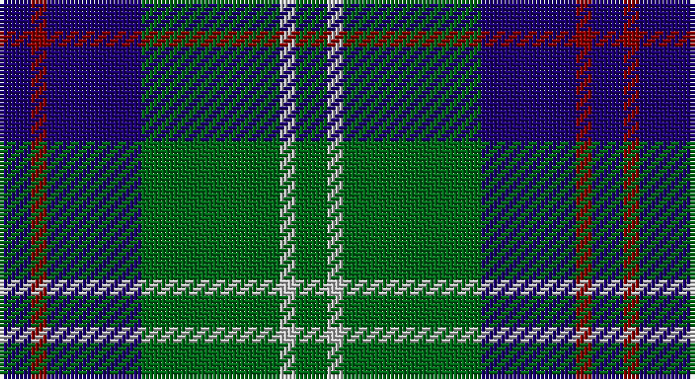

This page is one **sett** — a single exact thread-count. It belongs to the [tartan](/setts/db8r4db24g35lb4g8/)
(the same proportion at any scale), whose colour order is pattern [BRBGWG](/stripes/brbgwg/).

Sourced from register-of-tartans.  It is a [6 stripe tartan](/stripes/stripes6/).

Original link https://www.tartanregister.gov.uk/tartanDetails.aspx?ref=1697

2 attestations — the source records this cloth was collapsed from (oldest owns this page)

<ul>
<li>01/01/2002 — Heritage Tartan, The (register-of-tartans, <a href="https://www.tartanregister.gov.uk/tartanDetails.aspx?ref=1697">record</a>)</li>
<li>pre 2002 — Heritage Tartan, The (Corporate) (tartans-authority, <a href="http://www.tartansauthority.com/tartan-ferret/display/5185/">record</a>)</li>
</ul>

## Register references

External register numbers recorded for this tartan.

- Scottish Register of Tartans: [1697](https://www.tartanregister.gov.uk/tartanDetails.aspx?ref=1697)
- Scottish Tartans Authority (ITI): 5185

## Thread count
DB/8 DR4 DB24 G35 N4 G/8

One full sett is **150 threads**.

## Palette

Palette: <strong>Tartan Register</strong>
<table><thead><tr><th>Colour</th><th>Threads</th><th>Shade</th><th>Base</th><th>OKLCh</th></tr></thead><tbody><tr><td>DB/</td><td style="text-align:right;font-variant-numeric:tabular-nums">8</td><td><code style="background-color:#1C0070;">#1C0070</code> <small style="color:#888">#1C0070</small></td><td>B <code style="background-color:#2A418A;">#2A418A</code></td><td><small style="color:#888">oklch(26.3% 0.162 277.1)</small></td></tr><tr><td>DR</td><td style="text-align:right;font-variant-numeric:tabular-nums">4</td><td><code style="background-color:#880000;">#880000</code> <small style="color:#888">#880000</small></td><td>R <code style="background-color:#CC0000;">#CC0000</code></td><td><small style="color:#888">oklch(39.4% 0.162 29.2)</small></td></tr><tr><td>DB</td><td style="text-align:right;font-variant-numeric:tabular-nums">24</td><td><code style="background-color:#1C0070;">#1C0070</code> <small style="color:#888">#1C0070</small></td><td>B <code style="background-color:#2A418A;">#2A418A</code></td><td><small style="color:#888">oklch(26.3% 0.162 277.1)</small></td></tr><tr><td>G</td><td style="text-align:right;font-variant-numeric:tabular-nums">35</td><td><code style="background-color:#006818;">#006818</code> <small style="color:#888">#006818</small></td><td>G <code style="background-color:#006100;">#006100</code></td><td><small style="color:#888">oklch(45.0% 0.142 145.0)</small></td></tr><tr><td>N</td><td style="text-align:right;font-variant-numeric:tabular-nums">4</td><td><code style="background-color:#C0C0C0;">#C0C0C0</code> <small style="color:#888">#C0C0C0</small></td><td>W <code style="background-color:#F7F7F7;">#F7F7F7</code></td><td><small style="color:#888">oklch(80.8% 0.000 89.9)</small></td></tr><tr><td>G/</td><td style="text-align:right;font-variant-numeric:tabular-nums">8</td><td><code style="background-color:#006818;">#006818</code> <small style="color:#888">#006818</small></td><td>G <code style="background-color:#006100;">#006100</code></td><td><small style="color:#888">oklch(45.0% 0.142 145.0)</small></td></tr></tbody></table>

# Sample pattern

## Nearest tartans

The nearest existing variants by ΔTartan distance, with this tartan at the top so the swatches line up against it.

ΔTartan

Tartan

Sett

—

<a href="/ttd/edit/#slug=db8r4db24g35lb4g8">Heritage Tartan, The</a> <a class="nn-out" href="/variants/s6/db8r4db24g35lb4g8/" title="open its dictionary page">↗</a>

0.55

<a href="/ttd/edit/#slug=dg4db12r3db12dg32lb4&amp;base=db8r4db24g35lb4g8">MacIntyre L</a> <a class="nn-out" href="/variants/s6/dg4db12r3db12dg32lb4/" title="open its dictionary page">↗</a>

0.70

<a href="/ttd/edit/#slug=r2g3db2g14db14lr2~x2&amp;base=db8r4db24g35lb4g8">Irving of Bonshaw Tower (Personal)</a> <a class="nn-out" href="/variants/s6/r2g3db2g14db14lr2~x2/" title="open its dictionary page">↗</a>

0.75

<a href="/ttd/edit/#slug=g4db12r3db12g32w4~x2&amp;base=db8r4db24g35lb4g8">MacIntyre Hunting (VS)</a> <a class="nn-out" href="/variants/s6/g4db12r3db12g32w4~x2/" title="open its dictionary page">↗</a>

0.86

<a href="/ttd/edit/#slug=r3dg10r3dg14db16dg3ly2&amp;base=db8r4db24g35lb4g8">Cameron Hunting</a> <a class="nn-out" href="/variants/s7/r3dg10r3dg14db16dg3ly2/" title="open its dictionary page">↗</a>

0.86

<a href="/ttd/edit/#slug=r3g10r3g14db16g3ly2~x2&amp;base=db8r4db24g35lb4g8">Cameron of Lochiel (Hunting)</a> <a class="nn-out" href="/variants/s7/r3g10r3g14db16g3ly2~x2/" title="open its dictionary page">↗</a>

0.89

<a href="/ttd/edit/#slug=dg4db12r3db12dg32w4~x2&amp;base=db8r4db24g35lb4g8">MacIntyre</a> <a class="nn-out" href="/variants/s6/dg4db12r3db12dg32w4~x2/" title="open its dictionary page">↗</a>

0.91

<a href="/ttd/edit/#slug=dg4db12r3db12dg32lr4~x2&amp;base=db8r4db24g35lb4g8">MacIntyre LC</a> <a class="nn-out" href="/variants/s6/dg4db12r3db12dg32lr4~x2/" title="open its dictionary page">↗</a>

0.91

<a href="/ttd/edit/#slug=dg4db12r3db12dg32lr4&amp;base=db8r4db24g35lb4g8">MacIntyre LC</a> <a class="nn-out" href="/variants/s6/dg4db12r3db12dg32lr4/" title="open its dictionary page">↗</a>

0.93

<a href="/ttd/edit/#slug=dg10r1dg1r2dg8db10dg1ly1~x4&amp;base=db8r4db24g35lb4g8">Glen Esk</a> <a class="nn-out" href="/variants/s8/dg10r1dg1r2dg8db10dg1ly1~x4/" title="open its dictionary page">↗</a>

0.94

<a href="/ttd/edit/#slug=r5db25w5db3g25db3~x2&amp;base=db8r4db24g35lb4g8">Thayer USA (Name)</a> <a class="nn-out" href="/variants/s6/r5db25w5db3g25db3~x2/" title="open its dictionary page">↗</a>

## Neighbour map

Every grey dot is one of 14360 variants placed by the first two principal components of the ΔTartan feature space (44% of its variance). Red is this tartan; blue dots are its nearest — click one to open its page.

<svg viewBox="0 0 640 380" role="img" style="max-width:100%;height:auto;border:1px solid #e0e0e0;border-radius:4px;display:block" xmlns="http://www.w3.org/2000/svg"><image href="/nn/cloud.v1.png" width="640" height="380"/><a href="/variants/s6/dg4db12r3db12dg32lb4/"><circle cx="301.0" cy="219.4" r="4" fill="#3465a4"><title>MacIntyre L</title></circle></a><a href="/variants/s6/r2g3db2g14db14lr2~x2/"><circle cx="256.0" cy="231.3" r="4" fill="#3465a4"><title>Irving of Bonshaw Tower (Personal)</title></circle></a><a href="/variants/s6/g4db12r3db12g32w4~x2/"><circle cx="294.7" cy="211.8" r="4" fill="#3465a4"><title>MacIntyre Hunting (VS)</title></circle></a><a href="/variants/s7/r3dg10r3dg14db16dg3ly2/"><circle cx="263.4" cy="230.7" r="4" fill="#3465a4"><title>Cameron Hunting</title></circle></a><a href="/variants/s7/r3g10r3g14db16g3ly2~x2/"><circle cx="259.6" cy="225.9" r="4" fill="#3465a4"><title>Cameron of Lochiel (Hunting)</title></circle></a><a href="/variants/s6/dg4db12r3db12dg32w4~x2/"><circle cx="323.0" cy="226.7" r="4" fill="#3465a4"><title>MacIntyre</title></circle></a><a href="/variants/s6/dg4db12r3db12dg32lr4~x2/"><circle cx="322.0" cy="229.6" r="4" fill="#3465a4"><title>MacIntyre LC</title></circle></a><a href="/variants/s6/dg4db12r3db12dg32lr4/"><circle cx="322.0" cy="229.6" r="4" fill="#3465a4"><title>MacIntyre LC</title></circle></a><a href="/variants/s8/dg10r1dg1r2dg8db10dg1ly1~x4/"><circle cx="324.4" cy="208.7" r="4" fill="#3465a4"><title>Glen Esk</title></circle></a><a href="/variants/s6/r5db25w5db3g25db3~x2/"><circle cx="251.4" cy="216.9" r="4" fill="#3465a4"><title>Thayer USA (Name)</title></circle></a><circle cx="284.6" cy="229.3" r="5" fill="#c00000"/></svg>

ID: /variants/s6/db8r4db24g35lb4g8/
