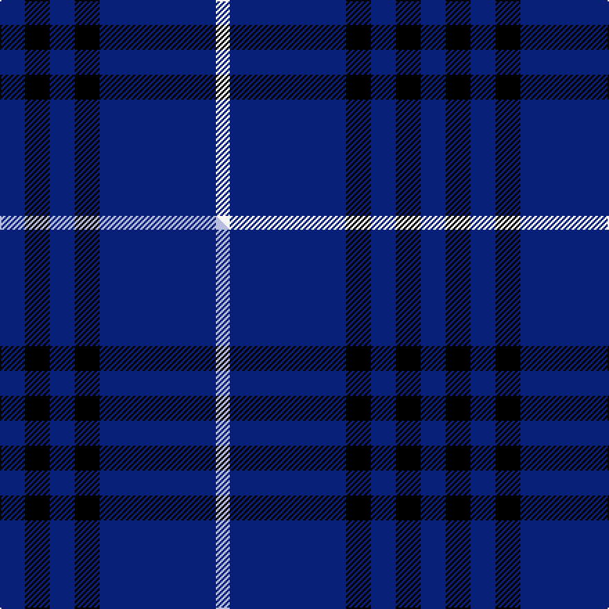

This page is one **sett** — a single exact thread-count. It belongs to the [tartan](/setts/db9k9db9k9db42w5/)
(the same proportion at any scale), whose colour order is pattern [BKBKBW](/stripes/bkbkbw/).

Part of the [Dollar Academy](/tartans/dollar-academy-2/) tartan — the named design grouping this sett with its other cloths.

Sourced from tartans-authority.  It is a [6 stripe tartan](/stripes/stripes6/).

Original link https://www.tartanregister.gov.uk/tartanDetails.aspx?ref=290

## Provenance

Earliest known date: pre 2003 No information on the original of this school tartan.

3 attestations — the source records this cloth was collapsed from (oldest owns this page)

<ul>
<li>1930s — Dollar Academy (1930s) (Corporate) (tartans-authority, <a href="https://www.tartanregister.gov.uk/tartanDetails.aspx?ref=290">record</a>)  <em>House tartan for Dollar Academy near Stirling designed by a former pupil John Husband in the 1930s. John was a fruit trader in London prior to emigrating to New Zealand. This tartan was never actually part of the school uniform but see #2668 for a much later version. Marketed by Botany Woolen Mills (neckties) ca. 1935-50.</em></li>
<li>undated — Dollar, Academy (weddslist, <a href="http://www.weddslist.com/cgi-bin/tartans/pg.pl?source=sts">record</a>) </li>
<li>undated — Dollar Academy Corporate Tartan (house-of-tartan, <a href="http://www.house-of-tartan.scotland.net/house/TartanViewjs.asp?colr=Def&tnam=290">record</a>) </li>
</ul>

Dataset <small>— provenance for this record, inherited from the source manifest</small>

<dl class="dataset-prov">
<dt>source</dt><dd><a href="/sources/tartans-authority/">Scottish Tartans Authority</a></dd>
<dt>data captured from</dt><dd><a href="https://github.com/thetartan/tartan-database/blob/master/data/tartans-authority/data.csv">https://github.com/thetartan/tartan-database/blob/master/data/tartans-authority/data.csv</a></dd>
<dt>data date</dt><dd>1930s <small>(this record)</small></dd>
<dt>licence</dt><dd><a href="https://creativecommons.org/licenses/by-nc-nd/4.0/">CC BY-NC-ND 4.0</a></dd>
</dl>

Capture chain <small>— the hands this data passed through, oldest first; each capture carries its own licence</small>

<ol class="capture-chain">
<li><a href="https://www.tartansauthority.com/">Scottish Tartans Authority</a> <small>the heritage body's archive — its tartan-ferret record browser is retired (links repaired to the SRT, above)</small></li>
<li><a href="https://github.com/thetartan/tartan-database">thetartan/tartan-database</a> <small>2016-2017</small> · <a href="https://creativecommons.org/licenses/by-nc-nd/4.0/">CC BY-NC-ND 4.0</a> <small>Levko Kravets's frozen compilation — the capture we vendored, and where its CC licence text came from</small></li>
<li>this dictionary <small>captured 2026-06-10 · commit 5bf86c7566</small> <small>each re-capture is a git commit to data/sources</small></li>
</ol>

## Register references

External register numbers recorded for this tartan.

- Scottish Tartans Authority (ITI): 290

## Thread count
DB/18 K18 DB18 K18 DB84 W/10

One full sett is **304 threads**.

## Palette
<table><thead><tr><th>Colour</th><th>Shade</th><th>OKLCh</th></tr></thead><tbody><tr><td>DB</td><td><code style="background-color:#082077;">#082077</code> <small style="color:#888">#082077</small></td><td><small style="color:#888">oklch(30.0% 0.149 265.1)</small></td></tr><tr><td>K</td><td><code style="background-color:#000000;">#000000</code> <small style="color:#888">#000000</small></td><td><small style="color:#888">oklch(0.0% 0.000 0.0)</small></td></tr><tr><td>W</td><td><code style="background-color:#F7F7F7;">#F7F7F7</code> <small style="color:#888">#F7F7F7</small></td><td><small style="color:#888">oklch(97.6% 0.000 89.9)</small></td></tr></tbody></table>

# Sample pattern

## Compared to the master

This cloth is one sett of its design; the master sett (the exemplar the design is anchored on) is below for comparison.

Its **ΔTartan distance** from the master is **0.30** — the same measure the nearest-tartans table ranks by (0 is identical; a re-scale of the same cloth is near 0, a recolour or a different proportion further).

<figure class="master-compare" style="margin:0">

this sett
master sett ★

<figcaption style="color:#888;font-size:smaller">One weave of this sett against the <a href="/setts/db9k9db9k9db42lb5/">master sett ★</a>, split on the diagonal: a shared proportion runs seamlessly across it with only the shades shifting; a different proportion breaks on it.</figcaption>
</figure>

## Nearest tartan variants

The nearest existing variants by ΔTartan distance, with this cloth at the top so the swatches line up against it.

ΔTartan

Threads

Variant

Sett

—

304

<a href="/variants/s6/db9k9db9k9db42w5~x2/">Dollar Academy (1930s) (Corporate)</a>

<a href="/ttd/edit/#slug=db9k9db9k9db42lb5~x2&amp;base=db9k9db9k9db42w5~x2" title="compare in the TTD">0.30</a>

304

<a href="/variants/s6/db9k9db9k9db42lb5~x2/">Dollar Academy</a>

<a href="/ttd/edit/#slug=b40k4b12k21b17w4~x2&amp;base=db9k9db9k9db42w5~x2" title="compare in the TTD">0.71</a>

304

<a href="/variants/s6/b40k4b12k21b17w4~x2/">Granger</a>

<a href="/ttd/edit/#slug=db1k3db1k3db8r1~x8&amp;base=db9k9db9k9db42w5~x2" title="compare in the TTD">0.95</a>

256

<a href="/variants/s6/db1k3db1k3db8r1~x8/">MacKay -1842 (VS) (Clan)</a>

<a href="/ttd/edit/#slug=db1k3db1k3db8r1~x4&amp;base=db9k9db9k9db42w5~x2" title="compare in the TTD">0.95</a>

128

<a href="/variants/s6/db1k3db1k3db8r1~x4/">Morgan (MacKay Blue) Clan Tartan</a>

<a href="/ttd/edit/#slug=r1t8k3t1k3t1~x8&amp;base=db9k9db9k9db42w5~x2" title="compare in the TTD">0.96</a>

256

<a href="/variants/s6/r1t8k3t1k3t1~x8/">Mackay (Blue)</a>

<a href="/ttd/edit/#slug=db2k6db2k6db16r1~x2&amp;base=db9k9db9k9db42w5~x2" title="compare in the TTD">1.15</a>

126

<a href="/variants/s6/db2k6db2k6db16r1~x2/">MacKay V</a>

<a href="/ttd/edit/#slug=db8k39db8k39db87r6&amp;base=db9k9db9k9db42w5~x2" title="compare in the TTD">1.21</a>

360

<a href="/variants/s6/db8k39db8k39db87r6/">Largan (?)</a>

<a href="/ttd/edit/#slug=db5k2db14k14db2lp2~x2&amp;base=db9k9db9k9db42w5~x2" title="compare in the TTD">1.28</a>

142

<a href="/variants/s6/db5k2db14k14db2lp2~x2/">Royal Scotsman Train (Corporate)</a>

<a href="/ttd/edit/#slug=w4n15db8k4db28k2db4w2&amp;base=db9k9db9k9db42w5~x2" title="compare in the TTD">1.55</a>

128

<a href="/variants/s8/w4n15db8k4db28k2db4w2/">Kelvinside Academy (School)</a>

<a href="/ttd/edit/#slug=db35k10db4w2db3r2~x2&amp;base=db9k9db9k9db42w5~x2" title="compare in the TTD">1.70</a>

150

<a href="/variants/s6/db35k10db4w2db3r2~x2/">Laidlaw's Highland Drovers</a>

## Neighbour map

Every grey dot is one of 13620 variants placed by the first two principal components of the ΔTartan feature space (42% of its variance). Red is this tartan; blue dots are its nearest — click one to open its page.

<svg viewBox="0 0 640 380" role="img" style="max-width:100%;height:auto;border:1px solid #e0e0e0;border-radius:4px;display:block" xmlns="http://www.w3.org/2000/svg"><image href="/nn/cloud.v1.png" width="640" height="380"/><a href="/variants/s6/db9k9db9k9db42lb5~x2/"><circle cx="417.8" cy="212.0" r="4" fill="#3465a4"><title>Dollar Academy</title></circle></a><a href="/variants/s6/b40k4b12k21b17w4~x2/"><circle cx="361.9" cy="209.3" r="4" fill="#3465a4"><title>Granger</title></circle></a><a href="/variants/s6/db1k3db1k3db8r1~x8/"><circle cx="344.7" cy="220.0" r="4" fill="#3465a4"><title>MacKay -1842 (VS) (Clan)</title></circle></a><a href="/variants/s6/db1k3db1k3db8r1~x4/"><circle cx="344.7" cy="220.0" r="4" fill="#3465a4"><title>Morgan (MacKay Blue) Clan Tartan</title></circle></a><a href="/variants/s6/r1t8k3t1k3t1~x8/"><circle cx="292.4" cy="209.6" r="4" fill="#3465a4"><title>Mackay (Blue)</title></circle></a><a href="/variants/s6/db2k6db2k6db16r1~x2/"><circle cx="393.5" cy="194.0" r="4" fill="#3465a4"><title>MacKay V</title></circle></a><a href="/variants/s6/db8k39db8k39db87r6/"><circle cx="362.8" cy="197.9" r="4" fill="#3465a4"><title>Largan (?)</title></circle></a><a href="/variants/s6/db5k2db14k14db2lp2~x2/"><circle cx="302.7" cy="225.5" r="4" fill="#3465a4"><title>Royal Scotsman Train (Corporate)</title></circle></a><a href="/variants/s8/w4n15db8k4db28k2db4w2/"><circle cx="302.8" cy="159.0" r="4" fill="#3465a4"><title>Kelvinside Academy (School)</title></circle></a><a href="/variants/s6/db35k10db4w2db3r2~x2/"><circle cx="452.5" cy="145.5" r="4" fill="#3465a4"><title>Laidlaw's Highland Drovers</title></circle></a><circle cx="397.7" cy="205.9" r="5" fill="#c00000"/><text x="320" y="376" text-anchor="middle" font-size="11" fill="#999">ground</text><text x="11" y="190" text-anchor="middle" font-size="11" fill="#999" transform="rotate(-90 11 190)">complexity</text></svg>

ID: /variants/s6/db9k9db9k9db42w5~x2/
