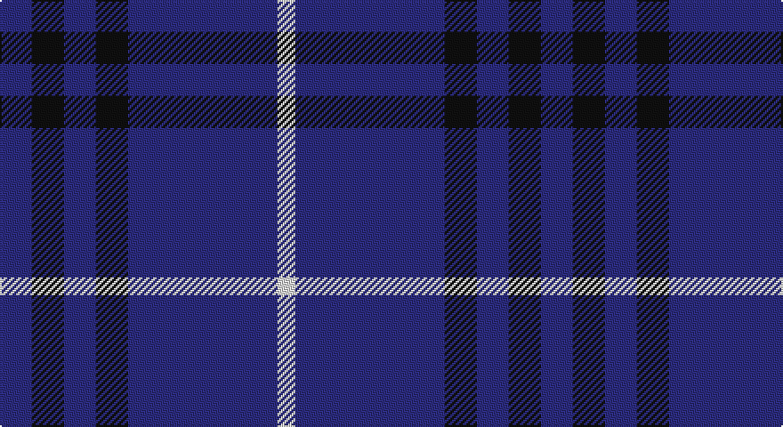

This page is one **sett** — a single exact thread-count. It belongs to the [tartan](/setts/db9k9db9k9db42w5/)
(the same proportion at any scale), whose colour order is pattern [BKBKBW](/stripes/bkbkbw/).

Part of the [Dollar Academy](/tartans/dollar-academy/) tartan — the named design grouping this sett with its other cloths.

Sourced from tartans-authority.  It is a [6 stripe tartan](/stripes/stripes6/).

Original link http://www.tartansauthority.com/tartan-ferret/display/290/

## Provenance

Earliest known date: pre 2003 No information on the original of this school tartan.

## Also known as

This cloth is also recorded under:

- Dollar, Academy

3 attestations — the source records this cloth was collapsed from (oldest owns this page)

<ul>
<li>1930s — Dollar Academy (1930s) (Corporate) (tartans-authority, <a href="http://www.tartansauthority.com/tartan-ferret/display/290/">record</a>)</li>
<li>undated — Dollar, Academy (weddslist, <a href="http://www.weddslist.com/cgi-bin/tartans/pg.pl?source=sts">record</a>)</li>
<li>undated — Dollar Academy Corporate Tartan (house-of-tartan, <a href="http://www.house-of-tartan.scotland.net/house/TartanViewjs.asp?colr=Def&tnam=290">record</a>)</li>
</ul>

## Register references

External register numbers recorded for this tartan.

- Scottish Tartans Authority (ITI): 290

## Thread count
DB/18 K18 DB18 K18 DB84 LN/10

One full sett is **304 threads**.

## Palette

Palette: <strong>Tartan Register</strong>
<table><thead><tr><th>Colour</th><th>Threads</th><th>Shade</th><th>Base</th><th>OKLCh</th></tr></thead><tbody><tr><td>DB/</td><td style="text-align:right;font-variant-numeric:tabular-nums">18</td><td><code style="background-color:#2C2C80;">#2C2C80</code> <small style="color:#888">#2C2C80</small></td><td>B <code style="background-color:#2A418A;">#2A418A</code></td><td><small style="color:#888">oklch(35.0% 0.138 276.6)</small></td></tr><tr><td>K</td><td style="text-align:right;font-variant-numeric:tabular-nums">18</td><td><code style="background-color:#101010;">#101010</code> <small style="color:#888">#101010</small></td><td>K <code style="background-color:#000000;">#000000</code></td><td><small style="color:#888">oklch(17.3% 0.000 89.9)</small></td></tr><tr><td>DB</td><td style="text-align:right;font-variant-numeric:tabular-nums">18</td><td><code style="background-color:#2C2C80;">#2C2C80</code> <small style="color:#888">#2C2C80</small></td><td>B <code style="background-color:#2A418A;">#2A418A</code></td><td><small style="color:#888">oklch(35.0% 0.138 276.6)</small></td></tr><tr><td>K</td><td style="text-align:right;font-variant-numeric:tabular-nums">18</td><td><code style="background-color:#101010;">#101010</code> <small style="color:#888">#101010</small></td><td>K <code style="background-color:#000000;">#000000</code></td><td><small style="color:#888">oklch(17.3% 0.000 89.9)</small></td></tr><tr><td>DB</td><td style="text-align:right;font-variant-numeric:tabular-nums">84</td><td><code style="background-color:#2C2C80;">#2C2C80</code> <small style="color:#888">#2C2C80</small></td><td>B <code style="background-color:#2A418A;">#2A418A</code></td><td><small style="color:#888">oklch(35.0% 0.138 276.6)</small></td></tr><tr><td>LN/</td><td style="text-align:right;font-variant-numeric:tabular-nums">10</td><td><code style="background-color:#E0E0E0;">#E0E0E0</code> <small style="color:#888">#E0E0E0</small></td><td>W <code style="background-color:#F7F7F7;">#F7F7F7</code></td><td><small style="color:#888">oklch(90.7% 0.000 89.9)</small></td></tr></tbody></table>

# Sample pattern

## Nearest tartans

The nearest existing variants by ΔTartan distance, with this tartan at the top so the swatches line up against it.

ΔTartan

Tartan

Sett

—

<a href="/ttd/edit/#slug=db9k9db9k9db42w5~x2">Dollar Academy (1930s) (Corporate)</a> <a class="nn-out" href="/variants/s6/db9k9db9k9db42w5~x2/" title="open its dictionary page">↗</a>

0.53

<a href="/ttd/edit/#slug=db9k9db9k9db42lb5~x2&amp;base=db9k9db9k9db42w5~x2">Dollar Academy</a> <a class="nn-out" href="/variants/s6/db9k9db9k9db42lb5~x2/" title="open its dictionary page">↗</a>

1.33

<a href="/ttd/edit/#slug=db72t6db12t17w6~x2&amp;base=db9k9db9k9db42w5~x2">Gulfmark (Corporate)</a> <a class="nn-out" href="/variants/s5/db72t6db12t17w6~x2/" title="open its dictionary page">↗</a>

1.38

<a href="/ttd/edit/#slug=g16db59ly4db59g16dbi9~x2&amp;base=db9k9db9k9db42w5~x2">Oxford University</a> <a class="nn-out" href="/variants/s6/g16db59ly4db59g16dbi9~x2/" title="open its dictionary page">↗</a>

1.54

<a href="/ttd/edit/#slug=db40g7ly3g7db15r5~x2&amp;base=db9k9db9k9db42w5~x2">Wheadon (Name)</a> <a class="nn-out" href="/variants/s6/db40g7ly3g7db15r5~x2/" title="open its dictionary page">↗</a>

1.57

<a href="/ttd/edit/#slug=db36lo5db8lb3db8lb10db3~x2&amp;base=db9k9db9k9db42w5~x2">Scottish Qualifications Auth. (Corp)</a> <a class="nn-out" href="/variants/s7/db36lo5db8lb3db8lb10db3~x2/" title="open its dictionary page">↗</a>

1.57

<a href="/ttd/edit/#slug=db4w3b6db40b8db12g3~x2&amp;base=db9k9db9k9db42w5~x2">JetBlue (Corporate)</a> <a class="nn-out" href="/variants/s7/db4w3b6db40b8db12g3~x2/" title="open its dictionary page">↗</a>

1.58

<a href="/ttd/edit/#slug=r5db15g3db15ly3db3~x2&amp;base=db9k9db9k9db42w5~x2">Abertay University (Estimated threadcount)</a> <a class="nn-out" href="/variants/s6/r5db15g3db15ly3db3~x2/" title="open its dictionary page">↗</a>

1.60

<a href="/ttd/edit/#slug=db35w4db10ri3r3ri3~x4&amp;base=db9k9db9k9db42w5~x2">Steffen, Morris (Personal)</a> <a class="nn-out" href="/variants/s6/db35w4db10ri3r3ri3~x4/" title="open its dictionary page">↗</a>

1.60

<a href="/ttd/edit/#slug=db35lr8db21lr13db6lo4~x2&amp;base=db9k9db9k9db42w5~x2">Ochterlonie</a> <a class="nn-out" href="/variants/s6/db35lr8db21lr13db6lo4~x2/" title="open its dictionary page">↗</a>

1.62

<a href="/ttd/edit/#slug=db8r1k1lr1~x10&amp;base=db9k9db9k9db42w5~x2">Kucher, Gregory</a> <a class="nn-out" href="/variants/s4/db8r1k1lr1~x10/" title="open its dictionary page">↗</a>

## Neighbour map

Every grey dot is one of 14360 variants placed by the first two principal components of the ΔTartan feature space (44% of its variance). Red is this tartan; blue dots are its nearest — click one to open its page.

<svg viewBox="0 0 640 380" role="img" style="max-width:100%;height:auto;border:1px solid #e0e0e0;border-radius:4px;display:block" xmlns="http://www.w3.org/2000/svg"><image href="/nn/cloud.v1.png" width="640" height="380"/><a href="/variants/s6/db9k9db9k9db42lb5~x2/"><circle cx="463.7" cy="258.6" r="4" fill="#3465a4"><title>Dollar Academy</title></circle></a><a href="/variants/s5/db72t6db12t17w6~x2/"><circle cx="496.0" cy="233.7" r="4" fill="#3465a4"><title>Gulfmark (Corporate)</title></circle></a><a href="/variants/s6/g16db59ly4db59g16dbi9~x2/"><circle cx="454.3" cy="231.7" r="4" fill="#3465a4"><title>Oxford University</title></circle></a><a href="/variants/s6/db40g7ly3g7db15r5~x2/"><circle cx="427.3" cy="202.5" r="4" fill="#3465a4"><title>Wheadon (Name)</title></circle></a><a href="/variants/s7/db36lo5db8lb3db8lb10db3~x2/"><circle cx="453.2" cy="202.5" r="4" fill="#3465a4"><title>Scottish Qualifications Auth. (Corp)</title></circle></a><a href="/variants/s7/db4w3b6db40b8db12g3~x2/"><circle cx="470.9" cy="201.2" r="4" fill="#3465a4"><title>JetBlue (Corporate)</title></circle></a><a href="/variants/s6/r5db15g3db15ly3db3~x2/"><circle cx="400.8" cy="256.2" r="4" fill="#3465a4"><title>Abertay University (Estimated threadcount)</title></circle></a><a href="/variants/s6/db35w4db10ri3r3ri3~x4/"><circle cx="493.9" cy="197.0" r="4" fill="#3465a4"><title>Steffen, Morris (Personal)</title></circle></a><a href="/variants/s6/db35lr8db21lr13db6lo4~x2/"><circle cx="387.2" cy="240.0" r="4" fill="#3465a4"><title>Ochterlonie</title></circle></a><a href="/variants/s4/db8r1k1lr1~x10/"><circle cx="422.6" cy="233.3" r="4" fill="#3465a4"><title>Kucher, Gregory</title></circle></a><circle cx="447.9" cy="250.6" r="5" fill="#c00000"/></svg>

ID: /variants/s6/db9k9db9k9db42w5~x2/
