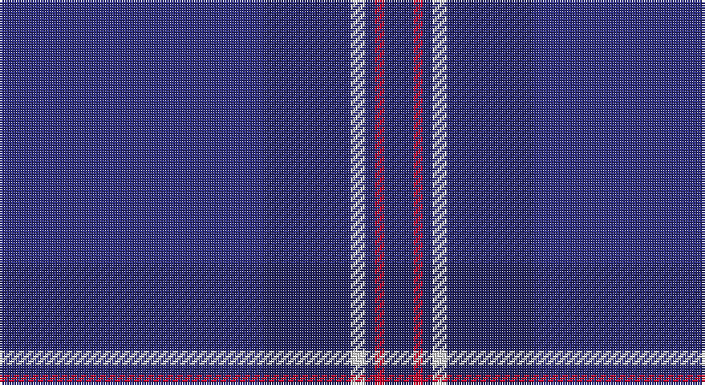

This page is one **sett** — a single exact thread-count. It belongs to the [tartan](/setts/dbi55db18w3db2r2db6/)
(the same proportion at any scale), whose colour order is pattern [BBWBRB](/stripes/bbwbrb/).

Sourced from house-of-tartan.  It is a [6 stripe tartan](/stripes/stripes6/).

Original link http://www.house-of-tartan.scotland.net/house/TartanViewjs.asp?colr=Def&tnam=82

## Provenance

Earliest known date: 1988 S = Scarlet. Based on the Earl of St Andrews tartan. S.C.O.T.S. is a U.S. nationwide network of travel agents promoting tourism in Scotland.

## Thread count
DB/110 DBa36 LN6 DBa4 R4 DBa/12

One full sett is **222 threads**.

## Palette

Palette: <strong>Tartan Register</strong>
<table><thead><tr><th>Colour</th><th>Threads</th><th>Shade</th><th>Base</th><th>OKLCh</th></tr></thead><tbody><tr><td>DB/</td><td style="text-align:right;font-variant-numeric:tabular-nums">110</td><td><code style="background-color:#2C2C80;">#2C2C80</code> <small style="color:#888">#2C2C80</small></td><td>B <code style="background-color:#2A418A;">#2A418A</code></td><td><small style="color:#888">oklch(35.0% 0.138 276.6)</small></td></tr><tr><td>DBa</td><td style="text-align:right;font-variant-numeric:tabular-nums">36</td><td><code style="background-color:#202060;">#202060</code> <small style="color:#888">#202060</small></td><td>B <code style="background-color:#2A418A;">#2A418A</code></td><td><small style="color:#888">oklch(28.9% 0.111 276.9)</small></td></tr><tr><td>LN</td><td style="text-align:right;font-variant-numeric:tabular-nums">6</td><td><code style="background-color:#E0E0E0;">#E0E0E0</code> <small style="color:#888">#E0E0E0</small></td><td>W <code style="background-color:#F7F7F7;">#F7F7F7</code></td><td><small style="color:#888">oklch(90.7% 0.000 89.9)</small></td></tr><tr><td>DBa</td><td style="text-align:right;font-variant-numeric:tabular-nums">4</td><td><code style="background-color:#202060;">#202060</code> <small style="color:#888">#202060</small></td><td>B <code style="background-color:#2A418A;">#2A418A</code></td><td><small style="color:#888">oklch(28.9% 0.111 276.9)</small></td></tr><tr><td>R</td><td style="text-align:right;font-variant-numeric:tabular-nums">4</td><td><code style="background-color:#C8002C;">#C8002C</code> <small style="color:#888">#C8002C</small></td><td>R <code style="background-color:#CC0000;">#CC0000</code></td><td><small style="color:#888">oklch(52.6% 0.212 22.0)</small></td></tr><tr><td>DBa/</td><td style="text-align:right;font-variant-numeric:tabular-nums">12</td><td><code style="background-color:#202060;">#202060</code> <small style="color:#888">#202060</small></td><td>B <code style="background-color:#2A418A;">#2A418A</code></td><td><small style="color:#888">oklch(28.9% 0.111 276.9)</small></td></tr></tbody></table>

# Sample pattern

## Nearest tartans

The nearest existing variants by ΔTartan distance, with this tartan at the top so the swatches line up against it.

ΔTartan

Tartan

Sett

—

<a href="/ttd/edit/#slug=dbi55db18w3db2r2db6~x2">S.C.O.T.S. U.S.A. Tartan</a> <a class="nn-out" href="/variants/s6/dbi55db18w3db2r2db6~x2/" title="open its dictionary page">↗</a>

1.57

<a href="/ttd/edit/#slug=db104dbi16w8dbi66r3dbi16&amp;base=dbi55db18w3db2r2db6~x2">Edzell U.S. Navy Regimental Tartan</a> <a class="nn-out" href="/variants/s6/db104dbi16w8dbi66r3dbi16/" title="open its dictionary page">↗</a>

1.67

<a href="/ttd/edit/#slug=dt104db16w8db66r3db16&amp;base=dbi55db18w3db2r2db6~x2">US Navy Edzell</a> <a class="nn-out" href="/variants/s6/dt104db16w8db66r3db16/" title="open its dictionary page">↗</a>

2.07

<a href="/ttd/edit/#slug=dbi28db49ly3db49dbi28w4~x2&amp;base=dbi55db18w3db2r2db6~x2">MacKerrell of Hillhouse Htg Family Tartan</a> <a class="nn-out" href="/variants/s6/dbi28db49ly3db49dbi28w4~x2/" title="open its dictionary page">↗</a>

2.09

<a href="/ttd/edit/#slug=k4r1db3dbi28db36k3r2o1~x2&amp;base=dbi55db18w3db2r2db6~x2">ODL (Corporate)</a> <a class="nn-out" href="/variants/s8/k4r1db3dbi28db36k3r2o1~x2/" title="open its dictionary page">↗</a>

2.10

<a href="/ttd/edit/#slug=r3dt32db2dt3db4dt2db16w1db1~x2&amp;base=dbi55db18w3db2r2db6~x2">Dauphinee, Andrew Hunter (Personal)</a> <a class="nn-out" href="/variants/s9/r3dt32db2dt3db4dt2db16w1db1~x2/" title="open its dictionary page">↗</a>

2.13

<a href="/ttd/edit/#slug=dt45db7w3db27r1db7~x2&amp;base=dbi55db18w3db2r2db6~x2">U.S. Navy/Edzell (Military)</a> <a class="nn-out" href="/variants/s6/dt45db7w3db27r1db7~x2/" title="open its dictionary page">↗</a>

2.25

<a href="/ttd/edit/#slug=db3k12db3k17db40k2db2w1~x2&amp;base=dbi55db18w3db2r2db6~x2">Blue Spirit Fashion Tartan</a> <a class="nn-out" href="/variants/s8/db3k12db3k17db40k2db2w1~x2/" title="open its dictionary page">↗</a>

2.25

<a href="/ttd/edit/#slug=k10db3k3db32dg1db1dg1db2n2~x2&amp;base=dbi55db18w3db2r2db6~x2">Orman (Midlothian) (Personal)</a> <a class="nn-out" href="/variants/s9/k10db3k3db32dg1db1dg1db2n2~x2/" title="open its dictionary page">↗</a>

2.28

<a href="/ttd/edit/#slug=db96dp8db12dbi3db3dbi3db3dg20dp8k3dp14~x2&amp;base=dbi55db18w3db2r2db6~x2">Spirit of Scotland (Corporate)</a> <a class="nn-out" href="/variants/s11/db96dp8db12dbi3db3dbi3db3dg20dp8k3dp14~x2/" title="open its dictionary page">↗</a>

2.35

<a href="/ttd/edit/#slug=db15dt55w1dp5r2ly1~x2&amp;base=dbi55db18w3db2r2db6~x2">Venters (Personal)</a> <a class="nn-out" href="/variants/s6/db15dt55w1dp5r2ly1~x2/" title="open its dictionary page">↗</a>

## Neighbour map

Every grey dot is one of 14360 variants placed by the first two principal components of the ΔTartan feature space (44% of its variance). Red is this tartan; blue dots are its nearest — click one to open its page.

<svg viewBox="0 0 640 380" role="img" style="max-width:100%;height:auto;border:1px solid #e0e0e0;border-radius:4px;display:block" xmlns="http://www.w3.org/2000/svg"><image href="/nn/cloud.v1.png" width="640" height="380"/><a href="/variants/s6/db104dbi16w8dbi66r3dbi16/"><circle cx="460.5" cy="228.0" r="4" fill="#3465a4"><title>Edzell U.S. Navy Regimental Tartan</title></circle></a><a href="/variants/s6/dt104db16w8db66r3db16/"><circle cx="458.8" cy="229.0" r="4" fill="#3465a4"><title>US Navy Edzell</title></circle></a><a href="/variants/s6/dbi28db49ly3db49dbi28w4~x2/"><circle cx="456.0" cy="283.3" r="4" fill="#3465a4"><title>MacKerrell of Hillhouse Htg Family Tartan</title></circle></a><a href="/variants/s8/k4r1db3dbi28db36k3r2o1~x2/"><circle cx="453.0" cy="184.3" r="4" fill="#3465a4"><title>ODL (Corporate)</title></circle></a><a href="/variants/s9/r3dt32db2dt3db4dt2db16w1db1~x2/"><circle cx="529.5" cy="204.6" r="4" fill="#3465a4"><title>Dauphinee, Andrew Hunter (Personal)</title></circle></a><a href="/variants/s6/dt45db7w3db27r1db7~x2/"><circle cx="450.4" cy="200.6" r="4" fill="#3465a4"><title>U.S. Navy/Edzell (Military)</title></circle></a><a href="/variants/s8/db3k12db3k17db40k2db2w1~x2/"><circle cx="537.3" cy="205.8" r="4" fill="#3465a4"><title>Blue Spirit Fashion Tartan</title></circle></a><a href="/variants/s9/k10db3k3db32dg1db1dg1db2n2~x2/"><circle cx="582.6" cy="191.1" r="4" fill="#3465a4"><title>Orman (Midlothian) (Personal)</title></circle></a><a href="/variants/s11/db96dp8db12dbi3db3dbi3db3dg20dp8k3dp14~x2/"><circle cx="551.7" cy="164.9" r="4" fill="#3465a4"><title>Spirit of Scotland (Corporate)</title></circle></a><a href="/variants/s6/db15dt55w1dp5r2ly1~x2/"><circle cx="544.8" cy="153.8" r="4" fill="#3465a4"><title>Venters (Personal)</title></circle></a><circle cx="531.2" cy="216.1" r="5" fill="#c00000"/></svg>

ID: /variants/s6/dbi55db18w3db2r2db6~x2/
