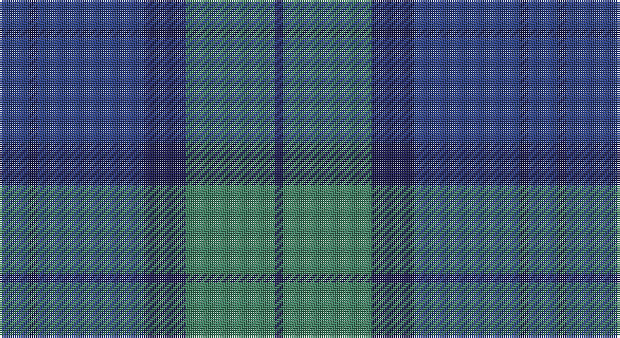

This page is one **sett** — a single exact thread-count. It belongs to the [tartan](/setts/dbi7db2dbi25db10g21db2/)
(the same proportion at any scale), whose colour order is pattern [BBBBGB](/stripes/bbbbgb/).

Sourced from register-of-tartans.  It is a [6 stripe tartan](/stripes/stripes6/).

Original link https://www.tartanregister.gov.uk/tartanDetails.aspx?ref=10639

## Provenance

Earliest known date: 01/04/2012 The tartan design has long been used on the school bags used by middle and high school students at Sugiyama Jogakuen University. The tartan design has been used as the motif on various other items that are used at the school, such as our carrier bag, in order to promote a sense of attachment and affinity when using the items.

## Also known as

This cloth is also recorded under:

- Sugiyama Jogakuen University

3 attestations — the source records this cloth was collapsed from (oldest owns this page)

<ul>
<li>01/04/2012 — Sugiyama (register-of-tartans, <a href="https://www.tartanregister.gov.uk/tartanDetails.aspx?ref=10639">record</a>)</li>
<li>01/04/2012 — Sugiyama Jogakuen University (Corp) (tartans-authority, <a href="http://www.tartansauthority.com/tartan-ferret/display/10639/">record</a>)</li>
<li>undated — Sugiyama Corporate Tartan (house-of-tartan, <a href="http://www.house-of-tartan.scotland.net/house/TartanViewjs.asp?colr=Def&tnam=10639">record</a>)</li>
</ul>

## Register references

External register numbers recorded for this tartan.

- Scottish Register of Tartans: [10639](https://www.tartanregister.gov.uk/tartanDetails?ref=10639)
- Scottish Tartans Authority (ITI): 10639

## Thread count
B/14 DB4 B50 DB20 G42 DB/4

One full sett is **250 threads**.

## Palette

Palette: <strong>Tartan Register</strong>
<table><thead><tr><th>Colour</th><th>Threads</th><th>Shade</th><th>Base</th><th>OKLCh</th></tr></thead><tbody><tr><td>B/</td><td style="text-align:right;font-variant-numeric:tabular-nums">14</td><td><code style="background-color:#2C4084;">#2C4084</code> <small style="color:#888">#2C4084</small></td><td>B <code style="background-color:#2A418A;">#2A418A</code></td><td><small style="color:#888">oklch(39.4% 0.117 268.3)</small></td></tr><tr><td>DB</td><td style="text-align:right;font-variant-numeric:tabular-nums">4</td><td><code style="background-color:#1C1C50;">#1C1C50</code> <small style="color:#888">#1C1C50</small></td><td>B <code style="background-color:#2A418A;">#2A418A</code></td><td><small style="color:#888">oklch(26.2% 0.093 277.9)</small></td></tr><tr><td>B</td><td style="text-align:right;font-variant-numeric:tabular-nums">50</td><td><code style="background-color:#2C4084;">#2C4084</code> <small style="color:#888">#2C4084</small></td><td>B <code style="background-color:#2A418A;">#2A418A</code></td><td><small style="color:#888">oklch(39.4% 0.117 268.3)</small></td></tr><tr><td>DB</td><td style="text-align:right;font-variant-numeric:tabular-nums">20</td><td><code style="background-color:#1C1C50;">#1C1C50</code> <small style="color:#888">#1C1C50</small></td><td>B <code style="background-color:#2A418A;">#2A418A</code></td><td><small style="color:#888">oklch(26.2% 0.093 277.9)</small></td></tr><tr><td>G</td><td style="text-align:right;font-variant-numeric:tabular-nums">42</td><td><code style="background-color:#408060;">#408060</code> <small style="color:#888">#408060</small></td><td>G <code style="background-color:#006100;">#006100</code></td><td><small style="color:#888">oklch(54.8% 0.084 160.1)</small></td></tr><tr><td>DB/</td><td style="text-align:right;font-variant-numeric:tabular-nums">4</td><td><code style="background-color:#1C1C50;">#1C1C50</code> <small style="color:#888">#1C1C50</small></td><td>B <code style="background-color:#2A418A;">#2A418A</code></td><td><small style="color:#888">oklch(26.2% 0.093 277.9)</small></td></tr></tbody></table>

# Sample pattern

## Nearest tartans

The nearest existing variants by ΔTartan distance, with this tartan at the top so the swatches line up against it.

ΔTartan

Tartan

Sett

—

<a href="/ttd/edit/#slug=dbi7db2dbi25db10g21db2~x2">Sugiyama</a> <a class="nn-out" href="/variants/s6/dbi7db2dbi25db10g21db2~x2/" title="open its dictionary page">↗</a>

1.13

<a href="/ttd/edit/#slug=dg10db2dg2db6t5db1t2~x2&amp;base=dbi7db2dbi25db10g21db2~x2">Unidentified No 17</a> <a class="nn-out" href="/variants/s7/dg10db2dg2db6t5db1t2~x2/" title="open its dictionary page">↗</a>

1.30

<a href="/ttd/edit/#slug=dg4db1dg12db12w1db4~x2&amp;base=dbi7db2dbi25db10g21db2~x2">Unidentified Tweed</a> <a class="nn-out" href="/variants/s6/dg4db1dg12db12w1db4~x2/" title="open its dictionary page">↗</a>

1.43

<a href="/ttd/edit/#slug=db20dy2db2dy2db2dy6g15dy2~x2&amp;base=dbi7db2dbi25db10g21db2~x2">Gammell (Brown) (Personal)</a> <a class="nn-out" href="/variants/s8/db20dy2db2dy2db2dy6g15dy2~x2/" title="open its dictionary page">↗</a>

1.44

<a href="/ttd/edit/#slug=t8r3dbi29db29t4~x2&amp;base=dbi7db2dbi25db10g21db2~x2">Bryson</a> <a class="nn-out" href="/variants/s5/t8r3dbi29db29t4~x2/" title="open its dictionary page">↗</a>

1.48

<a href="/ttd/edit/#slug=g15dt2w2dt11n28dt4~x2&amp;base=dbi7db2dbi25db10g21db2~x2">Rhode Island, The State of</a> <a class="nn-out" href="/variants/s6/g15dt2w2dt11n28dt4~x2/" title="open its dictionary page">↗</a>

1.53

<a href="/ttd/edit/#slug=r2y23db11b22r2~x2&amp;base=dbi7db2dbi25db10g21db2~x2">Skibo (Corporate)</a> <a class="nn-out" href="/variants/s5/r2y23db11b22r2~x2/" title="open its dictionary page">↗</a>

1.60

<a href="/ttd/edit/#slug=db11dg2db15dg18w2~x2&amp;base=dbi7db2dbi25db10g21db2~x2">Hamilton Hunting</a> <a class="nn-out" href="/variants/s5/db11dg2db15dg18w2~x2/" title="open its dictionary page">↗</a>

1.62

<a href="/ttd/edit/#slug=db19k4dr1k4dg9dr1~x4&amp;base=dbi7db2dbi25db10g21db2~x2">Monarchs</a> <a class="nn-out" href="/variants/s6/db19k4dr1k4dg9dr1~x4/" title="open its dictionary page">↗</a>

1.65

<a href="/ttd/edit/#slug=dt3t14dt3o16dt34r3~x2&amp;base=dbi7db2dbi25db10g21db2~x2">Thorburn (Lochcarron)</a> <a class="nn-out" href="/variants/s6/dt3t14dt3o16dt34r3~x2/" title="open its dictionary page">↗</a>

1.66

<a href="/ttd/edit/#slug=g8w3n6db11n30db5~x2&amp;base=dbi7db2dbi25db10g21db2~x2">Devlin, Craig (Personal)</a> <a class="nn-out" href="/variants/s6/g8w3n6db11n30db5~x2/" title="open its dictionary page">↗</a>

## Neighbour map

Every grey dot is one of 14360 variants placed by the first two principal components of the ΔTartan feature space (44% of its variance). Red is this tartan; blue dots are its nearest — click one to open its page.

<svg viewBox="0 0 640 380" role="img" style="max-width:100%;height:auto;border:1px solid #e0e0e0;border-radius:4px;display:block" xmlns="http://www.w3.org/2000/svg"><image href="/nn/cloud.v1.png" width="640" height="380"/><a href="/variants/s7/dg10db2dg2db6t5db1t2~x2/"><circle cx="309.5" cy="278.0" r="4" fill="#3465a4"><title>Unidentified No 17</title></circle></a><a href="/variants/s6/dg4db1dg12db12w1db4~x2/"><circle cx="385.7" cy="270.2" r="4" fill="#3465a4"><title>Unidentified Tweed</title></circle></a><a href="/variants/s8/db20dy2db2dy2db2dy6g15dy2~x2/"><circle cx="340.6" cy="239.6" r="4" fill="#3465a4"><title>Gammell (Brown) (Personal)</title></circle></a><a href="/variants/s5/t8r3dbi29db29t4~x2/"><circle cx="283.8" cy="263.1" r="4" fill="#3465a4"><title>Bryson</title></circle></a><a href="/variants/s6/g15dt2w2dt11n28dt4~x2/"><circle cx="299.3" cy="223.5" r="4" fill="#3465a4"><title>Rhode Island, The State of</title></circle></a><a href="/variants/s5/r2y23db11b22r2~x2/"><circle cx="291.1" cy="268.8" r="4" fill="#3465a4"><title>Skibo (Corporate)</title></circle></a><a href="/variants/s5/db11dg2db15dg18w2~x2/"><circle cx="365.8" cy="292.4" r="4" fill="#3465a4"><title>Hamilton Hunting</title></circle></a><a href="/variants/s6/db19k4dr1k4dg9dr1~x4/"><circle cx="381.0" cy="233.2" r="4" fill="#3465a4"><title>Monarchs</title></circle></a><a href="/variants/s6/dt3t14dt3o16dt34r3~x2/"><circle cx="332.7" cy="226.1" r="4" fill="#3465a4"><title>Thorburn (Lochcarron)</title></circle></a><a href="/variants/s6/g8w3n6db11n30db5~x2/"><circle cx="357.4" cy="242.8" r="4" fill="#3465a4"><title>Devlin, Craig (Personal)</title></circle></a><circle cx="345.7" cy="268.0" r="5" fill="#c00000"/></svg>

ID: /variants/s6/dbi7db2dbi25db10g21db2~x2/
