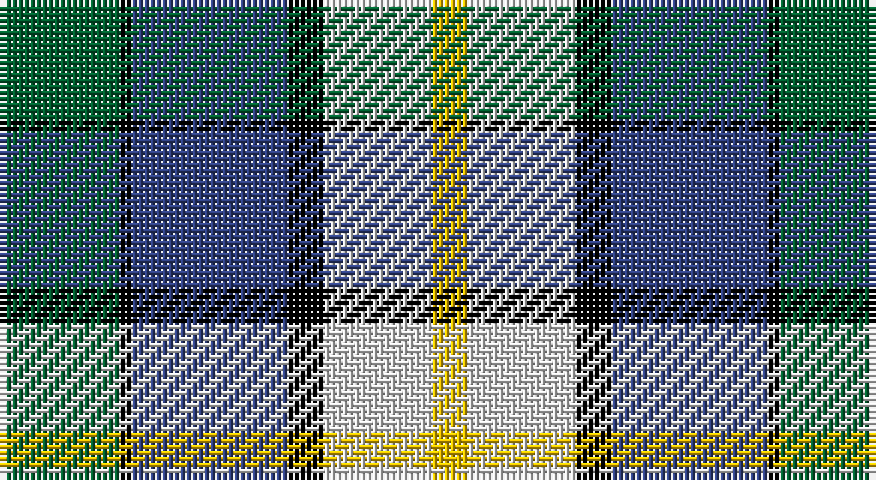

This page is one **sett** — a single exact thread-count. It belongs to the [tartan](/setts/dg10k1db13k3w9ly3/)
(the same proportion at any scale), whose colour order is pattern [GKBKWY](/stripes/gkbkwy/).

Part of the [Inverary](/tartans/inverary/) tartan — the named design grouping this sett with its other cloths.

Sourced from weddslist.  It is a [6 stripe tartan](/stripes/stripes6/).

Original link http://www.weddslist.com/cgi-bin/tartans/pg.pl?source=sts

## Thread count
G/20 K2 B26 K6 LN18 Y/6

One full sett is **130 threads**.

## Palette

Palette: <strong>Tartan Register</strong> <small style="color:#888">(2 of 5 colours)</small>
<table><thead><tr><th>Colour</th><th>Threads</th><th>Shade</th><th>Base</th><th>OKLCh</th></tr></thead><tbody><tr><td>G/</td><td style="text-align:right;font-variant-numeric:tabular-nums">20</td><td><code style="background-color:#006030;">#006030</code> <small style="color:#888">#006030</small></td><td>G <code style="background-color:#006100;">#006100</code></td><td><small style="color:#888">oklch(42.9% 0.111 152.8)</small></td></tr><tr><td>K</td><td style="text-align:right;font-variant-numeric:tabular-nums">2</td><td><code style="background-color:#000000;">#000000</code> <small style="color:#888">#000000</small></td><td>K <code style="background-color:#000000;">#000000</code></td><td><small style="color:#888">oklch(0.0% 0.000 0.0)</small></td></tr><tr><td>B</td><td style="text-align:right;font-variant-numeric:tabular-nums">26</td><td><code style="background-color:#304080;">#304080</code> <small style="color:#888">#304080</small></td><td>B <code style="background-color:#2A418A;">#2A418A</code></td><td><small style="color:#888">oklch(39.4% 0.109 270.2)</small></td></tr><tr><td>K</td><td style="text-align:right;font-variant-numeric:tabular-nums">6</td><td><code style="background-color:#000000;">#000000</code> <small style="color:#888">#000000</small></td><td>K <code style="background-color:#000000;">#000000</code></td><td><small style="color:#888">oklch(0.0% 0.000 0.0)</small></td></tr><tr><td>LN</td><td style="text-align:right;font-variant-numeric:tabular-nums">18</td><td><code style="background-color:#E0E0E0;">#E0E0E0</code> <small style="color:#888">#E0E0E0</small></td><td>W <code style="background-color:#F7F7F7;">#F7F7F7</code></td><td><small style="color:#888">oklch(90.7% 0.000 89.9)</small></td></tr><tr><td>Y/</td><td style="text-align:right;font-variant-numeric:tabular-nums">6</td><td><code style="background-color:#F0C000;">#F0C000</code> <small style="color:#888">#F0C000</small></td><td>Y <code style="background-color:#F2BF00;">#F2BF00</code></td><td><small style="color:#888">oklch(82.7% 0.169 90.5)</small></td></tr></tbody></table>

# Sample pattern

## Compared to the master

This cloth is one sett of its design; the master sett (the exemplar the design is anchored on) is below for comparison.

<figure style="margin:0"><figcaption style="color:#888;font-size:smaller">this sett</figcaption></figure>
<figure style="margin:0"><figcaption style="color:#888;font-size:smaller"><a href="/setts/y10k1db13k3lb9lo3/">master sett →</a></figcaption></figure>

## Nearest tartans

The nearest existing variants by ΔTartan distance, with this tartan at the top so the swatches line up against it.

ΔTartan

Tartan

Sett

—

<a href="/ttd/edit/#slug=dg10k1db13k3w9ly3~x2">Inverary</a> <a class="nn-out" href="/variants/s6/dg10k1db13k3w9ly3~x2/" title="open its dictionary page">↗</a>

0.19

<a href="/ttd/edit/#slug=g10k1db13k3w9ly3~x2&amp;base=dg10k1db13k3w9ly3~x2">Inverary Clan Tartan</a> <a class="nn-out" href="/variants/s6/g10k1db13k3w9ly3~x2/" title="open its dictionary page">↗</a>

0.76

<a href="/ttd/edit/#slug=y10k1db13k3lb9lo3~x2&amp;base=dg10k1db13k3w9ly3~x2">Inverary</a> <a class="nn-out" href="/variants/s6/y10k1db13k3lb9lo3~x2/" title="open its dictionary page">↗</a>

0.84

<a href="/ttd/edit/#slug=db8w33k15dg17t3dg17t3~x2&amp;base=dg10k1db13k3w9ly3~x2">MacRobart Dress (Personal)</a> <a class="nn-out" href="/variants/s7/db8w33k15dg17t3dg17t3~x2/" title="open its dictionary page">↗</a>

1.15

<a href="/ttd/edit/#slug=k4lb2db5lb7db9g14o4g1o4~x2&amp;base=dg10k1db13k3w9ly3~x2">Antigonish Centennial</a> <a class="nn-out" href="/variants/s9/k4lb2db5lb7db9g14o4g1o4~x2/" title="open its dictionary page">↗</a>

1.16

<a href="/ttd/edit/#slug=db8w33k15g17t3g17t3~x2&amp;base=dg10k1db13k3w9ly3~x2">MacRobart, dress</a> <a class="nn-out" href="/variants/s7/db8w33k15g17t3g17t3~x2/" title="open its dictionary page">↗</a>

1.19

<a href="/ttd/edit/#slug=b4ly2b16db15g16w3g3w4~x2&amp;base=dg10k1db13k3w9ly3~x2">Business Air</a> <a class="nn-out" href="/variants/s8/b4ly2b16db15g16w3g3w4~x2/" title="open its dictionary page">↗</a>

1.19

<a href="/ttd/edit/#slug=db6w10g10r2ly3r1db3~x2&amp;base=dg10k1db13k3w9ly3~x2">Ainslie, Lake</a> <a class="nn-out" href="/variants/s7/db6w10g10r2ly3r1db3~x2/" title="open its dictionary page">↗</a>

1.20

<a href="/ttd/edit/#slug=w6db24k7o11k2ly6~x2&amp;base=dg10k1db13k3w9ly3~x2">Clunie (Name)</a> <a class="nn-out" href="/variants/s6/w6db24k7o11k2ly6~x2/" title="open its dictionary page">↗</a>

1.22

<a href="/ttd/edit/#slug=db49ly12r12ly12dg32w8db3&amp;base=dg10k1db13k3w9ly3~x2">Kuznetsov (2014)</a> <a class="nn-out" href="/variants/s7/db49ly12r12ly12dg32w8db3/" title="open its dictionary page">↗</a>

1.27

<a href="/ttd/edit/#slug=w3b14k12g12k2ly3~x4&amp;base=dg10k1db13k3w9ly3~x2">MacNeil of Barra (Clan)</a> <a class="nn-out" href="/variants/s6/w3b14k12g12k2ly3~x4/" title="open its dictionary page">↗</a>

## Neighbour map

Every grey dot is one of 14360 variants placed by the first two principal components of the ΔTartan feature space (44% of its variance). Red is this tartan; blue dots are its nearest — click one to open its page.

<svg viewBox="0 0 640 380" role="img" style="max-width:100%;height:auto;border:1px solid #e0e0e0;border-radius:4px;display:block" xmlns="http://www.w3.org/2000/svg"><image href="/nn/cloud.v1.png" width="640" height="380"/><a href="/variants/s6/g10k1db13k3w9ly3~x2/"><circle cx="106.5" cy="182.1" r="4" fill="#3465a4"><title>Inverary Clan Tartan</title></circle></a><a href="/variants/s6/y10k1db13k3lb9lo3~x2/"><circle cx="117.1" cy="185.8" r="4" fill="#3465a4"><title>Inverary</title></circle></a><a href="/variants/s7/db8w33k15dg17t3dg17t3~x2/"><circle cx="114.3" cy="175.9" r="4" fill="#3465a4"><title>MacRobart Dress (Personal)</title></circle></a><a href="/variants/s9/k4lb2db5lb7db9g14o4g1o4~x2/"><circle cx="100.2" cy="173.5" r="4" fill="#3465a4"><title>Antigonish Centennial</title></circle></a><a href="/variants/s7/db8w33k15g17t3g17t3~x2/"><circle cx="104.9" cy="173.9" r="4" fill="#3465a4"><title>MacRobart, dress</title></circle></a><a href="/variants/s8/b4ly2b16db15g16w3g3w4~x2/"><circle cx="95.1" cy="182.7" r="4" fill="#3465a4"><title>Business Air</title></circle></a><a href="/variants/s7/db6w10g10r2ly3r1db3~x2/"><circle cx="72.2" cy="172.1" r="4" fill="#3465a4"><title>Ainslie, Lake</title></circle></a><a href="/variants/s6/w6db24k7o11k2ly6~x2/"><circle cx="154.2" cy="177.4" r="4" fill="#3465a4"><title>Clunie (Name)</title></circle></a><a href="/variants/s7/db49ly12r12ly12dg32w8db3/"><circle cx="156.5" cy="153.3" r="4" fill="#3465a4"><title>Kuznetsov (2014)</title></circle></a><a href="/variants/s6/w3b14k12g12k2ly3~x4/"><circle cx="86.3" cy="216.7" r="4" fill="#3465a4"><title>MacNeil of Barra (Clan)</title></circle></a><circle cx="102.9" cy="180.8" r="5" fill="#c00000"/></svg>

ID: /variants/s6/dg10k1db13k3w9ly3~x2/
