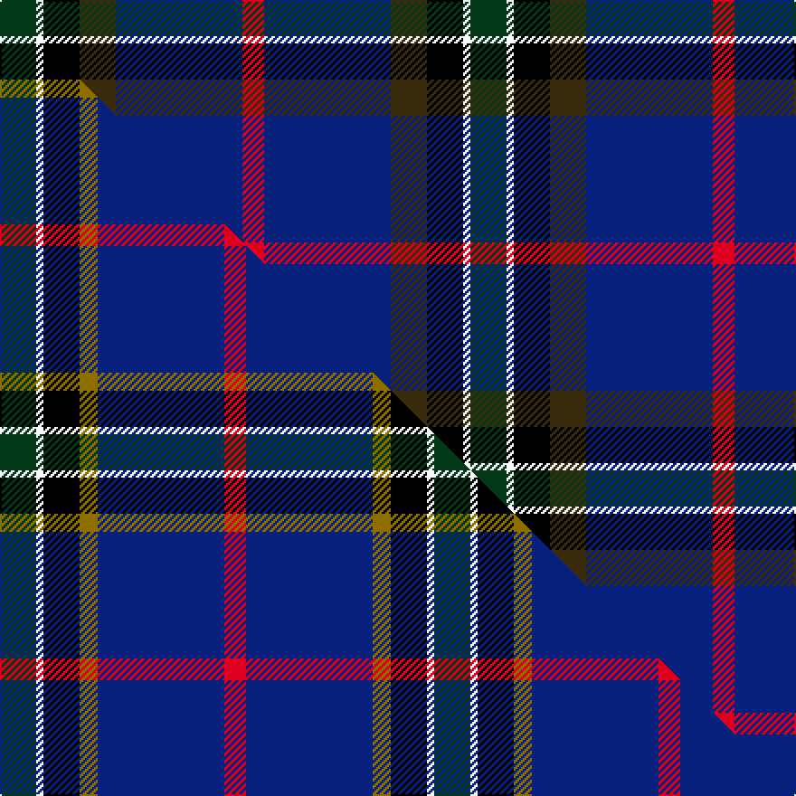

This page is one **sett** — a single exact thread-count. It belongs to the [tartan](/setts/dg10w2k10dy10db35r6/)
(the same proportion at any scale), whose colour order is pattern [GWKGBR](/stripes/gwkgbr/).

Part of the [Hatfield & Mize](/tartans/hatfield-mize/) tartan — the named design grouping this sett with its other cloths.

Sourced from tartans-authority.  It is a [6 stripe tartan](/stripes/stripes6/).

Original link http://www.tartansauthority.com/tartan-ferret/display/10956/

## Register references

External register numbers recorded for this tartan.

- Scottish Register of Tartans: [10956](https://www.tartanregister.gov.uk/tartanDetails?ref=10956)
- Scottish Tartans Authority (ITI): 10956

## Thread count
DG/20 W4 K20 DY20 DB70 R/12

One full sett is **260 threads**.

## Palette
<table><thead><tr><th>Colour</th><th>Shade</th><th>OKLCh</th></tr></thead><tbody><tr><td>DB</td><td><code style="background-color:#082077;">#082077</code> <small style="color:#888">#082077</small></td><td><small style="color:#888">oklch(30.0% 0.149 265.1)</small></td></tr><tr><td>DG</td><td><code style="background-color:#053819;">#053819</code> <small style="color:#888">#053819</small></td><td><small style="color:#888">oklch(30.0% 0.075 151.3)</small></td></tr><tr><td>K</td><td><code style="background-color:#000000;">#000000</code> <small style="color:#888">#000000</small></td><td><small style="color:#888">oklch(0.0% 0.000 0.0)</small></td></tr><tr><td>R</td><td><code style="background-color:#D60020;">#D60020</code> <small style="color:#888">#D60020</small></td><td><small style="color:#888">oklch(55.2% 0.224 25.5)</small></td></tr><tr><td>W</td><td><code style="background-color:#F7F7F7;">#F7F7F7</code> <small style="color:#888">#F7F7F7</small></td><td><small style="color:#888">oklch(97.6% 0.000 89.9)</small></td></tr><tr><td>DY</td><td><code style="background-color:#3A2B0D;">#3A2B0D</code> <small style="color:#888">#3A2B0D</small></td><td><small style="color:#888">oklch(30.0% 0.049 82.0)</small></td></tr></tbody></table>

# Sample pattern

## Compared to the master

This cloth is one sett of its design; the master sett (the exemplar the design is anchored on) is below for comparison.

Its **ΔTartan distance** from the master is **0.74** — the same measure the nearest-tartans table ranks by (0 is identical; a re-scale of the same cloth is near 0, a recolour or a different proportion further).

<figure class="master-compare" style="margin:0">

this sett
master sett ★

<figcaption style="color:#888;font-size:smaller">One weave of this sett against the <a href="/setts/dg10w2k10y5db35r6/">master sett ★</a>, split on the diagonal: a shared proportion runs seamlessly across it with only the shades shifting; a different proportion breaks on it.</figcaption>
</figure>

## Nearest tartan variants

The nearest existing variants by ΔTartan distance, with this cloth at the top so the swatches line up against it.

ΔTartan

Threads

Variant

Sett

—

260

<a href="/variants/s6/dg10w2k10dy10db35r6~x2/">Hatfield &amp; Mize (Personal)</a>

<a href="/ttd/edit/#slug=dg10w2k10y5db35r6~x2&amp;base=dg10w2k10dy10db35r6~x2" title="compare in the TTD">0.13</a>

240

<a href="/variants/s6/dg10w2k10y5db35r6~x2/">Hatfield &amp; Mize (Personal)</a>

<a href="/ttd/edit/#slug=dr3db38k13w3n20dy2~x2&amp;base=dg10w2k10dy10db35r6~x2" title="compare in the TTD">1.19</a>

306

<a href="/variants/s6/dr3db38k13w3n20dy2~x2/">LLoyd of Astargus Canadian Family Tartan</a>

<a href="/ttd/edit/#slug=k26n10dt19dr6dy2db9~x2~dt1502222-db1704245&amp;base=dg10w2k10dy10db35r6~x2" title="compare in the TTD">1.37</a>

218

<a href="/variants/s6/k26n10dt19dr6dy2db9~x2~dt1502222-db1704245/">Meeson Hunting</a>

<a href="/ttd/edit/#slug=k3dg44db27y6r10w3~x2&amp;base=dg10w2k10dy10db35r6~x2" title="compare in the TTD">1.41</a>

360

<a href="/variants/s6/k3dg44db27y6r10w3~x2/">Official Glasgow 2014, The</a>

<a href="/ttd/edit/#slug=r3db22k11dg32ly3~x2&amp;base=dg10w2k10dy10db35r6~x2" title="compare in the TTD">1.42</a>

272

<a href="/variants/s5/r3db22k11dg32ly3~x2/">Cultoquhey Hotel Corporate Tartan</a>

<a href="/ttd/edit/#slug=dy3db40k35g5w2r3~x2&amp;base=dg10w2k10dy10db35r6~x2" title="compare in the TTD">1.56</a>

340

<a href="/variants/s6/dy3db40k35g5w2r3~x2/">Italian National</a>

<a href="/ttd/edit/#slug=ly4k28r2db22t8dy3~x2&amp;base=dg10w2k10dy10db35r6~x2" title="compare in the TTD">1.66</a>

254

<a href="/variants/s6/ly4k28r2db22t8dy3~x2/">Loch Long One Design (Corporate)</a>

1.68

—

<a href="/variants/s7/r3w2dy10dg37k12db21w2~x2~dy1703114-dg1304144/">Jones, The</a>

<a href="/ttd/edit/#slug=r2k6y1dg12y1db6lb2~x4&amp;base=dg10w2k10dy10db35r6~x2" title="compare in the TTD">1.73</a>

224

<a href="/variants/s7/r2k6y1dg12y1db6lb2~x4/">James (Personal)</a>

<a href="/ttd/edit/#slug=r3db15dbi8g5k2w1~x2~db1004274-dbi1406275&amp;base=dg10w2k10dy10db35r6~x2" title="compare in the TTD">1.90</a>

128

<a href="/variants/s6/r3db15dbi8g5k2w1~x2~db1004274-dbi1406275/">Nicolson of Harris (Clan?)</a>

## Neighbour map

Every grey dot is one of 13620 variants placed by the first two principal components of the ΔTartan feature space (42% of its variance). Red is this tartan; blue dots are its nearest — click one to open its page.

<svg viewBox="0 0 640 380" role="img" style="max-width:100%;height:auto;border:1px solid #e0e0e0;border-radius:4px;display:block" xmlns="http://www.w3.org/2000/svg"><image href="/nn/cloud.v1.png" width="640" height="380"/><a href="/variants/s6/dg10w2k10y5db35r6~x2/"><circle cx="230.0" cy="140.1" r="4" fill="#3465a4"><title>Hatfield &amp; Mize (Personal)</title></circle></a><a href="/variants/s6/dr3db38k13w3n20dy2~x2/"><circle cx="233.5" cy="142.1" r="4" fill="#3465a4"><title>LLoyd of Astargus Canadian Family Tartan</title></circle></a><a href="/variants/s6/k26n10dt19dr6dy2db9~x2~dt1502222-db1704245/"><circle cx="150.9" cy="189.9" r="4" fill="#3465a4"><title>Meeson Hunting</title></circle></a><a href="/variants/s6/k3dg44db27y6r10w3~x2/"><circle cx="232.5" cy="155.2" r="4" fill="#3465a4"><title>Official Glasgow 2014, The</title></circle></a><a href="/variants/s5/r3db22k11dg32ly3~x2/"><circle cx="229.2" cy="205.0" r="4" fill="#3465a4"><title>Cultoquhey Hotel Corporate Tartan</title></circle></a><a href="/variants/s6/dy3db40k35g5w2r3~x2/"><circle cx="234.4" cy="124.9" r="4" fill="#3465a4"><title>Italian National</title></circle></a><a href="/variants/s6/ly4k28r2db22t8dy3~x2/"><circle cx="160.7" cy="146.8" r="4" fill="#3465a4"><title>Loch Long One Design (Corporate)</title></circle></a><a href="/variants/s7/r3w2dy10dg37k12db21w2~x2~dy1703114-dg1304144/"><circle cx="191.5" cy="141.9" r="4" fill="#3465a4"><title>Jones, The</title></circle></a><a href="/variants/s7/r2k6y1dg12y1db6lb2~x4/"><circle cx="145.6" cy="157.6" r="4" fill="#3465a4"><title>James (Personal)</title></circle></a><a href="/variants/s6/r3db15dbi8g5k2w1~x2~db1004274-dbi1406275/"><circle cx="195.2" cy="162.7" r="4" fill="#3465a4"><title>Nicolson of Harris (Clan?)</title></circle></a><circle cx="220.8" cy="154.2" r="5" fill="#c00000"/><text x="320" y="376" text-anchor="middle" font-size="11" fill="#999">ground</text><text x="11" y="190" text-anchor="middle" font-size="11" fill="#999" transform="rotate(-90 11 190)">complexity</text></svg>

ID: /variants/s6/dg10w2k10dy10db35r6~x2/
