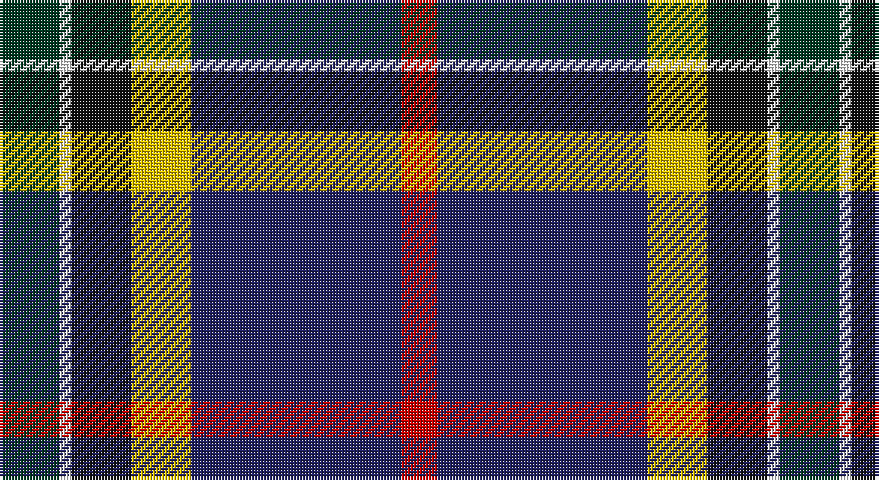

This page is one **sett** — a single exact thread-count. It belongs to the [tartan](/setts/dg10w2k10ly10db35r6/)
(the same proportion at any scale), whose colour order is pattern [GWKYBR](/stripes/gwkybr/).

Part of the [Hatfield & Mize](/tartans/hatfield-mize/) tartan — the named design grouping this sett with its other cloths.

Sourced from tartans-authority.  It is a [6 stripe tartan](/stripes/stripes6/).

Original link http://www.tartansauthority.com/tartan-ferret/display/10956/

## Register references

External register numbers recorded for this tartan.

- Scottish Register of Tartans: [10956](https://www.tartanregister.gov.uk/tartanDetails?ref=10956)
- Scottish Tartans Authority (ITI): 10956

## Thread count
DG/20 W4 K20 Y20 DB70 R/12

One full sett is **260 threads**.

## Palette

Palette: <strong>Tartan Register</strong>
<table><thead><tr><th>Colour</th><th>Threads</th><th>Shade</th><th>Base</th><th>OKLCh</th></tr></thead><tbody><tr><td>DG/</td><td style="text-align:right;font-variant-numeric:tabular-nums">20</td><td><code style="background-color:#003820;">#003820</code> <small style="color:#888">#003820</small></td><td>G <code style="background-color:#006100;">#006100</code></td><td><small style="color:#888">oklch(30.0% 0.070 158.3)</small></td></tr><tr><td>W</td><td style="text-align:right;font-variant-numeric:tabular-nums">4</td><td><code style="background-color:#FCFCFC;">#FCFCFC</code> <small style="color:#888">#FCFCFC</small></td><td>W <code style="background-color:#F7F7F7;">#F7F7F7</code></td><td><small style="color:#888">oklch(99.1% 0.000 89.9)</small></td></tr><tr><td>K</td><td style="text-align:right;font-variant-numeric:tabular-nums">20</td><td><code style="background-color:#101010;">#101010</code> <small style="color:#888">#101010</small></td><td>K <code style="background-color:#000000;">#000000</code></td><td><small style="color:#888">oklch(17.3% 0.000 89.9)</small></td></tr><tr><td>Y</td><td style="text-align:right;font-variant-numeric:tabular-nums">20</td><td><code style="background-color:#E8C000;">#E8C000</code> <small style="color:#888">#E8C000</small></td><td>Y <code style="background-color:#F2BF00;">#F2BF00</code></td><td><small style="color:#888">oklch(81.9% 0.168 93.7)</small></td></tr><tr><td>DB</td><td style="text-align:right;font-variant-numeric:tabular-nums">70</td><td><code style="background-color:#202060;">#202060</code> <small style="color:#888">#202060</small></td><td>B <code style="background-color:#2A418A;">#2A418A</code></td><td><small style="color:#888">oklch(28.9% 0.111 276.9)</small></td></tr><tr><td>R/</td><td style="text-align:right;font-variant-numeric:tabular-nums">12</td><td><code style="background-color:#C80000;">#C80000</code> <small style="color:#888">#C80000</small></td><td>R <code style="background-color:#CC0000;">#CC0000</code></td><td><small style="color:#888">oklch(52.3% 0.215 29.2)</small></td></tr></tbody></table>

# Sample pattern

## Compared to the master

This cloth is one sett of its design; the master sett (the exemplar the design is anchored on) is below for comparison.

<figure style="margin:0"><figcaption style="color:#888;font-size:smaller">this sett</figcaption></figure>
<figure style="margin:0"><figcaption style="color:#888;font-size:smaller"><a href="/setts/dg10w2dt10lo5db35r6/">master sett →</a></figcaption></figure>

## Nearest tartans

The nearest existing variants by ΔTartan distance, with this tartan at the top so the swatches line up against it.

ΔTartan

Tartan

Sett

—

<a href="/ttd/edit/#slug=dg10w2k10ly10db35r6~x2">Hatfield &amp; Mize (Personal)</a> <a class="nn-out" href="/variants/s6/dg10w2k10ly10db35r6~x2/" title="open its dictionary page">↗</a>

0.85

<a href="/ttd/edit/#slug=r3db38k13w3o20ly2~x2&amp;base=dg10w2k10ly10db35r6~x2">LLoyd of Astargus Canadian Family Tartan</a> <a class="nn-out" href="/variants/s6/r3db38k13w3o20ly2~x2/" title="open its dictionary page">↗</a>

0.99

<a href="/variants/s6/t12dp35lr4w3ki11k5~x2/">Ferster, James Carney</a>

1.01

<a href="/ttd/edit/#slug=dg10w2dt10lo5db35r6~x2&amp;base=dg10w2k10ly10db35r6~x2">Hatfield &amp; Mize (Personal)</a> <a class="nn-out" href="/variants/s6/dg10w2dt10lo5db35r6~x2/" title="open its dictionary page">↗</a>

1.06

<a href="/ttd/edit/#slug=ly4g22r3k17r3db37w3~x2&amp;base=dg10w2k10ly10db35r6~x2">Souza Nery (Personal)</a> <a class="nn-out" href="/variants/s7/ly4g22r3k17r3db37w3~x2/" title="open its dictionary page">↗</a>

1.11

<a href="/ttd/edit/#slug=lo3k2o15k10dt23r2dt1w2~x2&amp;base=dg10w2k10ly10db35r6~x2">Vienna Highlander (Fashion)</a> <a class="nn-out" href="/variants/s8/lo3k2o15k10dt23r2dt1w2~x2/" title="open its dictionary page">↗</a>

1.12

<a href="/ttd/edit/#slug=lo11k66o32dg11o10db6o10loi4&amp;base=dg10w2k10ly10db35r6~x2">Royal College of General Practitioners</a> <a class="nn-out" href="/variants/s8/lo11k66o32dg11o10db6o10loi4/" title="open its dictionary page">↗</a>

1.14

<a href="/ttd/edit/#slug=k45lo10g7r3w4db13w9r6~x2&amp;base=dg10w2k10ly10db35r6~x2">Legion of Frontiersmen (Corporate)</a> <a class="nn-out" href="/variants/s8/k45lo10g7r3w4db13w9r6~x2/" title="open its dictionary page">↗</a>

1.14

<a href="/ttd/edit/#slug=o11k66y32dg11y10db6y10r4&amp;base=dg10w2k10ly10db35r6~x2">Turnbull, Dress Bruce (Personal)</a> <a class="nn-out" href="/variants/s8/o11k66y32dg11y10db6y10r4/" title="open its dictionary page">↗</a>

1.20

<a href="/ttd/edit/#slug=w12db48k13o22k3ly6&amp;base=dg10w2k10ly10db35r6~x2">Clunie (Personal)</a> <a class="nn-out" href="/variants/s6/w12db48k13o22k3ly6/" title="open its dictionary page">↗</a>

1.21

<a href="/ttd/edit/#slug=p4db2t8db25k8g13ly4~x2&amp;base=dg10w2k10ly10db35r6~x2">Renfrewshire Tartan</a> <a class="nn-out" href="/variants/s7/p4db2t8db25k8g13ly4~x2/" title="open its dictionary page">↗</a>

## Neighbour map

Every grey dot is one of 14360 variants placed by the first two principal components of the ΔTartan feature space (44% of its variance). Red is this tartan; blue dots are its nearest — click one to open its page.

<svg viewBox="0 0 640 380" role="img" style="max-width:100%;height:auto;border:1px solid #e0e0e0;border-radius:4px;display:block" xmlns="http://www.w3.org/2000/svg"><image href="/nn/cloud.v1.png" width="640" height="380"/><a href="/variants/s6/r3db38k13w3o20ly2~x2/"><circle cx="236.4" cy="146.3" r="4" fill="#3465a4"><title>LLoyd of Astargus Canadian Family Tartan</title></circle></a><a href="/variants/s6/t12dp35lr4w3ki11k5~x2/"><circle cx="222.4" cy="168.0" r="4" fill="#3465a4"><title>Ferster, James Carney</title></circle></a><a href="/variants/s6/dg10w2dt10lo5db35r6~x2/"><circle cx="254.0" cy="157.2" r="4" fill="#3465a4"><title>Hatfield &amp; Mize (Personal)</title></circle></a><a href="/variants/s7/ly4g22r3k17r3db37w3~x2/"><circle cx="176.0" cy="156.3" r="4" fill="#3465a4"><title>Souza Nery (Personal)</title></circle></a><a href="/variants/s8/lo3k2o15k10dt23r2dt1w2~x2/"><circle cx="201.4" cy="119.9" r="4" fill="#3465a4"><title>Vienna Highlander (Fashion)</title></circle></a><a href="/variants/s8/lo11k66o32dg11o10db6o10loi4/"><circle cx="205.6" cy="127.1" r="4" fill="#3465a4"><title>Royal College of General Practitioners</title></circle></a><a href="/variants/s8/k45lo10g7r3w4db13w9r6~x2/"><circle cx="182.2" cy="122.1" r="4" fill="#3465a4"><title>Legion of Frontiersmen (Corporate)</title></circle></a><a href="/variants/s8/o11k66y32dg11y10db6y10r4/"><circle cx="218.5" cy="134.3" r="4" fill="#3465a4"><title>Turnbull, Dress Bruce (Personal)</title></circle></a><a href="/variants/s6/w12db48k13o22k3ly6/"><circle cx="197.0" cy="161.4" r="4" fill="#3465a4"><title>Clunie (Personal)</title></circle></a><a href="/variants/s7/p4db2t8db25k8g13ly4~x2/"><circle cx="149.0" cy="165.5" r="4" fill="#3465a4"><title>Renfrewshire Tartan</title></circle></a><circle cx="201.6" cy="149.7" r="5" fill="#c00000"/></svg>

ID: /variants/s6/dg10w2k10ly10db35r6~x2/
