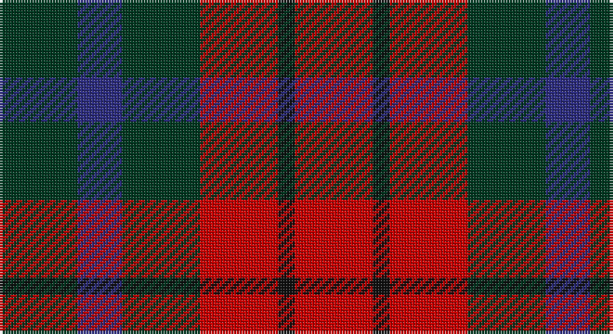

This page is one **sett** — a single exact thread-count. It belongs to the [tartan](/setts/dg14db8dg14r14k3r14/)
(the same proportion at any scale), whose colour order is pattern [GBGRKR](/stripes/gbgrkr/).

Sourced from register-of-tartans.  It is a [6 stripe tartan](/stripes/stripes6/).

Original link https://www.tartanregister.gov.uk/tartanDetails.aspx?ref=4155

2 attestations — the source records this cloth was collapsed from (oldest owns this page)

<ul>
<li>01/01/1978 — Tulsa, City of (register-of-tartans, <a href="https://www.tartanregister.gov.uk/tartanDetails.aspx?ref=4155">record</a>)</li>
<li>1978 — Tulsa, City of (District) (tartans-authority, <a href="http://www.tartansauthority.com/tartan-ferret/display/712/">record</a>)</li>
</ul>

## Register references

External register numbers recorded for this tartan.

- Scottish Register of Tartans: [4155](https://www.tartanregister.gov.uk/tartanDetails.aspx?ref=4155)
- Scottish Tartans Authority (ITI): 712
- Scottish Tartans World Register: 712

## Thread count
DG/28 DB16 DG28 R28 K6 R/28

One full sett is **212 threads**.

## Palette

Palette: <strong>Tartan Register</strong>
<table><thead><tr><th>Colour</th><th>Threads</th><th>Shade</th><th>Base</th><th>OKLCh</th></tr></thead><tbody><tr><td>DG/</td><td style="text-align:right;font-variant-numeric:tabular-nums">28</td><td><code style="background-color:#003820;">#003820</code> <small style="color:#888">#003820</small></td><td>G <code style="background-color:#006100;">#006100</code></td><td><small style="color:#888">oklch(30.0% 0.070 158.3)</small></td></tr><tr><td>DB</td><td style="text-align:right;font-variant-numeric:tabular-nums">16</td><td><code style="background-color:#2C2C80;">#2C2C80</code> <small style="color:#888">#2C2C80</small></td><td>B <code style="background-color:#2A418A;">#2A418A</code></td><td><small style="color:#888">oklch(35.0% 0.138 276.6)</small></td></tr><tr><td>DG</td><td style="text-align:right;font-variant-numeric:tabular-nums">28</td><td><code style="background-color:#003820;">#003820</code> <small style="color:#888">#003820</small></td><td>G <code style="background-color:#006100;">#006100</code></td><td><small style="color:#888">oklch(30.0% 0.070 158.3)</small></td></tr><tr><td>R</td><td style="text-align:right;font-variant-numeric:tabular-nums">28</td><td><code style="background-color:#C80000;">#C80000</code> <small style="color:#888">#C80000</small></td><td>R <code style="background-color:#CC0000;">#CC0000</code></td><td><small style="color:#888">oklch(52.3% 0.215 29.2)</small></td></tr><tr><td>K</td><td style="text-align:right;font-variant-numeric:tabular-nums">6</td><td><code style="background-color:#101010;">#101010</code> <small style="color:#888">#101010</small></td><td>K <code style="background-color:#000000;">#000000</code></td><td><small style="color:#888">oklch(17.3% 0.000 89.9)</small></td></tr><tr><td>R/</td><td style="text-align:right;font-variant-numeric:tabular-nums">28</td><td><code style="background-color:#C80000;">#C80000</code> <small style="color:#888">#C80000</small></td><td>R <code style="background-color:#CC0000;">#CC0000</code></td><td><small style="color:#888">oklch(52.3% 0.215 29.2)</small></td></tr></tbody></table>

# Sample pattern

## Nearest tartans

The nearest existing variants by ΔTartan distance, with this tartan at the top so the swatches line up against it.

ΔTartan

Tartan

Sett

—

<a href="/ttd/edit/#slug=dg14db8dg14r14k3r14~x2">Tulsa, City of</a> <a class="nn-out" href="/variants/s6/dg14db8dg14r14k3r14~x2/" title="open its dictionary page">↗</a>

1.09

<a href="/ttd/edit/#slug=r10db6k8dg10r6dg3r6~x2&amp;base=dg14db8dg14r14k3r14~x2">MacDuff #3</a> <a class="nn-out" href="/variants/s7/r10db6k8dg10r6dg3r6~x2/" title="open its dictionary page">↗</a>

1.21

<a href="/ttd/edit/#slug=dt6k6dt6r14ly3~x2&amp;base=dg14db8dg14r14k3r14~x2">Chivas Regal</a> <a class="nn-out" href="/variants/s5/dt6k6dt6r14ly3~x2/" title="open its dictionary page">↗</a>

1.22

<a href="/variants/s8/r4dg4r1db4r4~x12/">Gow</a>

1.27

<a href="/ttd/edit/#slug=g12r11dp12ri3dp8g8dp8~x2&amp;base=dg14db8dg14r14k3r14~x2">Fiddes (Corrected)</a> <a class="nn-out" href="/variants/s7/g12r11dp12ri3dp8g8dp8~x2/" title="open its dictionary page">↗</a>

1.28

<a href="/ttd/edit/#slug=r14k3r14g13db8g13~x2&amp;base=dg14db8dg14r14k3r14~x2">Tulsa</a> <a class="nn-out" href="/variants/s6/r14k3r14g13db8g13~x2/" title="open its dictionary page">↗</a>

1.30

<a href="/ttd/edit/#slug=dt2k2dt2r5ly1~x12&amp;base=dg14db8dg14r14k3r14~x2">Chivas Regal (Corporate)</a> <a class="nn-out" href="/variants/s5/dt2k2dt2r5ly1~x12/" title="open its dictionary page">↗</a>

1.32

<a href="/variants/s8/dg6dp6y1r6dg6r6y1dp6~x4/">Wilson's No.223</a>

1.36

<a href="/ttd/edit/#slug=db5r17dg16k10db10r17db5~x2&amp;base=dg14db8dg14r14k3r14~x2">MacNaughton (Logan)</a> <a class="nn-out" href="/variants/s7/db5r17dg16k10db10r17db5~x2/" title="open its dictionary page">↗</a>

1.37

<a href="/ttd/edit/#slug=r4dg4r1db4r4&amp;base=dg14db8dg14r14k3r14~x2">Gow</a> <a class="nn-out" href="/variants/s5/r4dg4r1db4r4/" title="open its dictionary page">↗</a>

1.43

<a href="/ttd/edit/#slug=r6g5k5g5r6t1~x4&amp;base=dg14db8dg14r14k3r14~x2">Norwich No.028</a> <a class="nn-out" href="/variants/s6/r6g5k5g5r6t1~x4/" title="open its dictionary page">↗</a>

## Neighbour map

Every grey dot is one of 14360 variants placed by the first two principal components of the ΔTartan feature space (44% of its variance). Red is this tartan; blue dots are its nearest — click one to open its page.

<svg viewBox="0 0 640 380" role="img" style="max-width:100%;height:auto;border:1px solid #e0e0e0;border-radius:4px;display:block" xmlns="http://www.w3.org/2000/svg"><image href="/nn/cloud.v1.png" width="640" height="380"/><a href="/variants/s7/r10db6k8dg10r6dg3r6~x2/"><circle cx="135.7" cy="290.9" r="4" fill="#3465a4"><title>MacDuff #3</title></circle></a><a href="/variants/s5/dt6k6dt6r14ly3~x2/"><circle cx="160.5" cy="269.8" r="4" fill="#3465a4"><title>Chivas Regal</title></circle></a><a href="/variants/s8/r4dg4r1db4r4~x12/"><circle cx="170.5" cy="296.8" r="4" fill="#3465a4"><title>Gow</title></circle></a><a href="/variants/s7/g12r11dp12ri3dp8g8dp8~x2/"><circle cx="149.6" cy="282.5" r="4" fill="#3465a4"><title>Fiddes (Corrected)</title></circle></a><a href="/variants/s6/r14k3r14g13db8g13~x2/"><circle cx="164.7" cy="283.0" r="4" fill="#3465a4"><title>Tulsa</title></circle></a><a href="/variants/s5/dt2k2dt2r5ly1~x12/"><circle cx="175.6" cy="262.7" r="4" fill="#3465a4"><title>Chivas Regal (Corporate)</title></circle></a><a href="/variants/s8/dg6dp6y1r6dg6r6y1dp6~x4/"><circle cx="142.4" cy="256.9" r="4" fill="#3465a4"><title>Wilson's No.223</title></circle></a><a href="/variants/s7/db5r17dg16k10db10r17db5~x2/"><circle cx="130.9" cy="274.8" r="4" fill="#3465a4"><title>MacNaughton (Logan)</title></circle></a><a href="/variants/s5/r4dg4r1db4r4/"><circle cx="238.7" cy="323.9" r="4" fill="#3465a4"><title>Gow</title></circle></a><a href="/variants/s6/r6g5k5g5r6t1~x4/"><circle cx="149.7" cy="267.7" r="4" fill="#3465a4"><title>Norwich No.028</title></circle></a><circle cx="182.0" cy="291.5" r="5" fill="#c00000"/></svg>

ID: /variants/s6/dg14db8dg14r14k3r14~x2/
