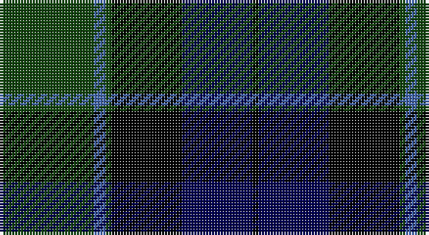

This page is one **sett** — a single exact thread-count. It belongs to the [tartan](/setts/dg16b2dg1k12db12k1/)
(the same proportion at any scale), whose colour order is pattern [GBGKBK](/stripes/gbgkbk/).

Part of the [Graham of Menteith](/tartans/graham-of-menteith/) tartan — the named design grouping this sett with its other cloths.

Sourced from weddslist.  It is a [6 stripe tartan](/stripes/stripes6/).

Original link http://www.weddslist.com/cgi-bin/tartans/pg.pl?source=tinsel

## Also known as

This cloth is also recorded under:

- Graham of Menteith,

2 attestations — the source records this cloth was collapsed from (oldest owns this page)

<ul>
<li>undated — Graham of Menteith (weddslist, <a href="http://www.weddslist.com/cgi-bin/tartans/pg.pl?source=tinsel">record</a>)</li>
<li>undated — Graham of Menteith (weddslist, <a href="http://www.weddslist.com/cgi-bin/tartans/pg.pl?source=x">record</a>)</li>
</ul>

## Thread count
DG/32 B4 DG2 K24 DB24 K/2

One full sett is **142 threads**.

## Palette

Palette: <strong>Ingles Buchan</strong> <small style="color:#888">(1 of 4 colours)</small>
<table><thead><tr><th>Colour</th><th>Threads</th><th>Shade</th><th>Base</th><th>OKLCh</th></tr></thead><tbody><tr><td>DG/</td><td style="text-align:right;font-variant-numeric:tabular-nums">32</td><td><code style="background-color:#11450D;">#11450D</code> <small style="color:#888">#11450D</small></td><td>G <code style="background-color:#006100;">#006100</code></td><td><small style="color:#888">oklch(34.4% 0.101 142.1)</small></td></tr><tr><td>B</td><td style="text-align:right;font-variant-numeric:tabular-nums">4</td><td><code style="background-color:#4367AE;">#4367AE</code> <small style="color:#888">#4367AE</small></td><td>B <code style="background-color:#2A418A;">#2A418A</code></td><td><small style="color:#888">oklch(52.2% 0.120 262.7)</small></td></tr><tr><td>DG</td><td style="text-align:right;font-variant-numeric:tabular-nums">2</td><td><code style="background-color:#11450D;">#11450D</code> <small style="color:#888">#11450D</small></td><td>G <code style="background-color:#006100;">#006100</code></td><td><small style="color:#888">oklch(34.4% 0.101 142.1)</small></td></tr><tr><td>K</td><td style="text-align:right;font-variant-numeric:tabular-nums">24</td><td><code style="background-color:#000000;">#000000</code> <small style="color:#888">#000000</small></td><td>K <code style="background-color:#000000;">#000000</code></td><td><small style="color:#888">oklch(0.0% 0.000 0.0)</small></td></tr><tr><td>DB</td><td style="text-align:right;font-variant-numeric:tabular-nums">24</td><td><code style="background-color:#000052;">#000052</code> <small style="color:#888">#000052</small></td><td>B <code style="background-color:#2A418A;">#2A418A</code></td><td><small style="color:#888">oklch(19.8% 0.137 264.1)</small></td></tr><tr><td>K/</td><td style="text-align:right;font-variant-numeric:tabular-nums">2</td><td><code style="background-color:#000000;">#000000</code> <small style="color:#888">#000000</small></td><td>K <code style="background-color:#000000;">#000000</code></td><td><small style="color:#888">oklch(0.0% 0.000 0.0)</small></td></tr></tbody></table>

# Sample pattern

## Compared to the master

This cloth is one sett of its design; the master sett (the exemplar the design is anchored on) is below for comparison.

<figure style="margin:0"><figcaption style="color:#888;font-size:smaller">this sett</figcaption></figure>
<figure style="margin:0"><figcaption style="color:#888;font-size:smaller"><a href="/setts/g8b1g1k6db6k1/">master sett →</a></figcaption></figure>

## Nearest tartans

The nearest existing variants by ΔTartan distance, with this tartan at the top so the swatches line up against it.

ΔTartan

Tartan

Sett

—

<a href="/ttd/edit/#slug=dg16b2dg1k12db12k1~x2">Graham of Menteith</a> <a class="nn-out" href="/variants/s6/dg16b2dg1k12db12k1~x2/" title="open its dictionary page">↗</a>

0.60

<a href="/ttd/edit/#slug=dg2db12dg1k12dg12r2~x2&amp;base=dg16b2dg1k12db12k1~x2">Gunn</a> <a class="nn-out" href="/variants/s6/dg2db12dg1k12dg12r2~x2/" title="open its dictionary page">↗</a>

0.74

<a href="/ttd/edit/#slug=dg2db12dg1k12dg12r2&amp;base=dg16b2dg1k12db12k1~x2">Gunn</a> <a class="nn-out" href="/variants/s6/dg2db12dg1k12dg12r2/" title="open its dictionary page">↗</a>

0.81

<a href="/ttd/edit/#slug=r3k2dg25k28db25k2r3~x2&amp;base=dg16b2dg1k12db12k1~x2">Coarse Kilt</a> <a class="nn-out" href="/variants/s7/r3k2dg25k28db25k2r3~x2/" title="open its dictionary page">↗</a>

0.93

<a href="/ttd/edit/#slug=dg5dp3dg32k16db32dp3db5&amp;base=dg16b2dg1k12db12k1~x2">MacThomas LC</a> <a class="nn-out" href="/variants/s7/dg5dp3dg32k16db32dp3db5/" title="open its dictionary page">↗</a>

0.93

<a href="/ttd/edit/#slug=dg14lr1dg7k7db2k2db2k2db14~x2&amp;base=dg16b2dg1k12db12k1~x2">Abercrombie D</a> <a class="nn-out" href="/variants/s9/dg14lr1dg7k7db2k2db2k2db14~x2/" title="open its dictionary page">↗</a>

0.93

<a href="/ttd/edit/#slug=dg14lr1dg7k7db2k2db2k2db14&amp;base=dg16b2dg1k12db12k1~x2">Abercrombie D</a> <a class="nn-out" href="/variants/s9/dg14lr1dg7k7db2k2db2k2db14/" title="open its dictionary page">↗</a>

0.95

<a href="/ttd/edit/#slug=k4db16k12dg24r1dg2k2~x2&amp;base=dg16b2dg1k12db12k1~x2">Dundas</a> <a class="nn-out" href="/variants/s7/k4db16k12dg24r1dg2k2~x2/" title="open its dictionary page">↗</a>

1.01

<a href="/ttd/edit/#slug=dg3dr2dg21k11db21dr2db3~x2&amp;base=dg16b2dg1k12db12k1~x2">MacThomas</a> <a class="nn-out" href="/variants/s7/dg3dr2dg21k11db21dr2db3~x2/" title="open its dictionary page">↗</a>

1.01

<a href="/ttd/edit/#slug=dg3dr2dg21k11db21dr2db3&amp;base=dg16b2dg1k12db12k1~x2">MacThomas</a> <a class="nn-out" href="/variants/s7/dg3dr2dg21k11db21dr2db3/" title="open its dictionary page">↗</a>

1.06

<a href="/ttd/edit/#slug=r2g12k12g1db12g2~x2&amp;base=dg16b2dg1k12db12k1~x2">Gunn</a> <a class="nn-out" href="/variants/s6/r2g12k12g1db12g2~x2/" title="open its dictionary page">↗</a>

## Neighbour map

Every grey dot is one of 14360 variants placed by the first two principal components of the ΔTartan feature space (44% of its variance). Red is this tartan; blue dots are its nearest — click one to open its page.

<svg viewBox="0 0 640 380" role="img" style="max-width:100%;height:auto;border:1px solid #e0e0e0;border-radius:4px;display:block" xmlns="http://www.w3.org/2000/svg"><image href="/nn/cloud.v1.png" width="640" height="380"/><a href="/variants/s6/dg2db12dg1k12dg12r2~x2/"><circle cx="218.2" cy="236.7" r="4" fill="#3465a4"><title>Gunn</title></circle></a><a href="/variants/s6/dg2db12dg1k12dg12r2/"><circle cx="203.8" cy="229.6" r="4" fill="#3465a4"><title>Gunn</title></circle></a><a href="/variants/s7/r3k2dg25k28db25k2r3~x2/"><circle cx="231.2" cy="209.6" r="4" fill="#3465a4"><title>Coarse Kilt</title></circle></a><a href="/variants/s7/dg5dp3dg32k16db32dp3db5/"><circle cx="235.0" cy="224.6" r="4" fill="#3465a4"><title>MacThomas LC</title></circle></a><a href="/variants/s9/dg14lr1dg7k7db2k2db2k2db14~x2/"><circle cx="252.9" cy="208.4" r="4" fill="#3465a4"><title>Abercrombie D</title></circle></a><a href="/variants/s9/dg14lr1dg7k7db2k2db2k2db14/"><circle cx="252.9" cy="208.4" r="4" fill="#3465a4"><title>Abercrombie D</title></circle></a><a href="/variants/s7/k4db16k12dg24r1dg2k2~x2/"><circle cx="275.3" cy="188.5" r="4" fill="#3465a4"><title>Dundas</title></circle></a><a href="/variants/s7/dg3dr2dg21k11db21dr2db3~x2/"><circle cx="250.7" cy="233.0" r="4" fill="#3465a4"><title>MacThomas</title></circle></a><a href="/variants/s7/dg3dr2dg21k11db21dr2db3/"><circle cx="250.7" cy="233.0" r="4" fill="#3465a4"><title>MacThomas</title></circle></a><a href="/variants/s6/r2g12k12g1db12g2~x2/"><circle cx="216.6" cy="231.7" r="4" fill="#3465a4"><title>Gunn</title></circle></a><circle cx="243.2" cy="221.0" r="5" fill="#c00000"/></svg>

ID: /variants/s6/dg16b2dg1k12db12k1~x2/
