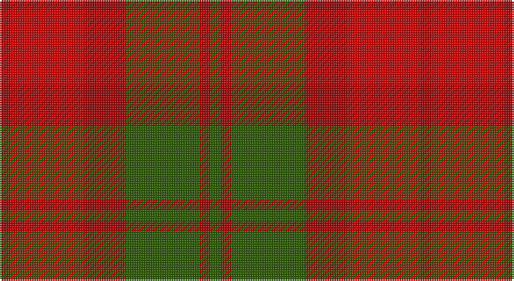

This page is one **sett** — a single exact thread-count. It belongs to the [tartan](/setts/dg1ri1dg7ri4r7ri1/)
(the same proportion at any scale), whose colour order is pattern [GRGRRR](/stripes/grgrrr/).

Part of the [Dewar](/tartans/dewar/) tartan — the named design grouping this sett with its other cloths.

Sourced from tartans-authority.  It is a [6 stripe tartan](/stripes/stripes6/).

Original link http://www.tartansauthority.com/tartan-ferret/display/3400/

## Also known as

This cloth is also recorded under:

- MacNab #2
- MacNab, Variant

## Register references

External register numbers recorded for this tartan.

- Scottish Tartans Authority (ITI): 3400

## Thread count
DR/6 R42 DR24 G42 DR6 G/6

One full sett is **240 threads**.

## Palette

Palette: <strong>Tartan Register</strong>
<table><thead><tr><th>Colour</th><th>Threads</th><th>Shade</th><th>Base</th><th>OKLCh</th></tr></thead><tbody><tr><td>DR/</td><td style="text-align:right;font-variant-numeric:tabular-nums">6</td><td><code style="background-color:#A00000;">#A00000</code> <small style="color:#888">#A00000</small></td><td>R <code style="background-color:#CC0000;">#CC0000</code></td><td><small style="color:#888">oklch(44.3% 0.182 29.2)</small></td></tr><tr><td>R</td><td style="text-align:right;font-variant-numeric:tabular-nums">42</td><td><code style="background-color:#C80000;">#C80000</code> <small style="color:#888">#C80000</small></td><td>R <code style="background-color:#CC0000;">#CC0000</code></td><td><small style="color:#888">oklch(52.3% 0.215 29.2)</small></td></tr><tr><td>DR</td><td style="text-align:right;font-variant-numeric:tabular-nums">24</td><td><code style="background-color:#A00000;">#A00000</code> <small style="color:#888">#A00000</small></td><td>R <code style="background-color:#CC0000;">#CC0000</code></td><td><small style="color:#888">oklch(44.3% 0.182 29.2)</small></td></tr><tr><td>G</td><td style="text-align:right;font-variant-numeric:tabular-nums">42</td><td><code style="background-color:#285800;">#285800</code> <small style="color:#888">#285800</small></td><td>G <code style="background-color:#006100;">#006100</code></td><td><small style="color:#888">oklch(41.0% 0.122 135.8)</small></td></tr><tr><td>DR</td><td style="text-align:right;font-variant-numeric:tabular-nums">6</td><td><code style="background-color:#A00000;">#A00000</code> <small style="color:#888">#A00000</small></td><td>R <code style="background-color:#CC0000;">#CC0000</code></td><td><small style="color:#888">oklch(44.3% 0.182 29.2)</small></td></tr><tr><td>G/</td><td style="text-align:right;font-variant-numeric:tabular-nums">6</td><td><code style="background-color:#285800;">#285800</code> <small style="color:#888">#285800</small></td><td>G <code style="background-color:#006100;">#006100</code></td><td><small style="color:#888">oklch(41.0% 0.122 135.8)</small></td></tr></tbody></table>

# Sample pattern

## Nearest tartans

The nearest existing variants by ΔTartan distance, with this tartan at the top so the swatches line up against it.

ΔTartan

Tartan

Sett

—

<a href="/ttd/edit/#slug=dg1ri1dg7ri4r7ri1~x6">Dewar (Name)</a> <a class="nn-out" href="/variants/s6/dg1ri1dg7ri4r7ri1~x6/" title="open its dictionary page">↗</a>

0.97

<a href="/ttd/edit/#slug=g1m1g7m4r7m1~x4&amp;base=dg1ri1dg7ri4r7ri1~x6">MacNab #2</a> <a class="nn-out" href="/variants/s6/g1m1g7m4r7m1~x4/" title="open its dictionary page">↗</a>

1.23

<a href="/ttd/edit/#slug=ri1r7ri4g7ri1g1~x4&amp;base=dg1ri1dg7ri4r7ri1~x6">MacNab, Variant</a> <a class="nn-out" href="/variants/s6/ri1r7ri4g7ri1g1~x4/" title="open its dictionary page">↗</a>

1.47

<a href="/ttd/edit/#slug=doi7do2doi2do2doi2do6r14do2r2do2~x4&amp;base=dg1ri1dg7ri4r7ri1~x6">Wcwm 1155</a> <a class="nn-out" href="/variants/s10/doi7do2doi2do2doi2do6r14do2r2do2~x4/" title="open its dictionary page">↗</a>

1.53

<a href="/variants/s10/dy1r7dy4g7dy1g1~x4/">Dewar</a>

1.57

<a href="/ttd/edit/#slug=dr2y10o15dr10y2~x4&amp;base=dg1ri1dg7ri4r7ri1~x6">Harmony 8</a> <a class="nn-out" href="/variants/s5/dr2y10o15dr10y2~x4/" title="open its dictionary page">↗</a>

1.59

<a href="/ttd/edit/#slug=db2r22dy11y2dy11db2~x2&amp;base=dg1ri1dg7ri4r7ri1~x6">Cetoloni</a> <a class="nn-out" href="/variants/s6/db2r22dy11y2dy11db2~x2/" title="open its dictionary page">↗</a>

1.62

<a href="/ttd/edit/#slug=dg2r1dg8r5y5r1y2~x4&amp;base=dg1ri1dg7ri4r7ri1~x6">Glen Esk (1993)</a> <a class="nn-out" href="/variants/s7/dg2r1dg8r5y5r1y2~x4/" title="open its dictionary page">↗</a>

1.66

<a href="/ttd/edit/#slug=n7r1dt6r8lr1~x8&amp;base=dg1ri1dg7ri4r7ri1~x6">Callum (Buchan) (Name)</a> <a class="nn-out" href="/variants/s5/n7r1dt6r8lr1~x8/" title="open its dictionary page">↗</a>

1.67

<a href="/ttd/edit/#slug=dg8r1dg1r1dg1r6ri8r1ri8r6dg7r1dg1&amp;base=dg1ri1dg7ri4r7ri1~x6">MacNab</a> <a class="nn-out" href="/variants/s13/dg8r1dg1r1dg1r6ri8r1ri8r6dg7r1dg1/" title="open its dictionary page">↗</a>

1.71

<a href="/ttd/edit/#slug=db2o22dy11ly2dy11db2~x2&amp;base=dg1ri1dg7ri4r7ri1~x6">Cetoloni Family Tartan</a> <a class="nn-out" href="/variants/s6/db2o22dy11ly2dy11db2~x2/" title="open its dictionary page">↗</a>

## Neighbour map

Every grey dot is one of 14360 variants placed by the first two principal components of the ΔTartan feature space (44% of its variance). Red is this tartan; blue dots are its nearest — click one to open its page.

<svg viewBox="0 0 640 380" role="img" style="max-width:100%;height:auto;border:1px solid #e0e0e0;border-radius:4px;display:block" xmlns="http://www.w3.org/2000/svg"><image href="/nn/cloud.v1.png" width="640" height="380"/><a href="/variants/s6/g1m1g7m4r7m1~x4/"><circle cx="261.0" cy="252.4" r="4" fill="#3465a4"><title>MacNab #2</title></circle></a><a href="/variants/s6/ri1r7ri4g7ri1g1~x4/"><circle cx="251.3" cy="249.2" r="4" fill="#3465a4"><title>MacNab, Variant</title></circle></a><a href="/variants/s10/doi7do2doi2do2doi2do6r14do2r2do2~x4/"><circle cx="298.5" cy="234.6" r="4" fill="#3465a4"><title>Wcwm 1155</title></circle></a><a href="/variants/s10/dy1r7dy4g7dy1g1~x4/"><circle cx="252.5" cy="255.1" r="4" fill="#3465a4"><title>Dewar</title></circle></a><a href="/variants/s5/dr2y10o15dr10y2~x4/"><circle cx="256.7" cy="277.8" r="4" fill="#3465a4"><title>Harmony 8</title></circle></a><a href="/variants/s6/db2r22dy11y2dy11db2~x2/"><circle cx="353.6" cy="233.6" r="4" fill="#3465a4"><title>Cetoloni</title></circle></a><a href="/variants/s7/dg2r1dg8r5y5r1y2~x4/"><circle cx="270.7" cy="258.6" r="4" fill="#3465a4"><title>Glen Esk (1993)</title></circle></a><a href="/variants/s5/n7r1dt6r8lr1~x8/"><circle cx="258.2" cy="263.9" r="4" fill="#3465a4"><title>Callum (Buchan) (Name)</title></circle></a><a href="/variants/s13/dg8r1dg1r1dg1r6ri8r1ri8r6dg7r1dg1/"><circle cx="257.7" cy="216.6" r="4" fill="#3465a4"><title>MacNab</title></circle></a><a href="/variants/s6/db2o22dy11ly2dy11db2~x2/"><circle cx="357.3" cy="243.2" r="4" fill="#3465a4"><title>Cetoloni Family Tartan</title></circle></a><circle cx="285.1" cy="264.5" r="5" fill="#c00000"/></svg>

ID: /variants/s6/dg1ri1dg7ri4r7ri1~x6/
