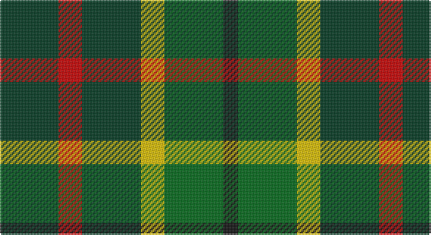

This page is one **sett** — a single exact thread-count. It belongs to the [tartan](/setts/dg20r8dg20ly8g20k5/)
(the same proportion at any scale), whose colour order is pattern [GRGYGK](/stripes/grgygk/).

Sourced from register-of-tartans.  It is a [6 stripe tartan](/stripes/stripes6/).

Original link https://www.tartanregister.gov.uk/tartanDetails.aspx?ref=595

2 attestations — the source records this cloth was collapsed from (oldest owns this page)

<ul>
<li>01/01/2006 — Cates Armigers (Personal) (register-of-tartans, <a href="https://www.tartanregister.gov.uk/tartanDetails.aspx?ref=595">record</a>)</li>
<li>pre 2006 — Cates Armigers (Personal) (tartans-authority, <a href="http://www.tartansauthority.com/tartan-ferret/display/6929/">record</a>)</li>
</ul>

## Register references

External register numbers recorded for this tartan.

- Scottish Register of Tartans: [595](https://www.tartanregister.gov.uk/tartanDetails.aspx?ref=595)
- Scottish Tartans Authority (ITI): 6929

## Thread count
DG/40 R16 DG40 Y16 G40 K/10

One full sett is **274 threads**.

## Palette

Palette: <strong>Tartan Register</strong>
<table><thead><tr><th>Colour</th><th>Threads</th><th>Shade</th><th>Base</th><th>OKLCh</th></tr></thead><tbody><tr><td>DG/</td><td style="text-align:right;font-variant-numeric:tabular-nums">40</td><td><code style="background-color:#003820;">#003820</code> <small style="color:#888">#003820</small></td><td>G <code style="background-color:#006100;">#006100</code></td><td><small style="color:#888">oklch(30.0% 0.070 158.3)</small></td></tr><tr><td>R</td><td style="text-align:right;font-variant-numeric:tabular-nums">16</td><td><code style="background-color:#C80000;">#C80000</code> <small style="color:#888">#C80000</small></td><td>R <code style="background-color:#CC0000;">#CC0000</code></td><td><small style="color:#888">oklch(52.3% 0.215 29.2)</small></td></tr><tr><td>DG</td><td style="text-align:right;font-variant-numeric:tabular-nums">40</td><td><code style="background-color:#003820;">#003820</code> <small style="color:#888">#003820</small></td><td>G <code style="background-color:#006100;">#006100</code></td><td><small style="color:#888">oklch(30.0% 0.070 158.3)</small></td></tr><tr><td>Y</td><td style="text-align:right;font-variant-numeric:tabular-nums">16</td><td><code style="background-color:#E8C000;">#E8C000</code> <small style="color:#888">#E8C000</small></td><td>Y <code style="background-color:#F2BF00;">#F2BF00</code></td><td><small style="color:#888">oklch(81.9% 0.168 93.7)</small></td></tr><tr><td>G</td><td style="text-align:right;font-variant-numeric:tabular-nums">40</td><td><code style="background-color:#006818;">#006818</code> <small style="color:#888">#006818</small></td><td>G <code style="background-color:#006100;">#006100</code></td><td><small style="color:#888">oklch(45.0% 0.142 145.0)</small></td></tr><tr><td>K/</td><td style="text-align:right;font-variant-numeric:tabular-nums">10</td><td><code style="background-color:#101010;">#101010</code> <small style="color:#888">#101010</small></td><td>K <code style="background-color:#000000;">#000000</code></td><td><small style="color:#888">oklch(17.3% 0.000 89.9)</small></td></tr></tbody></table>

# Sample pattern

## Nearest tartans

The nearest existing variants by ΔTartan distance, with this tartan at the top so the swatches line up against it.

ΔTartan

Tartan

Sett

—

<a href="/ttd/edit/#slug=dg20r8dg20ly8g20k5~x2">Cates Armigers (Personal)</a> <a class="nn-out" href="/variants/s6/dg20r8dg20ly8g20k5~x2/" title="open its dictionary page">↗</a>

1.21

<a href="/ttd/edit/#slug=r20g29db10g16r6g10k19~x2&amp;base=dg20r8dg20ly8g20k5~x2">MacDonagh</a> <a class="nn-out" href="/variants/s7/r20g29db10g16r6g10k19~x2/" title="open its dictionary page">↗</a>

1.44

<a href="/ttd/edit/#slug=r20dg29db10dg16r6dg10k19~x2&amp;base=dg20r8dg20ly8g20k5~x2">MacDonagh (Name)</a> <a class="nn-out" href="/variants/s7/r20dg29db10dg16r6dg10k19~x2/" title="open its dictionary page">↗</a>

1.51

<a href="/ttd/edit/#slug=r35g52db18g17r12g17k18&amp;base=dg20r8dg20ly8g20k5~x2">MacDona</a> <a class="nn-out" href="/variants/s7/r35g52db18g17r12g17k18/" title="open its dictionary page">↗</a>

1.52

<a href="/ttd/edit/#slug=k19t10dp19g40ly10&amp;base=dg20r8dg20ly8g20k5~x2">Gallowater Old District Tartan</a> <a class="nn-out" href="/variants/s5/k19t10dp19g40ly10/" title="open its dictionary page">↗</a>

1.53

<a href="/ttd/edit/#slug=g2lo1g5k4do5r1~x4&amp;base=dg20r8dg20ly8g20k5~x2">Forres</a> <a class="nn-out" href="/variants/s6/g2lo1g5k4do5r1~x4/" title="open its dictionary page">↗</a>

1.56

<a href="/ttd/edit/#slug=k4dy9k13g6dy3g9w4~x2&amp;base=dg20r8dg20ly8g20k5~x2">Ramsay Hunting Family Tartan</a> <a class="nn-out" href="/variants/s7/k4dy9k13g6dy3g9w4~x2/" title="open its dictionary page">↗</a>

1.59

<a href="/ttd/edit/#slug=db14g18k3g18r20k14lo3~x2&amp;base=dg20r8dg20ly8g20k5~x2">Scottish Parliament (unofficial)</a> <a class="nn-out" href="/variants/s7/db14g18k3g18r20k14lo3~x2/" title="open its dictionary page">↗</a>

1.62

<a href="/ttd/edit/#slug=g14dt11y3k5y3dt11g14ly2~x2&amp;base=dg20r8dg20ly8g20k5~x2">Wilson's No.122</a> <a class="nn-out" href="/variants/s8/g14dt11y3k5y3dt11g14ly2~x2/" title="open its dictionary page">↗</a>

1.62

<a href="/ttd/edit/#slug=g5r4g19k10g8w4db18r4~x2&amp;base=dg20r8dg20ly8g20k5~x2">CSCA (Corporate)</a> <a class="nn-out" href="/variants/s8/g5r4g19k10g8w4db18r4~x2/" title="open its dictionary page">↗</a>

1.64

<a href="/ttd/edit/#slug=g15r3t15r8g15ly2db4~x2&amp;base=dg20r8dg20ly8g20k5~x2">Rotary International</a> <a class="nn-out" href="/variants/s7/g15r3t15r8g15ly2db4~x2/" title="open its dictionary page">↗</a>

## Neighbour map

Every grey dot is one of 14360 variants placed by the first two principal components of the ΔTartan feature space (44% of its variance). Red is this tartan; blue dots are its nearest — click one to open its page.

<svg viewBox="0 0 640 380" role="img" style="max-width:100%;height:auto;border:1px solid #e0e0e0;border-radius:4px;display:block" xmlns="http://www.w3.org/2000/svg"><image href="/nn/cloud.v1.png" width="640" height="380"/><a href="/variants/s7/r20g29db10g16r6g10k19~x2/"><circle cx="196.9" cy="276.7" r="4" fill="#3465a4"><title>MacDonagh</title></circle></a><a href="/variants/s7/r20dg29db10dg16r6dg10k19~x2/"><circle cx="209.2" cy="281.4" r="4" fill="#3465a4"><title>MacDonagh (Name)</title></circle></a><a href="/variants/s7/r35g52db18g17r12g17k18/"><circle cx="181.5" cy="255.2" r="4" fill="#3465a4"><title>MacDona</title></circle></a><a href="/variants/s5/k19t10dp19g40ly10/"><circle cx="108.6" cy="257.2" r="4" fill="#3465a4"><title>Gallowater Old District Tartan</title></circle></a><a href="/variants/s6/g2lo1g5k4do5r1~x4/"><circle cx="166.5" cy="269.7" r="4" fill="#3465a4"><title>Forres</title></circle></a><a href="/variants/s7/k4dy9k13g6dy3g9w4~x2/"><circle cx="117.1" cy="274.4" r="4" fill="#3465a4"><title>Ramsay Hunting Family Tartan</title></circle></a><a href="/variants/s7/db14g18k3g18r20k14lo3~x2/"><circle cx="143.2" cy="247.0" r="4" fill="#3465a4"><title>Scottish Parliament (unofficial)</title></circle></a><a href="/variants/s8/g14dt11y3k5y3dt11g14ly2~x2/"><circle cx="200.1" cy="242.9" r="4" fill="#3465a4"><title>Wilson's No.122</title></circle></a><a href="/variants/s8/g5r4g19k10g8w4db18r4~x2/"><circle cx="140.7" cy="226.0" r="4" fill="#3465a4"><title>CSCA (Corporate)</title></circle></a><a href="/variants/s7/g15r3t15r8g15ly2db4~x2/"><circle cx="205.5" cy="227.5" r="4" fill="#3465a4"><title>Rotary International</title></circle></a><circle cx="166.4" cy="274.6" r="5" fill="#c00000"/></svg>

ID: /variants/s6/dg20r8dg20ly8g20k5~x2/
