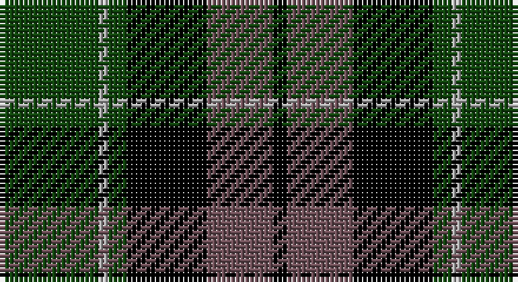

This page is one **sett** — a single exact thread-count. It belongs to the [tartan](/setts/dg21lr2dg4k17n14k3/)
(the same proportion at any scale), whose colour order is pattern [GYGKBK](/stripes/gygkbk/).

Part of the [Graham W](/tartans/graham-w/) tartan — the named design grouping this sett with its other cloths.

Sourced from weddslist.  It is a [6 stripe tartan](/stripes/stripes6/).

Original link http://www.weddslist.com/cgi-bin/tartans/pg.pl?source=x

## Also known as

This cloth is also recorded under:

- Wilson's No 158

## Thread count
DG/21 Na2 DG4 K17 N14 K/3

One full sett is **98 threads**.

## Palette

Palette: <strong>Ingles Buchan</strong> <small style="color:#888">(1 of 4 colours)</small>
<table><thead><tr><th>Colour</th><th>Threads</th><th>Shade</th><th>Base</th><th>OKLCh</th></tr></thead><tbody><tr><td>DG/</td><td style="text-align:right;font-variant-numeric:tabular-nums">21</td><td><code style="background-color:#11450D;">#11450D</code> <small style="color:#888">#11450D</small></td><td>G <code style="background-color:#006100;">#006100</code></td><td><small style="color:#888">oklch(34.4% 0.101 142.1)</small></td></tr><tr><td>Na</td><td style="text-align:right;font-variant-numeric:tabular-nums">2</td><td><code style="background-color:#AAAAAA;">#AAAAAA</code> <small style="color:#888">#AAAAAA</small></td><td>Y <code style="background-color:#F2BF00;">#F2BF00</code></td><td><small style="color:#888">oklch(73.8% 0.000 89.9)</small></td></tr><tr><td>DG</td><td style="text-align:right;font-variant-numeric:tabular-nums">4</td><td><code style="background-color:#11450D;">#11450D</code> <small style="color:#888">#11450D</small></td><td>G <code style="background-color:#006100;">#006100</code></td><td><small style="color:#888">oklch(34.4% 0.101 142.1)</small></td></tr><tr><td>K</td><td style="text-align:right;font-variant-numeric:tabular-nums">17</td><td><code style="background-color:#000000;">#000000</code> <small style="color:#888">#000000</small></td><td>K <code style="background-color:#000000;">#000000</code></td><td><small style="color:#888">oklch(0.0% 0.000 0.0)</small></td></tr><tr><td>N</td><td style="text-align:right;font-variant-numeric:tabular-nums">14</td><td><code style="background-color:#6E5058;">#6E5058</code> <small style="color:#888">#6E5058</small></td><td>B <code style="background-color:#2A418A;">#2A418A</code></td><td><small style="color:#888">oklch(46.6% 0.042 1.2)</small></td></tr><tr><td>K/</td><td style="text-align:right;font-variant-numeric:tabular-nums">3</td><td><code style="background-color:#000000;">#000000</code> <small style="color:#888">#000000</small></td><td>K <code style="background-color:#000000;">#000000</code></td><td><small style="color:#888">oklch(0.0% 0.000 0.0)</small></td></tr></tbody></table>

# Sample pattern

## Compared to the master

This cloth is one sett of its design; the master sett (the exemplar the design is anchored on) is below for comparison.

<figure style="margin:0"><figcaption style="color:#888;font-size:smaller">this sett</figcaption></figure>
<figure style="margin:0"><figcaption style="color:#888;font-size:smaller"><a href="/setts/dg21lb2dg4k17dp14k3/">master sett →</a></figcaption></figure>

## Nearest tartans

The nearest existing variants by ΔTartan distance, with this tartan at the top so the swatches line up against it.

ΔTartan

Tartan

Sett

—

<a href="/ttd/edit/#slug=dg21lr2dg4k17n14k3">Graham W</a> <a class="nn-out" href="/variants/s6/dg21lr2dg4k17n14k3/" title="open its dictionary page">↗</a>

0.00

<a href="/ttd/edit/#slug=dg21lr2dg4k17n14k3~x2&amp;base=dg21lr2dg4k17n14k3">Graham W</a> <a class="nn-out" href="/variants/s6/dg21lr2dg4k17n14k3~x2/" title="open its dictionary page">↗</a>

0.52

<a href="/ttd/edit/#slug=k5lr2dg18k17n16k3~x2&amp;base=dg21lr2dg4k17n14k3">Melville</a> <a class="nn-out" href="/variants/s6/k5lr2dg18k17n16k3~x2/" title="open its dictionary page">↗</a>

0.52

<a href="/ttd/edit/#slug=k5lr2dg18k17n16k3&amp;base=dg21lr2dg4k17n14k3">Melville</a> <a class="nn-out" href="/variants/s6/k5lr2dg18k17n16k3/" title="open its dictionary page">↗</a>

0.66

<a href="/ttd/edit/#slug=dg21lb2dg4k17dp14k3&amp;base=dg21lr2dg4k17n14k3">Graham W</a> <a class="nn-out" href="/variants/s6/dg21lb2dg4k17dp14k3/" title="open its dictionary page">↗</a>

1.00

<a href="/ttd/edit/#slug=dg8k2lb1dg4k6db6k1~x2&amp;base=dg21lr2dg4k17n14k3">MacCallum</a> <a class="nn-out" href="/variants/s7/dg8k2lb1dg4k6db6k1~x2/" title="open its dictionary page">↗</a>

1.03

<a href="/ttd/edit/#slug=g18t2g4k14p12k3~x2&amp;base=dg21lr2dg4k17n14k3">Wilson's, No 150 &quot;Coburg&quot;</a> <a class="nn-out" href="/variants/s6/g18t2g4k14p12k3~x2/" title="open its dictionary page">↗</a>

1.05

<a href="/ttd/edit/#slug=db48k6db10k46ly4k22g43&amp;base=dg21lr2dg4k17n14k3">Mowat</a> <a class="nn-out" href="/variants/s7/db48k6db10k46ly4k22g43/" title="open its dictionary page">↗</a>

1.05

<a href="/ttd/edit/#slug=dg2db12dg1k12dg12r2&amp;base=dg21lr2dg4k17n14k3">Gunn</a> <a class="nn-out" href="/variants/s6/dg2db12dg1k12dg12r2/" title="open its dictionary page">↗</a>

1.06

<a href="/ttd/edit/#slug=k2g12k12r1db12g2~x2&amp;base=dg21lr2dg4k17n14k3">Ferguson of Balquhidder</a> <a class="nn-out" href="/variants/s6/k2g12k12r1db12g2~x2/" title="open its dictionary page">↗</a>

1.07

<a href="/ttd/edit/#slug=r2g12k12g1db12g1~x2&amp;base=dg21lr2dg4k17n14k3">Gunn</a> <a class="nn-out" href="/variants/s6/r2g12k12g1db12g1~x2/" title="open its dictionary page">↗</a>

## Neighbour map

Every grey dot is one of 14360 variants placed by the first two principal components of the ΔTartan feature space (44% of its variance). Red is this tartan; blue dots are its nearest — click one to open its page.

<svg viewBox="0 0 640 380" role="img" style="max-width:100%;height:auto;border:1px solid #e0e0e0;border-radius:4px;display:block" xmlns="http://www.w3.org/2000/svg"><image href="/nn/cloud.v1.png" width="640" height="380"/><a href="/variants/s6/dg21lr2dg4k17n14k3~x2/"><circle cx="211.9" cy="228.1" r="4" fill="#3465a4"><title>Graham W</title></circle></a><a href="/variants/s6/k5lr2dg18k17n16k3~x2/"><circle cx="195.2" cy="235.9" r="4" fill="#3465a4"><title>Melville</title></circle></a><a href="/variants/s6/k5lr2dg18k17n16k3/"><circle cx="195.2" cy="235.9" r="4" fill="#3465a4"><title>Melville</title></circle></a><a href="/variants/s6/dg21lb2dg4k17dp14k3/"><circle cx="200.6" cy="223.5" r="4" fill="#3465a4"><title>Graham W</title></circle></a><a href="/variants/s7/dg8k2lb1dg4k6db6k1~x2/"><circle cx="194.4" cy="246.3" r="4" fill="#3465a4"><title>MacCallum</title></circle></a><a href="/variants/s6/g18t2g4k14p12k3~x2/"><circle cx="176.7" cy="221.4" r="4" fill="#3465a4"><title>Wilson's, No 150 &quot;Coburg&quot;</title></circle></a><a href="/variants/s7/db48k6db10k46ly4k22g43/"><circle cx="192.6" cy="211.6" r="4" fill="#3465a4"><title>Mowat</title></circle></a><a href="/variants/s6/dg2db12dg1k12dg12r2/"><circle cx="203.8" cy="229.6" r="4" fill="#3465a4"><title>Gunn</title></circle></a><a href="/variants/s6/k2g12k12r1db12g2~x2/"><circle cx="171.4" cy="213.0" r="4" fill="#3465a4"><title>Ferguson of Balquhidder</title></circle></a><a href="/variants/s6/r2g12k12g1db12g1~x2/"><circle cx="173.0" cy="207.2" r="4" fill="#3465a4"><title>Gunn</title></circle></a><circle cx="211.9" cy="228.1" r="5" fill="#c00000"/></svg>

ID: /variants/s6/dg21lr2dg4k17n14k3/
