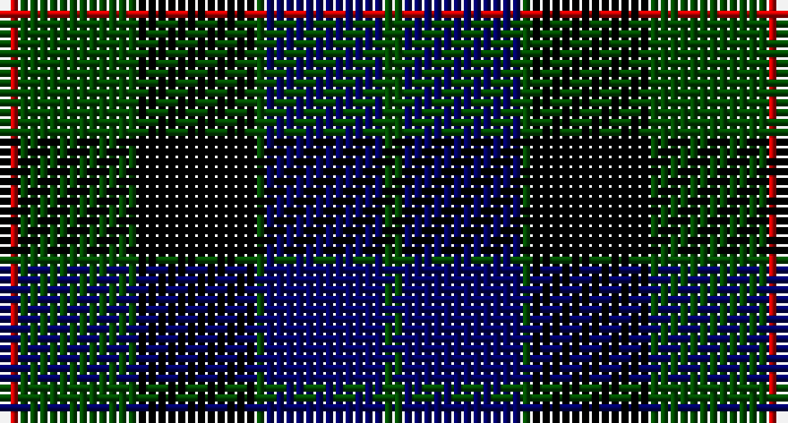

This page is one **sett** — a single exact thread-count. It belongs to the [tartan](/setts/dg2db12dg1k12dg12r2/)
(the same proportion at any scale), whose colour order is pattern [GBGKGR](/stripes/gbgkgr/).

Part of the [Gunn](/tartans/gunn/) tartan — the named design grouping this sett with its other cloths.

Sourced from weddslist.  It is a [6 stripe tartan](/stripes/stripes6/).

Original link http://www.weddslist.com/cgi-bin/tartans/pg.pl?source=rb

## Also known as

This cloth is also recorded under:

- Gunn 2011, Robert
- Gunn Personal

2 attestations — the source records this cloth was collapsed from (oldest owns this page)

<ul>
<li>undated — Gunn (weddslist, <a href="http://www.weddslist.com/cgi-bin/tartans/pg.pl?source=rb">record</a>)</li>
<li>undated — Gunn (weddslist, <a href="http://www.weddslist.com/cgi-bin/tartans/pg.pl?source=x">record</a>)</li>
</ul>

## Thread count
R/2 G12 K12 G1 DB12 G/2

One full sett is **78 threads**.

## Palette

Palette: <strong>Tartan Register</strong>
<table><thead><tr><th>Colour</th><th>Threads</th><th>Shade</th><th>Base</th><th>OKLCh</th></tr></thead><tbody><tr><td>R/</td><td style="text-align:right;font-variant-numeric:tabular-nums">2</td><td><code style="background-color:#C80000;">#C80000</code> <small style="color:#888">#C80000</small></td><td>R <code style="background-color:#CC0000;">#CC0000</code></td><td><small style="color:#888">oklch(52.3% 0.215 29.2)</small></td></tr><tr><td>G</td><td style="text-align:right;font-variant-numeric:tabular-nums">12</td><td><code style="background-color:#004C00;">#004C00</code> <small style="color:#888">#004C00</small></td><td>G <code style="background-color:#006100;">#006100</code></td><td><small style="color:#888">oklch(36.1% 0.123 142.5)</small></td></tr><tr><td>K</td><td style="text-align:right;font-variant-numeric:tabular-nums">12</td><td><code style="background-color:#000000;">#000000</code> <small style="color:#888">#000000</small></td><td>K <code style="background-color:#000000;">#000000</code></td><td><small style="color:#888">oklch(0.0% 0.000 0.0)</small></td></tr><tr><td>G</td><td style="text-align:right;font-variant-numeric:tabular-nums">1</td><td><code style="background-color:#004C00;">#004C00</code> <small style="color:#888">#004C00</small></td><td>G <code style="background-color:#006100;">#006100</code></td><td><small style="color:#888">oklch(36.1% 0.123 142.5)</small></td></tr><tr><td>DB</td><td style="text-align:right;font-variant-numeric:tabular-nums">12</td><td><code style="background-color:#000064;">#000064</code> <small style="color:#888">#000064</small></td><td>B <code style="background-color:#2A418A;">#2A418A</code></td><td><small style="color:#888">oklch(22.7% 0.158 264.1)</small></td></tr><tr><td>G/</td><td style="text-align:right;font-variant-numeric:tabular-nums">2</td><td><code style="background-color:#004C00;">#004C00</code> <small style="color:#888">#004C00</small></td><td>G <code style="background-color:#006100;">#006100</code></td><td><small style="color:#888">oklch(36.1% 0.123 142.5)</small></td></tr></tbody></table>

# Sample pattern

## Compared to the master

This cloth is one sett of its design; the master sett (the exemplar the design is anchored on) is below for comparison.

<figure style="margin:0"><figcaption style="color:#888;font-size:smaller">this sett</figcaption></figure>
<figure style="margin:0"><figcaption style="color:#888;font-size:smaller"><a href="/setts/b20k20g20r1/">master sett →</a></figcaption></figure>

## Nearest tartans

The nearest existing variants by ΔTartan distance, with this tartan at the top so the swatches line up against it.

ΔTartan

Tartan

Sett

—

<a href="/ttd/edit/#slug=dg2db12dg1k12dg12r2">Gunn</a> <a class="nn-out" href="/variants/s6/dg2db12dg1k12dg12r2/" title="open its dictionary page">↗</a>

0.49

<a href="/ttd/edit/#slug=dg2db12dg1k12dg12r2~x2&amp;base=dg2db12dg1k12dg12r2">Gunn</a> <a class="nn-out" href="/variants/s6/dg2db12dg1k12dg12r2~x2/" title="open its dictionary page">↗</a>

0.72

<a href="/ttd/edit/#slug=dg8lb2dg1k12db12k1~x2&amp;base=dg2db12dg1k12dg12r2">Graham of Menteith</a> <a class="nn-out" href="/variants/s6/dg8lb2dg1k12db12k1~x2/" title="open its dictionary page">↗</a>

0.74

<a href="/ttd/edit/#slug=dg16b2dg1k12db12k1~x2&amp;base=dg2db12dg1k12dg12r2">Graham of Menteith</a> <a class="nn-out" href="/variants/s6/dg16b2dg1k12db12k1~x2/" title="open its dictionary page">↗</a>

0.91

<a href="/ttd/edit/#slug=k3dg14k14dg2db14r3&amp;base=dg2db12dg1k12dg12r2">Morrison</a> <a class="nn-out" href="/variants/s6/k3dg14k14dg2db14r3/" title="open its dictionary page">↗</a>

0.92

<a href="/ttd/edit/#slug=dg21lb2dg4k17dp14k3&amp;base=dg2db12dg1k12dg12r2">Graham W</a> <a class="nn-out" href="/variants/s6/dg21lb2dg4k17dp14k3/" title="open its dictionary page">↗</a>

0.93

<a href="/ttd/edit/#slug=k2dg12k12r1db12lr2~x2&amp;base=dg2db12dg1k12dg12r2">Mitchell</a> <a class="nn-out" href="/variants/s6/k2dg12k12r1db12lr2~x2/" title="open its dictionary page">↗</a>

0.93

<a href="/ttd/edit/#slug=k2dg12k12r1db12lr2&amp;base=dg2db12dg1k12dg12r2">Mitchell</a> <a class="nn-out" href="/variants/s6/k2dg12k12r1db12lr2/" title="open its dictionary page">↗</a>

0.95

<a href="/ttd/edit/#slug=r2g12k12g1db12g2~x2&amp;base=dg2db12dg1k12dg12r2">Gunn</a> <a class="nn-out" href="/variants/s6/r2g12k12g1db12g2~x2/" title="open its dictionary page">↗</a>

1.00

<a href="/ttd/edit/#slug=k7g22k22db6r2db15r2~x2&amp;base=dg2db12dg1k12dg12r2">National Galleries of Scotland</a> <a class="nn-out" href="/variants/s7/k7g22k22db6r2db15r2~x2/" title="open its dictionary page">↗</a>

1.01

<a href="/ttd/edit/#slug=db6k1db6k8r1dg8r2&amp;base=dg2db12dg1k12dg12r2">Fletcher C</a> <a class="nn-out" href="/variants/s7/db6k1db6k8r1dg8r2/" title="open its dictionary page">↗</a>

## Neighbour map

Every grey dot is one of 14360 variants placed by the first two principal components of the ΔTartan feature space (44% of its variance). Red is this tartan; blue dots are its nearest — click one to open its page.

<svg viewBox="0 0 640 380" role="img" style="max-width:100%;height:auto;border:1px solid #e0e0e0;border-radius:4px;display:block" xmlns="http://www.w3.org/2000/svg"><image href="/nn/cloud.v1.png" width="640" height="380"/><a href="/variants/s6/dg2db12dg1k12dg12r2~x2/"><circle cx="218.2" cy="236.7" r="4" fill="#3465a4"><title>Gunn</title></circle></a><a href="/variants/s6/dg8lb2dg1k12db12k1~x2/"><circle cx="190.7" cy="218.2" r="4" fill="#3465a4"><title>Graham of Menteith</title></circle></a><a href="/variants/s6/dg16b2dg1k12db12k1~x2/"><circle cx="243.2" cy="221.0" r="4" fill="#3465a4"><title>Graham of Menteith</title></circle></a><a href="/variants/s6/k3dg14k14dg2db14r3/"><circle cx="164.4" cy="254.2" r="4" fill="#3465a4"><title>Morrison</title></circle></a><a href="/variants/s6/dg21lb2dg4k17dp14k3/"><circle cx="200.6" cy="223.5" r="4" fill="#3465a4"><title>Graham W</title></circle></a><a href="/variants/s6/k2dg12k12r1db12lr2~x2/"><circle cx="170.5" cy="212.5" r="4" fill="#3465a4"><title>Mitchell</title></circle></a><a href="/variants/s6/k2dg12k12r1db12lr2/"><circle cx="170.5" cy="212.5" r="4" fill="#3465a4"><title>Mitchell</title></circle></a><a href="/variants/s6/r2g12k12g1db12g2~x2/"><circle cx="216.6" cy="231.7" r="4" fill="#3465a4"><title>Gunn</title></circle></a><a href="/variants/s7/k7g22k22db6r2db15r2~x2/"><circle cx="218.5" cy="230.5" r="4" fill="#3465a4"><title>National Galleries of Scotland</title></circle></a><a href="/variants/s7/db6k1db6k8r1dg8r2/"><circle cx="168.3" cy="244.5" r="4" fill="#3465a4"><title>Fletcher C</title></circle></a><circle cx="203.8" cy="229.6" r="5" fill="#c00000"/></svg>

ID: /variants/s6/dg2db12dg1k12dg12r2/
