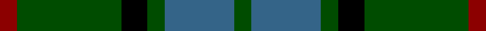
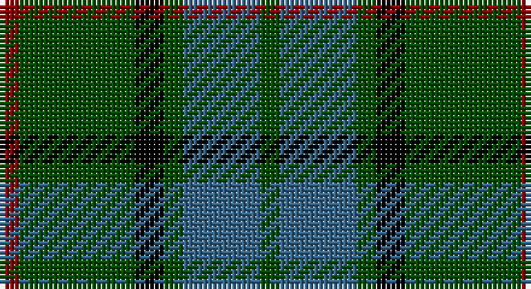

This page is one **sett** — a single exact thread-count. It belongs to the [tartan](/setts/dg2n8dg2k3dg12r2/)
(the same proportion at any scale), whose colour order is pattern [GBGKGR](/stripes/gbgkgr/).

Sourced from register-of-tartans.  It is a [6 stripe tartan](/stripes/stripes6/).

Original link https://www.tartanregister.gov.uk/tartanDetails.aspx?ref=4507

## Register references

External register numbers recorded for this tartan.

- Scottish Register of Tartans: [4507](https://www.tartanregister.gov.uk/tartanDetails.aspx?ref=4507)
- Scottish Tartans Authority (ITI): 4334

## Thread count
DR/4 G24 K6 G4 B16 G/4

One full sett is **108 threads**.

## Palette

Palette: <strong>Tartan Register</strong> <small style="color:#888">(2 of 4 colours)</small>
<table><thead><tr><th>Colour</th><th>Threads</th><th>Shade</th><th>Base</th><th>OKLCh</th></tr></thead><tbody><tr><td>DR/</td><td style="text-align:right;font-variant-numeric:tabular-nums">4</td><td><code style="background-color:#8C0000;">#8C0000</code> <small style="color:#888">#8C0000</small></td><td>R <code style="background-color:#CC0000;">#CC0000</code></td><td><small style="color:#888">oklch(40.2% 0.165 29.2)</small></td></tr><tr><td>G</td><td style="text-align:right;font-variant-numeric:tabular-nums">24</td><td><code style="background-color:#004C00;">#004C00</code> <small style="color:#888">#004C00</small></td><td>G <code style="background-color:#006100;">#006100</code></td><td><small style="color:#888">oklch(36.1% 0.123 142.5)</small></td></tr><tr><td>K</td><td style="text-align:right;font-variant-numeric:tabular-nums">6</td><td><code style="background-color:#000000;">#000000</code> <small style="color:#888">#000000</small></td><td>K <code style="background-color:#000000;">#000000</code></td><td><small style="color:#888">oklch(0.0% 0.000 0.0)</small></td></tr><tr><td>G</td><td style="text-align:right;font-variant-numeric:tabular-nums">4</td><td><code style="background-color:#004C00;">#004C00</code> <small style="color:#888">#004C00</small></td><td>G <code style="background-color:#006100;">#006100</code></td><td><small style="color:#888">oklch(36.1% 0.123 142.5)</small></td></tr><tr><td>B</td><td style="text-align:right;font-variant-numeric:tabular-nums">16</td><td><code style="background-color:#346488;">#346488</code> <small style="color:#888">#346488</small></td><td>B <code style="background-color:#2A418A;">#2A418A</code></td><td><small style="color:#888">oklch(48.6% 0.078 243.0)</small></td></tr><tr><td>G/</td><td style="text-align:right;font-variant-numeric:tabular-nums">4</td><td><code style="background-color:#004C00;">#004C00</code> <small style="color:#888">#004C00</small></td><td>G <code style="background-color:#006100;">#006100</code></td><td><small style="color:#888">oklch(36.1% 0.123 142.5)</small></td></tr></tbody></table>

# Sample pattern

## Nearest tartans

The nearest existing variants by ΔTartan distance, with this tartan at the top so the swatches line up against it.

ΔTartan

Tartan

Sett

—

<a href="/ttd/edit/#slug=dg2n8dg2k3dg12r2~x2">Wcwm 1045</a> <a class="nn-out" href="/variants/s6/dg2n8dg2k3dg12r2~x2/" title="open its dictionary page">↗</a>

0.66

<a href="/ttd/edit/#slug=g3db8g3k4g15r2~x2&amp;base=dg2n8dg2k3dg12r2~x2">Lauder (Family)</a> <a class="nn-out" href="/variants/s6/g3db8g3k4g15r2~x2/" title="open its dictionary page">↗</a>

0.75

<a href="/ttd/edit/#slug=db5dg8k1ly2k1dg8db4~x4&amp;base=dg2n8dg2k3dg12r2~x2">Salvation Army Htg (Corporate)</a> <a class="nn-out" href="/variants/s7/db5dg8k1ly2k1dg8db4~x4/" title="open its dictionary page">↗</a>

0.88

<a href="/ttd/edit/#slug=g14r2g2r3g7db12g2dr2~x2&amp;base=dg2n8dg2k3dg12r2~x2">Glen Nevis #3</a> <a class="nn-out" href="/variants/s8/g14r2g2r3g7db12g2dr2~x2/" title="open its dictionary page">↗</a>

1.01

<a href="/ttd/edit/#slug=r3dg10r3dg14db16dg3ly2~x2&amp;base=dg2n8dg2k3dg12r2~x2">Cameron Hunting</a> <a class="nn-out" href="/variants/s7/r3dg10r3dg14db16dg3ly2~x2/" title="open its dictionary page">↗</a>

1.05

<a href="/ttd/edit/#slug=r3k9g20k16g7b3~x2&amp;base=dg2n8dg2k3dg12r2~x2">Holman (Personal)</a> <a class="nn-out" href="/variants/s6/r3k9g20k16g7b3~x2/" title="open its dictionary page">↗</a>

1.12

<a href="/ttd/edit/#slug=r5g20r5g20db24g6ly4&amp;base=dg2n8dg2k3dg12r2~x2">Cameron of Lochiel (Hunting) Clan/Family Tartan</a> <a class="nn-out" href="/variants/s7/r5g20r5g20db24g6ly4/" title="open its dictionary page">↗</a>

1.13

<a href="/ttd/edit/#slug=t3k16dg16k16db3t3~x2&amp;base=dg2n8dg2k3dg12r2~x2">Murray</a> <a class="nn-out" href="/variants/s6/t3k16dg16k16db3t3~x2/" title="open its dictionary page">↗</a>

1.16

<a href="/ttd/edit/#slug=g3db1g8db7k3ly1~x2&amp;base=dg2n8dg2k3dg12r2~x2">Trafalgar (Fashion)</a> <a class="nn-out" href="/variants/s6/g3db1g8db7k3ly1~x2/" title="open its dictionary page">↗</a>

1.20

<a href="/ttd/edit/#slug=dy3g6dg2r2dg14g2dg2dy3~x2&amp;base=dg2n8dg2k3dg12r2~x2">Daks (Muted Loden)</a> <a class="nn-out" href="/variants/s8/dy3g6dg2r2dg14g2dg2dy3~x2/" title="open its dictionary page">↗</a>

1.22

<a href="/ttd/edit/#slug=dt6r15g41r15dt20g41db6&amp;base=dg2n8dg2k3dg12r2~x2">Bean of Freeport Htg (Corporate)</a> <a class="nn-out" href="/variants/s7/dt6r15g41r15dt20g41db6/" title="open its dictionary page">↗</a>

## Neighbour map

Every grey dot is one of 14360 variants placed by the first two principal components of the ΔTartan feature space (44% of its variance). Red is this tartan; blue dots are its nearest — click one to open its page.

<svg viewBox="0 0 640 380" role="img" style="max-width:100%;height:auto;border:1px solid #e0e0e0;border-radius:4px;display:block" xmlns="http://www.w3.org/2000/svg"><image href="/nn/cloud.v1.png" width="640" height="380"/><a href="/variants/s6/g3db8g3k4g15r2~x2/"><circle cx="328.7" cy="254.2" r="4" fill="#3465a4"><title>Lauder (Family)</title></circle></a><a href="/variants/s7/db5dg8k1ly2k1dg8db4~x4/"><circle cx="295.3" cy="252.9" r="4" fill="#3465a4"><title>Salvation Army Htg (Corporate)</title></circle></a><a href="/variants/s8/g14r2g2r3g7db12g2dr2~x2/"><circle cx="322.2" cy="242.1" r="4" fill="#3465a4"><title>Glen Nevis #3</title></circle></a><a href="/variants/s7/r3dg10r3dg14db16dg3ly2~x2/"><circle cx="285.2" cy="242.4" r="4" fill="#3465a4"><title>Cameron Hunting</title></circle></a><a href="/variants/s6/r3k9g20k16g7b3~x2/"><circle cx="252.1" cy="264.1" r="4" fill="#3465a4"><title>Holman (Personal)</title></circle></a><a href="/variants/s7/r5g20r5g20db24g6ly4/"><circle cx="263.7" cy="248.8" r="4" fill="#3465a4"><title>Cameron of Lochiel (Hunting) Clan/Family Tartan</title></circle></a><a href="/variants/s6/t3k16dg16k16db3t3~x2/"><circle cx="300.9" cy="282.5" r="4" fill="#3465a4"><title>Murray</title></circle></a><a href="/variants/s6/g3db1g8db7k3ly1~x2/"><circle cx="248.7" cy="248.4" r="4" fill="#3465a4"><title>Trafalgar (Fashion)</title></circle></a><a href="/variants/s8/dy3g6dg2r2dg14g2dg2dy3~x2/"><circle cx="296.7" cy="234.8" r="4" fill="#3465a4"><title>Daks (Muted Loden)</title></circle></a><a href="/variants/s7/dt6r15g41r15dt20g41db6/"><circle cx="304.7" cy="259.1" r="4" fill="#3465a4"><title>Bean of Freeport Htg (Corporate)</title></circle></a><circle cx="294.2" cy="260.3" r="5" fill="#c00000"/></svg>

ID: /variants/s6/dg2n8dg2k3dg12r2~x2/
