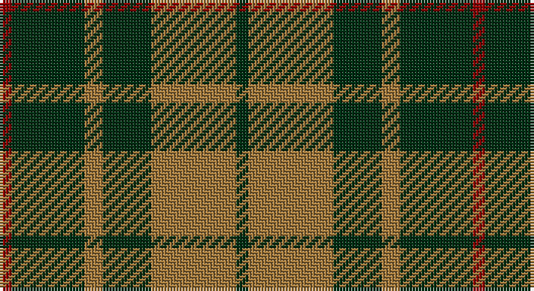

This page is one **sett** — a single exact thread-count. It belongs to the [tartan](/setts/dg2o14dg8o3dg12r2/)
(the same proportion at any scale), whose colour order is pattern [GRGRGR](/stripes/grgrgr/).

Sourced from register-of-tartans.  It is a [6 stripe tartan](/stripes/stripes6/).

Original link https://www.tartanregister.gov.uk/tartanDetails.aspx?ref=729

## Register references

External register numbers recorded for this tartan.

- Scottish Register of Tartans: [729](https://www.tartanregister.gov.uk/tartanDetails.aspx?ref=729)
- Scottish Tartans Authority (ITI): 4566

## Thread count
DR/4 DG24 LT6 DG16 LT28 DG/4

One full sett is **156 threads**.

## Palette

Palette: <strong>Tartan Register</strong> <small style="color:#888">(6 of 9 colours)</small>
<table><thead><tr><th>Colour</th><th>Threads</th><th>Shade</th><th>Base</th><th>OKLCh</th></tr></thead><tbody><tr><td>DR/</td><td style="text-align:right;font-variant-numeric:tabular-nums">4</td><td><code style="background-color:#8C0000;">#8C0000</code> <small style="color:#888">#8C0000</small></td><td>R <code style="background-color:#CC0000;">#CC0000</code></td><td><small style="color:#888">oklch(40.2% 0.165 29.2)</small></td></tr><tr><td>DG</td><td style="text-align:right;font-variant-numeric:tabular-nums">24</td><td><code style="background-color:#003014;">#003014</code> <small style="color:#888">#003014</small></td><td>G <code style="background-color:#006100;">#006100</code></td><td><small style="color:#888">oklch(27.1% 0.071 152.1)</small></td></tr><tr><td>LT</td><td style="text-align:right;font-variant-numeric:tabular-nums">6</td><td><code style="background-color:#A0783C;">#A0783C</code> <small style="color:#888">#A0783C</small></td><td>R <code style="background-color:#CC0000;">#CC0000</code></td><td><small style="color:#888">oklch(60.0% 0.092 75.5)</small></td></tr><tr><td>DG</td><td style="text-align:right;font-variant-numeric:tabular-nums">16</td><td><code style="background-color:#003014;">#003014</code> <small style="color:#888">#003014</small></td><td>G <code style="background-color:#006100;">#006100</code></td><td><small style="color:#888">oklch(27.1% 0.071 152.1)</small></td></tr><tr><td>LT</td><td style="text-align:right;font-variant-numeric:tabular-nums">28</td><td><code style="background-color:#A0783C;">#A0783C</code> <small style="color:#888">#A0783C</small></td><td>R <code style="background-color:#CC0000;">#CC0000</code></td><td><small style="color:#888">oklch(60.0% 0.092 75.5)</small></td></tr><tr><td>DG/</td><td style="text-align:right;font-variant-numeric:tabular-nums">4</td><td><code style="background-color:#003014;">#003014</code> <small style="color:#888">#003014</small></td><td>G <code style="background-color:#006100;">#006100</code></td><td><small style="color:#888">oklch(27.1% 0.071 152.1)</small></td></tr></tbody></table>

# Sample pattern

## Nearest tartans

The nearest existing variants by ΔTartan distance, with this tartan at the top so the swatches line up against it.

ΔTartan

Tartan

Sett

—

<a href="/ttd/edit/#slug=dg2o14dg8o3dg12r2~x2">Confederate Artillery</a> <a class="nn-out" href="/variants/s6/dg2o14dg8o3dg12r2~x2/" title="open its dictionary page">↗</a>

0.38

<a href="/ttd/edit/#slug=dg2o14dg8o3dg12db2~x2&amp;base=dg2o14dg8o3dg12r2~x2">Confederate Infantry</a> <a class="nn-out" href="/variants/s6/dg2o14dg8o3dg12db2~x2/" title="open its dictionary page">↗</a>

0.75

<a href="/ttd/edit/#slug=dg2y14dg8y3dg12lo2~x2&amp;base=dg2o14dg8o3dg12r2~x2">Confederate Cavalry (Military)</a> <a class="nn-out" href="/variants/s6/dg2y14dg8y3dg12lo2~x2/" title="open its dictionary page">↗</a>

1.00

<a href="/ttd/edit/#slug=db6r3g2r3g12r3g2~x2&amp;base=dg2o14dg8o3dg12r2~x2">Skene Clan Tartan</a> <a class="nn-out" href="/variants/s7/db6r3g2r3g12r3g2~x2/" title="open its dictionary page">↗</a>

1.07

<a href="/ttd/edit/#slug=g22dt5r4dt5r3~x2&amp;base=dg2o14dg8o3dg12r2~x2">Romsdal</a> <a class="nn-out" href="/variants/s5/g22dt5r4dt5r3~x2/" title="open its dictionary page">↗</a>

1.22

<a href="/ttd/edit/#slug=g9m2g2m2g2m8g11w2~x4&amp;base=dg2o14dg8o3dg12r2~x2">Leeds University Corporate Tartan</a> <a class="nn-out" href="/variants/s8/g9m2g2m2g2m8g11w2~x4/" title="open its dictionary page">↗</a>

1.25

<a href="/ttd/edit/#slug=k8g3k4g20r4~x2&amp;base=dg2o14dg8o3dg12r2~x2">MacArthur-Fox (Personal)</a> <a class="nn-out" href="/variants/s5/k8g3k4g20r4~x2/" title="open its dictionary page">↗</a>

1.29

<a href="/ttd/edit/#slug=k9g3k3g12ly2~x4&amp;base=dg2o14dg8o3dg12r2~x2">MacArthur</a> <a class="nn-out" href="/variants/s5/k9g3k3g12ly2~x4/" title="open its dictionary page">↗</a>

1.32

<a href="/ttd/edit/#slug=ly1r3dg7r3dg7r3ly1~x4&amp;base=dg2o14dg8o3dg12r2~x2">Unidentified #42</a> <a class="nn-out" href="/variants/s7/ly1r3dg7r3dg7r3ly1~x4/" title="open its dictionary page">↗</a>

1.40

<a href="/ttd/edit/#slug=g10db2r8lo2g5~x4&amp;base=dg2o14dg8o3dg12r2~x2">Cub Scouts of America</a> <a class="nn-out" href="/variants/s5/g10db2r8lo2g5~x4/" title="open its dictionary page">↗</a>

1.40

<a href="/ttd/edit/#slug=g25r4db24r21g25r3db4~x2&amp;base=dg2o14dg8o3dg12r2~x2">Glasgow</a> <a class="nn-out" href="/variants/s7/g25r4db24r21g25r3db4~x2/" title="open its dictionary page">↗</a>

## Neighbour map

Every grey dot is one of 14360 variants placed by the first two principal components of the ΔTartan feature space (44% of its variance). Red is this tartan; blue dots are its nearest — click one to open its page.

<svg viewBox="0 0 640 380" role="img" style="max-width:100%;height:auto;border:1px solid #e0e0e0;border-radius:4px;display:block" xmlns="http://www.w3.org/2000/svg"><image href="/nn/cloud.v1.png" width="640" height="380"/><a href="/variants/s6/dg2o14dg8o3dg12db2~x2/"><circle cx="313.3" cy="263.0" r="4" fill="#3465a4"><title>Confederate Infantry</title></circle></a><a href="/variants/s6/dg2y14dg8y3dg12lo2~x2/"><circle cx="336.6" cy="274.7" r="4" fill="#3465a4"><title>Confederate Cavalry (Military)</title></circle></a><a href="/variants/s7/db6r3g2r3g12r3g2~x2/"><circle cx="283.5" cy="254.3" r="4" fill="#3465a4"><title>Skene Clan Tartan</title></circle></a><a href="/variants/s5/g22dt5r4dt5r3~x2/"><circle cx="341.5" cy="257.4" r="4" fill="#3465a4"><title>Romsdal</title></circle></a><a href="/variants/s8/g9m2g2m2g2m8g11w2~x4/"><circle cx="349.6" cy="250.8" r="4" fill="#3465a4"><title>Leeds University Corporate Tartan</title></circle></a><a href="/variants/s5/k8g3k4g20r4~x2/"><circle cx="355.6" cy="278.7" r="4" fill="#3465a4"><title>MacArthur-Fox (Personal)</title></circle></a><a href="/variants/s5/k9g3k3g12ly2~x4/"><circle cx="282.1" cy="279.6" r="4" fill="#3465a4"><title>MacArthur</title></circle></a><a href="/variants/s7/ly1r3dg7r3dg7r3ly1~x4/"><circle cx="300.3" cy="245.0" r="4" fill="#3465a4"><title>Unidentified #42</title></circle></a><a href="/variants/s5/g10db2r8lo2g5~x4/"><circle cx="279.2" cy="283.4" r="4" fill="#3465a4"><title>Cub Scouts of America</title></circle></a><a href="/variants/s7/g25r4db24r21g25r3db4~x2/"><circle cx="256.5" cy="248.8" r="4" fill="#3465a4"><title>Glasgow</title></circle></a><circle cx="319.8" cy="263.9" r="5" fill="#c00000"/></svg>

ID: /variants/s6/dg2o14dg8o3dg12r2~x2/
