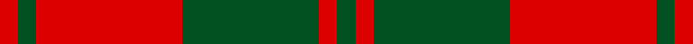
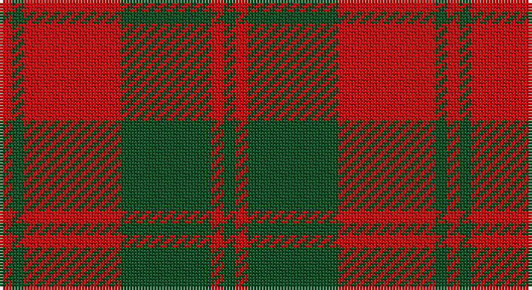

This page is one **sett** — a single exact thread-count. It belongs to the [tartan](/setts/dg2r2dg15r16dg2r2/)
(the same proportion at any scale), whose colour order is pattern [GRGRGR](/stripes/grgrgr/).

Sourced from register-of-tartans.  It is a [6 stripe tartan](/stripes/stripes6/).

Original link https://www.tartanregister.gov.uk/tartanDetails.aspx?ref=4335

## Also known as

This cloth is also recorded under:

- Unidentified, NW Highlands

## Register references

External register numbers recorded for this tartan.

- Scottish Register of Tartans: [4335](https://www.tartanregister.gov.uk/tartanDetails.aspx?ref=4335)
- Scottish Tartans World Register: 900

## Thread count
R/4 G4 R32 G30 R4 G/4

One full sett is **148 threads**.

## Palette

Palette: <strong>Tartan Register</strong>
<table><thead><tr><th>Colour</th><th>Threads</th><th>Shade</th><th>Base</th><th>OKLCh</th></tr></thead><tbody><tr><td>R/</td><td style="text-align:right;font-variant-numeric:tabular-nums">4</td><td><code style="background-color:#DC0000;">#DC0000</code> <small style="color:#888">#DC0000</small></td><td>R <code style="background-color:#CC0000;">#CC0000</code></td><td><small style="color:#888">oklch(56.2% 0.230 29.2)</small></td></tr><tr><td>G</td><td style="text-align:right;font-variant-numeric:tabular-nums">4</td><td><code style="background-color:#005020;">#005020</code> <small style="color:#888">#005020</small></td><td>G <code style="background-color:#006100;">#006100</code></td><td><small style="color:#888">oklch(37.7% 0.105 149.6)</small></td></tr><tr><td>R</td><td style="text-align:right;font-variant-numeric:tabular-nums">32</td><td><code style="background-color:#DC0000;">#DC0000</code> <small style="color:#888">#DC0000</small></td><td>R <code style="background-color:#CC0000;">#CC0000</code></td><td><small style="color:#888">oklch(56.2% 0.230 29.2)</small></td></tr><tr><td>G</td><td style="text-align:right;font-variant-numeric:tabular-nums">30</td><td><code style="background-color:#005020;">#005020</code> <small style="color:#888">#005020</small></td><td>G <code style="background-color:#006100;">#006100</code></td><td><small style="color:#888">oklch(37.7% 0.105 149.6)</small></td></tr><tr><td>R</td><td style="text-align:right;font-variant-numeric:tabular-nums">4</td><td><code style="background-color:#DC0000;">#DC0000</code> <small style="color:#888">#DC0000</small></td><td>R <code style="background-color:#CC0000;">#CC0000</code></td><td><small style="color:#888">oklch(56.2% 0.230 29.2)</small></td></tr><tr><td>G/</td><td style="text-align:right;font-variant-numeric:tabular-nums">4</td><td><code style="background-color:#005020;">#005020</code> <small style="color:#888">#005020</small></td><td>G <code style="background-color:#006100;">#006100</code></td><td><small style="color:#888">oklch(37.7% 0.105 149.6)</small></td></tr></tbody></table>

# Sample pattern

## Nearest tartans

The nearest existing variants by ΔTartan distance, with this tartan at the top so the swatches line up against it.

ΔTartan

Tartan

Sett

—

<a href="/ttd/edit/#slug=dg2r2dg15r16dg2r2~x2">Unidentified NW Highlands</a> <a class="nn-out" href="/variants/s6/dg2r2dg15r16dg2r2~x2/" title="open its dictionary page">↗</a>

1.01

<a href="/ttd/edit/#slug=r2g2r16g15r2g2~x2&amp;base=dg2r2dg15r16dg2r2~x2">Unidentified, NW Highlands</a> <a class="nn-out" href="/variants/s6/r2g2r16g15r2g2~x2/" title="open its dictionary page">↗</a>

1.18

<a href="/ttd/edit/#slug=dg16r5dg2r18k2~x2&amp;base=dg2r2dg15r16dg2r2~x2">MacDonald Lord of the Isles #2</a> <a class="nn-out" href="/variants/s5/dg16r5dg2r18k2~x2/" title="open its dictionary page">↗</a>

1.20

<a href="/ttd/edit/#slug=g16r5g2r18k2~x2&amp;base=dg2r2dg15r16dg2r2~x2">MacDonald, Lord of The Isles (Artef)</a> <a class="nn-out" href="/variants/s5/g16r5g2r18k2~x2/" title="open its dictionary page">↗</a>

1.26

<a href="/ttd/edit/#slug=r1g3r1g3r8ly1~x8&amp;base=dg2r2dg15r16dg2r2~x2">Cameron</a> <a class="nn-out" href="/variants/s6/r1g3r1g3r8ly1~x8/" title="open its dictionary page">↗</a>

1.34

<a href="/ttd/edit/#slug=dg8r2dg9r16dg1~x2&amp;base=dg2r2dg15r16dg2r2~x2">MacGregor of Glenstrae</a> <a class="nn-out" href="/variants/s5/dg8r2dg9r16dg1~x2/" title="open its dictionary page">↗</a>

1.35

<a href="/ttd/edit/#slug=dg7r3dg1r9k1~x2&amp;base=dg2r2dg15r16dg2r2~x2">MacDonald of Sleat</a> <a class="nn-out" href="/variants/s5/dg7r3dg1r9k1~x2/" title="open its dictionary page">↗</a>

1.37

<a href="/ttd/edit/#slug=r16dg1r1dg1r4dg12&amp;base=dg2r2dg15r16dg2r2~x2">MacQuarrie</a> <a class="nn-out" href="/variants/s6/r16dg1r1dg1r4dg12/" title="open its dictionary page">↗</a>

1.38

<a href="/ttd/edit/#slug=r1dg6r1dg6r15ly1~x2&amp;base=dg2r2dg15r16dg2r2~x2">Cameron Clan D</a> <a class="nn-out" href="/variants/s6/r1dg6r1dg6r15ly1~x2/" title="open its dictionary page">↗</a>

1.42

<a href="/ttd/edit/#slug=r16dg1r1dg1r4dg12~x2&amp;base=dg2r2dg15r16dg2r2~x2">MacQuarrie 7</a> <a class="nn-out" href="/variants/s6/r16dg1r1dg1r4dg12~x2/" title="open its dictionary page">↗</a>

1.44

<a href="/ttd/edit/#slug=r16g1r1g1r4g12~x4&amp;base=dg2r2dg15r16dg2r2~x2">MacQuarrie #5</a> <a class="nn-out" href="/variants/s6/r16g1r1g1r4g12~x4/" title="open its dictionary page">↗</a>

## Neighbour map

Every grey dot is one of 14360 variants placed by the first two principal components of the ΔTartan feature space (44% of its variance). Red is this tartan; blue dots are its nearest — click one to open its page.

<svg viewBox="0 0 640 380" role="img" style="max-width:100%;height:auto;border:1px solid #e0e0e0;border-radius:4px;display:block" xmlns="http://www.w3.org/2000/svg"><image href="/nn/cloud.v1.png" width="640" height="380"/><a href="/variants/s6/r2g2r16g15r2g2~x2/"><circle cx="379.4" cy="242.8" r="4" fill="#3465a4"><title>Unidentified, NW Highlands</title></circle></a><a href="/variants/s5/dg16r5dg2r18k2~x2/"><circle cx="342.1" cy="233.7" r="4" fill="#3465a4"><title>MacDonald Lord of the Isles #2</title></circle></a><a href="/variants/s5/g16r5g2r18k2~x2/"><circle cx="351.5" cy="241.0" r="4" fill="#3465a4"><title>MacDonald, Lord of The Isles (Artef)</title></circle></a><a href="/variants/s6/r1g3r1g3r8ly1~x8/"><circle cx="369.6" cy="227.2" r="4" fill="#3465a4"><title>Cameron</title></circle></a><a href="/variants/s5/dg8r2dg9r16dg1~x2/"><circle cx="380.5" cy="239.0" r="4" fill="#3465a4"><title>MacGregor of Glenstrae</title></circle></a><a href="/variants/s5/dg7r3dg1r9k1~x2/"><circle cx="353.6" cy="237.9" r="4" fill="#3465a4"><title>MacDonald of Sleat</title></circle></a><a href="/variants/s6/r16dg1r1dg1r4dg12/"><circle cx="450.8" cy="213.4" r="4" fill="#3465a4"><title>MacQuarrie</title></circle></a><a href="/variants/s6/r1dg6r1dg6r15ly1~x2/"><circle cx="393.3" cy="195.9" r="4" fill="#3465a4"><title>Cameron Clan D</title></circle></a><a href="/variants/s6/r16dg1r1dg1r4dg12~x2/"><circle cx="453.9" cy="216.0" r="4" fill="#3465a4"><title>MacQuarrie 7</title></circle></a><a href="/variants/s6/r16g1r1g1r4g12~x4/"><circle cx="455.5" cy="215.6" r="4" fill="#3465a4"><title>MacQuarrie #5</title></circle></a><circle cx="374.0" cy="236.4" r="5" fill="#c00000"/></svg>

ID: /variants/s6/dg2r2dg15r16dg2r2~x2/
