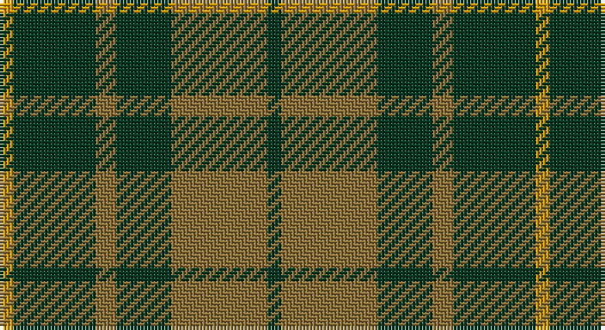

This page is one **sett** — a single exact thread-count. It belongs to the [tartan](/setts/dg2y14dg8y3dg12lo2/)
(the same proportion at any scale), whose colour order is pattern [GGGGGY](/stripes/gggggy/).

Sourced from tartans-authority.  It is a [6 stripe tartan](/stripes/stripes6/).

Original link http://www.tartansauthority.com/tartan-ferret/display/4567/

2 attestations — the source records this cloth was collapsed from (oldest owns this page)

<ul>
<li>pre 1997 — Confederate Cavalry (Military) (tartans-authority, <a href="http://www.tartansauthority.com/tartan-ferret/display/4567/">record</a>)</li>
<li>01/01/2002 — Confederate Cavalry (register-of-tartans, <a href="https://www.tartanregister.gov.uk/tartanDetails.aspx?ref=730">record</a>)</li>
</ul>

## Register references

External register numbers recorded for this tartan.

- Scottish Register of Tartans: [730](https://www.tartanregister.gov.uk/tartanDetails.aspx?ref=730)
- Scottish Tartans Authority (ITI): 4567

## Thread count
DY/4 DG24 LT6 DG16 LT28 DG/4

One full sett is **156 threads**.

## Palette

Palette: <strong>Tartan Register</strong> <small style="color:#888">(2 of 3 colours)</small>
<table><thead><tr><th>Colour</th><th>Threads</th><th>Shade</th><th>Base</th><th>OKLCh</th></tr></thead><tbody><tr><td>DY/</td><td style="text-align:right;font-variant-numeric:tabular-nums">4</td><td><code style="background-color:#D09800;">#D09800</code> <small style="color:#888">#D09800</small></td><td>Y <code style="background-color:#F2BF00;">#F2BF00</code></td><td><small style="color:#888">oklch(71.4% 0.147 82.1)</small></td></tr><tr><td>DG</td><td style="text-align:right;font-variant-numeric:tabular-nums">24</td><td><code style="background-color:#003820;">#003820</code> <small style="color:#888">#003820</small></td><td>G <code style="background-color:#006100;">#006100</code></td><td><small style="color:#888">oklch(30.0% 0.070 158.3)</small></td></tr><tr><td>LT</td><td style="text-align:right;font-variant-numeric:tabular-nums">6</td><td><code style="background-color:#8C7038;">#8C7038</code> <small style="color:#888">#8C7038</small></td><td>G <code style="background-color:#006100;">#006100</code></td><td><small style="color:#888">oklch(56.0% 0.082 83.0)</small></td></tr><tr><td>DG</td><td style="text-align:right;font-variant-numeric:tabular-nums">16</td><td><code style="background-color:#003820;">#003820</code> <small style="color:#888">#003820</small></td><td>G <code style="background-color:#006100;">#006100</code></td><td><small style="color:#888">oklch(30.0% 0.070 158.3)</small></td></tr><tr><td>LT</td><td style="text-align:right;font-variant-numeric:tabular-nums">28</td><td><code style="background-color:#8C7038;">#8C7038</code> <small style="color:#888">#8C7038</small></td><td>G <code style="background-color:#006100;">#006100</code></td><td><small style="color:#888">oklch(56.0% 0.082 83.0)</small></td></tr><tr><td>DG/</td><td style="text-align:right;font-variant-numeric:tabular-nums">4</td><td><code style="background-color:#003820;">#003820</code> <small style="color:#888">#003820</small></td><td>G <code style="background-color:#006100;">#006100</code></td><td><small style="color:#888">oklch(30.0% 0.070 158.3)</small></td></tr></tbody></table>

# Sample pattern

## Nearest tartans

The nearest existing variants by ΔTartan distance, with this tartan at the top so the swatches line up against it.

ΔTartan

Tartan

Sett

—

<a href="/ttd/edit/#slug=dg2y14dg8y3dg12lo2~x2">Confederate Cavalry (Military)</a> <a class="nn-out" href="/variants/s6/dg2y14dg8y3dg12lo2~x2/" title="open its dictionary page">↗</a>

0.75

<a href="/ttd/edit/#slug=dg2o14dg8o3dg12r2~x2&amp;base=dg2y14dg8y3dg12lo2~x2">Confederate Artillery</a> <a class="nn-out" href="/variants/s6/dg2o14dg8o3dg12r2~x2/" title="open its dictionary page">↗</a>

0.91

<a href="/ttd/edit/#slug=dg2o14dg8o3dg12db2~x2&amp;base=dg2y14dg8y3dg12lo2~x2">Confederate Infantry</a> <a class="nn-out" href="/variants/s6/dg2o14dg8o3dg12db2~x2/" title="open its dictionary page">↗</a>

1.04

<a href="/ttd/edit/#slug=g22dt5r4dt5r3~x2&amp;base=dg2y14dg8y3dg12lo2~x2">Romsdal</a> <a class="nn-out" href="/variants/s5/g22dt5r4dt5r3~x2/" title="open its dictionary page">↗</a>

1.06

<a href="/ttd/edit/#slug=k8g3k4g20r4~x2&amp;base=dg2y14dg8y3dg12lo2~x2">MacArthur-Fox (Personal)</a> <a class="nn-out" href="/variants/s5/k8g3k4g20r4~x2/" title="open its dictionary page">↗</a>

1.18

<a href="/ttd/edit/#slug=db6r3g2r3g12r3g2~x2&amp;base=dg2y14dg8y3dg12lo2~x2">Skene Clan Tartan</a> <a class="nn-out" href="/variants/s7/db6r3g2r3g12r3g2~x2/" title="open its dictionary page">↗</a>

1.24

<a href="/ttd/edit/#slug=dg16ly3dg14r16dg2r2dg3~x2&amp;base=dg2y14dg8y3dg12lo2~x2">Scott Autumn (Fashion)</a> <a class="nn-out" href="/variants/s7/dg16ly3dg14r16dg2r2dg3~x2/" title="open its dictionary page">↗</a>

1.33

<a href="/ttd/edit/#slug=db6r15g41r15db20g41t6&amp;base=dg2y14dg8y3dg12lo2~x2">Bean Hunting</a> <a class="nn-out" href="/variants/s7/db6r15g41r15db20g41t6/" title="open its dictionary page">↗</a>

1.35

<a href="/ttd/edit/#slug=g10db2r8lo2g5~x4&amp;base=dg2y14dg8y3dg12lo2~x2">Cub Scouts of America</a> <a class="nn-out" href="/variants/s5/g10db2r8lo2g5~x4/" title="open its dictionary page">↗</a>

1.36

<a href="/ttd/edit/#slug=db5dg8k1ly2k1dg8db4~x4&amp;base=dg2y14dg8y3dg12lo2~x2">Salvation Army Htg (Corporate)</a> <a class="nn-out" href="/variants/s7/db5dg8k1ly2k1dg8db4~x4/" title="open its dictionary page">↗</a>

1.36

<a href="/ttd/edit/#slug=r2g9r2t2~x4&amp;base=dg2y14dg8y3dg12lo2~x2">Wilson's No.212</a> <a class="nn-out" href="/variants/s4/r2g9r2t2~x4/" title="open its dictionary page">↗</a>

## Neighbour map

Every grey dot is one of 14360 variants placed by the first two principal components of the ΔTartan feature space (44% of its variance). Red is this tartan; blue dots are its nearest — click one to open its page.

<svg viewBox="0 0 640 380" role="img" style="max-width:100%;height:auto;border:1px solid #e0e0e0;border-radius:4px;display:block" xmlns="http://www.w3.org/2000/svg"><image href="/nn/cloud.v1.png" width="640" height="380"/><a href="/variants/s6/dg2o14dg8o3dg12r2~x2/"><circle cx="319.8" cy="263.9" r="4" fill="#3465a4"><title>Confederate Artillery</title></circle></a><a href="/variants/s6/dg2o14dg8o3dg12db2~x2/"><circle cx="313.3" cy="263.0" r="4" fill="#3465a4"><title>Confederate Infantry</title></circle></a><a href="/variants/s5/g22dt5r4dt5r3~x2/"><circle cx="341.5" cy="257.4" r="4" fill="#3465a4"><title>Romsdal</title></circle></a><a href="/variants/s5/k8g3k4g20r4~x2/"><circle cx="355.6" cy="278.7" r="4" fill="#3465a4"><title>MacArthur-Fox (Personal)</title></circle></a><a href="/variants/s7/db6r3g2r3g12r3g2~x2/"><circle cx="283.5" cy="254.3" r="4" fill="#3465a4"><title>Skene Clan Tartan</title></circle></a><a href="/variants/s7/dg16ly3dg14r16dg2r2dg3~x2/"><circle cx="405.9" cy="263.0" r="4" fill="#3465a4"><title>Scott Autumn (Fashion)</title></circle></a><a href="/variants/s7/db6r15g41r15db20g41t6/"><circle cx="283.8" cy="247.3" r="4" fill="#3465a4"><title>Bean Hunting</title></circle></a><a href="/variants/s5/g10db2r8lo2g5~x4/"><circle cx="279.2" cy="283.4" r="4" fill="#3465a4"><title>Cub Scouts of America</title></circle></a><a href="/variants/s7/db5dg8k1ly2k1dg8db4~x4/"><circle cx="295.3" cy="252.9" r="4" fill="#3465a4"><title>Salvation Army Htg (Corporate)</title></circle></a><a href="/variants/s4/r2g9r2t2~x4/"><circle cx="343.1" cy="289.1" r="4" fill="#3465a4"><title>Wilson's No.212</title></circle></a><circle cx="336.6" cy="274.7" r="5" fill="#c00000"/></svg>

ID: /variants/s6/dg2y14dg8y3dg12lo2~x2/
