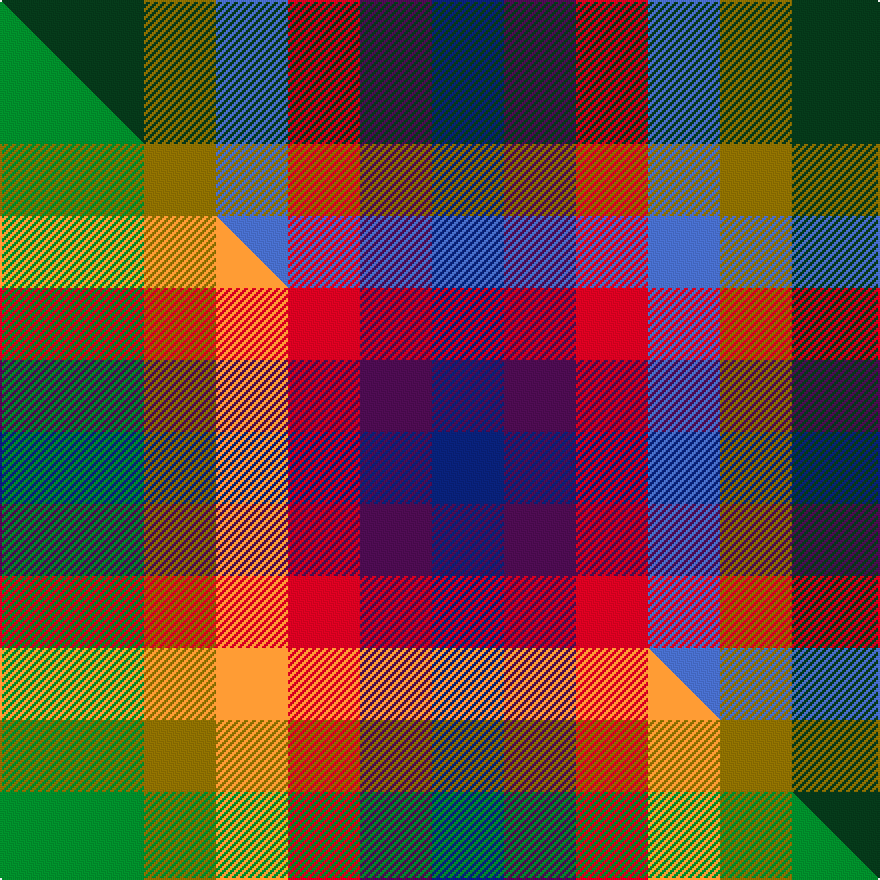

This is one **variant** — a specific cloth: this exact thread count and colourway, with its own
provenance below. It is one weaving of the [sett](/setts/dg2y1b1r1dp1db1/) (the scale-free proportion — the
same cloth at any scale or shade), whose colour order is pattern [BBRBGG](/stripes/bbrbgg/).

Part of the [Rainbow](/tartans/rainbow-7/) tartan — the named design grouping this sett with its other cloths.

Sourced from weddslist.  It is a [6 stripe tartan](/stripes/stripes6/).

Original link [http://www.weddslist.com/cgi-bin/tartans/pg.pl?source=sts](http://www.weddslist.com/cgi-bin/tartans/pg.pl?source=sts)

Dataset <small>— provenance for this record, inherited from the source manifest</small>

<dl class="dataset-prov">
<dt>source</dt><dd><a href="/sources/weddslist/">Weddslist</a></dd>
<dt>data captured from</dt><dd><a href="https://github.com/thetartan/tartan-database/blob/master/data/weddslist/data.csv">https://github.com/thetartan/tartan-database/blob/master/data/weddslist/data.csv</a></dd>
<dt>data date</dt><dd>2016-11-17 <small>(dataset default)</small></dd>
<dt>licence</dt><dd><a href="https://creativecommons.org/licenses/by-nc-nd/4.0/">CC BY-NC-ND 4.0</a></dd>
</dl>

Capture chain <small>— the hands this data passed through, oldest first; each capture carries its own licence</small>

<ol class="capture-chain">
<li><a href="https://www.weddslist.com/tartans/">Weddslist</a> <small>the living privately compiled reference</small></li>
<li><a href="https://github.com/thetartan/tartan-database">thetartan/tartan-database</a> <small>2016-2017</small> · <a href="https://creativecommons.org/licenses/by-nc-nd/4.0/">CC BY-NC-ND 4.0</a> <small>Levko Kravets's frozen compilation — the capture we vendored, and where its CC licence text came from</small></li>
<li>this dictionary <small>captured 2026-06-10 · commit 5bf86c7566</small> <small>each re-capture is a git commit to data/sources</small></li>
</ol>

## Thread count
DG/72 Y36 B36 R36 DP36 DB/36

One full sett is **396 threads**.

## Palette
<table><thead><tr><th>Colour</th><th>Shade</th><th>OKLCh</th></tr></thead><tbody><tr><td>DB</td><td><code style="background-color:#082077;">#082077</code> <small style="color:#888">#082077</small></td><td><small style="color:#888">oklch(30.0% 0.149 265.1)</small></td></tr><tr><td>DG</td><td><code style="background-color:#053819;">#053819</code> <small style="color:#888">#053819</small></td><td><small style="color:#888">oklch(30.0% 0.075 151.3)</small></td></tr><tr><td>B</td><td><code style="background-color:#466CC8;">#466CC8</code> <small style="color:#888">#466CC8</small></td><td><small style="color:#888">oklch(55.1% 0.149 265.0)</small></td></tr><tr><td>DP</td><td><code style="background-color:#4B0B4F;">#4B0B4F</code> <small style="color:#888">#4B0B4F</small></td><td><small style="color:#888">oklch(30.1% 0.125 325.4)</small></td></tr><tr><td>R</td><td><code style="background-color:#D60020;">#D60020</code> <small style="color:#888">#D60020</small></td><td><small style="color:#888">oklch(55.2% 0.224 25.5)</small></td></tr><tr><td>Y</td><td><code style="background-color:#8B6E00;">#8B6E00</code> <small style="color:#888">#8B6E00</small></td><td><small style="color:#888">oklch(55.1% 0.113 90.4)</small></td></tr></tbody></table>

# Sample pattern

## Compared to the master

This cloth is one sett of its design; the master sett (the exemplar the design is anchored on) is below for comparison.

Its **ΔTartan distance** from the master is **0.40** — the same measure the nearest-tartans table ranks by (0 is identical; a re-scale of the same cloth is near 0, a recolour or a different proportion further).

<figure class="master-compare" style="margin:0">

this sett
master sett ★

<figcaption style="color:#888;font-size:smaller">One weave of this sett against the <a href="/setts/g2y1lo1r1dp1db1/">master sett ★</a>, split on the diagonal: a shared proportion runs seamlessly across it with only the shades shifting; a different proportion breaks on it.</figcaption>
</figure>

## Nearest tartan variants

The nearest existing variants by ΔTartan distance, with this cloth at the top so the swatches line up against it.

ΔTartan

Threads

Variant

Sett

—

396

<a href="/variants/s6/dg2y1b1r1dp1db1~x36/">Rainbow</a>

<a href="/ttd/edit/#slug=g2y1lo1r1dp1db1~x36&amp;base=dg2y1b1r1dp1db1~x36" title="compare in the TTD">0.40</a>

396

<a href="/variants/s6/g2y1lo1r1dp1db1~x36/">Rainbow (Fashion)</a>

<a href="/ttd/edit/#slug=r2db2g3y2~x5&amp;base=dg2y1b1r1dp1db1~x36" title="compare in the TTD">0.84</a>

70

<a href="/variants/s4/r2db2g3y2~x5/">Sturch (Corporate)</a>

<a href="/ttd/edit/#slug=r13y13g13db22w4~x2&amp;base=dg2y1b1r1dp1db1~x36" title="compare in the TTD">1.29</a>

226

<a href="/variants/s5/r13y13g13db22w4~x2/">Clan Haggis World (Corporate)</a>

<a href="/ttd/edit/#slug=n25g25k6dp10r6~x2~n2203265-dp1502305&amp;base=dg2y1b1r1dp1db1~x36" title="compare in the TTD">1.60</a>

226

<a href="/variants/s5/n25g25k6dp10r6~x2~n2203265-dp1502305/">Breon (Jersey Shore, Pennsylvania) (Personal)</a>

<a href="/ttd/edit/#slug=dy19g23y3db15r11w5~x2&amp;base=dg2y1b1r1dp1db1~x36" title="compare in the TTD">1.61</a>

256

<a href="/variants/s6/dy19g23y3db15r11w5~x2/">Mekos, The</a>

<a href="/ttd/edit/#slug=dy19g23ly3db15r11w5~x2&amp;base=dg2y1b1r1dp1db1~x36" title="compare in the TTD">1.61</a>

256

<a href="/variants/s6/dy19g23ly3db15r11w5~x2/">Mekos, The</a>

<a href="/ttd/edit/#slug=db15g15lo11r17m15~x2~r2109032-m2610337&amp;base=dg2y1b1r1dp1db1~x36" title="compare in the TTD">1.69</a>

232

<a href="/variants/s5/db15g15lo11r17m15~x2~r2109032-m2610337/">Highland Princess, The</a>

<a href="/ttd/edit/#slug=r11db3dbi8w3y3g5k5~x4~db1004274-dbi1406275&amp;base=dg2y1b1r1dp1db1~x36" title="compare in the TTD">1.76</a>

240

<a href="/variants/s7/r11db3dbi8w3y3g5k5~x4~db1004274-dbi1406275/">Nicolson of Taransay Hunting (Personal)</a>

<a href="/ttd/edit/#slug=dbi1db1r1dp2dr1ly1~x10~dbi1406275-db1404245&amp;base=dg2y1b1r1dp1db1~x36" title="compare in the TTD">1.86</a>

120

<a href="/variants/s6/dbi1db1r1dp2dr1ly1~x10~dbi1406275-db1404245/">Lytley Formal (Personal)</a>

<a href="/ttd/edit/#slug=y1dr1dp2r1db1b1~x10~db1108266-b1611266&amp;base=dg2y1b1r1dp1db1~x36" title="compare in the TTD">1.86</a>

120

<a href="/variants/s6/y1dr1dp2r1db1b1~x10~db1108266-b1511266/">Lytley alias Parsons Formal (Personal)</a>

## Neighbour map

Every grey dot is one of 13621 variants placed by the first two principal components of the ΔTartan feature space (42% of its variance). Red is this tartan; blue dots are its nearest — click one to open its page.

<svg viewBox="0 0 640 380" role="img" style="max-width:100%;height:auto;border:1px solid #e0e0e0;border-radius:4px;display:block" xmlns="http://www.w3.org/2000/svg"><image href="/nn/cloud.v1.png" width="640" height="380"/><a href="/variants/s6/g2y1lo1r1dp1db1~x36/"><circle cx="22.7" cy="317.2" r="4" fill="#3465a4"><title>Rainbow (Fashion)</title></circle></a><a href="/variants/s4/r2db2g3y2~x5/"><circle cx="91.5" cy="366.0" r="4" fill="#3465a4"><title>Sturch (Corporate)</title></circle></a><a href="/variants/s5/r13y13g13db22w4~x2/"><circle cx="107.6" cy="275.0" r="4" fill="#3465a4"><title>Clan Haggis World (Corporate)</title></circle></a><a href="/variants/s5/n25g25k6dp10r6~x2~n2203265-dp1502305/"><circle cx="133.5" cy="262.7" r="4" fill="#3465a4"><title>Breon (Jersey Shore, Pennsylvania) (Personal)</title></circle></a><a href="/variants/s6/dy19g23y3db15r11w5~x2/"><circle cx="96.6" cy="231.2" r="4" fill="#3465a4"><title>Mekos, The</title></circle></a><a href="/variants/s6/dy19g23ly3db15r11w5~x2/"><circle cx="91.9" cy="230.1" r="4" fill="#3465a4"><title>Mekos, The</title></circle></a><a href="/variants/s5/db15g15lo11r17m15~x2~r2109032-m2610337/"><circle cx="14.0" cy="366.0" r="4" fill="#3465a4"><title>Highland Princess, The</title></circle></a><a href="/variants/s7/r11db3dbi8w3y3g5k5~x4~db1004274-dbi1406275/"><circle cx="14.0" cy="213.8" r="4" fill="#3465a4"><title>Nicolson of Taransay Hunting (Personal)</title></circle></a><a href="/variants/s6/dbi1db1r1dp2dr1ly1~x10~dbi1406275-db1404245/"><circle cx="37.0" cy="315.6" r="4" fill="#3465a4"><title>Lytley Formal (Personal)</title></circle></a><a href="/variants/s6/y1dr1dp2r1db1b1~x10~db1108266-b1511266/"><circle cx="54.4" cy="321.1" r="4" fill="#3465a4"><title>Lytley alias Parsons Formal (Personal)</title></circle></a><circle cx="53.8" cy="325.8" r="5" fill="#c00000"/><text x="320" y="376" text-anchor="middle" font-size="11" fill="#999">ground</text><text x="11" y="190" text-anchor="middle" font-size="11" fill="#999" transform="rotate(-90 11 190)">complexity</text></svg>

ID: /variants/s6/dg2y1b1r1dp1db1~x36/
