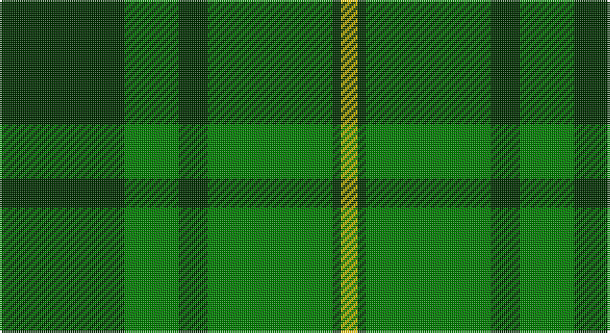

This page is one **sett** — a single exact thread-count. It belongs to the [tartan](/setts/dg30g13dg7g30dg2ly4/)
(the same proportion at any scale), whose colour order is pattern [GGGGGY](/stripes/gggggy/).

Sourced from weddslist.  It is a [6 stripe tartan](/stripes/stripes6/).

Original link http://www.weddslist.com/cgi-bin/tartans/pg.pl?source=sts

## Thread count
DG/60 G26 DG14 G60 DG4 Y/8

One full sett is **276 threads**.

## Palette

Palette: <strong>custom</strong>
<table><thead><tr><th>Colour</th><th>Threads</th><th>Shade</th><th>Base</th><th>OKLCh</th></tr></thead><tbody><tr><td>DG/</td><td style="text-align:right;font-variant-numeric:tabular-nums">60</td><td><code style="background-color:#003000;">#003000</code> <small style="color:#888">#003000</small></td><td>G <code style="background-color:#006100;">#006100</code></td><td><small style="color:#888">oklch(26.8% 0.091 142.5)</small></td></tr><tr><td>G</td><td style="text-align:right;font-variant-numeric:tabular-nums">26</td><td><code style="background-color:#008000;">#008000</code> <small style="color:#888">#008000</small></td><td>G <code style="background-color:#006100;">#006100</code></td><td><small style="color:#888">oklch(52.0% 0.177 142.5)</small></td></tr><tr><td>DG</td><td style="text-align:right;font-variant-numeric:tabular-nums">14</td><td><code style="background-color:#003000;">#003000</code> <small style="color:#888">#003000</small></td><td>G <code style="background-color:#006100;">#006100</code></td><td><small style="color:#888">oklch(26.8% 0.091 142.5)</small></td></tr><tr><td>G</td><td style="text-align:right;font-variant-numeric:tabular-nums">60</td><td><code style="background-color:#008000;">#008000</code> <small style="color:#888">#008000</small></td><td>G <code style="background-color:#006100;">#006100</code></td><td><small style="color:#888">oklch(52.0% 0.177 142.5)</small></td></tr><tr><td>DG</td><td style="text-align:right;font-variant-numeric:tabular-nums">4</td><td><code style="background-color:#003000;">#003000</code> <small style="color:#888">#003000</small></td><td>G <code style="background-color:#006100;">#006100</code></td><td><small style="color:#888">oklch(26.8% 0.091 142.5)</small></td></tr><tr><td>Y/</td><td style="text-align:right;font-variant-numeric:tabular-nums">8</td><td><code style="background-color:#F0C000;">#F0C000</code> <small style="color:#888">#F0C000</small></td><td>Y <code style="background-color:#F2BF00;">#F2BF00</code></td><td><small style="color:#888">oklch(82.7% 0.169 90.5)</small></td></tr></tbody></table>

# Sample pattern

## Nearest tartans

The nearest existing variants by ΔTartan distance, with this tartan at the top so the swatches line up against it.

ΔTartan

Tartan

Sett

—

<a href="/ttd/edit/#slug=dg30g13dg7g30dg2ly4~x2">MacSporran, Rejected design</a> <a class="nn-out" href="/variants/s6/dg30g13dg7g30dg2ly4~x2/" title="open its dictionary page">↗</a>

1.55

<a href="/ttd/edit/#slug=r2dg19g2dg2g19dg2ly2~x2&amp;base=dg30g13dg7g30dg2ly4~x2">Hunting Kenmore</a> <a class="nn-out" href="/variants/s7/r2dg19g2dg2g19dg2ly2~x2/" title="open its dictionary page">↗</a>

1.67

<a href="/ttd/edit/#slug=g3k6r2k6g3k2g16k1~x4&amp;base=dg30g13dg7g30dg2ly4~x2">Glenbarr</a> <a class="nn-out" href="/variants/s8/g3k6r2k6g3k2g16k1~x4/" title="open its dictionary page">↗</a>

1.68

<a href="/ttd/edit/#slug=g12k2g2dg9g4k2~x4&amp;base=dg30g13dg7g30dg2ly4~x2">Campbell-Simpson (Personal)</a> <a class="nn-out" href="/variants/s6/g12k2g2dg9g4k2~x4/" title="open its dictionary page">↗</a>

1.71

<a href="/ttd/edit/#slug=g4ly2g17dg2r4dg2g3dg11g2~x2&amp;base=dg30g13dg7g30dg2ly4~x2">Armagh</a> <a class="nn-out" href="/variants/s9/g4ly2g17dg2r4dg2g3dg11g2~x2/" title="open its dictionary page">↗</a>

1.74

<a href="/ttd/edit/#slug=g70k26g12k14db3k16~x2&amp;base=dg30g13dg7g30dg2ly4~x2">Duchess of Fife #2</a> <a class="nn-out" href="/variants/s6/g70k26g12k14db3k16~x2/" title="open its dictionary page">↗</a>

1.78

<a href="/ttd/edit/#slug=lo1dg11k6dg3lo1dg1lo1~x4&amp;base=dg30g13dg7g30dg2ly4~x2">Angle, Green (Fashion)</a> <a class="nn-out" href="/variants/s7/lo1dg11k6dg3lo1dg1lo1~x4/" title="open its dictionary page">↗</a>

1.79

<a href="/ttd/edit/#slug=r3g20k20g20lo2g2lo2~x2&amp;base=dg30g13dg7g30dg2ly4~x2">Paton (Personal)</a> <a class="nn-out" href="/variants/s7/r3g20k20g20lo2g2lo2~x2/" title="open its dictionary page">↗</a>

1.79

<a href="/ttd/edit/#slug=r3g30k12g6k16ly2~x2&amp;base=dg30g13dg7g30dg2ly4~x2">MacArthur (Variant)</a> <a class="nn-out" href="/variants/s6/r3g30k12g6k16ly2~x2/" title="open its dictionary page">↗</a>

1.80

<a href="/ttd/edit/#slug=g18ly2g18k4g2k15~x2&amp;base=dg30g13dg7g30dg2ly4~x2">MacArthur (Highland Society)</a> <a class="nn-out" href="/variants/s6/g18ly2g18k4g2k15~x2/" title="open its dictionary page">↗</a>

1.81

<a href="/ttd/edit/#slug=g24r9g4dg19ly2dg6g7~x2&amp;base=dg30g13dg7g30dg2ly4~x2">Doyle</a> <a class="nn-out" href="/variants/s7/g24r9g4dg19ly2dg6g7~x2/" title="open its dictionary page">↗</a>

## Neighbour map

Every grey dot is one of 14360 variants placed by the first two principal components of the ΔTartan feature space (44% of its variance). Red is this tartan; blue dots are its nearest — click one to open its page.

<svg viewBox="0 0 640 380" role="img" style="max-width:100%;height:auto;border:1px solid #e0e0e0;border-radius:4px;display:block" xmlns="http://www.w3.org/2000/svg"><image href="/nn/cloud.v1.png" width="640" height="380"/><a href="/variants/s7/r2dg19g2dg2g19dg2ly2~x2/"><circle cx="305.9" cy="208.9" r="4" fill="#3465a4"><title>Hunting Kenmore</title></circle></a><a href="/variants/s8/g3k6r2k6g3k2g16k1~x4/"><circle cx="376.4" cy="215.7" r="4" fill="#3465a4"><title>Glenbarr</title></circle></a><a href="/variants/s6/g12k2g2dg9g4k2~x4/"><circle cx="318.2" cy="274.4" r="4" fill="#3465a4"><title>Campbell-Simpson (Personal)</title></circle></a><a href="/variants/s9/g4ly2g17dg2r4dg2g3dg11g2~x2/"><circle cx="303.7" cy="209.6" r="4" fill="#3465a4"><title>Armagh</title></circle></a><a href="/variants/s6/g70k26g12k14db3k16~x2/"><circle cx="419.6" cy="222.1" r="4" fill="#3465a4"><title>Duchess of Fife #2</title></circle></a><a href="/variants/s7/lo1dg11k6dg3lo1dg1lo1~x4/"><circle cx="396.3" cy="226.6" r="4" fill="#3465a4"><title>Angle, Green (Fashion)</title></circle></a><a href="/variants/s7/r3g20k20g20lo2g2lo2~x2/"><circle cx="347.3" cy="222.0" r="4" fill="#3465a4"><title>Paton (Personal)</title></circle></a><a href="/variants/s6/r3g30k12g6k16ly2~x2/"><circle cx="319.1" cy="214.6" r="4" fill="#3465a4"><title>MacArthur (Variant)</title></circle></a><a href="/variants/s6/g18ly2g18k4g2k15~x2/"><circle cx="386.0" cy="265.9" r="4" fill="#3465a4"><title>MacArthur (Highland Society)</title></circle></a><a href="/variants/s7/g24r9g4dg19ly2dg6g7~x2/"><circle cx="303.3" cy="237.7" r="4" fill="#3465a4"><title>Doyle</title></circle></a><circle cx="342.9" cy="242.7" r="5" fill="#c00000"/></svg>

ID: /variants/s6/dg30g13dg7g30dg2ly4~x2/
