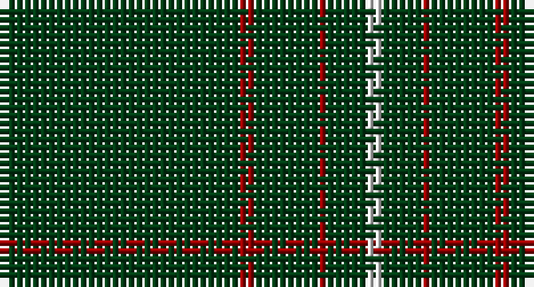

This page is one **sett** — a single exact thread-count. It belongs to the [tartan](/setts/dg30r2dg8r1dg5w2/)
(the same proportion at any scale), whose colour order is pattern [GRGRGW](/stripes/grgrgw/).

Sourced from register-of-tartans.  It is a [6 stripe tartan](/stripes/stripes6/).

Original link https://www.tartanregister.gov.uk/tartanDetails.aspx?ref=5904

## Register references

External register numbers recorded for this tartan.

- Scottish Register of Tartans: [5904](https://www.tartanregister.gov.uk/tartanDetails.aspx?ref=5904)
- Scottish Tartans World Register: 3108

## Thread count
DG/30 DR2 DG8 DR1 DG5 LN/2

One full sett is **64 threads**.

## Palette

Palette: <strong>Tartan Register</strong>
<table><thead><tr><th>Colour</th><th>Threads</th><th>Shade</th><th>Base</th><th>OKLCh</th></tr></thead><tbody><tr><td>DG/</td><td style="text-align:right;font-variant-numeric:tabular-nums">30</td><td><code style="background-color:#003C14;">#003C14</code> <small style="color:#888">#003C14</small></td><td>G <code style="background-color:#006100;">#006100</code></td><td><small style="color:#888">oklch(31.1% 0.089 148.5)</small></td></tr><tr><td>DR</td><td style="text-align:right;font-variant-numeric:tabular-nums">2</td><td><code style="background-color:#960000;">#960000</code> <small style="color:#888">#960000</small></td><td>R <code style="background-color:#CC0000;">#CC0000</code></td><td><small style="color:#888">oklch(42.3% 0.173 29.2)</small></td></tr><tr><td>DG</td><td style="text-align:right;font-variant-numeric:tabular-nums">8</td><td><code style="background-color:#003C14;">#003C14</code> <small style="color:#888">#003C14</small></td><td>G <code style="background-color:#006100;">#006100</code></td><td><small style="color:#888">oklch(31.1% 0.089 148.5)</small></td></tr><tr><td>DR</td><td style="text-align:right;font-variant-numeric:tabular-nums">1</td><td><code style="background-color:#960000;">#960000</code> <small style="color:#888">#960000</small></td><td>R <code style="background-color:#CC0000;">#CC0000</code></td><td><small style="color:#888">oklch(42.3% 0.173 29.2)</small></td></tr><tr><td>DG</td><td style="text-align:right;font-variant-numeric:tabular-nums">5</td><td><code style="background-color:#003C14;">#003C14</code> <small style="color:#888">#003C14</small></td><td>G <code style="background-color:#006100;">#006100</code></td><td><small style="color:#888">oklch(31.1% 0.089 148.5)</small></td></tr><tr><td>LN/</td><td style="text-align:right;font-variant-numeric:tabular-nums">2</td><td><code style="background-color:#E0E0E0;">#E0E0E0</code> <small style="color:#888">#E0E0E0</small></td><td>W <code style="background-color:#F7F7F7;">#F7F7F7</code></td><td><small style="color:#888">oklch(90.7% 0.000 89.9)</small></td></tr></tbody></table>

# Sample pattern

## Nearest tartans

The nearest existing variants by ΔTartan distance, with this tartan at the top so the swatches line up against it.

ΔTartan

Tartan

Sett

—

<a href="/ttd/edit/#slug=dg30r2dg8r1dg5w2">Dewi Sant</a> <a class="nn-out" href="/variants/s6/dg30r2dg8r1dg5w2/" title="open its dictionary page">↗</a>

1.37

<a href="/ttd/edit/#slug=dg30r2dg8r1dg5w2dg5r1dg8r2dg30&amp;base=dg30r2dg8r1dg5w2">Brithwe Dewi Sant (Welsh)</a> <a class="nn-out" href="/variants/s11/dg30r2dg8r1dg5w2dg5r1dg8r2dg30/" title="open its dictionary page">↗</a>

1.37

<a href="/ttd/edit/#slug=dg60r2dg8r1dg5w2&amp;base=dg30r2dg8r1dg5w2">St. David's Welsh District Tartan</a> <a class="nn-out" href="/variants/s6/dg60r2dg8r1dg5w2/" title="open its dictionary page">↗</a>

1.84

<a href="/ttd/edit/#slug=dg62r7k4r4dg62~x2&amp;base=dg30r2dg8r1dg5w2">MacNab, Ancient</a> <a class="nn-out" href="/variants/s5/dg62r7k4r4dg62~x2/" title="open its dictionary page">↗</a>

1.87

<a href="/ttd/edit/#slug=do10ly1do30y3~x4&amp;base=dg30r2dg8r1dg5w2">Pasteur Fancy Tartan</a> <a class="nn-out" href="/variants/s4/do10ly1do30y3~x4/" title="open its dictionary page">↗</a>

1.95

<a href="/ttd/edit/#slug=g2dp2g20g2g2dp1~x4&amp;base=dg30r2dg8r1dg5w2">Walters (Personal)</a> <a class="nn-out" href="/variants/s6/g2dp2g20g2g2dp1~x4/" title="open its dictionary page">↗</a>

2.03

<a href="/variants/s8/r8g3r4g44w4~x2/">Welsh National</a>

2.04

<a href="/ttd/edit/#slug=k60t3k9g7&amp;base=dg30r2dg8r1dg5w2">Wallington (Corporate?)</a> <a class="nn-out" href="/variants/s4/k60t3k9g7/" title="open its dictionary page">↗</a>

2.09

<a href="/ttd/edit/#slug=k72r3k11t9k11r3k37&amp;base=dg30r2dg8r1dg5w2">Chafyn House (School)</a> <a class="nn-out" href="/variants/s7/k72r3k11t9k11r3k37/" title="open its dictionary page">↗</a>

2.14

<a href="/ttd/edit/#slug=r2k3g45k3ly2&amp;base=dg30r2dg8r1dg5w2">Mar Tribe</a> <a class="nn-out" href="/variants/s5/r2k3g45k3ly2/" title="open its dictionary page">↗</a>

2.18

<a href="/ttd/edit/#slug=dy10ly1dy30y3~x4&amp;base=dg30r2dg8r1dg5w2">Pasteur</a> <a class="nn-out" href="/variants/s4/dy10ly1dy30y3~x4/" title="open its dictionary page">↗</a>

## Neighbour map

Every grey dot is one of 14360 variants placed by the first two principal components of the ΔTartan feature space (44% of its variance). Red is this tartan; blue dots are its nearest — click one to open its page.

<svg viewBox="0 0 640 380" role="img" style="max-width:100%;height:auto;border:1px solid #e0e0e0;border-radius:4px;display:block" xmlns="http://www.w3.org/2000/svg"><image href="/nn/cloud.v1.png" width="640" height="380"/><a href="/variants/s11/dg30r2dg8r1dg5w2dg5r1dg8r2dg30/"><circle cx="626.0" cy="181.5" r="4" fill="#3465a4"><title>Brithwe Dewi Sant (Welsh)</title></circle></a><a href="/variants/s6/dg60r2dg8r1dg5w2/"><circle cx="626.0" cy="171.0" r="4" fill="#3465a4"><title>St. David's Welsh District Tartan</title></circle></a><a href="/variants/s5/dg62r7k4r4dg62~x2/"><circle cx="626.0" cy="264.5" r="4" fill="#3465a4"><title>MacNab, Ancient</title></circle></a><a href="/variants/s4/do10ly1do30y3~x4/"><circle cx="626.0" cy="232.1" r="4" fill="#3465a4"><title>Pasteur Fancy Tartan</title></circle></a><a href="/variants/s6/g2dp2g20g2g2dp1~x4/"><circle cx="626.0" cy="226.0" r="4" fill="#3465a4"><title>Walters (Personal)</title></circle></a><a href="/variants/s8/r8g3r4g44w4~x2/"><circle cx="575.0" cy="207.6" r="4" fill="#3465a4"><title>Welsh National</title></circle></a><a href="/variants/s4/k60t3k9g7/"><circle cx="626.0" cy="231.8" r="4" fill="#3465a4"><title>Wallington (Corporate?)</title></circle></a><a href="/variants/s7/k72r3k11t9k11r3k37/"><circle cx="626.0" cy="214.1" r="4" fill="#3465a4"><title>Chafyn House (School)</title></circle></a><a href="/variants/s5/r2k3g45k3ly2/"><circle cx="588.3" cy="184.8" r="4" fill="#3465a4"><title>Mar Tribe</title></circle></a><a href="/variants/s4/dy10ly1dy30y3~x4/"><circle cx="626.0" cy="239.1" r="4" fill="#3465a4"><title>Pasteur</title></circle></a><circle cx="626.0" cy="202.3" r="5" fill="#c00000"/></svg>

ID: /variants/s6/dg30r2dg8r1dg5w2/
