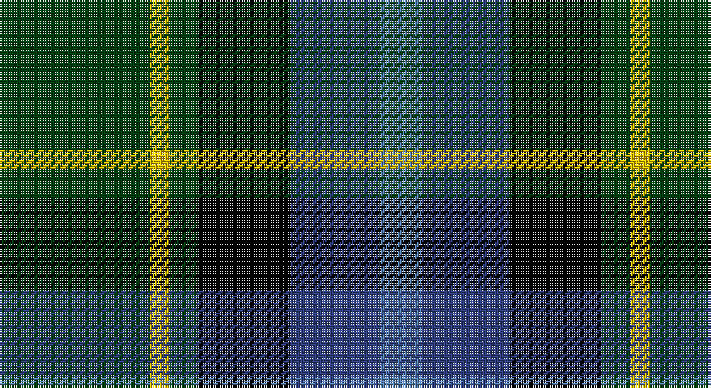

This page is one **sett** — a single exact thread-count. It belongs to the [tartan](/setts/dg31ly4dg6k19db18t9/)
(the same proportion at any scale), whose colour order is pattern [BBKGYG](/stripes/bbkgyg/).

Part of the [Lanark](/tartans/lanark/) tartan — the named design grouping this sett with its other cloths.

Sourced from weddslist.  It is a [6 stripe tartan](/stripes/stripes6/).

Original link http://www.weddslist.com/cgi-bin/tartans/pg.pl?source=sts

## Thread count
DG/62 Y8 DG12 K38 B36 Ba/18

One full sett is **268 threads**.

## Palette

Palette: <strong>Ingles Buchan</strong> <small style="color:#888">(1 of 5 colours)</small>
<table><thead><tr><th>Colour</th><th>Threads</th><th>Shade</th><th>Base</th><th>OKLCh</th></tr></thead><tbody><tr><td>DG/</td><td style="text-align:right;font-variant-numeric:tabular-nums">62</td><td><code style="background-color:#004010;">#004010</code> <small style="color:#888">#004010</small></td><td>G <code style="background-color:#006100;">#006100</code></td><td><small style="color:#888">oklch(32.3% 0.098 146.3)</small></td></tr><tr><td>Y</td><td style="text-align:right;font-variant-numeric:tabular-nums">8</td><td><code style="background-color:#F0C000;">#F0C000</code> <small style="color:#888">#F0C000</small></td><td>Y <code style="background-color:#F2BF00;">#F2BF00</code></td><td><small style="color:#888">oklch(82.7% 0.169 90.5)</small></td></tr><tr><td>DG</td><td style="text-align:right;font-variant-numeric:tabular-nums">12</td><td><code style="background-color:#004010;">#004010</code> <small style="color:#888">#004010</small></td><td>G <code style="background-color:#006100;">#006100</code></td><td><small style="color:#888">oklch(32.3% 0.098 146.3)</small></td></tr><tr><td>K</td><td style="text-align:right;font-variant-numeric:tabular-nums">38</td><td><code style="background-color:#000000;">#000000</code> <small style="color:#888">#000000</small></td><td>K <code style="background-color:#000000;">#000000</code></td><td><small style="color:#888">oklch(0.0% 0.000 0.0)</small></td></tr><tr><td>B</td><td style="text-align:right;font-variant-numeric:tabular-nums">36</td><td><code style="background-color:#304080;">#304080</code> <small style="color:#888">#304080</small></td><td>B <code style="background-color:#2A418A;">#2A418A</code></td><td><small style="color:#888">oklch(39.4% 0.109 270.2)</small></td></tr><tr><td>Ba/</td><td style="text-align:right;font-variant-numeric:tabular-nums">18</td><td><code style="background-color:#5480B0;">#5480B0</code> <small style="color:#888">#5480B0</small></td><td>B <code style="background-color:#2A418A;">#2A418A</code></td><td><small style="color:#888">oklch(58.8% 0.089 251.5)</small></td></tr></tbody></table>

# Sample pattern

## Compared to the master

This cloth is one sett of its design; the master sett (the exemplar the design is anchored on) is below for comparison.

<figure style="margin:0"><figcaption style="color:#888;font-size:smaller">this sett</figcaption></figure>
<figure style="margin:0"><figcaption style="color:#888;font-size:smaller"><a href="/setts/r1db3dr1g3dr5lb1/">master sett →</a></figcaption></figure>

## Nearest tartans

The nearest existing variants by ΔTartan distance, with this tartan at the top so the swatches line up against it.

ΔTartan

Tartan

Sett

—

<a href="/ttd/edit/#slug=dg31ly4dg6k19db18t9~x2">Lanark</a> <a class="nn-out" href="/variants/s6/dg31ly4dg6k19db18t9~x2/" title="open its dictionary page">↗</a>

0.74

<a href="/ttd/edit/#slug=r2dg8ly1k8dg8db8r2&amp;base=dg31ly4dg6k19db18t9~x2">Brodie Hunting</a> <a class="nn-out" href="/variants/s7/r2dg8ly1k8dg8db8r2/" title="open its dictionary page">↗</a>

0.81

<a href="/variants/s7/k7db11ki3db11dy11g22db3~x2/">Scottish Odyssey Commemorative Tartan</a>

0.83

<a href="/ttd/edit/#slug=k2ly1dg6k6db6w1~x4&amp;base=dg31ly4dg6k19db18t9~x2">Dyce #3</a> <a class="nn-out" href="/variants/s6/k2ly1dg6k6db6w1~x4/" title="open its dictionary page">↗</a>

0.86

<a href="/ttd/edit/#slug=db31b4db5k19g20ly4~x2&amp;base=dg31ly4dg6k19db18t9~x2">Midlothian</a> <a class="nn-out" href="/variants/s6/db31b4db5k19g20ly4~x2/" title="open its dictionary page">↗</a>

0.86

<a href="/ttd/edit/#slug=k4w1g10k10db10r2~x4&amp;base=dg31ly4dg6k19db18t9~x2">Rose Hunting</a> <a class="nn-out" href="/variants/s6/k4w1g10k10db10r2~x4/" title="open its dictionary page">↗</a>

0.87

<a href="/ttd/edit/#slug=dg4lb1dg10k10db10r2&amp;base=dg31ly4dg6k19db18t9~x2">Rose Hunting</a> <a class="nn-out" href="/variants/s6/dg4lb1dg10k10db10r2/" title="open its dictionary page">↗</a>

0.90

<a href="/ttd/edit/#slug=g16lb3g3k10db12r2db3~x2&amp;base=dg31ly4dg6k19db18t9~x2">MacLean, Donald (Personal)</a> <a class="nn-out" href="/variants/s7/g16lb3g3k10db12r2db3~x2/" title="open its dictionary page">↗</a>

0.94

<a href="/ttd/edit/#slug=k4w1g10k10db10r2~x2&amp;base=dg31ly4dg6k19db18t9~x2">Rose Hunting Clan Tartan</a> <a class="nn-out" href="/variants/s6/k4w1g10k10db10r2~x2/" title="open its dictionary page">↗</a>

0.94

<a href="/ttd/edit/#slug=r1db6k3dg6lb1&amp;base=dg31ly4dg6k19db18t9~x2">Davidson of Tulloch</a> <a class="nn-out" href="/variants/s5/r1db6k3dg6lb1/" title="open its dictionary page">↗</a>

0.96

<a href="/ttd/edit/#slug=ly3dt17n9k25lb3~x2&amp;base=dg31ly4dg6k19db18t9~x2">Teylu Coleman (Name)</a> <a class="nn-out" href="/variants/s5/ly3dt17n9k25lb3~x2/" title="open its dictionary page">↗</a>

## Neighbour map

Every grey dot is one of 14360 variants placed by the first two principal components of the ΔTartan feature space (44% of its variance). Red is this tartan; blue dots are its nearest — click one to open its page.

<svg viewBox="0 0 640 380" role="img" style="max-width:100%;height:auto;border:1px solid #e0e0e0;border-radius:4px;display:block" xmlns="http://www.w3.org/2000/svg"><image href="/nn/cloud.v1.png" width="640" height="380"/><a href="/variants/s7/r2dg8ly1k8dg8db8r2/"><circle cx="153.9" cy="225.4" r="4" fill="#3465a4"><title>Brodie Hunting</title></circle></a><a href="/variants/s7/k7db11ki3db11dy11g22db3~x2/"><circle cx="127.8" cy="225.1" r="4" fill="#3465a4"><title>Scottish Odyssey Commemorative Tartan</title></circle></a><a href="/variants/s6/k2ly1dg6k6db6w1~x4/"><circle cx="135.4" cy="240.4" r="4" fill="#3465a4"><title>Dyce #3</title></circle></a><a href="/variants/s6/db31b4db5k19g20ly4~x2/"><circle cx="158.7" cy="210.0" r="4" fill="#3465a4"><title>Midlothian</title></circle></a><a href="/variants/s6/k4w1g10k10db10r2~x4/"><circle cx="166.4" cy="224.3" r="4" fill="#3465a4"><title>Rose Hunting</title></circle></a><a href="/variants/s6/dg4lb1dg10k10db10r2/"><circle cx="157.2" cy="225.7" r="4" fill="#3465a4"><title>Rose Hunting</title></circle></a><a href="/variants/s7/g16lb3g3k10db12r2db3~x2/"><circle cx="164.3" cy="216.4" r="4" fill="#3465a4"><title>MacLean, Donald (Personal)</title></circle></a><a href="/variants/s6/k4w1g10k10db10r2~x2/"><circle cx="170.5" cy="226.5" r="4" fill="#3465a4"><title>Rose Hunting Clan Tartan</title></circle></a><a href="/variants/s5/r1db6k3dg6lb1/"><circle cx="126.1" cy="243.3" r="4" fill="#3465a4"><title>Davidson of Tulloch</title></circle></a><a href="/variants/s5/ly3dt17n9k25lb3~x2/"><circle cx="192.0" cy="222.9" r="4" fill="#3465a4"><title>Teylu Coleman (Name)</title></circle></a><circle cx="154.0" cy="229.3" r="5" fill="#c00000"/></svg>

ID: /variants/s6/dg31ly4dg6k19db18t9~x2/
