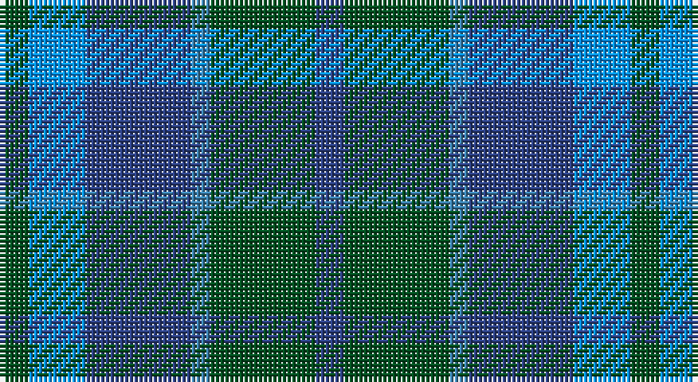

This page is one **sett** — a single exact thread-count. It belongs to the [tartan](/setts/dg3b6db11t2dg11db3/)
(the same proportion at any scale), whose colour order is pattern [BGBBBG](/stripes/bgbbbg/).

Sourced from register-of-tartans.  It is a [6 stripe tartan](/stripes/stripes6/).

Original link https://www.tartanregister.gov.uk/tartanDetails.aspx?ref=4395

## Register references

External register numbers recorded for this tartan.

- Scottish Register of Tartans: [4395](https://www.tartanregister.gov.uk/tartanDetails.aspx?ref=4395)
- Scottish Tartans World Register: 110

## Thread count
G/6 Bb12 B22 Ba4 G22 B/6

One full sett is **132 threads**.

## Palette

Palette: <strong>Tartan Register</strong>
<table><thead><tr><th>Colour</th><th>Threads</th><th>Shade</th><th>Base</th><th>OKLCh</th></tr></thead><tbody><tr><td>G/</td><td style="text-align:right;font-variant-numeric:tabular-nums">6</td><td><code style="background-color:#005020;">#005020</code> <small style="color:#888">#005020</small></td><td>G <code style="background-color:#006100;">#006100</code></td><td><small style="color:#888">oklch(37.7% 0.105 149.6)</small></td></tr><tr><td>Bb</td><td style="text-align:right;font-variant-numeric:tabular-nums">12</td><td><code style="background-color:#0596FA;">#0596FA</code> <small style="color:#888">#0596FA</small></td><td>B <code style="background-color:#2A418A;">#2A418A</code></td><td><small style="color:#888">oklch(66.0% 0.180 248.9)</small></td></tr><tr><td>B</td><td style="text-align:right;font-variant-numeric:tabular-nums">22</td><td><code style="background-color:#2C4084;">#2C4084</code> <small style="color:#888">#2C4084</small></td><td>B <code style="background-color:#2A418A;">#2A418A</code></td><td><small style="color:#888">oklch(39.4% 0.117 268.3)</small></td></tr><tr><td>Ba</td><td style="text-align:right;font-variant-numeric:tabular-nums">4</td><td><code style="background-color:#3C82AF;">#3C82AF</code> <small style="color:#888">#3C82AF</small></td><td>B <code style="background-color:#2A418A;">#2A418A</code></td><td><small style="color:#888">oklch(58.1% 0.099 239.8)</small></td></tr><tr><td>G</td><td style="text-align:right;font-variant-numeric:tabular-nums">22</td><td><code style="background-color:#005020;">#005020</code> <small style="color:#888">#005020</small></td><td>G <code style="background-color:#006100;">#006100</code></td><td><small style="color:#888">oklch(37.7% 0.105 149.6)</small></td></tr><tr><td>B/</td><td style="text-align:right;font-variant-numeric:tabular-nums">6</td><td><code style="background-color:#2C4084;">#2C4084</code> <small style="color:#888">#2C4084</small></td><td>B <code style="background-color:#2A418A;">#2A418A</code></td><td><small style="color:#888">oklch(39.4% 0.117 268.3)</small></td></tr></tbody></table>

# Sample pattern

## Nearest tartans

The nearest existing variants by ΔTartan distance, with this tartan at the top so the swatches line up against it.

ΔTartan

Tartan

Sett

—

<a href="/ttd/edit/#slug=dg3b6db11t2dg11db3~x2">Unidentified No 29</a> <a class="nn-out" href="/variants/s6/dg3b6db11t2dg11db3~x2/" title="open its dictionary page">↗</a>

0.95

<a href="/ttd/edit/#slug=db3g11t2db11b6g3~x2&amp;base=dg3b6db11t2dg11db3~x2">Unnamed, No 29</a> <a class="nn-out" href="/variants/s6/db3g11t2db11b6g3~x2/" title="open its dictionary page">↗</a>

1.19

<a href="/ttd/edit/#slug=g3t1db7t1g3k1~x8&amp;base=dg3b6db11t2dg11db3~x2">Scott Green (Sir Walter)</a> <a class="nn-out" href="/variants/s6/g3t1db7t1g3k1~x8/" title="open its dictionary page">↗</a>

1.20

<a href="/ttd/edit/#slug=o1b7k4b1g7b1~x4&amp;base=dg3b6db11t2dg11db3~x2">Flower of Scotland Commemorative Tartan</a> <a class="nn-out" href="/variants/s6/o1b7k4b1g7b1~x4/" title="open its dictionary page">↗</a>

1.20

<a href="/ttd/edit/#slug=o1b7k4b1g7b1~x2&amp;base=dg3b6db11t2dg11db3~x2">Flower of Scotland MINI Tartan</a> <a class="nn-out" href="/variants/s6/o1b7k4b1g7b1~x2/" title="open its dictionary page">↗</a>

1.29

<a href="/ttd/edit/#slug=g21k14g9db21k3db12dp3~x2&amp;base=dg3b6db11t2dg11db3~x2">Scotsman</a> <a class="nn-out" href="/variants/s7/g21k14g9db21k3db12dp3~x2/" title="open its dictionary page">↗</a>

1.41

<a href="/ttd/edit/#slug=db2k2db12k8dg11r2~x2&amp;base=dg3b6db11t2dg11db3~x2">Murray #3</a> <a class="nn-out" href="/variants/s6/db2k2db12k8dg11r2~x2/" title="open its dictionary page">↗</a>

1.46

<a href="/ttd/edit/#slug=n4g18n3k17n18p4~x2&amp;base=dg3b6db11t2dg11db3~x2">Scottish Airports</a> <a class="nn-out" href="/variants/s6/n4g18n3k17n18p4~x2/" title="open its dictionary page">↗</a>

1.50

<a href="/ttd/edit/#slug=g11t2db11t6g3t6db11t2g11db3~x2&amp;base=dg3b6db11t2dg11db3~x2">Norwich No.029</a> <a class="nn-out" href="/variants/s10/g11t2db11t6g3t6db11t2g11db3~x2/" title="open its dictionary page">↗</a>

1.51

<a href="/ttd/edit/#slug=db8dg8db1dg8k8db8ly2~x2&amp;base=dg3b6db11t2dg11db3~x2">MacKay</a> <a class="nn-out" href="/variants/s7/db8dg8db1dg8k8db8ly2~x2/" title="open its dictionary page">↗</a>

1.51

<a href="/ttd/edit/#slug=db1g10db9b10db1b1~x4&amp;base=dg3b6db11t2dg11db3~x2">Black Watch (Aljean)</a> <a class="nn-out" href="/variants/s6/db1g10db9b10db1b1~x4/" title="open its dictionary page">↗</a>

## Neighbour map

Every grey dot is one of 14360 variants placed by the first two principal components of the ΔTartan feature space (44% of its variance). Red is this tartan; blue dots are its nearest — click one to open its page.

<svg viewBox="0 0 640 380" role="img" style="max-width:100%;height:auto;border:1px solid #e0e0e0;border-radius:4px;display:block" xmlns="http://www.w3.org/2000/svg"><image href="/nn/cloud.v1.png" width="640" height="380"/><a href="/variants/s6/db3g11t2db11b6g3~x2/"><circle cx="198.5" cy="274.3" r="4" fill="#3465a4"><title>Unnamed, No 29</title></circle></a><a href="/variants/s6/g3t1db7t1g3k1~x8/"><circle cx="249.7" cy="253.0" r="4" fill="#3465a4"><title>Scott Green (Sir Walter)</title></circle></a><a href="/variants/s6/o1b7k4b1g7b1~x4/"><circle cx="238.7" cy="253.6" r="4" fill="#3465a4"><title>Flower of Scotland Commemorative Tartan</title></circle></a><a href="/variants/s6/o1b7k4b1g7b1~x2/"><circle cx="238.7" cy="253.6" r="4" fill="#3465a4"><title>Flower of Scotland MINI Tartan</title></circle></a><a href="/variants/s7/g21k14g9db21k3db12dp3~x2/"><circle cx="210.8" cy="270.0" r="4" fill="#3465a4"><title>Scotsman</title></circle></a><a href="/variants/s6/db2k2db12k8dg11r2~x2/"><circle cx="217.5" cy="273.5" r="4" fill="#3465a4"><title>Murray #3</title></circle></a><a href="/variants/s6/n4g18n3k17n18p4~x2/"><circle cx="211.5" cy="276.1" r="4" fill="#3465a4"><title>Scottish Airports</title></circle></a><a href="/variants/s10/g11t2db11t6g3t6db11t2g11db3~x2/"><circle cx="207.4" cy="277.7" r="4" fill="#3465a4"><title>Norwich No.029</title></circle></a><a href="/variants/s7/db8dg8db1dg8k8db8ly2~x2/"><circle cx="200.6" cy="277.9" r="4" fill="#3465a4"><title>MacKay</title></circle></a><a href="/variants/s6/db1g10db9b10db1b1~x4/"><circle cx="251.0" cy="259.4" r="4" fill="#3465a4"><title>Black Watch (Aljean)</title></circle></a><circle cx="212.8" cy="285.9" r="5" fill="#c00000"/></svg>

ID: /variants/s6/dg3b6db11t2dg11db3~x2/
