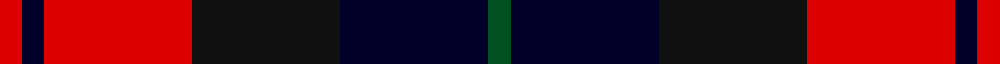
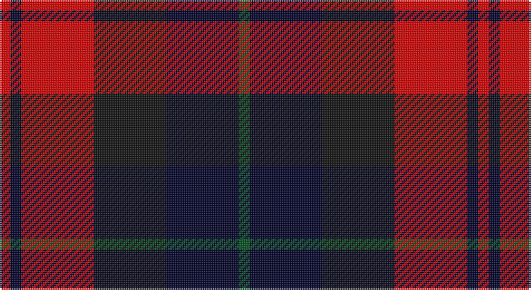

This page is one **sett** — a single exact thread-count. It belongs to the [tartan](/setts/dg3k20ki20r20k3r3/)
(the same proportion at any scale), whose colour order is pattern [GKKRKR](/stripes/gkkrkr/).

Part of the [Unidentified](/tartans/unidentified/) tartan — the named design grouping this sett with its other cloths.

Sourced from register-of-tartans.  It is a [6 stripe tartan](/stripes/stripes6/).

Original link https://www.tartanregister.gov.uk/tartanDetails.aspx?ref=5055

## Also known as

This cloth is also recorded under:

- Unidentified #10
- Unidentified #12
- Unidentified #14
- Unidentified #15
- Unidentified #16
- Unidentified #18
- Unidentified #2
- Unidentified #21
- Unidentified #22
- Unidentified #24
- Unidentified #25
- Unidentified #28
- Unidentified #29
- Unidentified #30
- Unidentified #31
- Unidentified #32
- Unidentified #36
- Unidentified #37
- Unidentified #38
- Unidentified #40
- Unidentified #43
- Unidentified #44
- Unidentified #45
- Unidentified #46
- Unidentified #47
- Unidentified #48
- Unidentified #49
- Unidentified #5
- Unidentified #50
- Unidentified #51
- Unidentified #52
- Unidentified #53
- Unidentified #54
- Unidentified #55
- Unidentified #56
- Unidentified #57
- Unidentified #58
- Unidentified #59
- Unidentified #60
- Unidentified #61
- Unidentified #62
- Unidentified #63
- Unidentified #64
- Unidentified #65
- Unidentified #66
- Unidentified #7
- Unidentified #8
- Unidentified #9
- Unidentified 16
- Unidentified Artifact
- Unidentified Plaid
- Unidentified Plaid #11
- Unidentified Plaid #13
- Unidentified Plaid #2
- Unidentified Plaid #3
- Unidentified Plaid #7
- Unidentified Plaid #8
- Unidentified Plaid #9
- Unidentified Portrait

## Register references

External register numbers recorded for this tartan.

- Scottish Register of Tartans: [5055](https://www.tartanregister.gov.uk/tartanDetails.aspx?ref=5055)
- Scottish Tartans World Register: 3056

## Thread count
R/6 DB6 R40 K40 DB40 G/6

One full sett is **264 threads**.

## Palette

Palette: <strong>Tartan Register</strong> <small style="color:#888">(3 of 4 colours)</small>
<table><thead><tr><th>Colour</th><th>Threads</th><th>Shade</th><th>Base</th><th>OKLCh</th></tr></thead><tbody><tr><td>R/</td><td style="text-align:right;font-variant-numeric:tabular-nums">6</td><td><code style="background-color:#DC0000;">#DC0000</code> <small style="color:#888">#DC0000</small></td><td>R <code style="background-color:#CC0000;">#CC0000</code></td><td><small style="color:#888">oklch(56.2% 0.230 29.2)</small></td></tr><tr><td>DB</td><td style="text-align:right;font-variant-numeric:tabular-nums">6</td><td><code style="background-color:#000028;">#000028</code> <small style="color:#888">#000028</small></td><td>K <code style="background-color:#000000;">#000000</code></td><td><small style="color:#888">oklch(12.5% 0.087 264.1)</small></td></tr><tr><td>R</td><td style="text-align:right;font-variant-numeric:tabular-nums">40</td><td><code style="background-color:#DC0000;">#DC0000</code> <small style="color:#888">#DC0000</small></td><td>R <code style="background-color:#CC0000;">#CC0000</code></td><td><small style="color:#888">oklch(56.2% 0.230 29.2)</small></td></tr><tr><td>K</td><td style="text-align:right;font-variant-numeric:tabular-nums">40</td><td><code style="background-color:#101010;">#101010</code> <small style="color:#888">#101010</small></td><td>K <code style="background-color:#000000;">#000000</code></td><td><small style="color:#888">oklch(17.3% 0.000 89.9)</small></td></tr><tr><td>DB</td><td style="text-align:right;font-variant-numeric:tabular-nums">40</td><td><code style="background-color:#000028;">#000028</code> <small style="color:#888">#000028</small></td><td>K <code style="background-color:#000000;">#000000</code></td><td><small style="color:#888">oklch(12.5% 0.087 264.1)</small></td></tr><tr><td>G/</td><td style="text-align:right;font-variant-numeric:tabular-nums">6</td><td><code style="background-color:#005020;">#005020</code> <small style="color:#888">#005020</small></td><td>G <code style="background-color:#006100;">#006100</code></td><td><small style="color:#888">oklch(37.7% 0.105 149.6)</small></td></tr></tbody></table>

# Sample pattern

## Compared to the master

This cloth is one sett of its design; the master sett (the exemplar the design is anchored on) is below for comparison.

<figure style="margin:0"><figcaption style="color:#888;font-size:smaller">this sett</figcaption></figure>
<figure style="margin:0"><figcaption style="color:#888;font-size:smaller"><a href="/setts/dp4r3dp26r26dg26r4/">master sett →</a></figcaption></figure>

## Nearest tartans

The nearest existing variants by ΔTartan distance, with this tartan at the top so the swatches line up against it.

ΔTartan

Tartan

Sett

—

<a href="/ttd/edit/#slug=dg3k20ki20r20k3r3~x2">Unidentified #65</a> <a class="nn-out" href="/variants/s6/dg3k20ki20r20k3r3~x2/" title="open its dictionary page">↗</a>

1.11

<a href="/ttd/edit/#slug=r26t3r4k16db16k4~x2&amp;base=dg3k20ki20r20k3r3~x2">Graham of Menteith, (Red)</a> <a class="nn-out" href="/variants/s6/r26t3r4k16db16k4~x2/" title="open its dictionary page">↗</a>

1.11

<a href="/ttd/edit/#slug=lo5db2k2db12k16r20k2r4~x2&amp;base=dg3k20ki20r20k3r3~x2">Aitken</a> <a class="nn-out" href="/variants/s8/lo5db2k2db12k16r20k2r4~x2/" title="open its dictionary page">↗</a>

1.13

<a href="/ttd/edit/#slug=oi4db19oi3k20o24db3~x2&amp;base=dg3k20ki20r20k3r3~x2">Edinburgh International Conference Centre</a> <a class="nn-out" href="/variants/s6/oi4db19oi3k20o24db3~x2/" title="open its dictionary page">↗</a>

1.14

<a href="/ttd/edit/#slug=db5k1g1k1r3k1~x4&amp;base=dg3k20ki20r20k3r3~x2">Clerk</a> <a class="nn-out" href="/variants/s6/db5k1g1k1r3k1~x4/" title="open its dictionary page">↗</a>

1.14

<a href="/ttd/edit/#slug=k4o19k19o2dp22w4~x2&amp;base=dg3k20ki20r20k3r3~x2">Dutch</a> <a class="nn-out" href="/variants/s6/k4o19k19o2dp22w4~x2/" title="open its dictionary page">↗</a>

1.16

<a href="/variants/s5/ki3r29ki11k29t3~x2/">Wallace Red Dress Tartan</a>

1.19

<a href="/ttd/edit/#slug=k1dg8r6db8k1~x4&amp;base=dg3k20ki20r20k3r3~x2">Edinburgh Military Tattoo 50th</a> <a class="nn-out" href="/variants/s5/k1dg8r6db8k1~x4/" title="open its dictionary page">↗</a>

1.22

<a href="/ttd/edit/#slug=ly3db22k3db3k11r20ly3~x2&amp;base=dg3k20ki20r20k3r3~x2">Biffy Clyro</a> <a class="nn-out" href="/variants/s7/ly3db22k3db3k11r20ly3~x2/" title="open its dictionary page">↗</a>

1.27

<a href="/ttd/edit/#slug=db13k13db13r29ly4~x2&amp;base=dg3k20ki20r20k3r3~x2">Highland Pub Company</a> <a class="nn-out" href="/variants/s5/db13k13db13r29ly4~x2/" title="open its dictionary page">↗</a>

1.29

<a href="/ttd/edit/#slug=r2dp8k8w1r2~x2&amp;base=dg3k20ki20r20k3r3~x2">Inder (Corporate)</a> <a class="nn-out" href="/variants/s5/r2dp8k8w1r2~x2/" title="open its dictionary page">↗</a>

## Neighbour map

Every grey dot is one of 14360 variants placed by the first two principal components of the ΔTartan feature space (44% of its variance). Red is this tartan; blue dots are its nearest — click one to open its page.

<svg viewBox="0 0 640 380" role="img" style="max-width:100%;height:auto;border:1px solid #e0e0e0;border-radius:4px;display:block" xmlns="http://www.w3.org/2000/svg"><image href="/nn/cloud.v1.png" width="640" height="380"/><a href="/variants/s6/r26t3r4k16db16k4~x2/"><circle cx="205.3" cy="208.7" r="4" fill="#3465a4"><title>Graham of Menteith, (Red)</title></circle></a><a href="/variants/s8/lo5db2k2db12k16r20k2r4~x2/"><circle cx="188.0" cy="190.5" r="4" fill="#3465a4"><title>Aitken</title></circle></a><a href="/variants/s6/oi4db19oi3k20o24db3~x2/"><circle cx="153.2" cy="224.2" r="4" fill="#3465a4"><title>Edinburgh International Conference Centre</title></circle></a><a href="/variants/s6/db5k1g1k1r3k1~x4/"><circle cx="172.1" cy="234.5" r="4" fill="#3465a4"><title>Clerk</title></circle></a><a href="/variants/s6/k4o19k19o2dp22w4~x2/"><circle cx="152.2" cy="198.5" r="4" fill="#3465a4"><title>Dutch</title></circle></a><a href="/variants/s5/ki3r29ki11k29t3~x2/"><circle cx="204.0" cy="212.4" r="4" fill="#3465a4"><title>Wallace Red Dress Tartan</title></circle></a><a href="/variants/s5/k1dg8r6db8k1~x4/"><circle cx="167.7" cy="247.1" r="4" fill="#3465a4"><title>Edinburgh Military Tattoo 50th</title></circle></a><a href="/variants/s7/ly3db22k3db3k11r20ly3~x2/"><circle cx="163.4" cy="192.5" r="4" fill="#3465a4"><title>Biffy Clyro</title></circle></a><a href="/variants/s5/db13k13db13r29ly4~x2/"><circle cx="184.1" cy="249.7" r="4" fill="#3465a4"><title>Highland Pub Company</title></circle></a><a href="/variants/s5/r2dp8k8w1r2~x2/"><circle cx="203.1" cy="223.2" r="4" fill="#3465a4"><title>Inder (Corporate)</title></circle></a><circle cx="164.7" cy="227.9" r="5" fill="#c00000"/></svg>

ID: /variants/s6/dg3k20ki20r20k3r3~x2/
