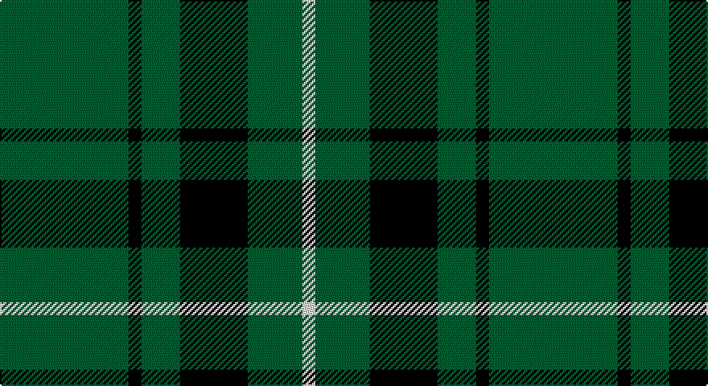

This page is one **sett** — a single exact thread-count. It belongs to the [tartan](/setts/dg40k4dg12k21dg17w4/)
(the same proportion at any scale), whose colour order is pattern [GKGKGW](/stripes/gkgkgw/).

Part of the [Granger](/tartans/granger/) tartan — the named design grouping this sett with its other cloths.

Sourced from weddslist.  It is a [6 stripe tartan](/stripes/stripes6/).

Original link http://www.weddslist.com/cgi-bin/tartans/pg.pl?source=sts

## Thread count
G/80 K8 G24 K42 G34 LN/8

One full sett is **304 threads**.

## Palette

Palette: <strong>Tartan Register</strong> <small style="color:#888">(2 of 3 colours)</small>
<table><thead><tr><th>Colour</th><th>Threads</th><th>Shade</th><th>Base</th><th>OKLCh</th></tr></thead><tbody><tr><td>G/</td><td style="text-align:right;font-variant-numeric:tabular-nums">80</td><td><code style="background-color:#006030;">#006030</code> <small style="color:#888">#006030</small></td><td>G <code style="background-color:#006100;">#006100</code></td><td><small style="color:#888">oklch(42.9% 0.111 152.8)</small></td></tr><tr><td>K</td><td style="text-align:right;font-variant-numeric:tabular-nums">8</td><td><code style="background-color:#000000;">#000000</code> <small style="color:#888">#000000</small></td><td>K <code style="background-color:#000000;">#000000</code></td><td><small style="color:#888">oklch(0.0% 0.000 0.0)</small></td></tr><tr><td>G</td><td style="text-align:right;font-variant-numeric:tabular-nums">24</td><td><code style="background-color:#006030;">#006030</code> <small style="color:#888">#006030</small></td><td>G <code style="background-color:#006100;">#006100</code></td><td><small style="color:#888">oklch(42.9% 0.111 152.8)</small></td></tr><tr><td>K</td><td style="text-align:right;font-variant-numeric:tabular-nums">42</td><td><code style="background-color:#000000;">#000000</code> <small style="color:#888">#000000</small></td><td>K <code style="background-color:#000000;">#000000</code></td><td><small style="color:#888">oklch(0.0% 0.000 0.0)</small></td></tr><tr><td>G</td><td style="text-align:right;font-variant-numeric:tabular-nums">34</td><td><code style="background-color:#006030;">#006030</code> <small style="color:#888">#006030</small></td><td>G <code style="background-color:#006100;">#006100</code></td><td><small style="color:#888">oklch(42.9% 0.111 152.8)</small></td></tr><tr><td>LN/</td><td style="text-align:right;font-variant-numeric:tabular-nums">8</td><td><code style="background-color:#E0E0E0;">#E0E0E0</code> <small style="color:#888">#E0E0E0</small></td><td>W <code style="background-color:#F7F7F7;">#F7F7F7</code></td><td><small style="color:#888">oklch(90.7% 0.000 89.9)</small></td></tr></tbody></table>

# Sample pattern

## Compared to the master

This cloth is one sett of its design; the master sett (the exemplar the design is anchored on) is below for comparison.

<figure style="margin:0"><figcaption style="color:#888;font-size:smaller">this sett</figcaption></figure>
<figure style="margin:0"><figcaption style="color:#888;font-size:smaller"><a href="/setts/db40k4db12k21g27w4/">master sett →</a></figcaption></figure>

## Nearest tartans

The nearest existing variants by ΔTartan distance, with this tartan at the top so the swatches line up against it.

ΔTartan

Tartan

Sett

—

<a href="/ttd/edit/#slug=dg40k4dg12k21dg17w4~x2">Granger</a> <a class="nn-out" href="/variants/s6/dg40k4dg12k21dg17w4~x2/" title="open its dictionary page">↗</a>

1.28

<a href="/ttd/edit/#slug=g7k1g7t1k6t1~x4&amp;base=dg40k4dg12k21dg17w4~x2">Innes, Georgina (Portrait)</a> <a class="nn-out" href="/variants/s6/g7k1g7t1k6t1~x4/" title="open its dictionary page">↗</a>

1.40

<a href="/ttd/edit/#slug=g7db1g2k3g2~x4&amp;base=dg40k4dg12k21dg17w4~x2">Peterhead</a> <a class="nn-out" href="/variants/s5/g7db1g2k3g2~x4/" title="open its dictionary page">↗</a>

1.47

<a href="/ttd/edit/#slug=g7k1g7t1k6t1~x2&amp;base=dg40k4dg12k21dg17w4~x2">Innes</a> <a class="nn-out" href="/variants/s6/g7k1g7t1k6t1~x2/" title="open its dictionary page">↗</a>

1.49

<a href="/ttd/edit/#slug=dg86lo44dg21lo44dg86t10&amp;base=dg40k4dg12k21dg17w4~x2">Special Saffron</a> <a class="nn-out" href="/variants/s6/dg86lo44dg21lo44dg86t10/" title="open its dictionary page">↗</a>

1.52

<a href="/ttd/edit/#slug=g18ly2g18k4g2k15~x2&amp;base=dg40k4dg12k21dg17w4~x2">MacArthur (Highland Society)</a> <a class="nn-out" href="/variants/s6/g18ly2g18k4g2k15~x2/" title="open its dictionary page">↗</a>

1.53

<a href="/ttd/edit/#slug=dg21ly43dg86t10&amp;base=dg40k4dg12k21dg17w4~x2">Special Saffron Tartan</a> <a class="nn-out" href="/variants/s4/dg21ly43dg86t10/" title="open its dictionary page">↗</a>

1.54

<a href="/ttd/edit/#slug=dg21lo44dg86t10&amp;base=dg40k4dg12k21dg17w4~x2">Special Saffron (Fashion)</a> <a class="nn-out" href="/variants/s4/dg21lo44dg86t10/" title="open its dictionary page">↗</a>

1.55

<a href="/ttd/edit/#slug=dg21lo43dg86b10&amp;base=dg40k4dg12k21dg17w4~x2">Special, Saffron</a> <a class="nn-out" href="/variants/s4/dg21lo43dg86b10/" title="open its dictionary page">↗</a>

1.57

<a href="/ttd/edit/#slug=g30k12g6k6db2k5~x2&amp;base=dg40k4dg12k21dg17w4~x2">Fife, Duchess of..</a> <a class="nn-out" href="/variants/s6/g30k12g6k6db2k5~x2/" title="open its dictionary page">↗</a>

1.60

<a href="/ttd/edit/#slug=k25ly5k5g25k25b3k10~x2&amp;base=dg40k4dg12k21dg17w4~x2">London Community Gospel Choir</a> <a class="nn-out" href="/variants/s7/k25ly5k5g25k25b3k10~x2/" title="open its dictionary page">↗</a>

## Neighbour map

Every grey dot is one of 14360 variants placed by the first two principal components of the ΔTartan feature space (44% of its variance). Red is this tartan; blue dots are its nearest — click one to open its page.

<svg viewBox="0 0 640 380" role="img" style="max-width:100%;height:auto;border:1px solid #e0e0e0;border-radius:4px;display:block" xmlns="http://www.w3.org/2000/svg"><image href="/nn/cloud.v1.png" width="640" height="380"/><a href="/variants/s6/g7k1g7t1k6t1~x4/"><circle cx="310.5" cy="256.8" r="4" fill="#3465a4"><title>Innes, Georgina (Portrait)</title></circle></a><a href="/variants/s5/g7db1g2k3g2~x4/"><circle cx="386.6" cy="270.5" r="4" fill="#3465a4"><title>Peterhead</title></circle></a><a href="/variants/s6/g7k1g7t1k6t1~x2/"><circle cx="297.9" cy="251.0" r="4" fill="#3465a4"><title>Innes</title></circle></a><a href="/variants/s6/dg86lo44dg21lo44dg86t10/"><circle cx="354.3" cy="257.4" r="4" fill="#3465a4"><title>Special Saffron</title></circle></a><a href="/variants/s6/g18ly2g18k4g2k15~x2/"><circle cx="386.0" cy="265.9" r="4" fill="#3465a4"><title>MacArthur (Highland Society)</title></circle></a><a href="/variants/s4/dg21ly43dg86t10/"><circle cx="356.7" cy="255.8" r="4" fill="#3465a4"><title>Special Saffron Tartan</title></circle></a><a href="/variants/s4/dg21lo44dg86t10/"><circle cx="371.8" cy="263.0" r="4" fill="#3465a4"><title>Special Saffron (Fashion)</title></circle></a><a href="/variants/s4/dg21lo43dg86b10/"><circle cx="378.3" cy="264.5" r="4" fill="#3465a4"><title>Special, Saffron</title></circle></a><a href="/variants/s6/g30k12g6k6db2k5~x2/"><circle cx="343.6" cy="211.8" r="4" fill="#3465a4"><title>Fife, Duchess of..</title></circle></a><a href="/variants/s7/k25ly5k5g25k25b3k10~x2/"><circle cx="350.0" cy="242.7" r="4" fill="#3465a4"><title>London Community Gospel Choir</title></circle></a><circle cx="390.8" cy="246.4" r="5" fill="#c00000"/></svg>

ID: /variants/s6/dg40k4dg12k21dg17w4~x2/
