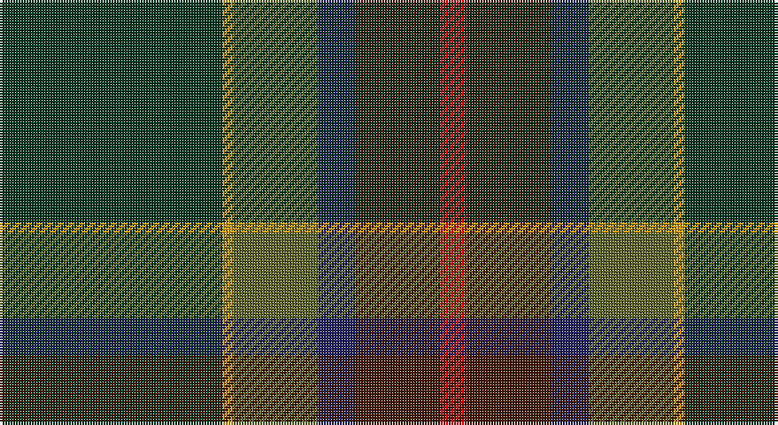

This page is one **sett** — a single exact thread-count. It belongs to the [tartan](/setts/dg42lo2y16db7do16r5/)
(the same proportion at any scale), whose colour order is pattern [GYGBBR](/stripes/gygbbr/).

Part of the [Waterford](/tartans/waterford/) tartan — the named design grouping this sett with its other cloths.

Sourced from register-of-tartans.  It is a [6 stripe tartan](/stripes/stripes6/).

Original link https://www.tartanregister.gov.uk/tartanDetails.aspx?ref=4498

## Also known as

This cloth is also recorded under:

- Waterford, County

## Register references

External register numbers recorded for this tartan.

- Scottish Register of Tartans: [4498](https://www.tartanregister.gov.uk/tartanDetails.aspx?ref=4498)
- Scottish Tartans Authority (ITI): 2255
- Scottish Tartans World Register: 2255

## Thread count
DG/84 DY4 G32 DB14 DR32 R/10

One full sett is **258 threads**.

## Palette

Palette: <strong>Tartan Register</strong> <small style="color:#888">(6 of 7 colours)</small>
<table><thead><tr><th>Colour</th><th>Threads</th><th>Shade</th><th>Base</th><th>OKLCh</th></tr></thead><tbody><tr><td>DG/</td><td style="text-align:right;font-variant-numeric:tabular-nums">84</td><td><code style="background-color:#003820;">#003820</code> <small style="color:#888">#003820</small></td><td>G <code style="background-color:#006100;">#006100</code></td><td><small style="color:#888">oklch(30.0% 0.070 158.3)</small></td></tr><tr><td>DY</td><td style="text-align:right;font-variant-numeric:tabular-nums">4</td><td><code style="background-color:#D09800;">#D09800</code> <small style="color:#888">#D09800</small></td><td>Y <code style="background-color:#F2BF00;">#F2BF00</code></td><td><small style="color:#888">oklch(71.4% 0.147 82.1)</small></td></tr><tr><td>G</td><td style="text-align:right;font-variant-numeric:tabular-nums">32</td><td><code style="background-color:#5C6428;">#5C6428</code> <small style="color:#888">#5C6428</small></td><td>G <code style="background-color:#006100;">#006100</code></td><td><small style="color:#888">oklch(48.3% 0.084 116.0)</small></td></tr><tr><td>DB</td><td style="text-align:right;font-variant-numeric:tabular-nums">14</td><td><code style="background-color:#202060;">#202060</code> <small style="color:#888">#202060</small></td><td>B <code style="background-color:#2A418A;">#2A418A</code></td><td><small style="color:#888">oklch(28.9% 0.111 276.9)</small></td></tr><tr><td>DR</td><td style="text-align:right;font-variant-numeric:tabular-nums">32</td><td><code style="background-color:#441800;">#441800</code> <small style="color:#888">#441800</small></td><td>B <code style="background-color:#2A418A;">#2A418A</code></td><td><small style="color:#888">oklch(27.3% 0.076 46.3)</small></td></tr><tr><td>R/</td><td style="text-align:right;font-variant-numeric:tabular-nums">10</td><td><code style="background-color:#C80000;">#C80000</code> <small style="color:#888">#C80000</small></td><td>R <code style="background-color:#CC0000;">#CC0000</code></td><td><small style="color:#888">oklch(52.3% 0.215 29.2)</small></td></tr></tbody></table>

# Sample pattern

## Nearest tartans

The nearest existing variants by ΔTartan distance, with this tartan at the top so the swatches line up against it.

ΔTartan

Tartan

Sett

—

<a href="/ttd/edit/#slug=dg42lo2y16db7do16r5~x2">Waterford, County</a> <a class="nn-out" href="/variants/s6/dg42lo2y16db7do16r5~x2/" title="open its dictionary page">↗</a>

0.88

<a href="/ttd/edit/#slug=o3dgi13dt13lo2dg34w3~x2&amp;base=dg42lo2y16db7do16r5~x2">Glencross (Tynron) (Personal)</a> <a class="nn-out" href="/variants/s6/o3dgi13dt13lo2dg34w3~x2/" title="open its dictionary page">↗</a>

0.98

<a href="/ttd/edit/#slug=g7lo2g5dg37db6r16db5b2~x2&amp;base=dg42lo2y16db7do16r5~x2">Telfer Green</a> <a class="nn-out" href="/variants/s8/g7lo2g5dg37db6r16db5b2~x2/" title="open its dictionary page">↗</a>

1.03

<a href="/ttd/edit/#slug=g15lo1do2db5k4dg5~x6&amp;base=dg42lo2y16db7do16r5~x2">Dobson (Palm Bay) (Personal)</a> <a class="nn-out" href="/variants/s6/g15lo1do2db5k4dg5~x6/" title="open its dictionary page">↗</a>

1.22

<a href="/ttd/edit/#slug=dpi10k2dg10dp30dg30dgi55k4r8&amp;base=dg42lo2y16db7do16r5~x2">Batten of Argyll (Baddenach)</a> <a class="nn-out" href="/variants/s8/dpi10k2dg10dp30dg30dgi55k4r8/" title="open its dictionary page">↗</a>

1.30

<a href="/ttd/edit/#slug=r4n38k4n6k41dg62y4&amp;base=dg42lo2y16db7do16r5~x2">Bennett, John Paul (Personal)</a> <a class="nn-out" href="/variants/s7/r4n38k4n6k41dg62y4/" title="open its dictionary page">↗</a>

1.40

<a href="/ttd/edit/#slug=dt12k17y4dg51ly3g4~x2&amp;base=dg42lo2y16db7do16r5~x2">US Army Regimental Tartan</a> <a class="nn-out" href="/variants/s6/dt12k17y4dg51ly3g4~x2/" title="open its dictionary page">↗</a>

1.41

<a href="/ttd/edit/#slug=m8k2y10dp30y30g55k4o6&amp;base=dg42lo2y16db7do16r5~x2">Aberuchill District Tartan</a> <a class="nn-out" href="/variants/s8/m8k2y10dp30y30g55k4o6/" title="open its dictionary page">↗</a>

1.48

<a href="/ttd/edit/#slug=do31lo6lr3db36do8dg60lo7t7~x2&amp;base=dg42lo2y16db7do16r5~x2">Little-Dowse Wedding</a> <a class="nn-out" href="/variants/s8/do31lo6lr3db36do8dg60lo7t7~x2/" title="open its dictionary page">↗</a>

1.52

<a href="/ttd/edit/#slug=w2k2r1dt20k15dg30ly1~x2&amp;base=dg42lo2y16db7do16r5~x2">Muir-Hill (Personal)</a> <a class="nn-out" href="/variants/s7/w2k2r1dt20k15dg30ly1~x2/" title="open its dictionary page">↗</a>

1.53

<a href="/ttd/edit/#slug=k4dg16db11r16dg25lo2t3~x2&amp;base=dg42lo2y16db7do16r5~x2">Mayo, County (District)</a> <a class="nn-out" href="/variants/s7/k4dg16db11r16dg25lo2t3~x2/" title="open its dictionary page">↗</a>

## Neighbour map

Every grey dot is one of 14360 variants placed by the first two principal components of the ΔTartan feature space (44% of its variance). Red is this tartan; blue dots are its nearest — click one to open its page.

<svg viewBox="0 0 640 380" role="img" style="max-width:100%;height:auto;border:1px solid #e0e0e0;border-radius:4px;display:block" xmlns="http://www.w3.org/2000/svg"><image href="/nn/cloud.v1.png" width="640" height="380"/><a href="/variants/s6/o3dgi13dt13lo2dg34w3~x2/"><circle cx="302.3" cy="193.7" r="4" fill="#3465a4"><title>Glencross (Tynron) (Personal)</title></circle></a><a href="/variants/s8/g7lo2g5dg37db6r16db5b2~x2/"><circle cx="285.2" cy="163.4" r="4" fill="#3465a4"><title>Telfer Green</title></circle></a><a href="/variants/s6/g15lo1do2db5k4dg5~x6/"><circle cx="266.4" cy="207.9" r="4" fill="#3465a4"><title>Dobson (Palm Bay) (Personal)</title></circle></a><a href="/variants/s8/dpi10k2dg10dp30dg30dgi55k4r8/"><circle cx="256.0" cy="168.3" r="4" fill="#3465a4"><title>Batten of Argyll (Baddenach)</title></circle></a><a href="/variants/s7/r4n38k4n6k41dg62y4/"><circle cx="291.6" cy="212.1" r="4" fill="#3465a4"><title>Bennett, John Paul (Personal)</title></circle></a><a href="/variants/s6/dt12k17y4dg51ly3g4~x2/"><circle cx="351.6" cy="191.7" r="4" fill="#3465a4"><title>US Army Regimental Tartan</title></circle></a><a href="/variants/s8/m8k2y10dp30y30g55k4o6/"><circle cx="243.3" cy="151.3" r="4" fill="#3465a4"><title>Aberuchill District Tartan</title></circle></a><a href="/variants/s8/do31lo6lr3db36do8dg60lo7t7~x2/"><circle cx="254.2" cy="177.3" r="4" fill="#3465a4"><title>Little-Dowse Wedding</title></circle></a><a href="/variants/s7/w2k2r1dt20k15dg30ly1~x2/"><circle cx="291.4" cy="161.3" r="4" fill="#3465a4"><title>Muir-Hill (Personal)</title></circle></a><a href="/variants/s7/k4dg16db11r16dg25lo2t3~x2/"><circle cx="285.1" cy="212.2" r="4" fill="#3465a4"><title>Mayo, County (District)</title></circle></a><circle cx="302.3" cy="191.8" r="5" fill="#c00000"/></svg>

ID: /variants/s6/dg42lo2y16db7do16r5~x2/
