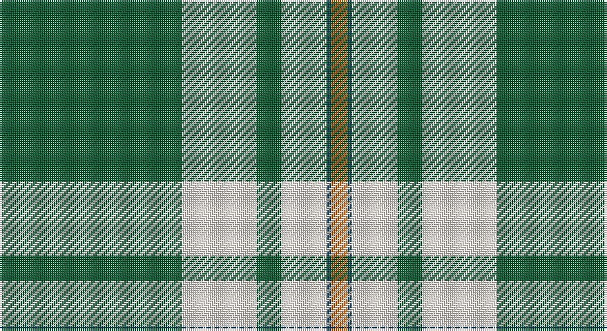

This page is one **sett** — a single exact thread-count. It belongs to the [tartan](/setts/dg44w18dg6w11dt1o4/)
(the same proportion at any scale), whose colour order is pattern [GWGWBR](/stripes/gwgwbr/).

Sourced from tartans-authority.  It is a [6 stripe tartan](/stripes/stripes6/).

Original link http://www.tartansauthority.com/tartan-ferret/display/7523/

## Provenance

Earliest known date: June 2002 A worsted scarf for a German dairy machinery company. Woven sample.

## Also known as

This cloth is also recorded under:

- Westfalia German

3 attestations — the source records this cloth was collapsed from (oldest owns this page)

<ul>
<li>June 2002 — Westfalia (Corporate) (tartans-authority, <a href="http://www.tartansauthority.com/tartan-ferret/display/7523/">record</a>)</li>
<li>undated — Westfalia (register-of-tartans, <a href="https://www.tartanregister.gov.uk/tartanDetails.aspx?ref=5560">record</a>)</li>
<li>undated — Westfalia German Corporate Tartan (house-of-tartan, <a href="http://www.house-of-tartan.scotland.net/house/TartanViewjs.asp?colr=Def&tnam=7523">record</a>)</li>
</ul>

## Register references

External register numbers recorded for this tartan.

- Scottish Register of Tartans: [5560](https://www.tartanregister.gov.uk/tartanDetails.aspx?ref=5560)
- Scottish Tartans Authority (ITI): 7523

## Thread count
G/88 LY36 G12 LY22 DB2 O/8

One full sett is **240 threads**.

## Palette

Palette: <strong>Tartan Register</strong> <small style="color:#888">(2 of 4 colours)</small>
<table><thead><tr><th>Colour</th><th>Threads</th><th>Shade</th><th>Base</th><th>OKLCh</th></tr></thead><tbody><tr><td>G/</td><td style="text-align:right;font-variant-numeric:tabular-nums">88</td><td><code style="background-color:#005C30;">#005C30</code> <small style="color:#888">#005C30</small></td><td>G <code style="background-color:#006100;">#006100</code></td><td><small style="color:#888">oklch(41.7% 0.105 153.9)</small></td></tr><tr><td>LY</td><td style="text-align:right;font-variant-numeric:tabular-nums">36</td><td><code style="background-color:#F8F0E4;">#F8F0E4</code> <small style="color:#888">#F8F0E4</small></td><td>W <code style="background-color:#F7F7F7;">#F7F7F7</code></td><td><small style="color:#888">oklch(95.8% 0.018 78.2)</small></td></tr><tr><td>G</td><td style="text-align:right;font-variant-numeric:tabular-nums">12</td><td><code style="background-color:#005C30;">#005C30</code> <small style="color:#888">#005C30</small></td><td>G <code style="background-color:#006100;">#006100</code></td><td><small style="color:#888">oklch(41.7% 0.105 153.9)</small></td></tr><tr><td>LY</td><td style="text-align:right;font-variant-numeric:tabular-nums">22</td><td><code style="background-color:#F8F0E4;">#F8F0E4</code> <small style="color:#888">#F8F0E4</small></td><td>W <code style="background-color:#F7F7F7;">#F7F7F7</code></td><td><small style="color:#888">oklch(95.8% 0.018 78.2)</small></td></tr><tr><td>DB</td><td style="text-align:right;font-variant-numeric:tabular-nums">2</td><td><code style="background-color:#003C64;">#003C64</code> <small style="color:#888">#003C64</small></td><td>B <code style="background-color:#2A418A;">#2A418A</code></td><td><small style="color:#888">oklch(34.5% 0.089 246.0)</small></td></tr><tr><td>O/</td><td style="text-align:right;font-variant-numeric:tabular-nums">8</td><td><code style="background-color:#E86000;">#E86000</code> <small style="color:#888">#E86000</small></td><td>R <code style="background-color:#CC0000;">#CC0000</code></td><td><small style="color:#888">oklch(65.3% 0.187 44.9)</small></td></tr></tbody></table>

# Sample pattern

## Nearest tartans

The nearest existing variants by ΔTartan distance, with this tartan at the top so the swatches line up against it.

ΔTartan

Tartan

Sett

—

<a href="/ttd/edit/#slug=dg44w18dg6w11dt1o4~x2">Westfalia (Corporate)</a> <a class="nn-out" href="/variants/s6/dg44w18dg6w11dt1o4~x2/" title="open its dictionary page">↗</a>

1.27

<a href="/ttd/edit/#slug=w44dg18w6dg11dt1o4~x2&amp;base=dg44w18dg6w11dt1o4~x2">Westfalia Dress (Corporate)</a> <a class="nn-out" href="/variants/s6/w44dg18w6dg11dt1o4~x2/" title="open its dictionary page">↗</a>

1.29

<a href="/ttd/edit/#slug=g42ly1w2ly1g5dg12w32g4~x2&amp;base=dg44w18dg6w11dt1o4~x2">Longniddry Green Error (Dance)</a> <a class="nn-out" href="/variants/s8/g42ly1w2ly1g5dg12w32g4~x2/" title="open its dictionary page">↗</a>

1.35

<a href="/ttd/edit/#slug=w47g20w6g8k1r3~x2&amp;base=dg44w18dg6w11dt1o4~x2">MacGregor, Green</a> <a class="nn-out" href="/variants/s6/w47g20w6g8k1r3~x2/" title="open its dictionary page">↗</a>

1.43

<a href="/ttd/edit/#slug=n4w2n1w36g21ly4~x2&amp;base=dg44w18dg6w11dt1o4~x2">Skye, Green (Dance)</a> <a class="nn-out" href="/variants/s6/n4w2n1w36g21ly4~x2/" title="open its dictionary page">↗</a>

1.47

<a href="/ttd/edit/#slug=w52dg22w6dg8k1r3~x2&amp;base=dg44w18dg6w11dt1o4~x2">MacGregor Dress Green (Dance)</a> <a class="nn-out" href="/variants/s6/w52dg22w6dg8k1r3~x2/" title="open its dictionary page">↗</a>

1.56

<a href="/ttd/edit/#slug=lo2db4g60p30w1~x2&amp;base=dg44w18dg6w11dt1o4~x2">McGuinness, Tam (Personal)</a> <a class="nn-out" href="/variants/s5/lo2db4g60p30w1~x2/" title="open its dictionary page">↗</a>

1.57

<a href="/ttd/edit/#slug=w52g22w6g8k1r3~x2&amp;base=dg44w18dg6w11dt1o4~x2">MacGregor - 1975 (Dance, Green)</a> <a class="nn-out" href="/variants/s6/w52g22w6g8k1r3~x2/" title="open its dictionary page">↗</a>

1.60

<a href="/ttd/edit/#slug=g30k2w3k1w4t6w2~x4&amp;base=dg44w18dg6w11dt1o4~x2">Madras 2 (Fashion)</a> <a class="nn-out" href="/variants/s7/g30k2w3k1w4t6w2~x4/" title="open its dictionary page">↗</a>

1.64

<a href="/ttd/edit/#slug=g3lo16w4k6g28lo1g3~x4&amp;base=dg44w18dg6w11dt1o4~x2">Pollock</a> <a class="nn-out" href="/variants/s7/g3lo16w4k6g28lo1g3~x4/" title="open its dictionary page">↗</a>

1.68

<a href="/ttd/edit/#slug=ly6dg36w5b4w30b1w2~x2&amp;base=dg44w18dg6w11dt1o4~x2">Pearce Scotch Plaid 4 (Fashion)</a> <a class="nn-out" href="/variants/s7/ly6dg36w5b4w30b1w2~x2/" title="open its dictionary page">↗</a>

## Neighbour map

Every grey dot is one of 14360 variants placed by the first two principal components of the ΔTartan feature space (44% of its variance). Red is this tartan; blue dots are its nearest — click one to open its page.

<svg viewBox="0 0 640 380" role="img" style="max-width:100%;height:auto;border:1px solid #e0e0e0;border-radius:4px;display:block" xmlns="http://www.w3.org/2000/svg"><image href="/nn/cloud.v1.png" width="640" height="380"/><a href="/variants/s6/w44dg18w6dg11dt1o4~x2/"><circle cx="357.9" cy="115.8" r="4" fill="#3465a4"><title>Westfalia Dress (Corporate)</title></circle></a><a href="/variants/s8/g42ly1w2ly1g5dg12w32g4~x2/"><circle cx="302.8" cy="103.9" r="4" fill="#3465a4"><title>Longniddry Green Error (Dance)</title></circle></a><a href="/variants/s6/w47g20w6g8k1r3~x2/"><circle cx="395.1" cy="116.2" r="4" fill="#3465a4"><title>MacGregor, Green</title></circle></a><a href="/variants/s6/n4w2n1w36g21ly4~x2/"><circle cx="335.6" cy="121.2" r="4" fill="#3465a4"><title>Skye, Green (Dance)</title></circle></a><a href="/variants/s6/w52dg22w6dg8k1r3~x2/"><circle cx="383.3" cy="100.8" r="4" fill="#3465a4"><title>MacGregor Dress Green (Dance)</title></circle></a><a href="/variants/s5/lo2db4g60p30w1~x2/"><circle cx="382.3" cy="113.6" r="4" fill="#3465a4"><title>McGuinness, Tam (Personal)</title></circle></a><a href="/variants/s6/w52g22w6g8k1r3~x2/"><circle cx="387.1" cy="102.3" r="4" fill="#3465a4"><title>MacGregor - 1975 (Dance, Green)</title></circle></a><a href="/variants/s7/g30k2w3k1w4t6w2~x4/"><circle cx="380.6" cy="130.6" r="4" fill="#3465a4"><title>Madras 2 (Fashion)</title></circle></a><a href="/variants/s7/g3lo16w4k6g28lo1g3~x4/"><circle cx="336.5" cy="145.3" r="4" fill="#3465a4"><title>Pollock</title></circle></a><a href="/variants/s7/ly6dg36w5b4w30b1w2~x2/"><circle cx="268.8" cy="114.9" r="4" fill="#3465a4"><title>Pearce Scotch Plaid 4 (Fashion)</title></circle></a><circle cx="361.5" cy="127.7" r="5" fill="#c00000"/></svg>

ID: /variants/s6/dg44w18dg6w11dt1o4~x2/
