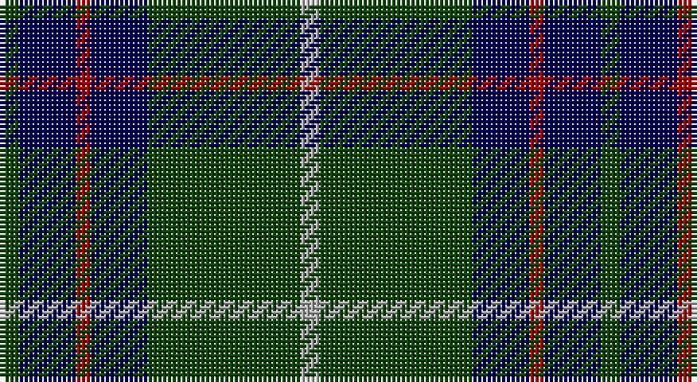

This page is one **sett** — a single exact thread-count. It belongs to the [tartan](/setts/dg4db12r3db12dg32lr4/)
(the same proportion at any scale), whose colour order is pattern [GBRBGY](/stripes/gbrbgy/).

Sourced from weddslist.  It is a [6 stripe tartan](/stripes/stripes6/).

Original link http://www.weddslist.com/cgi-bin/tartans/pg.pl?source=x

## Thread count
DG/4 DB12 DR3 DB12 DG32 N/4

One full sett is **126 threads**.

## Palette

Palette: <strong>custom</strong>
<table><thead><tr><th>Colour</th><th>Threads</th><th>Shade</th><th>Base</th><th>OKLCh</th></tr></thead><tbody><tr><td>DG/</td><td style="text-align:right;font-variant-numeric:tabular-nums">4</td><td><code style="background-color:#11450D;">#11450D</code> <small style="color:#888">#11450D</small></td><td>G <code style="background-color:#006100;">#006100</code></td><td><small style="color:#888">oklch(34.4% 0.101 142.1)</small></td></tr><tr><td>DB</td><td style="text-align:right;font-variant-numeric:tabular-nums">12</td><td><code style="background-color:#000052;">#000052</code> <small style="color:#888">#000052</small></td><td>B <code style="background-color:#2A418A;">#2A418A</code></td><td><small style="color:#888">oklch(19.8% 0.137 264.1)</small></td></tr><tr><td>DR</td><td style="text-align:right;font-variant-numeric:tabular-nums">3</td><td><code style="background-color:#AA0000;">#AA0000</code> <small style="color:#888">#AA0000</small></td><td>R <code style="background-color:#CC0000;">#CC0000</code></td><td><small style="color:#888">oklch(46.3% 0.190 29.2)</small></td></tr><tr><td>DB</td><td style="text-align:right;font-variant-numeric:tabular-nums">12</td><td><code style="background-color:#000052;">#000052</code> <small style="color:#888">#000052</small></td><td>B <code style="background-color:#2A418A;">#2A418A</code></td><td><small style="color:#888">oklch(19.8% 0.137 264.1)</small></td></tr><tr><td>DG</td><td style="text-align:right;font-variant-numeric:tabular-nums">32</td><td><code style="background-color:#11450D;">#11450D</code> <small style="color:#888">#11450D</small></td><td>G <code style="background-color:#006100;">#006100</code></td><td><small style="color:#888">oklch(34.4% 0.101 142.1)</small></td></tr><tr><td>N/</td><td style="text-align:right;font-variant-numeric:tabular-nums">4</td><td><code style="background-color:#AAAAAA;">#AAAAAA</code> <small style="color:#888">#AAAAAA</small></td><td>Y <code style="background-color:#F2BF00;">#F2BF00</code></td><td><small style="color:#888">oklch(73.8% 0.000 89.9)</small></td></tr></tbody></table>

# Sample pattern

## Nearest tartans

The nearest existing variants by ΔTartan distance, with this tartan at the top so the swatches line up against it.

ΔTartan

Tartan

Sett

—

<a href="/ttd/edit/#slug=dg4db12r3db12dg32lr4">MacIntyre LC</a> <a class="nn-out" href="/variants/s6/dg4db12r3db12dg32lr4/" title="open its dictionary page">↗</a>

0.00

<a href="/ttd/edit/#slug=dg4db12r3db12dg32lr4~x2&amp;base=dg4db12r3db12dg32lr4">MacIntyre LC</a> <a class="nn-out" href="/variants/s6/dg4db12r3db12dg32lr4~x2/" title="open its dictionary page">↗</a>

0.65

<a href="/ttd/edit/#slug=g26db10k3db2dy2db10~x4&amp;base=dg4db12r3db12dg32lr4">St. Andrews Old Course Hotel (Corp)</a> <a class="nn-out" href="/variants/s6/g26db10k3db2dy2db10~x4/" title="open its dictionary page">↗</a>

0.67

<a href="/ttd/edit/#slug=dg4db12r3db12dg32w4~x2&amp;base=dg4db12r3db12dg32lr4">MacIntyre</a> <a class="nn-out" href="/variants/s6/dg4db12r3db12dg32w4~x2/" title="open its dictionary page">↗</a>

0.71

<a href="/ttd/edit/#slug=dg4db12r3db12dg32lb4&amp;base=dg4db12r3db12dg32lr4">MacIntyre L</a> <a class="nn-out" href="/variants/s6/dg4db12r3db12dg32lb4/" title="open its dictionary page">↗</a>

0.82

<a href="/ttd/edit/#slug=k6db4dg44k41w4~x2&amp;base=dg4db12r3db12dg32lr4">Douglas (Clan)</a> <a class="nn-out" href="/variants/s5/k6db4dg44k41w4~x2/" title="open its dictionary page">↗</a>

0.90

<a href="/ttd/edit/#slug=r3dg10r3dg14db16dg3ly2~x2&amp;base=dg4db12r3db12dg32lr4">Cameron Hunting</a> <a class="nn-out" href="/variants/s7/r3dg10r3dg14db16dg3ly2~x2/" title="open its dictionary page">↗</a>

0.91

<a href="/ttd/edit/#slug=db8r4db24g35lb4g8&amp;base=dg4db12r3db12dg32lr4">Heritage Tartan, The</a> <a class="nn-out" href="/variants/s6/db8r4db24g35lb4g8/" title="open its dictionary page">↗</a>

0.99

<a href="/ttd/edit/#slug=dg10r1dg1r2dg8db10dg1ly1~x4&amp;base=dg4db12r3db12dg32lr4">Glen Esk</a> <a class="nn-out" href="/variants/s8/dg10r1dg1r2dg8db10dg1ly1~x4/" title="open its dictionary page">↗</a>

1.04

<a href="/ttd/edit/#slug=g12lo1db8k1db1~x4&amp;base=dg4db12r3db12dg32lr4">Rowan (Personal)</a> <a class="nn-out" href="/variants/s5/g12lo1db8k1db1~x4/" title="open its dictionary page">↗</a>

1.06

<a href="/ttd/edit/#slug=db24g3db3g3lo2g18r2~x2&amp;base=dg4db12r3db12dg32lr4">Greenways Marketing Intl (Corporate)</a> <a class="nn-out" href="/variants/s7/db24g3db3g3lo2g18r2~x2/" title="open its dictionary page">↗</a>

## Neighbour map

Every grey dot is one of 14360 variants placed by the first two principal components of the ΔTartan feature space (44% of its variance). Red is this tartan; blue dots are its nearest — click one to open its page.

<svg viewBox="0 0 640 380" role="img" style="max-width:100%;height:auto;border:1px solid #e0e0e0;border-radius:4px;display:block" xmlns="http://www.w3.org/2000/svg"><image href="/nn/cloud.v1.png" width="640" height="380"/><a href="/variants/s6/dg4db12r3db12dg32lr4~x2/"><circle cx="322.0" cy="229.6" r="4" fill="#3465a4"><title>MacIntyre LC</title></circle></a><a href="/variants/s6/g26db10k3db2dy2db10~x4/"><circle cx="315.5" cy="218.3" r="4" fill="#3465a4"><title>St. Andrews Old Course Hotel (Corp)</title></circle></a><a href="/variants/s6/dg4db12r3db12dg32w4~x2/"><circle cx="323.0" cy="226.7" r="4" fill="#3465a4"><title>MacIntyre</title></circle></a><a href="/variants/s6/dg4db12r3db12dg32lb4/"><circle cx="301.0" cy="219.4" r="4" fill="#3465a4"><title>MacIntyre L</title></circle></a><a href="/variants/s5/k6db4dg44k41w4~x2/"><circle cx="317.7" cy="236.5" r="4" fill="#3465a4"><title>Douglas (Clan)</title></circle></a><a href="/variants/s7/r3dg10r3dg14db16dg3ly2~x2/"><circle cx="285.2" cy="242.4" r="4" fill="#3465a4"><title>Cameron Hunting</title></circle></a><a href="/variants/s6/db8r4db24g35lb4g8/"><circle cx="284.6" cy="229.3" r="4" fill="#3465a4"><title>Heritage Tartan, The</title></circle></a><a href="/variants/s8/dg10r1dg1r2dg8db10dg1ly1~x4/"><circle cx="324.4" cy="208.7" r="4" fill="#3465a4"><title>Glen Esk</title></circle></a><a href="/variants/s5/g12lo1db8k1db1~x4/"><circle cx="339.9" cy="226.8" r="4" fill="#3465a4"><title>Rowan (Personal)</title></circle></a><a href="/variants/s7/db24g3db3g3lo2g18r2~x2/"><circle cx="312.1" cy="197.7" r="4" fill="#3465a4"><title>Greenways Marketing Intl (Corporate)</title></circle></a><circle cx="322.0" cy="229.6" r="5" fill="#c00000"/></svg>

ID: /variants/s6/dg4db12r3db12dg32lr4/
