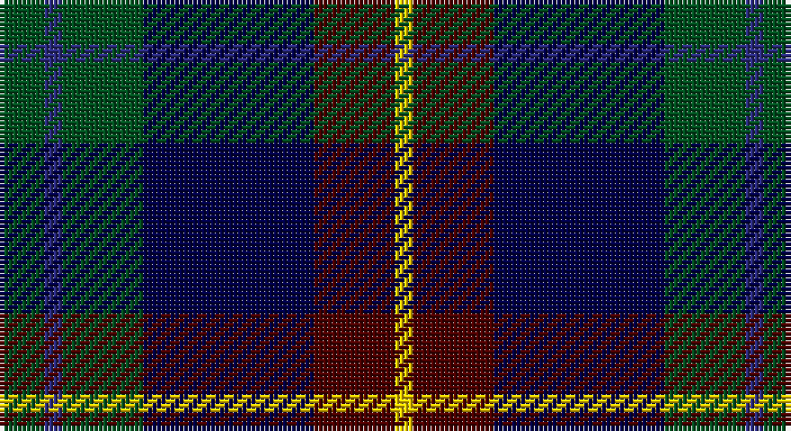

This page is one **sett** — a single exact thread-count. It belongs to the [tartan](/setts/dg5db2dg9dbi19dr9ly2/)
(the same proportion at any scale), whose colour order is pattern [GBGBBY](/stripes/gbgbby/).

Part of the [Lyle and Scott](/tartans/lyle-and-scott/) tartan — the named design grouping this sett with its other cloths.

Sourced from register-of-tartans.  It is a [6 stripe tartan](/stripes/stripes6/).

Original link https://www.tartanregister.gov.uk/tartanDetails.aspx?ref=11139

## Register references

External register numbers recorded for this tartan.

- Scottish Register of Tartans: [11139](https://www.tartanregister.gov.uk/tartanDetails.aspx?ref=11139)

## Thread count
G/10 DBa4 G18 DB38 DR18 Y/4

One full sett is **170 threads**.

## Palette

Palette: <strong>Tartan Register</strong>
<table><thead><tr><th>Colour</th><th>Threads</th><th>Shade</th><th>Base</th><th>OKLCh</th></tr></thead><tbody><tr><td>G/</td><td style="text-align:right;font-variant-numeric:tabular-nums">10</td><td><code style="background-color:#005020;">#005020</code> <small style="color:#888">#005020</small></td><td>G <code style="background-color:#006100;">#006100</code></td><td><small style="color:#888">oklch(37.7% 0.105 149.6)</small></td></tr><tr><td>DBa</td><td style="text-align:right;font-variant-numeric:tabular-nums">4</td><td><code style="background-color:#2C2C80;">#2C2C80</code> <small style="color:#888">#2C2C80</small></td><td>B <code style="background-color:#2A418A;">#2A418A</code></td><td><small style="color:#888">oklch(35.0% 0.138 276.6)</small></td></tr><tr><td>G</td><td style="text-align:right;font-variant-numeric:tabular-nums">18</td><td><code style="background-color:#005020;">#005020</code> <small style="color:#888">#005020</small></td><td>G <code style="background-color:#006100;">#006100</code></td><td><small style="color:#888">oklch(37.7% 0.105 149.6)</small></td></tr><tr><td>DB</td><td style="text-align:right;font-variant-numeric:tabular-nums">38</td><td><code style="background-color:#000048;">#000048</code> <small style="color:#888">#000048</small></td><td>B <code style="background-color:#2A418A;">#2A418A</code></td><td><small style="color:#888">oklch(18.2% 0.126 264.1)</small></td></tr><tr><td>DR</td><td style="text-align:right;font-variant-numeric:tabular-nums">18</td><td><code style="background-color:#4C0000;">#4C0000</code> <small style="color:#888">#4C0000</small></td><td>B <code style="background-color:#2A418A;">#2A418A</code></td><td><small style="color:#888">oklch(26.2% 0.107 29.2)</small></td></tr><tr><td>Y/</td><td style="text-align:right;font-variant-numeric:tabular-nums">4</td><td><code style="background-color:#FCCC00;">#FCCC00</code> <small style="color:#888">#FCCC00</small></td><td>Y <code style="background-color:#F2BF00;">#F2BF00</code></td><td><small style="color:#888">oklch(86.2% 0.176 91.5)</small></td></tr></tbody></table>

# Sample pattern

## Nearest tartans

The nearest existing variants by ΔTartan distance, with this tartan at the top so the swatches line up against it.

ΔTartan

Tartan

Sett

—

<a href="/ttd/edit/#slug=dg5db2dg9dbi19dr9ly2~x2">Lyle and Scott</a> <a class="nn-out" href="/variants/s6/dg5db2dg9dbi19dr9ly2~x2/" title="open its dictionary page">↗</a>

0.67

<a href="/ttd/edit/#slug=k2w1k12g5db11r1~x2&amp;base=dg5db2dg9dbi19dr9ly2~x2">New England (Fashion)</a> <a class="nn-out" href="/variants/s6/k2w1k12g5db11r1~x2/" title="open its dictionary page">↗</a>

0.74

<a href="/ttd/edit/#slug=r4db24k12g14k4lb3~x2&amp;base=dg5db2dg9dbi19dr9ly2~x2">MacPhail Hunting #2</a> <a class="nn-out" href="/variants/s6/r4db24k12g14k4lb3~x2/" title="open its dictionary page">↗</a>

0.77

<a href="/ttd/edit/#slug=k4w1g10k10db10r2~x2&amp;base=dg5db2dg9dbi19dr9ly2~x2">Rose Hunting Clan Tartan</a> <a class="nn-out" href="/variants/s6/k4w1g10k10db10r2~x2/" title="open its dictionary page">↗</a>

0.77

<a href="/ttd/edit/#slug=r2db23k14dg16k2w2~x2&amp;base=dg5db2dg9dbi19dr9ly2~x2">MacPhail Hunting</a> <a class="nn-out" href="/variants/s6/r2db23k14dg16k2w2~x2/" title="open its dictionary page">↗</a>

0.79

<a href="/ttd/edit/#slug=db31b4db5k19g20lo4~x2&amp;base=dg5db2dg9dbi19dr9ly2~x2">Midlothian</a> <a class="nn-out" href="/variants/s6/db31b4db5k19g20lo4~x2/" title="open its dictionary page">↗</a>

0.80

<a href="/ttd/edit/#slug=db22w2k10g11r3g4~x2&amp;base=dg5db2dg9dbi19dr9ly2~x2">Paterson Blue (Personal)</a> <a class="nn-out" href="/variants/s6/db22w2k10g11r3g4~x2/" title="open its dictionary page">↗</a>

0.81

<a href="/ttd/edit/#slug=r4k2db24k20g20lo3~x2&amp;base=dg5db2dg9dbi19dr9ly2~x2">Loudoun's Highlanders - 1747 #1 (Mil</a> <a class="nn-out" href="/variants/s6/r4k2db24k20g20lo3~x2/" title="open its dictionary page">↗</a>

0.81

<a href="/ttd/edit/#slug=k2g17k16r2db17lr2~x2&amp;base=dg5db2dg9dbi19dr9ly2~x2">Mitchell (Clan)</a> <a class="nn-out" href="/variants/s6/k2g17k16r2db17lr2~x2/" title="open its dictionary page">↗</a>

0.82

<a href="/ttd/edit/#slug=k4w1g10k10db10r2~x4&amp;base=dg5db2dg9dbi19dr9ly2~x2">Rose Hunting</a> <a class="nn-out" href="/variants/s6/k4w1g10k10db10r2~x4/" title="open its dictionary page">↗</a>

0.83

<a href="/ttd/edit/#slug=k2dg12k12r1db12w2~x2&amp;base=dg5db2dg9dbi19dr9ly2~x2">Russell or Mitchell or Hunter or Galbraith</a> <a class="nn-out" href="/variants/s6/k2dg12k12r1db12w2~x2/" title="open its dictionary page">↗</a>

## Neighbour map

Every grey dot is one of 14360 variants placed by the first two principal components of the ΔTartan feature space (44% of its variance). Red is this tartan; blue dots are its nearest — click one to open its page.

<svg viewBox="0 0 640 380" role="img" style="max-width:100%;height:auto;border:1px solid #e0e0e0;border-radius:4px;display:block" xmlns="http://www.w3.org/2000/svg"><image href="/nn/cloud.v1.png" width="640" height="380"/><a href="/variants/s6/k2w1k12g5db11r1~x2/"><circle cx="238.3" cy="204.6" r="4" fill="#3465a4"><title>New England (Fashion)</title></circle></a><a href="/variants/s6/r4db24k12g14k4lb3~x2/"><circle cx="172.4" cy="221.9" r="4" fill="#3465a4"><title>MacPhail Hunting #2</title></circle></a><a href="/variants/s6/k4w1g10k10db10r2~x2/"><circle cx="170.5" cy="226.5" r="4" fill="#3465a4"><title>Rose Hunting Clan Tartan</title></circle></a><a href="/variants/s6/r2db23k14dg16k2w2~x2/"><circle cx="214.9" cy="210.7" r="4" fill="#3465a4"><title>MacPhail Hunting</title></circle></a><a href="/variants/s6/db31b4db5k19g20lo4~x2/"><circle cx="191.0" cy="227.8" r="4" fill="#3465a4"><title>Midlothian</title></circle></a><a href="/variants/s6/db22w2k10g11r3g4~x2/"><circle cx="203.8" cy="205.8" r="4" fill="#3465a4"><title>Paterson Blue (Personal)</title></circle></a><a href="/variants/s6/r4k2db24k20g20lo3~x2/"><circle cx="173.5" cy="211.7" r="4" fill="#3465a4"><title>Loudoun's Highlanders - 1747 #1 (Mil</title></circle></a><a href="/variants/s6/k2g17k16r2db17lr2~x2/"><circle cx="163.2" cy="222.5" r="4" fill="#3465a4"><title>Mitchell (Clan)</title></circle></a><a href="/variants/s6/k4w1g10k10db10r2~x4/"><circle cx="166.4" cy="224.3" r="4" fill="#3465a4"><title>Rose Hunting</title></circle></a><a href="/variants/s6/k2dg12k12r1db12w2~x2/"><circle cx="180.5" cy="212.1" r="4" fill="#3465a4"><title>Russell or Mitchell or Hunter or Galbraith</title></circle></a><circle cx="202.9" cy="222.8" r="5" fill="#c00000"/></svg>

ID: /variants/s6/dg5db2dg9dbi19dr9ly2~x2/
